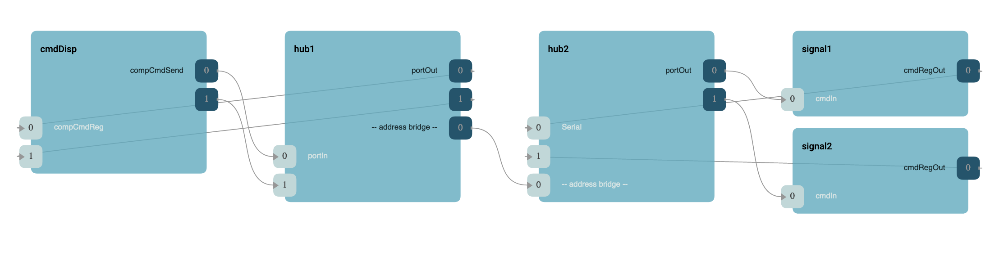
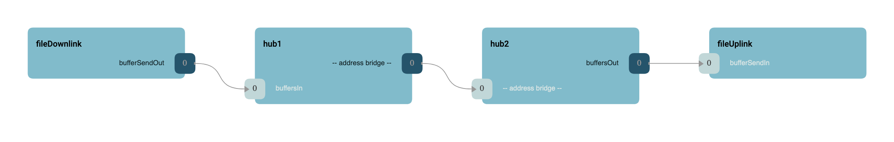
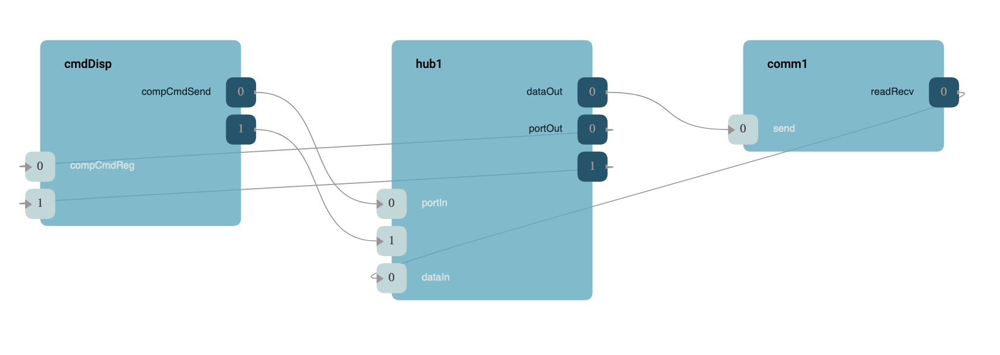
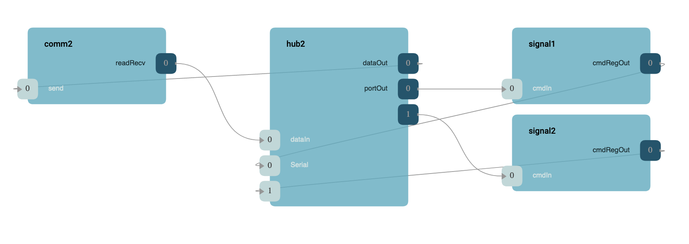

# Svc::GenericHub Generic Hub Component

The [`Svc::GenericHub`](../GenericHub.fpp) component implements the F´ hub
pattern. A hub makes logical F´ port connections span two deployments, address
spaces, processors, or other transport boundaries. A pair of hubs multiplexes
many logical connections through a buffer-based transport:

```text
    FSW --> GenericHub --> Driver ~~> Driver --> GenericHub --> FSW
```

The `~~>` represents the deployment-to-deployment transport. It may be shared
memory, an inter-process channel, a network connection, or another mechanism.
The GenericHub is transport-independent; its driver interface operates on
`Fw::Buffer` objects.

For example, logical connections between components in deployments A and B:

```text
    A1 -->--+       +-->-- B1
            |       |
            HA ~~> HB
            |       |
    A2 -->--+       +-->-- B2
```

The driver paired with each hub must be a **buffer driver**: a combination of
components that sends and receives `Fw::Buffer` objects across the transport.
The reference implementation uses a `Drv::ByteStreamDriver` together with a
`Drv::ByteStreamBufferAdapter`. Other transport-specific drivers may be used
provided that they implement the buffer-driver interfaces described below.

## Design

The GenericHub has four interfaces:

1. ports from FSW into the hub for data that the hub sends;
2. ports from the hub into the buffer driver;
3. ports from the buffer driver into the hub; and
4. ports from the hub into FSW for received data.

The hub is bidirectional. The input configuration on one hub must be parallel
with the output configuration on its peer, and vice versa. A serial port call
is serialized by value; an `Fw::Buffer` is copied or transferred according to
the buffer lifecycle described later. A pointer must never be passed through
the hub: a pointer is meaningful only in the address space that allocated the
pointed-to object.

## Port catalog

### 1. FSW to hub: send interface

These ports accept data from the local deployment and serialize it for the
remote hub.

| Port | Type | Purpose |
|---|---|---|
| `eventIn` | `Fw.Log` | Sends an event to the remote deployment. |
| `tlmIn` | `Fw.Tlm` | Sends a telemetry value to the remote deployment. |
| `serialIn` | `[GenericHubCfg.NumSerialInputPorts] serial` | Sends typed, by-value serialized port calls. Do not connect ports that emit `Fw.Buffer`; use `bufferIn` for those. |
| `bufferIn` | `[GenericHubCfg.NumBufferInputPorts] Fw.BufferSend` | Sends buffer data to the remote deployment. The hub copies the data and returns the incoming buffer. |
| `bufferInReturn` | `[GenericHubCfg.NumBufferInputPorts] Fw.BufferSend` | Returns buffers received on `bufferIn` to their senders. It must match `bufferIn`. |
| `cmdDispIn` | `[CmdDispatcherSequencePorts] Fw.Com` | Accepts a command forwarded by a command splitter. |
| `cmdRespOut` | `[CmdDispatcherSequencePorts] Fw.CmdResponse` | Emits a command response received from the remote hub. |

Typical connections include:

```text
eventProducer.eventOut       -> genericHub.eventIn
telemetryProducer.tlmOut     -> genericHub.tlmIn
valueProducer.valueOut[0]    -> genericHub.serialIn[0]
bufferProducer.bufferOut      -> genericHub.bufferIn[0]
genericHub.bufferInReturn[0]  -> bufferProducer.bufferIn
commandSplitter.RemoteCmd[0] -> genericHub.cmdDispIn[0]
genericHub.cmdRespOut[0]      -> commandSplitter.seqCmdStatus[0]
```

### 2. Hub to buffer driver: send interface

The hub sends serialized messages through the buffer driver using imported
interfaces:

| Port | Type | Purpose |
|---|---|---|
| `allocate` | `Fw.BufferGet` | Requests an output buffer from the buffer manager. |
| `deallocate` | `Fw.BufferSend` | Returns an output buffer to the buffer manager. |
| `toBufferDriver` | `Fw.BufferSend` | Sends a serialized message buffer to the driver. |
| `toBufferDriverReturn` | `Fw.BufferSend` | Receives ownership back when the driver returns a sent buffer. |

The usual connections are:

```text
genericHub.allocate          -> bufferManager.bufferGetCallee
genericHub.toBufferDriver    -> bufferDriver.bufferIn
bufferDriver.bufferInReturn  -> genericHub.toBufferDriverReturn
genericHub.deallocate        -> bufferManager.bufferSendIn
```

`allocate` and `deallocate` come from `Svc.BufferAllocation`.
`toBufferDriver` and `toBufferDriverReturn` come from
`Drv.PassiveBufferDriverClientSend`.

### 3. Buffer driver to hub: receive interface

| Port | Type | Purpose |
|---|---|---|
| `fromBufferDriver` | `Fw.BufferSend` | Receives a serialized message buffer from the driver. |
| `fromBufferDriverReturn` | `Fw.BufferSend` | Returns a received buffer to the driver after the hub and its receiver are done with it. |

These ports come from `Drv.PassiveBufferDriverClientRecv`:

```text
bufferDriver.bufferOut             -> genericHub.fromBufferDriver
genericHub.fromBufferDriverReturn -> bufferDriver.bufferOutReturn
```

### 4. Hub to FSW: receive interface

These ports deserialize a message received from the remote hub and invoke the
corresponding local FSW port.

| Port | Type | Purpose |
|---|---|---|
| `eventOut` | `Fw.Log` | Emits a received event. |
| `tlmOut` | `Fw.Tlm` | Emits a received telemetry value. |
| `serialOut` | `[GenericHubCfg.NumSerialOutputPorts] serial` | Emits a received typed, by-value port call. |
| `bufferOut` | `[GenericHubCfg.NumBufferOutputPorts] Fw.BufferSend` | Emits a received buffer with metadata adjusted to the payload. |
| `bufferOutReturn` | `[GenericHubCfg.NumBufferOutputPorts] Fw.BufferSend` | Returns a buffer emitted on `bufferOut`. It must match `bufferOut`. |
| `cmdDispOut` | `[CmdDispatcherSequencePorts] Fw.Com` | Forwards a received command to the local command dispatcher. |
| `cmdRespIn` | `[CmdDispatcherSequencePorts] Fw.CmdResponse` | Accepts a response from the local command dispatcher for transport back to the remote hub. |

Typical connections include:

```text
genericHub.eventOut                -> eventManager.eventIn
genericHub.tlmOut                  -> tlmDb.tlmIn
genericHub.serialOut[0]            -> valueConsumer.valueIn[0]
genericHub.bufferOut[0]            -> bufferConsumer.bufferIn
bufferConsumer.bufferInReturn     -> genericHub.bufferOutReturn[0]
genericHub.cmdDispOut[0]           -> commandDispatcher.seqCmdBuff[0]
commandDispatcher.seqCmdStatus[0] -> genericHub.cmdRespIn[0]
```

## Message framing and behavior

Every message sent to the buffer driver has this outer framing:

1. a `U32` message-type discriminator;
2. a `U32` port index;
3. an `FwBuffSizeType` payload size; and
4. the payload bytes.

The hub allocates enough space for these fields and the payload, serializes the
fields in that order, sets the buffer size to the serialized size, and emits
the buffer on `toBufferDriver`. On receipt, the hub validates the type,
deserializes the port and payload size, checks that the payload size matches
the received buffer, and dispatches according to the message type.

| Message type | Payload and behavior |
|---|---|
| Serial (`HUB_TYPE_PORT`) | The payload is the serialized by-value argument list for `serialIn`. The receiver wraps the payload in an `Fw::ExternalSerializeBuffer` and invokes the matching `serialOut` port. |
| Buffer (`HUB_TYPE_BUFFER`) | The sender copies the incoming buffer data into a newly allocated transport buffer. The receiver adjusts the received buffer metadata to the payload and emits it on the matching `bufferOut` port. |
| Event (`HUB_TYPE_EVENT`) | The payload contains the event ID, time tag, severity, and `Fw::LogBuffer` arguments. The receiver deserializes these values and invokes `eventOut`. |
| Telemetry (`HUB_TYPE_CHANNEL`) | The payload contains the channel ID, time tag, and `Fw::TlmBuffer` value. The receiver deserializes these values and invokes `tlmOut`. |
| Command dispatch (`HUB_TYPE_CMD_DISP`) | The payload contains the serialized `Fw::ComBuffer` command data followed by its `U32` context. The receiver invokes the matching `cmdDispOut` port. |
| Command response (`HUB_TYPE_CMD_RESP`) | The payload contains the opcode, command sequence, and `Fw::CmdResponse`. The receiver invokes the matching `cmdRespOut` port. |

Malformed or invalid messages are not dispatched, and the received transport
buffer is returned to the driver. A message whose destination port is invalid
or disconnected is also not dispatched; buffer messages in that case are
returned to the driver to avoid a leak.

## Command routing

The command ports allow a command splitter to forward a command from one
deployment to another:

```text
command splitter A
    -> hub A.cmdDispIn
    -> buffer driver / transport
    -> hub B.cmdDispOut
    -> command dispatcher B
    -> remote component B
```

The command dispatcher response follows the reverse path:

```text
command dispatcher B
    -> hub B.cmdRespIn
    -> buffer driver / transport
    -> hub A.cmdRespOut
    -> command splitter A
```

The command arrays are sized by the framework constant
`CmdDispatcherSequencePorts`, which is `5` in the default configuration.

### Known limitation

Although GenericHub serializes and forwards command responses, the standard
CCSDS routing path currently drops the response at the origin deployment.
`Svc::FprimeRouter::cmdResponseIn_handler` is a no-op (`// Nothing to do`).
Consequently, command completion is not observable at the origin deployment's
GDS through that path today. DeploymentB can still dispatch and complete the
command locally.

## Buffer lifecycle

For a locally produced message, the hub:

1. requests a transport buffer through `allocate`;
2. serializes the message type, port index, payload size, and payload;
3. emits the buffer through `toBufferDriver`;
4. receives ownership back through `toBufferDriverReturn`; and
5. returns the buffer to the manager through `deallocate`.

For `bufferIn`, the hub copies the incoming data into the newly allocated
transport buffer and immediately returns the original buffer through the
matching `bufferInReturn` port. The hub never sends the original pointer
through the transport.

For `serialIn`, `eventIn`, and `tlmIn`, the remote hub deserializes the payload
by value, invokes the matching output port, and returns the received transport
buffer. For `bufferOut`, the remote hub reuses the received storage by
adjusting its metadata to the payload. Ownership remains with the receiving
consumer until it invokes the matching `bufferOutReturn` port; the hub then
returns the transport buffer through `fromBufferDriverReturn`.

Pointers must never be passed through a GenericHub. An address is valid only
in the address space that owns it, so a pointer transmitted across the hub
would refer to invalid or unrelated memory in the receiving deployment.

## Configuration

The default GenericHub configuration is defined in
`default/config/GenericHubCfg.fpp`:

```text
Svc.GenericHubCfg.NumSerialInputPorts  = 10
Svc.GenericHubCfg.NumBufferInputPorts  = 10
Svc.GenericHubCfg.NumSerialOutputPorts = 10
Svc.GenericHubCfg.NumBufferOutputPorts = 10
```

The command ports use the framework constant
`CmdDispatcherSequencePorts`, defined in `default/config/AcConstants.fpp`
and set to `5` by default.

Both deployments must use matching settings. In particular, the inputs on hub
A must match the outputs on hub B, and the outputs on hub A must match the
inputs on hub B. The port index is part of the serialized message, so the
corresponding arrays must be wired in parallel.

To use the event and telemetry pattern connections, include the hub in the
corresponding topology specifiers:

```text
event connections instance hub
telemetry connections instance hub
```

## Idiosyncrasies

The buffer driver can report send and receive errors, but GenericHub currently
drops those errors. Projects that need to monitor transport failures must add
that handling around or within the component.

The hub is not itself an event source or telemetry database. Its `eventOut`
and `tlmOut` ports still need to be wired to the deployment's event manager and
telemetry database, respectively.

## Requirements

| Name | Description | Validation |
|---|---|---|
| GENHUB-001 | The GenericHub shall receive incoming port and buffer calls. | Unit test |
| GENHUB-002 | The GenericHub shall serialize incoming port and buffer calls to an output buffer-driver port. | Unit test |
| GENHUB-003 | The GenericHub shall deserialize incoming transport buffers to output port and buffer calls. | Unit test |
| GENHUB-004 | The GenericHub shall work with another GenericHub to send port and buffer calls. | Unit test |
| GENHUB-005 | The GenericHub shall forward command dispatches and command responses between deployments. | Unit test |

## Example formations

The following diagrams show progressively more detail:









## Change Log

| Date | Description |
|---|---|
| 2020-12-21 | Initial Draft |
| 2021-01-29 | Updated |
| 2023-06-09 | Added telemetry and event helpers |
| 2026-07-09 | Documented command routing, current configuration constants, buffer-driver interfaces, framing, and buffer lifecycle |
