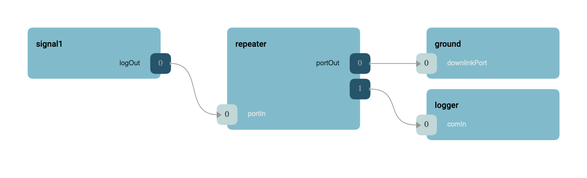

\page SvcGenericRepeaterComponent Svc::GenericRepeater Component
# Svc::GenericRepeater Generic Repeater Component

The GenericRepeater component is designed to take in a port and repeat it to the output multiple times. GenericRepeater is
typically used to take in `Fw::ComBuffer` and log the buffer to a file and send it to the ground interface.

## Design

The generic component has an input port and an array of output ports that receive the repeated calls. A typical logging
use case is shown below.



## Configuration

Generic repeater maximum output ports are configured using `AcConstants.ini` as shown below:

```ini
GenericRepeaterOutputPorts = 2
```

Here the repeater will bifurcate the incoming port calls.

## Idiosyncrasies 

The generic repeater does not copy data, and thus reference port calls will not clone references. Care should be taken
when passing pointers and references through the repeater. Special care must be taken with items that need to be
deallocated, like `Svc::BufferManager` allocations.


## Requirements

| Name | Description | Validation |
|---|---|---|
| GENREP-001 | The generic repeater shall repeat calls from input to output | unit test |

## Change Log

| Date | Description |
|---|---|
| 2020-12-21 | Initial Draft |
| 2021-01-29 | Updated |