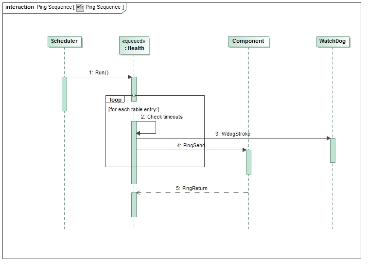

\page SvcHealthComponent Svc::Health Component
# Svc::Health Component

## 1. Introduction

The `Svc::Health` component monitors the execution health of the software. It does so by pinging active components and checking for a response. It also does optional platform-specific checks.

## 2. Requirements

The requirements for `Svc::Health` are as follows:

Requirement | Description | Verification Method
----------- | ----------- | -------------------
HTH-001 | The `Svc::Health` component shall ping each output port specified in the provided table. | Unit Test
HTH-002 | The `Svc::Health` component shall track the timeout cycles for each component. | Unit Test
HTH-003 | The `Svc::Health` component shall issue a FATAL event if a component fails to return a ping by the specified timeout | Unit Test
HTH-004 | The `Svc::Health` component shall have a command to enable or disable all monitoring | Unit Test
HTH-005 | The `Svc::Health` component shall have a command to enable or disable monitoring for a particular port. | Unit Test
HTH-006 | The `Svc::Health` component shall have a command to update ping timeout values for a port | Unit Test
HTH-007 | The `Svc::Health` component shall stroke a watchdog port while all ping replies are within their limit and health checks pass | Unit Test

## 3. Design

### 3.1 Context

#### 3.1.1 Component Diagram

The `Svc::Health` component has the following component diagram:

#### 3.1.2 Ports

The Svc::Health component uses the following port types:

Port Data Type | Name | Direction | Kind | Usage
-------------- | ---- | --------- | ---- | -----
[`Svc::Ping`](../../../Svc/Ping/docs/sdd.md) | PingSend | Output | n/a | Send ping requests from components
[`Svc::Ping`](../../../Svc/Ping/docs/sdd.md) | PingReturn | Input | Asynchronous | Receive ping responses from components
[`Svc::Sched`](../../../Svc/Sched/docs/sdd.md) | Run | Input | Synchronous | Execute periodic behavior
[`Svc::WatchDog`](../../../Svc/WatchDog/docs/sdd.md) | Wdog | Output | n/a | Send ping requests from components

### 3.2 Functional Description

#### 3.2.1 Pings

The `Svc::Health` component monitors health by iterating through a table of port numbers and their maximum allowed timeout. The timeout is specified as the number of calls to the `SchedIn` port. The actual timeout value in wall time will be dependent on the rate at which the port is called. During each `SchedIn` port call, all the `PingSend` ports are called with a key. The key is simply a counter value maintained as a private data member. An active component with a `Svc::Ping` port is required to execute the port handler on the thread of the component. When the handler is invoked, it returns the value of the `Svc::Ping` port key argument as the argument to the output `Svc::Ping` port. When the health component receives the return port invocation on the `PingReturn` port, it sets a status in the tracking table indicating the response was received. In addition to dispatching pings to components, the `SchedIn` port call checks the status of all the dispatched pings to verify that they have not exceeded the specified timeout. If there is a call that is outstanding but has not timed out, a counter is decremented. The port is not pinged while there is an outstanding ping call. If an active component times out responding to a ping, the `Svc::Health` component sends a FATAL event. The component has commands to completely turn off monitoring, turn off monitoring for a specific port, or update the timeout values. The updated timeout values or monitoring updates are not stored through a software reset.

#### 3.2.2 Platform-specific Checks

The `Svc::Health` component defines an internal method call `doOtherChecks()`. It is called at the end of the `Run` handler, and is meant to be used for platform-specific health checks. Alternate implementations can be added to the mod.mk `SRC_` variables. An empty stub has been provided for implementations where nothing extra is needed.

#### 3.2.2.1 VxWorks

The `doOtherChecks()` method does the following checks for VxWorks:

* Check for suspended tasks
* Check for PCI errors  

### 3.3 Scenarios

#### 3.3.1 Ping Components

The `Svc::Health` component pings other components and checks for their response:

 

### 3.4 State

`Svc::Health` has no state machines.

### 3.5 Algorithms

`Svc::Health` has no significant algorithms.

## 4. Dictionaries

TBD

## 5. Module Checklists

Document | Link
-------- | ----
Design Checklist | [Link](Checklist_Design.xlsx)
Code Checklist | [Link](Checklist_Code.xlsx)
Unit Test Checklist | [Link](Checklist_Unit_Test.xls)

## 6. Unit Testing
The Health unit tests are designed to test interfaces and functionality with the available ports, command processing, telemetry output, EVR and data product generation.

<ol>
  <li> Nominal scenarios for a given requirement</li>
  <li> Off-nominal testing </li>
  <li> Miscellaneous remaining testing </li>
</ol>

Off-nominal testing contains cases which deal with ping-related issues such as late responses and invalid entries. Every command is also tested with various inputs for thorough validation and code coverage.

## 6.1 Unit Test Descriptions
### 6.1.1 Nominal Telemetry Test
When the Health component's schedIn handler is called, each ping entry in the user provided table is checked if it's enabled. If the entry is enabled and empty, a ping is sent out through its corresponding port. If the entry is awaiting a ping response, its counter is checked against a warning threshold and the counter is decremented. If the warning threshold is reached, an EVR and telemetry write are generated. If the fault threshold is reached, a fatal EVR is generated. 

This test invokes the schedIn handler for multiple iterations with a provided table of three ping entries. To test nominal conditions, when a ping is received through the test port, a valid ping return is sent back to the component.  

For this nominal condition, no EVRs or telemetry are expected.

Requirement verified: `HTH-001`
### 6.1.2 Warning Telemetry Test

This test verifies the requirement that component shall track the timeout cycles for each ping entry. This is validated by having the component ping each entry in the table without responding. The counter for entry is checked after every iteration to see if its value is decremented accordingly. This test will also cause each entry to reach its warning threshold, so the corresponding EVRs and telemetry will be verified.

Requirement verified: `HTH-002`
### 6.1.3 Fault Telemetry Test

This test is similar to 6.1.2, with the difference being that the schedIn handler is ran until the fault threshold for each ping entry is reached. The counters for each entry and expected fault EVRs are both verified. 

Requirement verified: `HTH-003`
### 6.1.4 Enable/Disable All Monitoring Test

In this test, we verify the requirement to enable/disable all monitoring of the ping entries. This is done by running the schedIn handler with monitoring enabled initially with pings sent to each entry with no response from the test. After several iterations and certifying that each entry is being checked, we disable monitoring and invoke the schedIn handler again. During multiple runs of the handler, it is verified that timeouts are not modified and no EVRs are received. Monitoring is then re-enabled and checked if it's working as expected.

Requirement verified: `HTH-004`
### 6.1.5 Enable/Disable Single Monitor Test

This test is similar to 6.1.4, but instead of enabling/disabling all monitors, each ping entry is enabled then disabled. These actions are verified through the previous methodology of 6.1.4. 

Requirement verified: `HTH-005`
### 6.1.6 Updating Ping Timeout Test

This test verifies the requirement that the component shall have a command to update timeout values for a port entry. This is done by modifying the initial timeout values for each ping entry in the table. These changes are validated by running the schedIn handler and checking for EVRs and telemetry at the updated timeout values.

Requirement verified: `HTH-006`
### 6.1.7 Watchdog Test

This test verifies the requirement that the component shall stroke a watchdog port while all ping are within their limit. This is done by checking the output of the watchdog port and verifying its content. 

Requirement verified: `HTH-007`

### 6.1.8 Nominal Command Test
This test verifies the functionally of all the provided health commands including the enable/disable monitoring of the ping entries as well as updating timeouts. All commands are validated and verified with nominal inputs. 

### 6.1.9 Nominal Command and Telemetry Test
This test is similar to `6.1.8`, but it includes a nominal running of the SchedIn handler while handling incoming commands. 

### 6.1.10 Miscellaneous 

This set of test cases verifies the remaining off-nominal error cases. Each test case is simulated and validated individually.

## 6.2 Unit Test Coverage

To see unit test coverage run fprime-util check --coverage

## 7. Change Log

Date | Description
---- | -----------
1/11/2016 | Edits for design review

