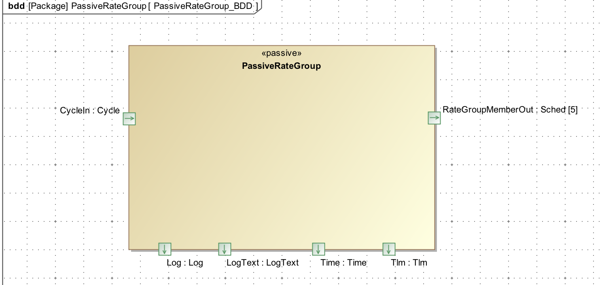
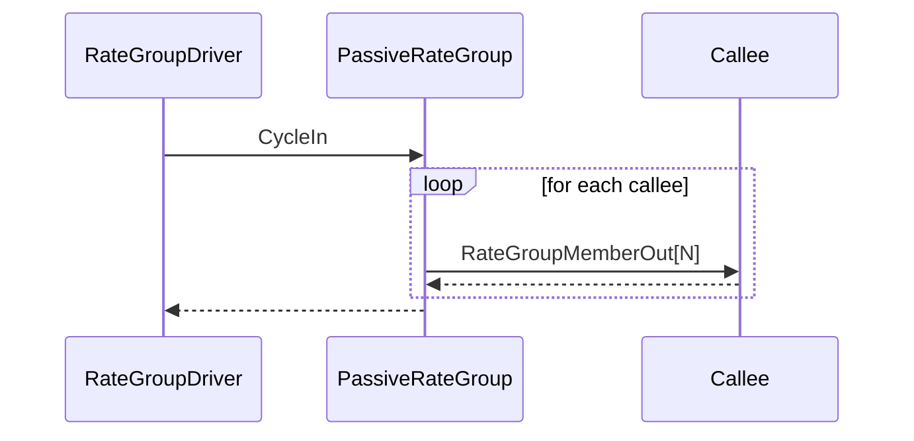

# PassiveRateGroup Component

## 1. Introduction

`Svc::PassiveRateGroup` is an passive component that drives a set of components connected to `Svc::Sched` output ports. It contains an synchronous input `Svc::Cycle` port that drives all the operations.  The component invokes each output port in order, passing an argument specified in the supplied context list. It tracks execution time of the cycle.

## 2. Requirements

The requirements for `Svc::PassiveRateGroup` are as follows:

Requirement | Description | Verification Method
----------- | ----------- | -------------------
FPRIME-PRG-001 | The `Svc::PassiveRateGroup` component shall be passive and will be driven by an input synchronous port call | Inspection, Unit test
FPRIME-PRG-002 | The `Svc::PassiveRateGroup` component shall invoke its output ports in order, passing the value contained in a table based on port number | Unit Test
FPRIME-PRG-003 | The `Svc::PassiveRateGroup` component shall track the time required to execute the rate group and report it as telemetry | Unit Test
FPRIME-PRG-004 | The `Svc::PassiveRateGroup` component shall track per-port execution times and high water marks when configured | Unit Test
FPRIME-PRG-005 | The `Svc::PassiveRateGroup` component shall provide a command to clear statistics and high water marks | Unit Test

## 3. Design

### 3.1 Context

#### 3.1.1 Component Diagram

The `Svc::PassiveRateGroup` component has the following component diagram:

#### 3.1.2 Ports

The `Svc::PassiveRateGroup` component uses the following port types:

Port Data Type | Name | Direction | Kind | Usage
-------------- | ---- | --------- | ---- | -----
Svc::Cycle | CycleIn | Input | synchronous | Receive a call to run one cycle of the rate group
[`Svc::Sched`](../../Sched/docs/sdd.md) | RateGroupMemberOut | Output | n/a | Rate group ports
Fw::Cmd | CmdDisp | Input | sync | Command receive port
Fw::CmdResponse | CmdStatus | Output | n/a | Command response port
Fw::CmdReg | CmdReg | Output | n/a | Command registration port
Fw::Tlm | Tlm | Output | n/a | Telemetry port
Fw::Time | Time | Output | n/a | Time get port

#### 3.2 Functional Description

The `Svc::PassiveRateGroup` component has one input port that is used to drive all of the processing.  The component calls the output ports in order, passing the context from the context list as the port argument.

The component must be configured via `configure()` with:
- A context array of U32 values (one per output port) passed to each rate group member
- An optional `Os::RawTimeSource` specifying which hardware timer to use for execution time measurements (defaults to `Os::RAWTIME_DEFAULT`)

The component tracks execution time statistics:
- Overall rate group cycle time (current and maximum)
- Per-port execution times and high water marks (when PassiveRateGroupCfg::PortCycleTime is enabled)
- Total cycle count

These statistics can be cleared via the `CLEAR_STATISTICS` sync command, which resets the maximum cycle time and per-port high water marks to zero (the running cycle count is not cleared). All statistics are protected by lock-free atomic operations, making them ISR-safe and eliminating mutex overhead.

**IMPORTANT - RawTimeSource Limitation**: The `RawTimeSource` parameter in `configure()` only affects the *end* timestamp of each cycle. The *start* timestamp (`cycleStart`) comes from the cycle driver (e.g., `RateGroupDriver`, `LinuxTimer`), which constructs its `Os::RawTime` with `RAWTIME_DEFAULT`. If you configure a non-default `RawTimeSource`, the cycle time calculation subtracts timestamps from two different timer sources, producing meaningless results. **This feature is only correct when using `RAWTIME_DEFAULT` (the default), or when the cycle driver is modified to use the same non-default source.** There is currently no API to configure the cycle driver's timer source, so non-default configurations require custom cycle driver implementations.

#### 3.2.1 Commands

The `Svc::PassiveRateGroup` component supports the following commands:

Command | Description
------- | -----------
CLEAR_STATISTICS | Clears port cycle time high water marks and maximum cycle time. Does NOT reset cycle count, which is a running total. Uses lock-free atomic operations for ISR-safe execution.

#### 3.2.2 Telemetry

The `Svc::PassiveRateGroup` component provides the following telemetry channels:

Channel | Type | Description
------- | ---- | -----------
MaxCycleTime | U32 | Maximum execution time of rate group cycle (microseconds). Cleared by CLEAR_STATISTICS command. Updated only when maximum increases (update on change).
CycleTime | U32 | Execution time of current cycle (microseconds). Sent every cycle.
CycleCount | U32 | Running total count of cycles executed. NOT cleared by CLEAR_STATISTICS command. Sent every cycle.
PortCycleTime | U32[PassiveRateGroupOutputPorts] | Execution time for each port in the most recent cycle (microseconds). Sent every cycle (only when PassiveRateGroupCfg::PortCycleTime is enabled).
PortCycleTimeHWM | U32[PassiveRateGroupOutputPorts] | High water mark for each port execution time (microseconds). Cleared by CLEAR_STATISTICS command. Updated only when any high water mark increases (update on change). Only available when PassiveRateGroupCfg::PortCycleTime is enabled.   

### 3.3 Scenarios

#### 3.3.1 Rate Group Port Call

As described in the Functional Description section, the `Svc::PassiveRateGroup` component accepts calls to the CycleIn and invokes the RateGroupMemberOut ports:

**Sequence Diagram**

```mermaid
sequenceDiagram
    participant RateGroupDriver
    participant PassiveRateGroup
    participant Callee
    RateGroupDriver ->> PassiveRateGroup: CycleIn
    loop for each callee
        PassiveRateGroup ->> Callee: RateGroupMemberOut[N]
        Callee -->> PassiveRateGroup: 
    end
    PassiveRateGroup -->> RateGroupDriver: 
```

### 3.4 State

`Svc::PassiveRateGroup` has no state machines.

### 3.5 Algorithms

`Svc::PassiveRateGroup` has no significant algorithms.

## 4. Change Log

Date | Description
---- | -----------
2/9/2017 | First Draft
8/8/2026 | Updated to document CLEAR_STATISTICS command, telemetry channels, and standard ports. Added lock-free atomic operations for all statistics (m_maxTime and per-port HWMs) to provide ISR-safe, race-free concurrent access without mutex overhead.

