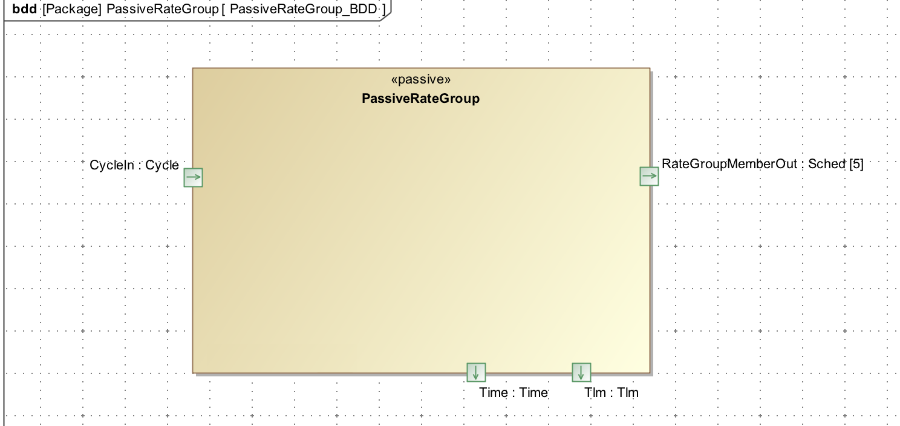
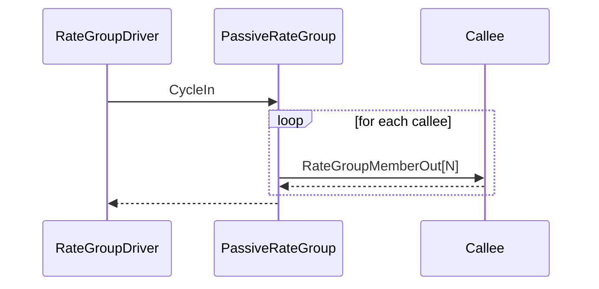

\page SvcPassiveRateGroupComponent Svc::PassiveRateGroup Component
# RateGroupDriver Component

## 1. Introduction

`Svc::PassiveRateGroup` is an passive component that drives a set of components connected to `Svc::Sched` output ports. It contains an synchronous input `Svc::Cycle` port that drives all the operations.  The component invokes each output port in order, passing an argument specified in the supplied context list. It tracks execution time of the cycle.

## 2. Requirements

The requirements for `Svc::PassiveRateGroup` are as follows:

Requirement | Description | Verification Method
----------- | ----------- | -------------------
FPRIME-PRG-001 | The `Svc::PassiveRateGroup` component shall be passive and will be driven by an input synchronous port call | Inspection, Unit test
FPRIME-PRG-002 | The `Svc::PassiveRateGroup` component shall invoke its output ports in order, passing the value contained in a table based on port number | Unit Test
FPRIME-PRG-003 | The `Svc::PassiveRateGroup` component shall track the time required to execute the rate group and report it as telemetry | Unit Test

## 3. Design

### 3.1 Context

#### 3.1.1 Component Diagram

The `Svc::PassiveRateGroup` component has the following component diagram:

#### 3.1.2 Ports

The `Svc::PassiveRateGroup` component uses the following port types:

Port Data Type | Name | Direction | Kind | Usage
-------------- | ---- | --------- | ---- | -----
Svc::Cycle | CycleIn | Input | synchronous | Receive a call to run one cycle of the rate group
[`Svc::Sched`](../../Sched/docs/sdd.md) | RateGroupMemberOut | Output | n/a | Rate group ports

#### 3.2 Functional Description

The `Svc::PassiveRateGroup` component has one input port that is used to drive all of the processing.  The component calls the output ports in order, passing the context from the context list as the port argument.   

### 3.3 Scenarios

#### 3.3.1 Rate Group Port Call

As described in the Functional Description section, the `Svc::PassiveRateGroup` component accepts calls to the CycleIn and invokes the RateGroupMemberOut ports:

**Sequence Diagram**

### 3.4 State

`Svc::PassiveRateGroup` has no state machines.

### 3.5 Algorithms

`Svc::PassiveRateGroup` has no significant algorithms.

## 4. Change Log

Date | Description
---- | -----------
2/9/2017 | First Draft

