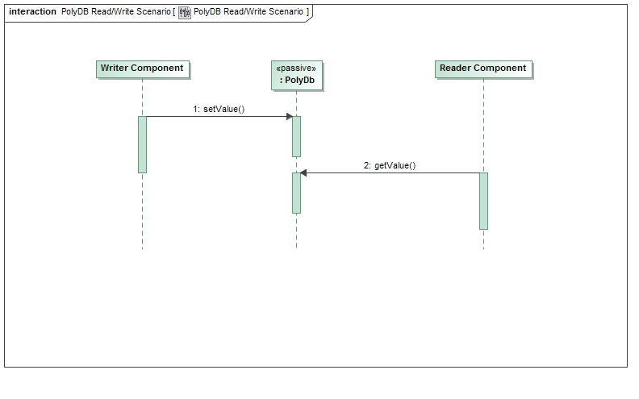

\page SvcPolyDbComponent Svc::PolyDb Component
# Svc::PolyDb Component

## 1. Introduction

The `Svc::PolyDb` component is meant to act as a resident database of values that components can use for checking or for data in algorithms. 

## 2. Requirements

The requirements for `Svc::PolyDb` are as follows:

Requirement | Description | Verification Method
----------- | ----------- | -------------------
PDB-001 | The `Svc::PolyDb` component shall store `Fw::PolyType` values. | Inspection, Unit Test
PDB-002 | The `Svc::PolyDb` component shall allow the `Fw::PolyType` values to be read and written. | Unit Test 
PDB-003 | The `Svc::PolyDb` component shall time tag the data | Unit Test 
PDB-004 | The `Svc::PolyDb` component shall report the measurement state of the data (good, stale, failure) | Unit Test 

## 3. Design

### 3.1 Context

#### 3.1.1 Component Diagram

The `Svc::PolyDb` component has the following component diagram:

#### 3.1.2 Ports

The Svc::PolyDb component uses the following port types:

Port Data Type | Name | Direction | Kind | Usage
-------------- | ---- | --------- | ---- | -----
[`Svc::Poly`](../../PolyIf/docs/sdd.html) | getValue | Input | Guarded | Write `Fw::PolyType` values
[`Svc::Poly`](../../PolyIf/docs/sdd.html) | setValue | Input | Guarded | Write `Fw::PolyType` values

#### 3.2 Functional Description

`Fw::PolyType` is different from binary telemetry in that it is not in a serialized form, but is stored as the native type.
The component stores a table of `Fw::PolyType' objects which are read and written by a table index enumeration. 
The table is protected by a mutex to prevent simultaneous access.

Users can customize the index name by modifying the `config/PolyDbCfg.fpp` file in their own configuration directory.

Note that users should understand how the `Fw::PolyType` works to avoid asserts when reading a different type than was written. To avoid asserts, user code can verify the expected type matches by calling the correct `isXX()` function before trying to read the value out. The `PolyDb` will not assert on the read or write of a `Fw::PolyType` if there is a type mismatch. This only happens when trying to read out the value stored in the `Fw::PolyType`.

### 3.3 Scenarios

#### 3.3.1 Read and Write Values

The following diagram shows how components can share a value by having one component write the value, and the other read it:

 

### 3.4 State

`Svc::PolyDb` has no state machines.

### 3.5 Algorithms

`Svc::PolyDb` has no significant algorithms.

## 4. Dictionaries

No dictionaries

## 4. Module Checklists

Document | Link
-------- | ----
Design Checklist | [Link](Checklist_Design.xlsx)
Code Checklist | [Link](Checklist_Design.xlsx)
Unit Test Checklist | [Link](Checklist_Unit_Test.xlsx)

## 5. Unit Testing

To see unit test coverage run fprime-util check --coverage

## 6. Change Log

Date | Description
---- | -----------
6/19/2015 | Design review edits
7/22/2015 | Design review actions 
9/15.2015 | Unit Test actions

