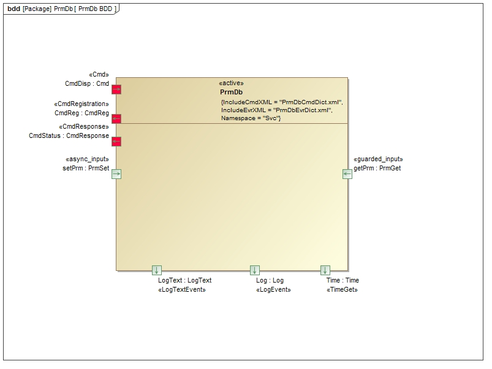
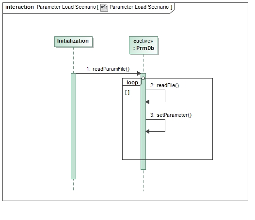
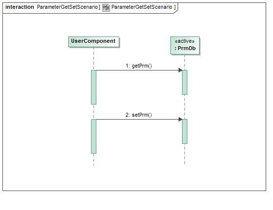
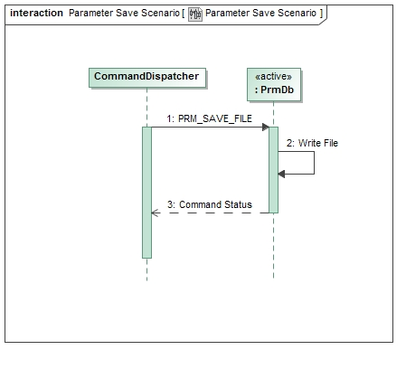

\page SvcPrmDbComponent Svc::PrmDb Component
# Svc::PrmDb Component

## 1. Introduction

The `Svc::PrmDb` Component is used to store parameter values used by other components. The values are stored in serialized form. During initialization, `Svc::PrmDb` loads a set of parameters from a file, and stores the values in a table based on the parameter ID. Components that need parameters request their values during initialization after they have been loaded. Components occasionally receive updates to parameter values via a command, and the new values will be sent to `Svc::PrmDb`. A command will save the copy in memory back to the file.

## 2. Requirements

The requirements for `Svc::TlmChan` are as follows:

Requirement | Description | Verification Method
----------- | ----------- | -------------------
PRMDB-001 | The `Svc::PrmDb` component shall load parameter values from a file | Unit Test
PRMDB-002 | The `Svc::PrmDb` component shall provide an interface to read parameter values | Inspection, Unit Test
PRMDB-003 | The `Svc::PrmDb` component shall provide an interface to update parameter values | Inspection, Unit Test
PRMDB-004 | The `Svc::PrmDb` component shall provide a command to save the current parameter values | Inspection, Unit Test

## 3. Design

### 3.1 Context

#### 3.1.1 Component Diagram

The `Svc::PrmDb` component has the following component diagram:

#### 3.1.2 Ports

The `Svc::PrmDb` component uses the following port types:

Port | Name | Direction | Type | Usage
---- | ---- | --------- | ---- | -----
[`Fw::PrmGet`](../../../Fw/Prm/docs/sdd.md) | getPrm | Input | Synchronous | Get a parameter
[`Fw::PrmSet`](../../../Fw/Prm/docs/sdd.md) | setPrm | Input | Asynchronous | Update a parameter

#### 3.2 Functional Description

The `Svc::PrmDb` component stores parameter values in a table by parameter ID. The table is mutex protected to prevent reading and writing from occurring at the same time. When the parameter file is read, the ID and serialized value are extracted and placed in the table. If an error occurs during the file load, any entries not successfully loaded will return a status to the `getPrm` port of `PARAM_INVALID` will be returned, otherwise `PARAM_OK`. 

When a new parameter value is written to the `setPrm` port, the table in memory is updated, and the flag indicating a valid value is set.

When the component receives the `PRM_SAVE_FILE` command, it saves the entire table to the file, overwriting the old values. Unless the file is written, any parameter updates will be lost when the software is restarted.

The fields for each parameter value as stored in the parameter file are as follows:

Description | Size (in bytes) | Value
----------- | ---- | -----
Entry Delimiter | 1 | 0xA5
Record Size | 4 | Id type size + number of bytes in parameter value
Parameter ID | Size of FwPrmIdType | Value of parameter ID
Parameter value | number of bytes in parameter | serialized bytes of value

### 3.3 Scenarios

#### 3.3.1 Parameter Load Scenario

This diagram shows the scenario where parameters are loaded from a file.

 

#### 3.3.2 Parameter Get/Set Scenario

This diagram shows the scenario where parameters are retrieved and updated by components.

 

#### 3.3.3 Parameter Save Scenario

This diagram shows the scenario where parameters are saved to a file.

 

### 3.4 State

`Svc::PrmDb` has no state machines.

### 3.5 Algorithms

`Svc::PrmDb` has no significant algorithms.

## 4. Module Checklists

Document | Link
-------- | ----
Design Checklist | [Link](Checklist_Design.xlsx)
Code Checklist | [Link](Checklist_Code.xlsx)
Unit Test Checklist | [Link](Checklist_Unit_Test.xls)

## 5. Dictionary

TBD

## 6. Unit Testing

To see unit test coverage run fprime-util check --coverage

## 7. Change Log

Date | Description
---- | -----------
7/15/2015 | Design review edits
10/6/2015 | Unit test review edits 

