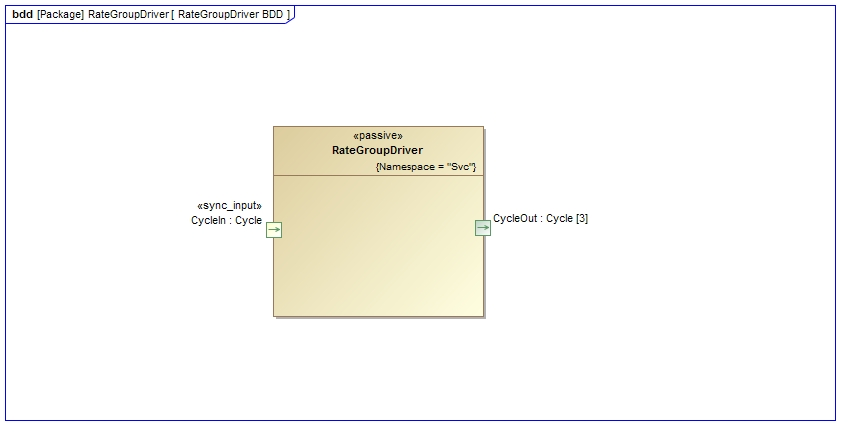
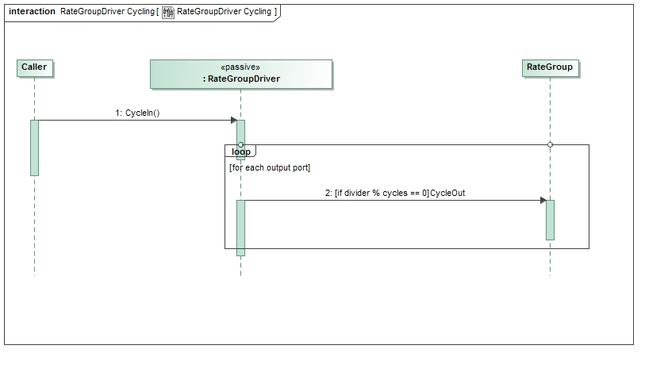

\page SvcRateGroupDriverComponent Svc::RateGroupDriver Component
# Svc::RateGroupDriver Component

## 1. Introduction

The RateGroupDriver Component is used to take a single system tick and distribute it to multiple rate groups in a system. 
It takes the input `Svc::Sched` port, then divides down the tick rate based on arguments to the constructor. 
Typically, the output ports would be connected to the asynchronous inputs of an `ActiveRateGroup`.

## 2. Requirements

The requirements for RateGroupDriver are as follows:

Requirement | Description | Verification Method
----------- | ----------- | -------------------
RGD-001 | The 'Svc::RateGroupDriver' component shall divide a primary system tick into the needed rate groups | Unit Test
RCD-002 | The 'Svc::RateGroupDriver' component shall be able to run in ISR context | Inspection

## 3. Design

### 3.1 Context

#### 3.1.1 Component Diagram

The Svc::RateGroupDriver component has the following component diagram:



#### 3.1.2 Ports

The Svc::RateGroupDriver component uses the following port types:

Port Data Type | Name | Direction | Kind | Usage
-------------- | ---- | --------- | ---- | -----
[`Svc::Cycle`](../../Sched/docs/sdd.md) | CycleIn | Input | Synchronous | Receive the system tick
[`Svc::Cycle`](../../Sched/docs/sdd.md) | CycleOut| Output | n/a | Used to drive rate groups

#### 3.2 Functional Description

The Svc::RateGroupDriver component has one input port that receives a system tick. 

The `configure()` function is passed an array of integer arguments that specifies the divisors for each output port. This should be called after the constructor but before any port calls are made. The contents of the array are copied during the call, so the array can be a temporary variable.

```
    RateGroupDriverImpl::configure(NATIVE_INT_TYPE dividers[], NATIVE_INT_TYPE numDividers);
```    

The input rate for each output port will be divided down by the value in the `dividers[]` array corresponding to the output port number.

The implementation will be ISR compliant by avoiding the following:

* Floating point calculations
* Taking mutexes
* Calling libraries with unknown side effects
* Long implementation

For instance,

`SchedIn` Rate | `divider[0]` | `SchedOut[0]` | `divider[1]` | `SchedOut[1]` | `divider[2]` | `SchedOut[2]`
-------------- | ------------ | ------------- | ------------ | ------------- | ------------ | -------------
1Hz | 1 | 1Hz | 2 | 0.5Hz | 4 | 0.25Hz

### 3.3 Scenarios

#### 3.3.1 System Tick Port Call

As described in the Functional Description section, the RateGroupDriver component accepts calls to the SchedIn and divides them down to the SchedOut ports:

 

### 3.4 State

RateGroupDriver has no state machines.

### 3.5 Algorithms

RateGroupDriver has no significant algorithms.

## 4. Dictionary

No dictionary for this module

## 5. Module Checklists

Document | Link
-------- | ----
Design Checklist | [Link](Checklist_Design.xlsx)
Code Review Checklist | [Link](Checklist_Code.xlsx)
Unit Test Checklist | [Link](Checklist_Unit_Test.xls)

## 6. Unit Testing

To see unit test coverage run fprime-util check --coverage

## 7. Change Log

Date | Description
---- | -----------
6/19/2015 | Design review edits
7/22/2015 | Design review actions
9/2/2015| Unit test updates


