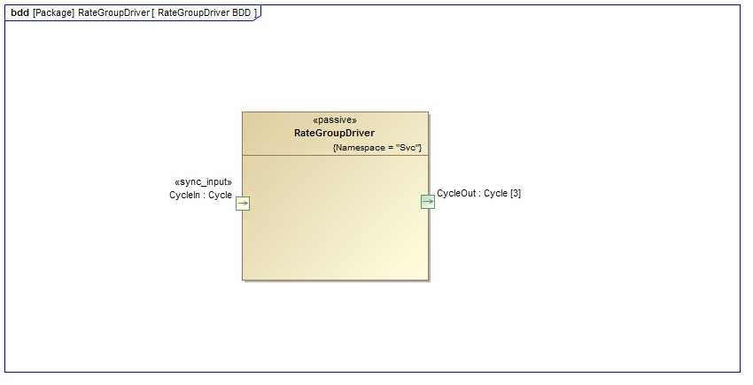
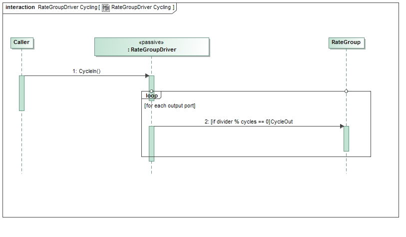

# Svc::RateGroupDriver Component

## 1. Introduction

The RateGroupDriver Component is used to take a single system tick and distribute it to multiple rate groups in a system. 
It takes the input `Svc::Sched` port, then divides down the tick rate based on arguments to the constructor. 
Typically, the output ports would be connected to the asynchronous inputs of an `ActiveRateGroup`.

## 2. Requirements

The requirements for RateGroupDriver are as follows:

Requirement | Description | Verification Method
----------- | ----------- | -------------------
RGD-001 | The 'Svc::RateGroupDriver' component shall divide a primary system tick into the needed rate groups | Unit Test
RCD-002 | The 'Svc::RateGroupDriver' component shall be able to run in ISR context | Inspection

## 3. Design

### 3.1 Context

#### 3.1.1 Component Diagram

The Svc::RateGroupDriver component has the following component diagram:



#### 3.1.2 Ports

The Svc::RateGroupDriver component uses the following port types:

Port Data Type | Name | Direction | Kind | Usage
-------------- | ---- | --------- | ---- | -----
[`Svc::Cycle`](../../Sched/docs/sdd.md) | CycleIn | Input | Synchronous | Receive the system tick
[`Svc::Cycle`](../../Sched/docs/sdd.md) | CycleOut| Output | n/a | Used to drive rate groups

#### 3.2 Functional Description

The Svc::RateGroupDriver component has one input port that receives a system tick. 

The `configure()` function is passed a divider set that specifies the divisors and offsets for each output port. This should be called after the constructor but before any port calls are made. The contents of the structure are copied during the call, so the array can be a temporary variable.

```
    RateGroupDriver::configure(const DividerSet& dividerSet);
```    

`DividerSet` holds one `Divider{divisor, offset}` entry per `CycleOut` port, indexed by output port number. The divider contract is:

* The component keeps a tick counter that starts at zero and increments on every `CycleIn` call.
* Output port `n` is called on a tick when `ticks % dividers[n].divisor == dividers[n].offset`, so the input rate is divided down by `divisor` and the output is shifted by `offset` ticks. Different offsets let rate groups with the same divisor run on different ticks.
* A `divisor` of `0` disables the output port; it is never called. This is the default for an entry that is not set.
* The `offset` must be `0` or less than the `divisor`; `configure()` asserts otherwise because such a port would never be called.
* The tick counter rolls over at the product of all non-zero divisors, so every port keeps its cadence across the rollover. `configure()` asserts if this product would overflow.

The implementation will be ISR compliant by avoiding the following:

* Floating point calculations
* Taking mutexes
* Calling libraries with unknown side effects
* Long implementation

For instance,

`CycleIn` Rate | `dividers[0]` | `CycleOut[0]` | `dividers[1]` | `CycleOut[1]` | `dividers[2]` | `CycleOut[2]`
-------------- | ------------- | ------------- | ------------- | ------------- | ------------- | -------------
1Hz | {1, 0} | 1Hz (every tick) | {2, 0} | 0.5Hz (ticks 0, 2, 4, ...) | {2, 1} | 0.5Hz (ticks 1, 3, 5, ...)

### 3.3 Scenarios

#### 3.3.1 System Tick Port Call

As described in the Functional Description section, the RateGroupDriver component accepts calls to `CycleIn` and divides them down to the `CycleOut` ports:

 

### 3.4 State

RateGroupDriver has no state machines.

### 3.5 Algorithms

RateGroupDriver has no significant algorithms.

## 4. Dictionary

No dictionary for this module

## 5. Module Checklists

Checklist |
-------- |
[Design](Checklist_Design.xlsx) |
[Code](Checklist_Code.xlsx) |
[Unit Test](Checklist_Unit_Test.xls) |

## 6. Unit Testing

To see unit test coverage run fprime-util check --coverage

## 7. Change Log

Date | Description
---- | -----------
6/19/2015 | Design review edits
7/22/2015 | Design review actions
9/2/2015| Unit test updates


