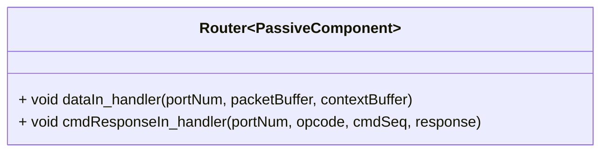

# Svc::Router

The `Svc::Router` component routes F´ packets (such as command or file packets) to other components.

The `Svc::Router` component receives F´ packets (as [Fw::Buffer](../../../Fw/Buffer/docs/sdd.md) objects) and routes them to other components through synchronous port calls. The `Svc::Router` component supports `Fw::ComPacket::FW_PACKET_COMMAND` and `Fw::ComPacket::FW_PACKET_FILE` packet types.

## Usage Examples

The `Svc::Router` component is used in the uplink stack of many reference F´ application such as [the tutorials source code](https://github.com/fprime-community#tutorials).

### Typical Usage

In the canonical uplink communications stack, `Svc::Router` is connected to a [Svc::CmdDispatcher](../../CmdDispatcher/docs/sdd.md) and a [Svc::FileUplink](../../FileUplink/docs/sdd.md) component, to receive Command and File packets respectively.

## Class Diagram

## Port Descriptions

| Name | Description | Type |
|---|---|---|
| `dataIn: Fw.DataWithContext` | Receiving Fw::Buffer with context buffer from Deframer | `guarded input` |
| `commandOut: Fw.Com` | Port for sending command packets as Fw::ComBuffers | `output` |
| `fileOut: Fw.BufferSend` | Port for sending file packets as Fw::Buffer (ownership passed to receiver) | `output` |

## Requirements

| Name | Description | Rationale | Validation |
|---|---|---|---|
SVC-ROUTER-001 | `Svc::Router` shall route packets based on their packet type as indicated by the packet header | Routing mechanism of the F´ comms protocol | Unit test |
SVC-ROUTER-002 | `Svc::Router` shall route packets with the following types: `Fw::ComPacket::FW_PACKET_COMMAND`, `Fw::ComPacket::FW_PACKET_FILE`. | These are the packet types used for uplink. | Unit test |
SVC-ROUTER-003 | `Svc::Router` shall route command and file packets to the `commandOut` and `fileOut` ports, respectively | Routing mechanism as dictated by the F´ point-to-point architecture. | Unit test |
