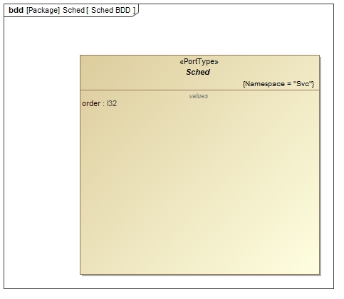

\page SvcSchedPort Svc::Sched Port
# Svc::Sched Port

## 1. Introduction

The `Svc::Sched` port is used to invoke components used in the scheduling of the application. 
It has an argument that specifies the invocation order, so components can take different actions depending on the call order.

## 2. Design

### 2.1 Context

#### 2.1.1 Port Diagram

The Svc::Sched port has the following port diagram:

#### 2.1.2 Serializables

The Svc::Sched port does not use any serializables for arguments.

## 3. Change Log

Date | Description
---- | -----------
6/19/2015 |  Initial Version

