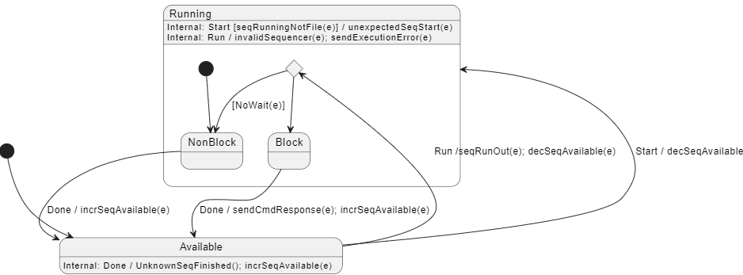

# components::SeqDispatcher

Dispatches command sequences to available command sequencers, allowing the spacecraft controllers to run multiple sequences at once without having to manually manage which `CmdSequencer`s those sequences run on.

### Usage
* Call the `RUN` command just like you would call it on a `CmdSequencer`
* If any connected `CmdSequencer` is available, it will route the sequence to the first one it finds
* `RUN` can be made blocking or non-blocking, just like `CmdSequencer`'s `RUN`

## State diagram

## Port Descriptions
|Type| Name | Description |
|async input|seqRunIn|Equivalent to the RUN cmd, dispatches a sequence to the first available sequencer|
|output|seqRunOut|This is used by the SeqDispatcher to send sequence run calls to sequencers|
|output|seqCancelOut|This is used by the SeqDispatcher to cancel a running sequence on a specific sequencer|
|async input|seqDoneIn|Called by a command sequencer whenever it has finished any sequence|
|async input|seqStartIn|Called by a command sequencer whenever it starts any sequence|

## Commands
| Name | Description |
|RUN|Dispatches a sequence to the first available sequencer|
|RUN_ARGS|Dispatches a sequence with arguments to the first available sequencer|
|LOG_STATUS|Logs via Events the state of each connected command sequencer|
|CANCEL_NAME|Cancels any running sequence matching the given file name.|
|CANCEL_ALL|Cancels every currently running sequence on all connected sequencers. This is a broadcast and does not exclude the caller: a sequence that issues CANCEL_ALL is itself canceled.|

## Events
| Name | Description |
|InvalidSequencer|The given sequencer index is invalid for an unspecified reason|
|NoAvailableSequencers|There are no available sequencers to dispatch a sequence to|
|UnknownSequenceFinished|We received a call to seqDoneIn that didn't have a corresponding seqStartIn call. The dispatcher recovers by marking the sequencer available and clearing its tracked sequence|
|UnexpectedSequenceStarted|We received a call to seqStartIn but we didn't receive a call to seqDoneIn before that|
|ConflictingSequenceStarted|A sequencer started a new sequence while still marked as running another|
|LogSequencerStatus|Shows the current state and sequence filename for a particular sequencer. Produced by the LOG_STATUS command|
|SequenceCanceled|A running sequence was canceled on the given sequencer (by CANCEL_NAME or CANCEL_ALL)|
|CancelSequenceNotFound|No running sequence matched the CANCEL_NAME file name|

## Telemetry
| Name | Description |
|dispatchedCount|Number of sequences dispatched|
|errorCount|Number of sequences dispatched that returned an error. Note: if a sequence was run in non-blocking mode, even if the sequence errors out, this error count will never increase|
|sequencersAvailable|Number of sequencers ready to run a sequence|
|canceledCount|Number of sequences canceled by the CANCEL_NAME and CANCEL_ALL commands|

## Unit Tests
Add unit test descriptions in the chart below
| Name | Description |
|testDispatch|Tests the basic dispatch functionality of the `SeqDispatcher`|
|testLogStatus|Tests the LOG_STATUS command|
|testCancelName|Tests that CANCEL_NAME cancels the matching sequencer and clears state on seqDoneIn|
|testCancelNameNotFound|Tests that CANCEL_NAME with an unmatched file name errors and cancels nothing|
|testCancelAll|Tests that CANCEL_ALL cancels every running sequencer and clears state on seqDoneIn|
|testCancelAllNoneRunning|Tests that CANCEL_ALL with no running sequences succeeds and cancels nothing|

## Requirements
Add requirements in the chart below
| Name | Description | Validation |
|---|---|---|
|---|---|---|