# ComCcsds (CCSDS Framing) Subtopology — Software Design Document (SDD)

The **ComCcsds subtopologies** implement F´’s **CCSDS** communications stack for framing/deframing on the flight side. There are **two variants** in the same module:

1. A variant that **supplies a `Svc::ComStub`** implementation of `Svc.ComInterface` and expects to be wired to a **`Drv::ByteStreamDriverModel`** (TCP/UDP/UART, etc.), and
2. A variant that **expects an external implementation of [`Svc.ComInterface`](https://fprime.jpl.nasa.gov/latest/docs/reference/communication-adapter-interface/)** provided by the deployment.

Both variants provide the standard **router + ComQueue + CCSDS framers/deframers** path and are tuned through **ComCcsdsConfig** instance properties.

> [!IMPORTANT]
> `ComCcsds` provides framing/deframing for CCSDS SpacePackets inside TM/TC data transfer frames.

---

## 1. Requirements

| ID               | Description                                                                                                    | Validation |
| ---------------- | -------------------------------------------------------------------------------------------------------------- | ---------- |
| SVC-COMCCSDS-001 | Provide a **CCSDS framer** to convert COM buffers into CCSDS frames for downlink.                             | Inspection |
| SVC-COMCCSDS-002 | Provide a **CCSDS deframing path** to parse incoming CCSDS frames into COM buffers for uplink.                 | Inspection |
| SVC-COMCCSDS-003 | Provide an F´ **router** to route deframed packets (e.g., commands/files) into the flight software.            | Inspection |
| SVC-COMCCSDS-004 | Provide a **subtopology variant that supplies `Svc::ComStub`** designed to connect to a ByteStream driver.     | Inspection |
| SVC-COMCCSDS-005 | Provide a **subtopology variant that expects an external `Svc::ComInterface`** supplied by the deployment.     | Inspection |
| SVC-COMCCSDS-006 | Support **configurable instance properties** (IDs, queue sizes, stack sizes, priorities, CPU affinities) via `ComCcsdsConfig`. | Inspection |
| SVC-COMCCSDS-007 | Provide **composable layer topologies**: a Space Packet packet layer (`SpacePacketFraming`, `SpacePacket`) and a TM/TC transfer frame layer (`TmTcFraming`), from which the full stack is composed. | Inspection |

---

## 2. Design & Core Functions

### 2.1 Instance Summary

| Instance name         | Type (Svc/Drv)                  | Kind    | Purpose (core function)                                                                         |
| --------------------- | ------------------------------- | ------- | ----------------------------------------------------------------------------------------------- |
| `fprimeRouter`        | `Svc.FprimeRouter` (default; configurable via `ComCcsdsRouterConfig.fpp`) | Passive | Routes deframed packets (e.g., commands/files) into the flight software.                        |
| `comQueue`            | `Svc.ComQueue`                  | Active  | Queues categorized COM data for framing (telemetry, events, file, etc.); exposes `run`.         |
| `spacePacketFramer`   | `Svc.Ccsds.SpacePacketFramer`   | Passive | Builds **CCSDS Space Packets** from COM buffers (downlink step 1).                              |
| `framer`              | `Svc.Ccsds.TmFramer`            | Passive | Builds **CCSDS TM Transfer Frames** from space packets and sends to the link (downlink step 2). |
| `spacePacketDeframer` | `Svc.Ccsds.SpacePacketDeframer` | Passive | Deframes F Prime data from **CCSDS Space Packets** (uplink step 2).                             |
| `tcDeframer`          | `Svc.Ccsds.tcFramer`            | Passive | Deframes **CCSDS Space Packets** from  **CCSDS TM Transfer Frames** (uplink step 1).            |
| `frameAccumulator`    | `Svc.FrameAccumulator`          | Passive | Collects bytes from the link and emits complete frames/packets for deframing (uplink path).     |
| `comStub`             | `Svc.ComStub`                   | Passive | (Variant A only) Implementation of `Svc.ComInterface`, adapting a `Drv::ByteStreamDriverModel`. |

> **Two variants:**
> **A. “With ComStub”:** Subtopology **includes** `Svc::ComStub` and exposes **ByteStream** ports to your driver.
> **B. “With External ComInterface”:** Subtopology **does not include** `Svc::ComStub`; you **provide** one in the deployment.

### 2.1.1 Layered Topologies

The module also exposes the two layers of the stack as importable topologies, allowing projects to compose
alternative stacks (e.g., inserting an SDLS security layer between them) while reusing the same instances:

| Topology             | Contents                                                                                          |
| -------------------- | ------------------------------------------------------------------------------------------------- |
| `SpacePacketFraming` | Packet layer: `comQueue`, `fprimeRouter`, `spacePacketFramer`, `spacePacketDeframer`, `apidManager`, `aggregator`, `commsBufferManager`. Open framing boundary. |
| `SpacePacket`        | `SpacePacketFraming` plus `comStub` — a space-packet-only stack with no transfer frame layer.      |
| `TmTcFraming`       | Transfer frame layer: `framer` (TM), `tcDeframer`, `frameAccumulator`. Open upstream/downstream boundaries. |
| `FramingSubtopology` | `SpacePacketFraming` composed with `TmTcFraming` (variant B).                                      |
| `Subtopology`        | `FramingSubtopology` plus `comStub` (variant A).                                                    |

Each layer topology exposes its open boundary as **topology ports** (e.g. `SpacePacketFraming.dataOut`,
`TmTcFraming.framedDataIn`, `FramingSubtopology.comStatusIn`), so composing topologies and deployments wire
to the layer's ports rather than to individual component instances.

### 2.2 Data Flow - Uplink

On uplink, raw bytes from the com interface are accumulated into TC Transfer Frames,
deframed into Space Packets, and routed into the flight software.

```mermaid
flowchart LR
    subgraph TMTC["ComCcsds.TmTcFraming (transfer frame layer)"]
        frameAccumulator["frameAccumulator<br>Svc.FrameAccumulator"]
        tcDeframer["tcDeframer<br>Svc.Ccsds.TcDeframer"]
    end

    subgraph SPF["ComCcsds.SpacePacketFraming (packet layer)"]
        spacePacketDeframer["spacePacketDeframer<br>Svc.Ccsds.SpacePacketDeframer"]
        fprimeRouter["fprimeRouter<br>Svc.FprimeRouter"]
    end

    com["ComInterface<br>comStub (variant A) or external (variant B)"]
    fsw["Flight software<br>(command dispatch, file uplink, ...)"]

    com -->|raw bytes| frameAccumulator
    frameAccumulator -->|TC Transfer Frame| tcDeframer
    tcDeframer -->|Space Packet| spacePacketDeframer
    spacePacketDeframer -->|F´ packet| fprimeRouter
    fprimeRouter -->|commands / files| fsw
```



### 2.3 Data Flow - Downlink

On downlink, COM data is queued, framed into CCSDS Space Packets, aggregated, and framed
into TM Transfer Frames for transmission by the com interface.

```mermaid
flowchart LR
    subgraph SPF["ComCcsds.SpacePacketFraming (packet layer)"]
        comQueue["comQueue<br>Svc.ComQueue"]
        spacePacketFramer["spacePacketFramer<br>Svc.Ccsds.SpacePacketFramer"]
        aggregator["aggregator<br>Svc.ComAggregator"]
    end

    subgraph TMTC["ComCcsds.TmTcFraming (transfer frame layer)"]
        framer["framer<br>Svc.Ccsds.TmFramer"]
    end

    com["ComInterface<br>comStub (variant A) or external (variant B)"]
    src["Packet sources<br>(telemetry, events, file downlink)"]

    src -->|COM data| comQueue
    comQueue -->|Fw::Buffer| spacePacketFramer
    spacePacketFramer -->|Space Packet| aggregator
    aggregator -->|aggregated Space Packets| framer
    framer -->|TM Transfer Frame| com
```



For the variant of these flows with an SDLS security layer inserted between the packet and
transfer frame layers, see the [ComCcsdsSdls subtopology](../../ComCcsdsSdls/docs/sdd.md).

### 2.4 Required Inputs for Operation

* **Rate Groups:** Connect a rate group to **`comQueue.run`**. This is not required for the subtopology to function, but defines the rate at which ComQueue will send telemetry.
* **Transport Endpoint:**

  * **Variant A:** Wire **ByteStream send/recv** between your **`Drv::ByteStreamDriverModel`** and the subtopology’s **`ComStub`**.
  * **Variant B:** Provide your own **`Svc::ComInterface`** and wire it to the **CCSDS framer/deframer ports** in the subtopology.
* **Flight-side hookups:** Wire the **router** outputs (commands/files) into your CDH stack (e.g., command dispatcher, file uplink), and feed **packet sources** (telemetry/events/file downlink) into **`comQueue`**.

### 2.5 Limitations

These subtopologies focus on the **CCSDS framing and deframing setup** and does not provide wider CDH.

---

## 3. Usage

Below are **two usage patterns**, one for each variant. Replace identifiers/ports with the **exact names in `ComCcsds.fpp`**.

### 3.1 Variant A — ComCcsds **with** `Svc::ComStub` (expects a ByteStream driver)

```fpp
topology Flight {
  instance ComCcsds.Subtopology

instance comDriver: <ByteStreamDriverInterface>

# (A1) Schedule ComQueue telemetry downlink (optional)
  connections RateGroups {
    rg.RateGroupMemberOut[0] -> ComCcsds.Subtopology.comQueueRun
  }

  # (A2) Wire ByteStream driver <-> ComStub supplied by the subtopology
  connections Link {
    comDriver.$recv                                -> ComCcsds.Subtopology.drvReceiveIn
    ComCcsds.Subtopology.drvReceiveReturnOut       -> comDriver.recvReturnIn
    ComCcsds.Subtopology.drvSendOut                -> comDriver.$send
    comDriver.ready                                -> ComCcsds.Subtopology.drvConnected
  }
}
```

> [!TIP]
> `ComCcsds.commsBufferManager` and `ComCcsds.commsBufferSendIn` can be used if the `ByteStreamDriver` requires buffer management.

### 3.2 Variant B — ComCcsds **without** `Svc::ComStub`

```fpp
topology Flight {
  import ComCcsds.FramingSubtopology

  # (B1) Provide your own ComInterface
  instance radio: <YourComInterface>

  # (B2) Schedule ComQueue
  connections RateGroups {
    rg.RateGroupMemberOut[0] -> ComCcsds.comQueue.run
  }

  # (B3) Wire your ComInterface between the driver and the ComCcsds framer/deframer
  connections Link {
    # Downlink: framing layer -> your ComInterface
    ComCcsds.FramingSubtopology.dataOut       -> radio.dataIn
    radio.dataReturnOut                       -> ComCcsds.FramingSubtopology.dataReturnIn
    radio.comStatusOut                        -> ComCcsds.FramingSubtopology.comStatusIn

    # Uplink: your ComInterface -> framing layer
    radio.dataOut                             -> ComCcsds.FramingSubtopology.dataIn
    ComCcsds.FramingSubtopology.dataReturnOut -> radio.dataReturnIn
  }
}
```

---

## 4. Configuration

> Configure **only the instance properties** owned by the ComCcsds subtopologies. All knobs live under:
> `Svc/Subtopologies/ComCcsds/ComCcsdsConfig/ComCcsdsConfig.fpp`

### 4.1 Component properties (`ComCcsdsConfig.fpp`)

* **Base ID** — Base identifier for the subtopologies; instance IDs are offset from this base.
* **Queue sizes** — Depths for **`ComQueue`** and any other active/queued elements defined by the subtopology.
* **Stack sizes** — Task stack allocations for active components (if any beyond `ComQueue`).
* **Priorities** — RTOS priorities for active/queued components as applicable.
* **CPU affinities** — Core pinning for active component tasks; defaults to `TASK_DEFAULT` (no pinning).

### 4.2 Buffer Manager Bin Configuration

`module BuffMgr` provides constants for the bins configured for `commsBufferManager`.

---

## 5. Traceability Matrix

| Requirement ID   | Satisfied by (instance/type)                                                           |
| ---------------- | -------------------------------------------------------------------------------------- |
| SVC-COMCCSDS-001 | `spacePacketFramer` — `Svc.Ccsds.SpacePacketFramer`, `tmFramer` — `Svc.Ccsds.TmFramer` |
| SVC-COMCCSDS-002 | `frameAccumulator` — `Svc.FrameAccumulator`                                            |
| SVC-COMCCSDS-003 | `fprimeRouter` — `Svc.FprimeRouter` (default; swappable via `ComCcsdsRouterConfig.fpp`)      |
| SVC-COMCCSDS-004 | `Subtopology` (variant including `Svc.ComStub`)                                        |
| SVC-COMCCSDS-005 | `FramingSubtopology` (variant expecting external `Svc.ComInterface`)                   |
| SVC-COMCCSDS-006 | `ComCcsdsConfig` module                                                                |
| SVC-COMCCSDS-007 | `SpacePacketFraming`, `SpacePacket`, and `TmTcFraming` topologies                     |

