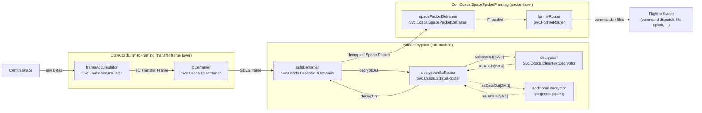
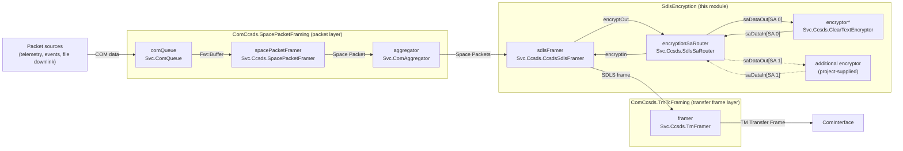

# ComCcsdsSdls (CCSDS Framing with SDLS Decryption) Subtopology — Software Design Document (SDD)

The **ComCcsdsSdls subtopologies** implement F´'s **CCSDS** communications stack for framing/deframing on the flight side, with an **SDLS (Space Data Link Security) decryption stage** inserted in the uplink path. As with `ComCcsds`, there are **two variants** in the same module:

1. A variant that **supplies a `Svc::ComStub`** implementation of `Svc.ComInterface` and expects to be wired to a **`Drv::ByteStreamDriverModel`** (TCP/UDP/UART, etc.), and
2. A variant that **expects an external implementation of [`Svc.ComInterface`](https://fprime.jpl.nasa.gov/latest/docs/reference/communication-adapter-interface/)** provided by the deployment.

Both variants are **composed from the `ComCcsds` layer topologies**: the `ComCcsds.SpacePacketFraming` packet layer and the `ComCcsds.TmTcFraming` transfer frame layer are imported and wired together through their **topology ports**, with the boxed **`SdlsDecryption` layer topology** (`CcsdsSdlsDeframer` → `SdlsSaRouter` → decryptor) inserted between them on the uplink path. Only the SDLS instances are defined in this module; the packet and frame layer instances remain in `ComCcsds` and are configured through `ComCcsdsConfig`.

> [!WARNING]
> The **default decryptor is `Svc.Ccsds.ClearTextDecryptor`, which provides NO security** — no confidentiality, no integrity, and no authentication. Projects requiring security must override the configuration module to select a real decryptor implementation.

---

## 1. Requirements

| ID                   | Description                                                                                                                                              | Validation |
| -------------------- | -------------------------------------------------------------------------------------------------------------------------------------------------------- | ---------- |
| SVC-COMCCSDSSDLS-001 | The subtopology shall provide the standard CCSDS framing/deframing communications stack by composing the `ComCcsds.SpacePacketFraming` and `ComCcsds.TmTcFraming` layer topologies, with SDLS decryption inserted in the uplink path. | Inspection |
| SVC-COMCCSDSSDLS-002 | The uplink path shall pass TC-deframed data through a `Svc.Ccsds.CcsdsSdlsDeframer`, which extracts the SA index and delegates decryption before Space Packet deframing. | Inspection |
| SVC-COMCCSDSSDLS-003 | Decryption requests shall be routed by SA index through a `Svc.Ccsds.SdlsSaRouter` to downstream decryptor instances.                                    | Inspection |
| SVC-COMCCSDSSDLS-004 | The decryptor choice shall be configurable via the subtopology configuration module, defaulting to `Svc.Ccsds.ClearTextDecryptor`.                       | Inspection |
| SVC-COMCCSDSSDLS-005 | The default SA map shall route SA 0 to the `PLAINTEXT` port (the default decryptor/encryptor); remaining default entries route to ports left unconnected. | Inspection |
| SVC-COMCCSDSSDLS-006 | The module shall provide a `FramingSubtopology` (external `Svc.ComInterface`) and a `Subtopology` (supplies `Svc::ComStub`) variant, mirroring ComCcsds. | Inspection |
| SVC-COMCCSDSSDLS-007 | The SDLS instance properties (base ID, decryptor selection) shall be configurable via a `ComCcsdsSdlsConfig` module; the reused packet and frame layer instances remain configurable via `ComCcsdsConfig`. | Inspection |

---

## 2. Design & Core Functions

### 2.1 Composition

The module defines one new layer topology and reuses two from `ComCcsds`:

| Layer topology                | Source        | Contents                                                                                       |
| ----------------------------- | ------------- | ----------------------------------------------------------------------------------------------- |
| `ComCcsds.SpacePacketFraming` | reused        | Router, ComQueue, aggregator, space packet framer/deframer, APID manager, comms buffer manager.  |
| `SdlsDecryption`              | this module   | `sdlsDeframer`, `decryptionSaRouter`, `decryptor` — the boxed SDLS decryption layer (see 2.2).   |
| `SdlsEncryption`              | this module   | `sdlsFramer`, `encryptionSaRouter`, `encryptor` — the boxed SDLS encryption layer.               |
| `ComCcsds.TmTcFraming`        | reused        | TM framer (downlink), frame accumulator + TC deframer (uplink).                                  |

Instances defined in this module:

| Instance name  | Type (Svc)                      | Kind    | Purpose (core function)                                                                     |
| -------------- | ------------------------------- | ------- | -------------------------------------------------------------------------------------------- |
| `sdlsDeframer` | `Svc.Ccsds.CcsdsSdlsDeframer`   | Passive | Extracts the SA index from the SDLS frame and delegates decryption.                           |
| `decryptionSaRouter` | `Svc.Ccsds.SdlsSaRouter`  | Passive | Routes decryption requests by SA index to the mapped downstream decryptor.                    |
| `sdlsFramer`   | `Svc.Ccsds.CcsdsSdlsFramer`     | Passive | Delegates encryption and prepends the SA index to build the SDLS frame.                       |
| `encryptionSaRouter` | `Svc.Ccsds.SdlsSaRouter`  | Passive | Routes encryption requests by SA index to the mapped downstream encryptor.                    |
| `decryptor`    | `Svc.Ccsds.ClearTextDecryptor`* | Passive | Default decryptor for the base SA (**pass-through, NO security**). *Configurable — see 2.4.   |

The layers are wired together exclusively through their **topology ports** (e.g. `ComCcsds.TmTcFraming.dataOut -> SdlsDecryption.dataIn`, `SdlsDecryption.dataOut -> ComCcsds.SpacePacketFraming.dataIn`); the `Subtopology` variant additionally instantiates `ComCcsds.comStub`.

> **Two variants:**
> **A. "With ComStub" (`Subtopology`):** includes `Svc::ComStub` and exposes **ByteStream** ports to your driver.
> **B. "With External ComInterface" (`FramingSubtopology`):** you **provide** an `Svc.ComInterface` implementation in the deployment.

### 2.2 Data Flow - Uplink

For reference, the standard (non-SDLS) CCSDS uplink flow is diagrammed in the
[ComCcsds SDD, "Data Flow - Uplink"](../../ComCcsds/docs/sdd.md#22-data-flow---uplink).
The SDLS stack inserts the `SdlsDecryption` layer between the transfer frame layer and
the packet layer. The `decryptionSaRouter` routes each frame by its SA index to the
decryptor mapped to that SA — the default `decryptor` on the `PLAINTEXT` port, or an
additional project-supplied decryptor connected in the deployment (see 2.4, 2.5):

### 2.3 Data Flow - Downlink

For reference, the standard (non-SDLS) CCSDS downlink flow is diagrammed in the
[ComCcsds SDD, "Data Flow - Downlink"](../../ComCcsds/docs/sdd.md#23-data-flow---downlink).
The SDLS stack inserts the mirrored `SdlsEncryption` layer between the packet layer and
the transfer frame layer, with the `encryptionSaRouter` routing by SA index to the
default `encryptor` or an additional project-supplied encryptor:

\* The `encryptor`/`decryptor` instances default to the ClearText implementations (NO
security) and are configurable — see 2.4. Dashed connections show an additional
crypto component mapped to a second SA; in the default configuration SA 1 routes to
the `UNCONNECTED` port (see 2.5) and the second component is supplied and wired by the
deployment.

The `sdlsDeframer` extracts the leading 16-bit SA index, records it in the frame context, and sends the remaining iv/data to the `decryptionSaRouter`, which maps the SA to the decryptor on the mapped port. Decrypted data flows back through the router and deframer to the `spacePacketDeframer`. Buffer ownership returns flow the reverse paths (`dataReturnIn` → `decryptReturnOut` → decryptor; decryptor `bufferReturnOut` → router `bufferReturnOut` → deframer `dataReturnOut`).

### 2.4 Selecting a Different Decryptor

The `decryptor` instance is defined in the configuration module (`ComCcsdsSdlsConfig/ComCcsdsSdlsConfig.fpp`), not in the subtopology itself. Projects override the configuration module (CMake `CONFIGURATION_OVERRIDES`) to instantiate a different component implementing the `Svc.Ccsds.CcsdsSdlsDecrypt` interface. To route additional SAs to additional decryptors, also override the `SdlsSaRouter` configuration (`SdlsCfg.SaMap`, `SdlsCfg.SaRouterPortCount`) and connect the added router ports in the deployment topology.

### 2.5 Default SA Map

The `SdlsSaRouter` default configuration is two deep: `{ SA 0 -> SaRouterPorts.PLAINTEXT, SA 1 -> SaRouterPorts.UNCONNECTED }`. Each subtopology connects only the `PLAINTEXT` port (the default decryptor/encryptor); the `UNCONNECTED` port is left unconnected, so its SA returns `UNKNOWN_PORT` unless a deployment connects an additional crypto component. The SA mapping is configurable by overriding the `SdlsSaRouter` configuration module.

### 2.6 Required Inputs for Operation

* **Rate Groups:** Connect a rate group to the **`comQueueRun`** (telemetry send rate) and **`aggregatorTimeout`** topology ports.
* **Transport Endpoint:** wire the ComStub ByteStream ports (variant A) or an external `Svc.ComInterface` (variant B) as documented in the usage note in `ComCcsdsSdls.fpp`.

## 3. Configuration

`ComCcsdsSdlsConfig` supplies the `BASE_ID` for the SDLS instances and the `decryptor` instance definition (see 2.4). The reused packet and transfer frame layers are configured through `ComCcsdsConfig` (queue sizes, priorities, buffer sizing, memory allocator), exactly as when using `ComCcsds` directly.

## 4. See Also

- [ComCcsds subtopology](../../ComCcsds/docs/sdd.md)
- [`Svc::Ccsds::CcsdsSdlsDeframer`](../../../Ccsds/CcsdsSdlsDeframer/docs/sdd.md)
- [`Svc::Ccsds::SdlsSaRouter`](../../../Ccsds/SdlsSaRouter/docs/sdd.md)
- [`Svc::Ccsds::ClearTextDecryptor`](../../../Ccsds/ClearTextDecryptor/docs/sdd.md)
