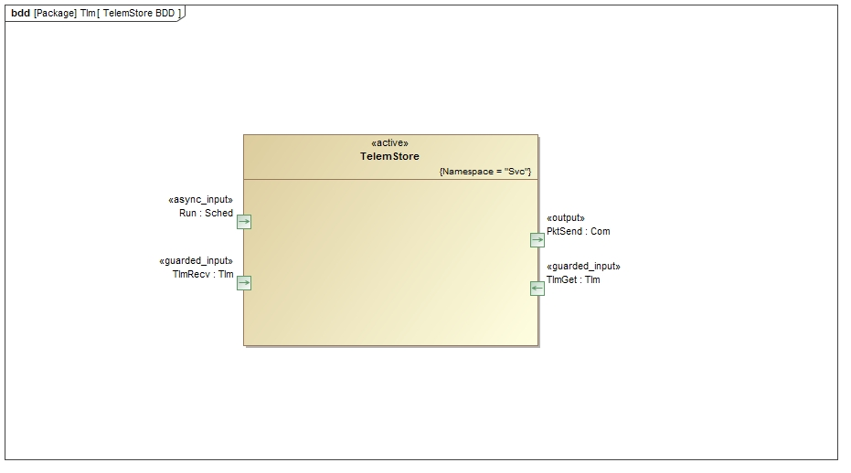
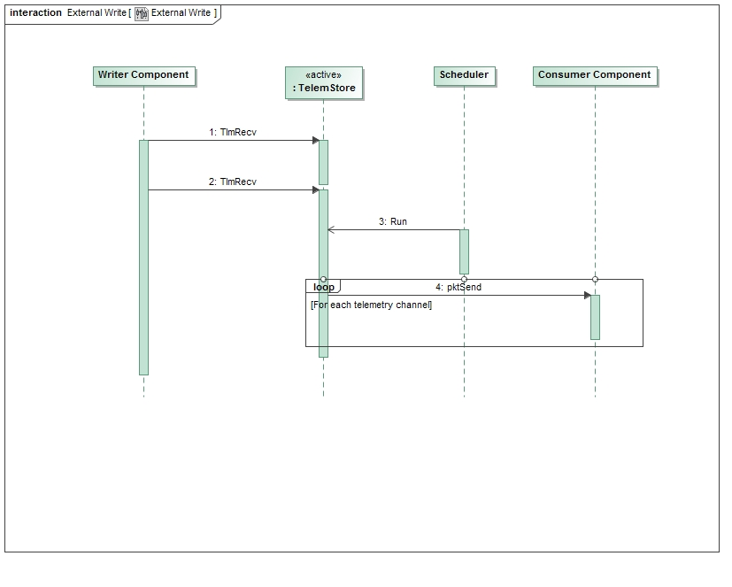
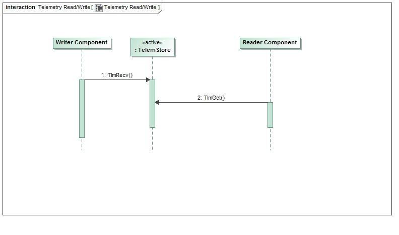

\page SvcTlmChanComponent Svc::TlmChan Component
# Svc::TlmChan Component

## 1. Introduction

The `Svc::TlmChan` Component is used to store telemetry values written by other components. The values are stored in serialized form. 
The data is stored as a set of telemetry channels in a table. 
The data can be individually read back or periodically pushed to another component for transporting out of the system. 
`Svc::TlmChan` is an implementation of the `Svc::TlmStore` component in the `Svc/Tlm` directory.

## 2. Requirements

The requirements for `Svc::TlmChan` are as follows:

Requirement | Description | Verification Method
----------- | ----------- | -------------------
TLC-001 | The `Svc::TlmChan` component shall provide an interface to submit telemetry | Unit Test
TLC-002 | The `Svc::TlmChan` component shall provide an interface to read telemetry | Unit Test
TLC-003 | The `Svc::TlmChan` component shall provide an interface to run periodically to write telemetry | Unit Test
TLC-004 | The `Svc::TlmChan` component shall write changed telemetry channels when invoked by the run port | Unit Test

## 3. Design

### 3.1 Context

#### 3.1.1 Component Diagram

The `Svc::TlmChan` component has the following component diagram:

#### 3.1.2 Ports

The `Svc::TlmChan` component uses the following port types:

Port Data Type | Name | Direction | Kind | Usage
-------------- | ---- | --------- | ---- | -----
[`Svc::Sched`](../../Sched/docs/sdd.html) | Run | Input | Asynchronous | Execute a cycle to write changed telemetry channels
[`Fw::Tlm`](../../../Fw/Tlm/docs/sdd.html) | TlmRecv | Input | Synchronous Input | Update a telemetry channel
[`Fw::Tlm`](../../../Fw/Tlm/docs/sdd.html) | TlmGet | Input | Synchronous Input | Read a telemetry channel
[`Fw::Com`](../../../Fw/Com/docs/sdd.html) | PktSend | Output | n/a | Write a set of packets with updated telemetry

#### 3.2 Functional Description

The `Svc::TlmChan` component has an input port `TlmRecv` that receives channel updates from other components in the system. These calls from the other components are made by the component implementation classes, but the generated code in the base classes takes the type specific channel value and serializes it, then makes the call to the output port. The `Svc::TlmChan` component can then store the channel value as generic data. The channel values are stored in an internal double-buffered table, and a flag is set when a new value is written to the channel entry.

When a request is made for a nonexistent channel, the call will return with an empty buffer in the Fw::TlmBuffer value argument. This is to cover the case where a channel is defined in the system, but has not been written yet. If the channel has not ever been defined, there is no way to programmatically determine that from the TlmGet port call. 

The implementation uses a hashing function that is tuned in the configuration file `TlmChanImplCfg.hpp`. See section 3.5 for description.

### 3.3 Scenarios

#### 3.3.1 External User Option

This diagram shows the scenario where telemetry packets are generated for an external user:

 

#### 3.3.2 Telemetry Database Option

This diagram shows the scenario where telemetry packets are stored and retrieved as a database:

 

### 3.4 State

`Svc::TlmChan` has no state machines.

### 3.5 Algorithms

In order to speed up lookups for storing and reading telemetry channels, a simple hash function is used to select a location in an array of hash table slots.
A configuration value in `TlmChanImplCfg.h` defines a set of hash buckets to store the telemetry values. The number of buckets has to be at least as large as the number of telemetry values defined in the system. The number of channels in the system can be determined by invoking `make comp_report_gen` from the deployment directory. The number of has table slots `TLMCHAN_NUM_TLM_HASH_SLOTS` and the hash value `TLMCHAN_HASH_MOD_VALUE` in the configuration file can be varied to balance the amount of memory for slots versus the distribution of buckets to slots. See `TlmChanImplCfg.h` for a procedure on how to tune the algorithm.

## 4. Dictionaries

TBD

## 5. Module Checklists

Document | Link
-------- | ----
Design Checklist | [Link](Checklist_Design.xlsx)
Code Checklist  | [Link](Checklist_Code.xlsx)
Unit Test Checklist  | [Link](Checklist_Unit_Test.xlsx)

## 6. Unit Testing

To see unit test coverage run fprime-util check --coverage

## 7. Change Log

Date | Description
---- | -----------
6/23/2015 | Design review edits
7/22/2015 | Design review actions 
9/28/2015 | Unit Test Review additions

