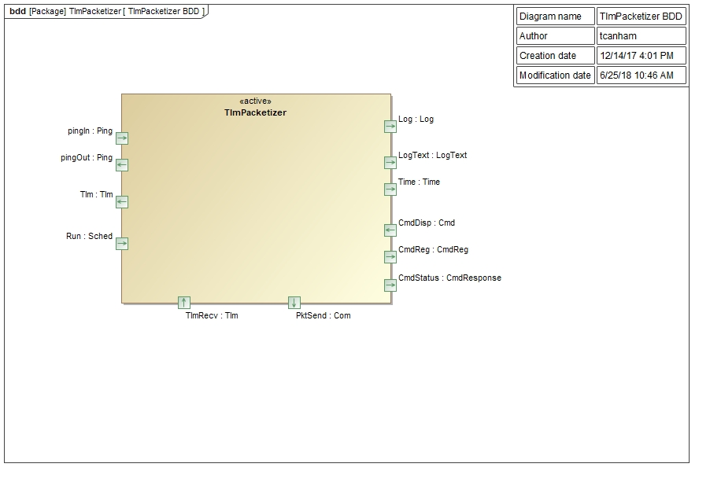

\page SvcTlmPacketizerComponent Svc::TlmPacketizer Component
# Svc::TlmPacketizer Component

## 1. Introduction

The `Svc::TlmPacketizer` Component is used to store telemetry values written by other components. The values are stored in serialized form. TlmPacketizer differs from `Svc::TlmChan` in that it stores telemetry in defined packets instead of streaming the updates as they come. The defined packets are passed in as a table to the `setPacketList()` public method. When telemetry updates are passed to the component, they are placed at the offset in a packet buffer defined by the table. When the `run()` port is called, all the defined packets are sent to the output port with the most recent . This is meant to replace `Svc::TlmCham` for use cases where a more compact packet format is desired. The disadvantage is that all channels are pushed whether or not they have been updated.

## 2. Requirements

The requirements for `Svc::TlmPacketizer` are as follows:

| Requirement | Description | Verification Method |
|---|---|---|
| TPK-001 | The `Svc::TlmPacketizer` component shall provide an interface to submit telemetry | Unit Test |
| TPK-002 | The `Svc::TlmPacketizer` component shall time tag each packet | Unit Test |
| TPK-003 | The `Svc::TlmPacketizer` component shall keep the latest value of each channel | Unit Test |
| TPK-004 | The `Svc::TlmPacketizer` component shall uniquely identify each packet | Unit Test |
| TPK-005 | The `Svc::TlmPacketizer` component shall write all packets when the scheduler call is made | Unit Test |

## 3. Design

### 3.1 Context

#### 3.1.1 Component Diagram

The `Svc::TlmPacketizer` component has the following component diagram:

#### 3.1.2 Ports

The `Svc::TlmChan` component uses the following port types:

Port Data Type | Name | Direction | Kind | Usage
-------------- | ---- | --------- | ---- | -----
[`Svc::Sched`](../../Sched/docs/sdd.md) | Run | Input | Asynchronous | Execute a cycle to write changed telemetry channels
[`Fw::Tlm`](../../../Fw/Tlm/docs/sdd.md) | TlmRecv | Input | Synchronous Input | Update a telemetry channel
[`Fw::Com`](../../../Fw/Com/docs/sdd.md) | PktSend | Output | n/a | Write a set of packets with updated telemetry

#### 3.2 Functional Description

The `Svc::TlmPacketizer` component has an input port `TlmRecv` that receives channel updates from other components in the system. These calls from the other components are made by the component implementation classes, but the generated code in the base classes takes the type specific channel value and serializes it, then makes the call to the output port. The `Svc::TlmPacketizer` component can then store the channel value as generic data. The channel ID is used to look up offsets for the channel in each of the defined packets. A channel can be defined in more than one packet. The time tag is stripped from the incoming telemetry value. The time tag of the channel will become the time tag of the entire frame when it is sent.

The implementation uses a hashing function to find the location of telemetry channels that is tuned in the configuration file `TlmPacketizerImplCfg.hpp`. See section 3.5 for description.

When a call to the `Run()` interface is called, the packet writes are locked and all the packets are copied to a second set of packets. Once the copy is complete, the packets writes are unlocked. The destination packet set gets updated with the current time tag and are sent out the `pktSend()` port.  

### 3.3 Scenarios

#### 3.3.1 External User Option

### 3.4 State

`Svc::TlmPacketizer` has no state machines.

### 3.5 Algorithms

In order to speed up lookups for storing and reading telemetry channels, a simple hash function is used to select a location in an array of hash table slots.
A configuration value in `TlmPacketizerImplCfg.h` defines a set of hash buckets to store the telemetry values. The number of buckets has to be at least as large as the number of telemetry channels defined in the system. The number of channels in the system can be determined by invoking `make comp_report_gen` from the deployment directory. The number of has table slots `TLMPACKETIZER_NUM_TLM_HASH_SLOTS` and the hash value `TLMPACKETIZER_HASH_MOD_VALUE` in the configuration file can be varied to balance the amount of memory for slots versus the distribution of buckets to slots. See `TlmPacketizerImplCfg.h` for a procedure on how to tune the algorithm.

## 4. Dictionaries

## 5. Module Checklists

## 6. Unit Testing

To see unit test coverage run fprime-util check --coverage

## 7. Change Log

Date | Description
---- | -----------
12/14/2017 | Initial version

