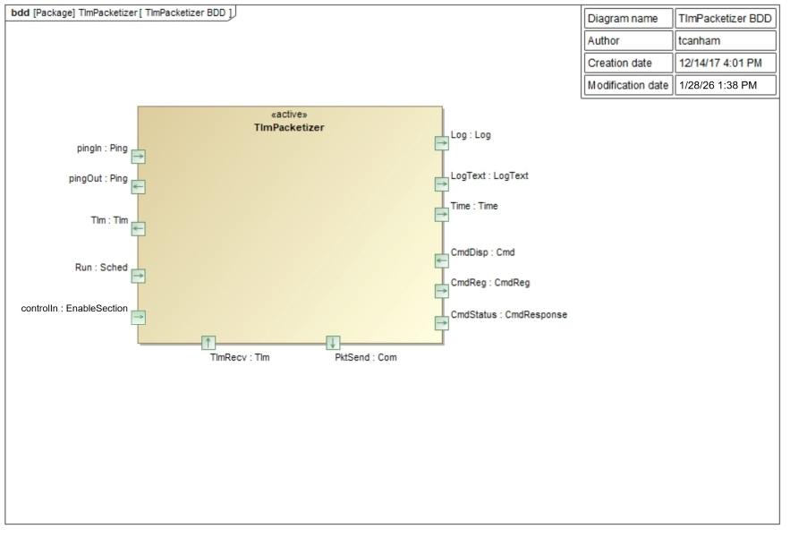
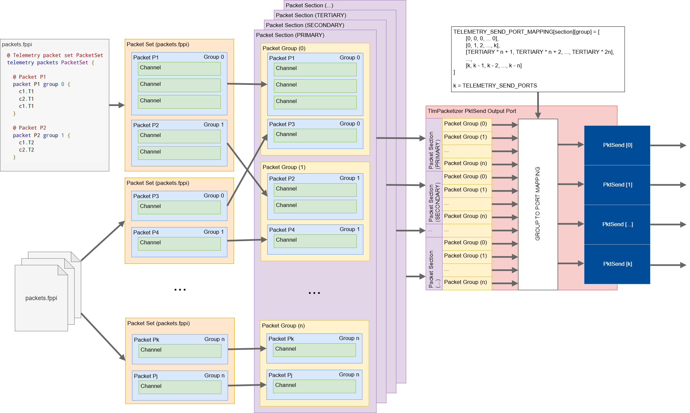

# Svc::TlmPacketizer Component

## 1. Introduction

The `Svc::TlmPacketizer` Component is used to store telemetry values written by other components. The values are stored in serialized form. TlmPacketizer stores telemetry in defined packets, which it sends on invocation of the `run` port. The defined packets are passed in as a table to the `setPacketList()` public method. When telemetry updates are passed to the component, they are placed at the offset in a packet buffer defined by the table. When the `run` port is called, all the defined packets are sent to the output ports with the most recent values. All channels in a packet are pushed together as a packet.

TlmPacketizer has a configurable set of sections (e.g. realtime, recorded, etc.). Every packet has a numerical group (aka level). Every section controls the output of packets based on their group.

Users can change the individual rates at which telemetry groups are output upon a `run` schedule tick for each section/group assignment. Packets can be sent on change with a rate limiting enforced minimum number of ticks between updates. Alternatively, packets can be sent with at a guaranteed rate of a maximum number of ticks between updates. Packets are evaluated individually and have a counter since last invocation. The minimum (MIN) and maximum (MAX) schedule ticks between sent telemetry of the same group is configurable, and users can configure groups within each section to apply logic using none, MIN, MAX, or both.

Packets are output on different ports based on a configurable mapping of section and group to the output port.

## 2. Requirements

The requirements for `Svc::TlmPacketizer` are as follows:

| Requirement | Description | Verification Method |
|---|---|---|
| TPK-001 | The `Svc::TlmPacketizer` component shall provide an interface to submit telemetry | Unit Test |
| TPK-002 | The `Svc::TlmPacketizer` component shall time tag each packet | Unit Test |
| TPK-003 | The `Svc::TlmPacketizer` component shall keep the latest value of each channel | Unit Test |
| TPK-004 | The `Svc::TlmPacketizer` component shall uniquely identify each packet | Unit Test |
| TPK-005 | The `Svc::TlmPacketizer` component shall write packets upon fulfilling the rate send configurations for its group | Unit Test |
| TPK-006 | The `Svc::TlmPacketizer` component shall determine output port index based on section and group | Unit Test |
| TPK-007 | The `Svc::TlmPacketizer` component shall accept a packet specification containing no channels | Unit Test |
| TPK-008 | The `Svc::TlmPacketizer` component shall, upon command, record the packets of a selected telemetry group as data products | Unit Test, Integration Test |
| TPK-009 | The `Svc::TlmPacketizer` component shall record each packet as a data product record containing the packet exactly as sent on `PktSend` (descriptor, packet ID, time tag, channel values) | Unit Test |
| TPK-010 | The `Svc::TlmPacketizer` component shall identify the telemetry group of each data product container in a record of that container | Unit Test |
| TPK-011 | The `Svc::TlmPacketizer` component shall send a data product container when it holds the commanded number of packets, and shall send a partially filled container when recording of its group is stopped or restarted | Unit Test, Integration Test |
| TPK-012 | The `Svc::TlmPacketizer` component shall not record data products unless commanded, and shall not alter packet output on `PktSend` when recording | Unit Test, Integration Test |
| TPK-013 | The `Svc::TlmPacketizer` component shall reject data product recording commands with an invalid group, a zero or oversized packet count, or a group without packets, and shall report a dropped packet when a data product container cannot be obtained | Unit Test, Integration Test |


## 3. Design

### 3.1 Context

#### 3.1.1 Component Diagram

The `Svc::TlmPacketizer` component has the following component diagram:



#### 3.1.2 Ports

The `Svc::TlmPacketizer` component uses the following port types:

Port Data Type | Name | Direction | Kind | Usage
-------------- | ---- | --------- | ---- | -----
[`Svc::Sched`](../../Sched/docs/sdd.md) | Run | Input | Asynchronous | Execute a cycle to write changed telemetry channels\r
[`Fw::Tlm`](../../../Fw/Tlm/docs/sdd.md) | TlmRecv | Input | Synchronous Input | Update a telemetry channel\r
[`Fw::Com`](../../../Fw/Com/docs/sdd.md) | PktSend | Output | n/a | Array of ports used to write packets with updated telemetry\r
[`Svc::EnableSection`](../../Ports/TlmPacketizerPorts/sdd.md) | controlIn | Input | Asynchronous | Enable / Disable sections of telemetry groups\r
[`Fw::DpGet`](../../../Fw/Dp/docs/sdd.md) | productGetOut | Output | n/a | Get an empty data product container from a data product manager
[`Fw::DpSend`](../../../Fw/Dp/docs/sdd.md) | productSendOut | Output | n/a | Send a filled data product container to a data product manager

#### 3.1.3 Terminology

This SDD and component use the following terminology:

1. Telemetry Point: An emitted telemetry value.
2. Telemetry Channel: A tagged type, identifier, and timestamp for emitting telemetry points.
3. Telemetry Packets: A set of telemetry channels send together.
4. Telemetry Group / Level: An identifier specifying a set of packets that share output configuration.
5. Telemetry Section: A resampling of telemetry groups. Each Section typically is destined for a different destination (e.g. realtime downlink vs store & forward)
6. Output Port: The port used to write telemetry packets. The output port index is determined by the section and group of the packet.

The following example demonstrates the structure composition of packet set specifications and packet sections used in `Svc::TlmPacketizer`. While multiple packet sets can have packets with different group identifiers, a section contains all packets partitioned based on group identifier.



#### 3.2 Functional Description

The `Svc::TlmPacketizer` component has an input port `TlmRecv` that receives channel updates from other components in the system. These calls from the other components are made by the component implementation classes, but the generated code in the base classes takes the type specific channel value and serializes it, then makes the call to the output port. The `Svc::TlmPacketizer` component can then store the channel value as generic data. The channel ID is used to look up offsets for the channel in each of the defined packets. A channel can be defined in more than one packet. The time tag is stripped from the incoming telemetry value. The time tag of the channel will become the time tag of the entire frame when it is sent.

A packet may be specified with no channels (FPP autocodes such a packet with an empty channel list). It is accepted by `setPacketList`, is never marked updated by channel traffic, and is emitted as a header-only packet (descriptor, packet ID, time tag) when explicitly requested with `SEND_PKT`.

When a call to the `Run()` interface is called, each packet is evaluated for output, one at a time. The packet is locked, determined to contain update data, and then unlocked. The packet's section and group are compared to the output criteria for each section/group pair. If a packet meets the criteria for output in any section/group, the packet is locked again, copied, unlocked, and then sent on each section requiring output. The actual output port is determined by a configurable map of section/group to output port index. 

Each telemetry group, depending on section and group configurations, are sent out on the `pktSend` port array. Since each group is evaluated for each section, a packet with group 1 (and a configuration of 3 sections), will be sent up to 3 times based on the section/group configuration. Each of these sends (section/group) will run through a configurable map to determine which output port to use. Should the output port index be repeated for different section/group pairs, the packet will be sent to that port multiple times.

Port invocations to `controlIn` or the command, `ENABLE_SECTION` are used to enable / disable each section, supporting downstream components that rely on different samplings of groups of telemetry. Each group instance is separately sampled from each other, allowing for individual rates per section and group.

#### 3.2.1 Data Product Recording

`Svc::TlmPacketizer` can record the packets of a telemetry group as data products, in addition to (and independent of) sending them on `PktSend`. Recording is disabled for every group at startup and is controlled per group by two commands:

- `START_DP_RECORDING(tlmGroup, packetsPerContainer, priority)` starts recording the packets of `tlmGroup`. Each data product container holds `packetsPerContainer` packets and is sent with `priority`. Starting a group that is already being recorded sends its partially filled container and applies the new settings.
- `STOP_DP_RECORDING(tlmGroup)` stops recording `tlmGroup`, sending any partially filled container. The `DpRecordingStopped` event reports whether a partial container was sent.

Both commands validate `tlmGroup` against `MAX_CONFIGURABLE_TLMPACKETIZER_GROUP`. `START_DP_RECORDING` also rejects a group without packets in the packet list and a `packetsPerContainer` of zero or large enough that the container would not fit an `Fw::Buffer`. A rejected command emits `DpRecordingRejected` with the reason and responds with `VALIDATION_ERROR`.

While a group is recorded, every packet of that group that has new data on a `Run` cycle is recorded once, regardless of the section, group, and rate configuration that governs `PktSend`. Recording therefore captures telemetry whose downlink is disabled or rate limited, which is the operator flexibility sought by the feature. Downlink is unaffected: the packet copy that is recorded is the same copy that is sent on `PktSend`, and the `PktSend` decisions do not consider the recording state.

Data products are modeled as follows:

- `TlmPacketContainer` (container id 0): one container type, used for all groups. A container holds the packets of a single group.
- `TlmGroupRecord` (record id 0, `FwChanIdType`): the first record of every container; the telemetry group of the packets in the container. This lets the ground separate containers by group even though they share a container id.
- `TlmPacketRecord` (record id 1, `U8 array`): one packet, byte for byte as sent on `PktSend`: `FwPacketDescriptorType`, `FwTlmPacketizeIdType`, `Fw::Time` and the channel values. Ground tools can decode the record with the deployment's packet set definitions.

Containers are obtained synchronously through `productGetOut` (`Fw::DpGet`) when the first packet of a container is recorded, so an idle group does not hold a container. The requested data size is the size of the group record plus `packetsPerContainer` records sized for the longest packet of the group, so every packet of the group fits. If no container can be obtained, the packet is dropped, `DpBufferError` is emitted (throttled), and `DpPacketsDropped` is incremented; recording continues with the next packet. A container is sent through `productSendOut` (`Fw::DpSend`) when it holds `packetsPerContainer` packets, or when recording of its group is stopped or restarted.

The recording state is only touched on the component's thread (the `Run` handler and the asynchronous command handlers), so it needs no lock. It is reported by the `DpGroupsRecording`, `DpPacketsRecorded`, `DpContainersSent` and `DpPacketsDropped` channels, which are written on the `Run` cycle that follows a change (and once at the first `Run` cycle) and by the recording commands.

### 3.3 Scenarios

#### 3.3.1 Configuring Telemetry Group Rates Per Port at Runtime

The `Svc::TlmPacketizer` is configurable to have multiple `PktSend` group outputs using the fpp constant, `MAX_CONFIGURABLE_TLMPACKETIZER_GROUP`. Doing so allows each packet group have different configurations for each `PktSend` output section.

Each group within each section are separately sampled, and have their own configuration rates and logic independent from each other. These section/group pairs have their own mapping to output port in the output port map.

Each group is configured with min/max delta parameters, as well as a logic gate determining its output rate behavior. Deltas are counters of schedule ticks invoked through the `run()` port. Min Delta is the least number of `Run()` invocations between successive packets before a packet with an updated channel is allowed to be sent. Updated packets will not be sent until their counter reaches Min Delta. This mitigates against telemetry spam while allowing users to benefit from asynchronously updating channels (e.g. those that don't occupy a set schedule). Max Delta is the maximum number of `Run()` invocations between successive packets. Upon reaching this counter, the packet would be sent, regardless of change.

Each telemetry group per section is configured with a `RateLogic` parameter:
* `SILENCED`: Packet will never be sent
* `EVERY_MAX`: Packet will be sent every Max Delta intervals
* `ON_CHANGE_MIN`: Packet will only be sent on updates at at least Min Delta intervals.
* `ON_CHANGE_MIN_OR_EVERY_MAX`: Packet will be sent on updates at at least Min Delta intervals, or at most Max Delta intervals.

Note: `MAX` will take priority over `MIN` if less than `MIN` and the telemetry group is set to `ON_CHANGE_MIN_OR_EVERY_MAX`. 

Groups are configured using the `CONFIGURE_GROUP_RATES` command.

#### 3.3.3 Switching Telemetry Sections
`Svc::TlmPacketizer` also has a configurable constant `TelemetrySection::NUM_SECTIONS` that allows separately streamed outputs of packets of the same group. This is useful for downstream components that would handle different telemetry groups at different rates. Examples of this configuration includes live telemetry throughput, detailed sim reconstruction, or critical data operations.

Telemetry sections are enabled and disabled upon spacecraft state transitions through `controlIn()` port invocations or via operator commands. A section and group pair must be both enabled to emit a telemetry packet.
* `ENABLE_SECTION` / `controlIn()`: Enable / Disable telemetry sections.
* `ENABLE_GROUP`: Within a section, Enable / Disable a telemetry group.
* `FORCE_GROUP`: If set to Enabled, telemetry of the chosen group in a section will be emitted regardless if the section or group within the section is disabled.

Disabling groups / sections will freeze the group's counter between sent output.
Updated groups using `ON_CHANGE_MIN` or `ON_CHANGE_MIN_OR_EVERY_MAX` while group disabled / section disabled will be marked "NEW" but not sent. The group counter resumes once the group / section is re-enabled and will be sent upon reaching their MIN counter.

### 3.4 State

`Svc::TlmPacketizer` has no state machines. The data product recording state of each telemetry group (recording enabled, packets per container, priority, the container being filled and its packet count) is held in the component and set only by the `START_DP_RECORDING` and `STOP_DP_RECORDING` commands and the `Run` handler. It is not persisted.

### 3.5 Algorithms

In order to speed up lookups for storing and reading telemetry channels, a simple hash function is used to select a location in an array of hash table slots.
A configuration value in `TlmPacketizerImplCfg.h` defines a set of hash buckets to store the telemetry values. The number of buckets has to be at least as large as the number of telemetry channels defined in the system. The number of channels in the system can be determined by invoking `make comp_report_gen` from the deployment directory. The number of has table slots `TLMPACKETIZER_NUM_TLM_HASH_SLOTS` and the hash value `TLMPACKETIZER_HASH_MOD_VALUE` in the configuration file can be varied to balance the amount of memory for slots versus the distribution of buckets to slots. See `TlmPacketizerImplCfg.h` for a procedure on how to tune the algorithm.

## 4. Configuration

The `Svc::TlmPacketizer` component has the following configuration parameters:

- `MAX_PACKETIZER_PACKETS` (TlmPacketizerCfg.hpp): Maximum allowed packets
- `MAX_PACKETIZER_CHANNELS` (TlmPacketizerCfg.hpp): Maximum allowed telemetry channels
- `TLMPACKETIZER_MAX_MISSING_TLM_CHECK` (TlmPacketizerCfg.hpp): Maximum reported missing telemetry channels
- `TelemetrySection` (TlmPacketizerCfg.fpp): An enumeration of the telemetry sections used by the project. Must end with `NUM_SECTIONS` to specify the number of sections.
- `MAX_CONFIGURABLE_TLMPACKETIZER_GROUP` (TlmPacketizerCfg.fpp): Maximum value allowed for a packet's group/level identifier
- `TELEMETRY_SEND_PORTS` (TlmPacketizerCfg.fpp): Number of output ports for telemetry packets
- `TELEMETRY_SEND_PORT_MAPPING` (TlmPacketizerCfg.fpp): A mapping of each section/group pair to the output port index used.
- `TELEMETRY_SECTION_DEFAULTS` (TlmPacketizerCfg.fpp): A mapping of each section/group pair to the default rate logic and parameters for that section/group pair.

A deployment that records data products must connect `productGetOut` and `productSendOut` to a data product manager (see [`Svc::DpManager`](../../DpManager/docs/sdd.md)) whose buffer manager can supply containers of the requested size: `Fw::DpContainer::MIN_PACKET_SIZE` plus the size of the group record plus `packetsPerContainer` times the size of a `TlmPacketRecord` holding the longest packet of the group. A deployment that does not record data products may leave both ports unconnected.

### 4.1 Sizing

Overall memory usage of the `Svc::TlmPacketizer` is determined by the following configuration parameters: `MAX_PACKETIZER_PACKETS`, `MAX_PACKETIZER_CHANNELS`, and `TLMPACKETIZER_MAX_MISSING_TLM_CHECK`.

`MAX_PACKETIZER_PACKETS` determines the size of storage for the telemetry packets registered by components. It should be set to at least the number of packets defined in the system, but may be larger to allow for a project's packet growth over time without incurring additional memory usage.

`MAX_PACKETIZER_CHANNELS` determines the size of storage for the telemetry channels registered by components. It should be set to at least the number of non-omitted channels defined in the system, but may be larger to allow for a project's channel growth over time without incurring additional memory usage.

`TLMPACKETIZER_MAX_MISSING_TLM_CHECK` determines the size of the data structure used to track and event on missing telemetry channels. Most projects should set this to a low number since missing channels are a rarity with FPP defined telemetry channels.

Both of these parameters are set in [`TlmPacketizerImplCfg.hpp`](http://github.com/nasa/fprime/blob/devel/Svc/TlmPacketizer/config/TlmPacketizerConfig/TlmPacketizerCfg.hpp).

The number of sections is determined by the `TelemetrySection` enum. A project may enumerate any number of sections and must end the enum with `NUM_SECTIONS`.

The number of groups is determined by the `NUM_CONFIGURABLE_TLMPACKETIZER_GROUPS` parameter. This should be set to at least the maximum group identifier used in the system + 1, but may be larger to allow for growth over time.

Sizes of maps and output configuration is then determined by (`NUM_CONFIGURABLE_TLMPACKETIZER_GROUPS`) * `TelemetrySection::NUM_SECTIONS`.

The number of output ports for telemetry is set by: `TELEMETRY_SEND_PORTS`. This may be set to any positive number of ports. Setting this to more than number of sections * number of groups will result in unused ports.

### 4.2 Output Port Mapping

The value of `TELEMETRY_SEND_PORT_MAPPING` maps each section/group pair to an output port index. It must be a constant array of type `FwIndexType[NUM_SECTIONS][MAX_CONFIGURABLE_TLMPACKETIZER_GROUPS]`.  A field at `TELEMETRY_SEND_PORT_MAPPING[section][group]` is set to the output index to used. Each field must be < `TELEMETRY_SEND_PORTS`. Multiple section/group pairs may map to the same output port index, but each field must be a valid port index.

Here is an example with 2 sections and 4 groups (max group identifier of 3). In this example, a section uses the same output port across all groups.

```py
    constant TELEMETRY_SEND_PORT_MAPPING = [
        [0, 0, 0, 0], # All groups in section 0 use port 0
        [1, 1, 1, 1], # All groups in section 1 use port 1
    ]
```

### 4.3 Default Output Rate Limits 

Default rate limits for each section/group pair is set by the `TELEMETRY_SECTION_DEFAULTS` constant. It must be a constant array of type `TlmPacketizer::SectionGroupConfig[NUM_SECTIONS][MAX_CONFIGURABLE_TLMPACKETIZER_GROUP + 1]`. Each field at `TELEMETRY_SECTION_DEFAULTS[section][group]` is set to a struct containing the default `RateLogic`, `MinDelta`, and `MaxDelta` for that section/group pair. These defaults are used to initialize the section/group pair's configuration upon component initialization, but can be changed at runtime using the `CONFIGURE_GROUP_RATES` command.

Here is an example with 2 sections and 4 groups that sets all section/group pairs to update-on-change with no min nor max.

```py
    constant TELEMETRY_SECTION_DEFAULTS = [
        # REALTIME section
        [
            # Group 0
            { enabled = Fw.Enabled.ENABLED, forceEnabled = Fw.Enabled.DISABLED, rateLogic =  RateLogic.ON_CHANGE_MIN, min = 0, max = 0 },
            # Group 1
            { enabled = Fw.Enabled.ENABLED, forceEnabled = Fw.Enabled.DISABLED, rateLogic =  RateLogic.ON_CHANGE_MIN, min = 0, max = 0 },
            # Group 2
            { enabled = Fw.Enabled.ENABLED, forceEnabled = Fw.Enabled.DISABLED, rateLogic =  RateLogic.ON_CHANGE_MIN, min = 0, max = 0 },
            # Group 3
            { enabled = Fw.Enabled.ENABLED, forceEnabled = Fw.Enabled.DISABLED, rateLogic =  RateLogic.ON_CHANGE_MIN, min = 0, max = 0 },
        ],
        # RECORDED section
        [
            # Group 0
            { enabled = Fw.Enabled.ENABLED, forceEnabled = Fw.Enabled.DISABLED, rateLogic =  RateLogic.ON_CHANGE_MIN, min = 0, max = 0 },
            # Group 1
            { enabled = Fw.Enabled.ENABLED, forceEnabled = Fw.Enabled.DISABLED, rateLogic =  RateLogic.ON_CHANGE_MIN, min = 0, max = 0 },
            # Group 2
            { enabled = Fw.Enabled.ENABLED, forceEnabled = Fw.Enabled.DISABLED, rateLogic =  RateLogic.ON_CHANGE_MIN, min = 0, max = 0 },
            # Group 3
            { enabled = Fw.Enabled.ENABLED, forceEnabled = Fw.Enabled.DISABLED, rateLogic =  RateLogic.ON_CHANGE_MIN, min = 0, max = 0 },
        ]
    ]
```

### 4.4 Sample Configuration: Realtime and Recorded Sections with a Single Output Port for Each

This section will show configuration for 2 sections (LIVE, RECORDED) each outputting all groups to a dedicated output port. Four groups are allowed (0, 1, 2, 3).

```py
enum TelemetrySection {
    @ First section, LIVE 
    LIVE,
    @ Second section, RECORDED
    RECORDED,
    NUM_SECTIONS,     @< REQUIRED: Counter, leave as last element.
}
@ Allows groups 0, 1, 2, and 3
NUM_CONFIGURABLE_TLMPACKETIZER_GROUPS = 4

@ Allows output ports 0, and 1
TELEMETRY_SEND_PORTS = 2

@ Each section uses a single output port for all groups 0-3
constant TELEMETRY_SEND_PORT_MAPPING = [
    [0, 0, 0, 0], # All groups in section 0 use port 0
    [1, 1, 1, 1], # All groups in section 1 use port 1
]
@ Set the default rate logic for all section/group pairs to update-on-change with no min nor max.
constant TELEMETRY_SECTION_DEFAULTS = [
    # LIVE section
    [
        # Group 0
        { enabled = Fw.Enabled.ENABLED, forceEnabled = Fw.Enabled.DISABLED, rateLogic =  RateLogic.ON_CHANGE_MIN, min = 0, max = 0 },
        # Group 1
        { enabled = Fw.Enabled.ENABLED, forceEnabled = Fw.Enabled.DISABLED, rateLogic =  RateLogic.ON_CHANGE_MIN, min = 0, max = 0 },
        # Group 2
        { enabled = Fw.Enabled.ENABLED, forceEnabled = Fw.Enabled.DISABLED, rateLogic =  RateLogic.ON_CHANGE_MIN, min = 0, max = 0 },
        # Group 3
        { enabled = Fw.Enabled.ENABLED, forceEnabled = Fw.Enabled.DISABLED, rateLogic =  RateLogic.ON_CHANGE_MIN, min = 0, max = 0 },
    ],
    # RECORDED section
    [
        # Group 0
        { enabled = Fw.Enabled.ENABLED, forceEnabled = Fw.Enabled.DISABLED, rateLogic =  RateLogic.ON_CHANGE_MIN, min = 0, max = 0 },
        # Group 1
        { enabled = Fw.Enabled.ENABLED, forceEnabled = Fw.Enabled.DISABLED, rateLogic =  RateLogic.ON_CHANGE_MIN, min = 0, max = 0 },
        # Group 2
        { enabled = Fw.Enabled.ENABLED, forceEnabled = Fw.Enabled.DISABLED, rateLogic =  RateLogic.ON_CHANGE_MIN, min = 0, max = 0 },
        # Group 3
        { enabled = Fw.Enabled.ENABLED, forceEnabled = Fw.Enabled.DISABLED, rateLogic =  RateLogic.ON_CHANGE_MIN, min = 0, max = 0 },
    ]
]
```

### 4.5 Sample Configuration: Dedicated Output Port for Each Group in Each Section

This section will show configuration for 3 sections (LIVE, RECORDED, EXTRA) each outputting 2 groups (0, 1) to a dedicated output port. This results in 6 total output ports. This one will require that LIVE telemetry is sent no more often that every 3 ticks, and no less often than every 10 ticks.

```py
enum TelemetrySection {
    @ First section, LIVE 
    LIVE,
    @ Second section, RECORDED
    RECORDED,
    @ Third section, EXTRA
    EXTRA,
    NUM_SECTIONS,     @< REQUIRED: Counter, leave as last element.
}
@ Allows groups 0, 1
NUM_CONFIGURABLE_TLMPACKETIZER_GROUPS = 2

@ Allows output ports 0, 1, 2, 3, 4, 5
TELEMETRY_SEND_PORTS = 6

@ Each section/group uses a unique output port
constant TELEMETRY_SEND_PORT_MAPPING = [
    [0, 1],
    [2, 3],
    [4, 5],
]
@ Set the default rate logic for all section/group pairs to update-on-change with no min nor max.
constant TELEMETRY_SECTION_DEFAULTS = [
    # LIVE section
    [
        # Group 0
        { enabled = Fw.Enabled.ENABLED, forceEnabled = Fw.Enabled.DISABLED, rateLogic =  RateLogic.ON_CHANGE_MIN_OR_EVERY_MAX, min = 3, max = 10 },
        # Group 1
        { enabled = Fw.Enabled.ENABLED, forceEnabled = Fw.Enabled.DISABLED, rateLogic =  RateLogic.ON_CHANGE_MIN_OR_EVERY_MAX, min = 3, max = 10 },
    ],
    # RECORDED section
    [
        # Group 0
        { enabled = Fw.Enabled.ENABLED, forceEnabled = Fw.Enabled.DISABLED, rateLogic =  RateLogic.ON_CHANGE_MIN, min = 0, max = 0 },
        # Group 1
        { enabled = Fw.Enabled.ENABLED, forceEnabled = Fw.Enabled.DISABLED, rateLogic =  RateLogic.ON_CHANGE_MIN, min = 0, max = 0 },
    ],
    # EXTRA section
    [
        # Group 0
        { enabled = Fw.Enabled.ENABLED, forceEnabled = Fw.Enabled.DISABLED, rateLogic =  RateLogic.ON_CHANGE_MIN, min = 0, max = 0 },
        # Group 1
        { enabled = Fw.Enabled.ENABLED, forceEnabled = Fw.Enabled.DISABLED, rateLogic =  RateLogic.ON_CHANGE_MIN, min = 0, max = 0 },
    ]
]
```

## 5. Unit Testing

To see unit test coverage run fprime-util check --coverage

## 7. Change Log

Date | Description
---- | -----------
12/14/2017 | Initial version
01/23/2026 | Added group level rate logic
02/23/2026 | Added section/group mapping logic
03/30/2026 | Added configuration section
10/04/2026 | Added data product recording of telemetry groups
