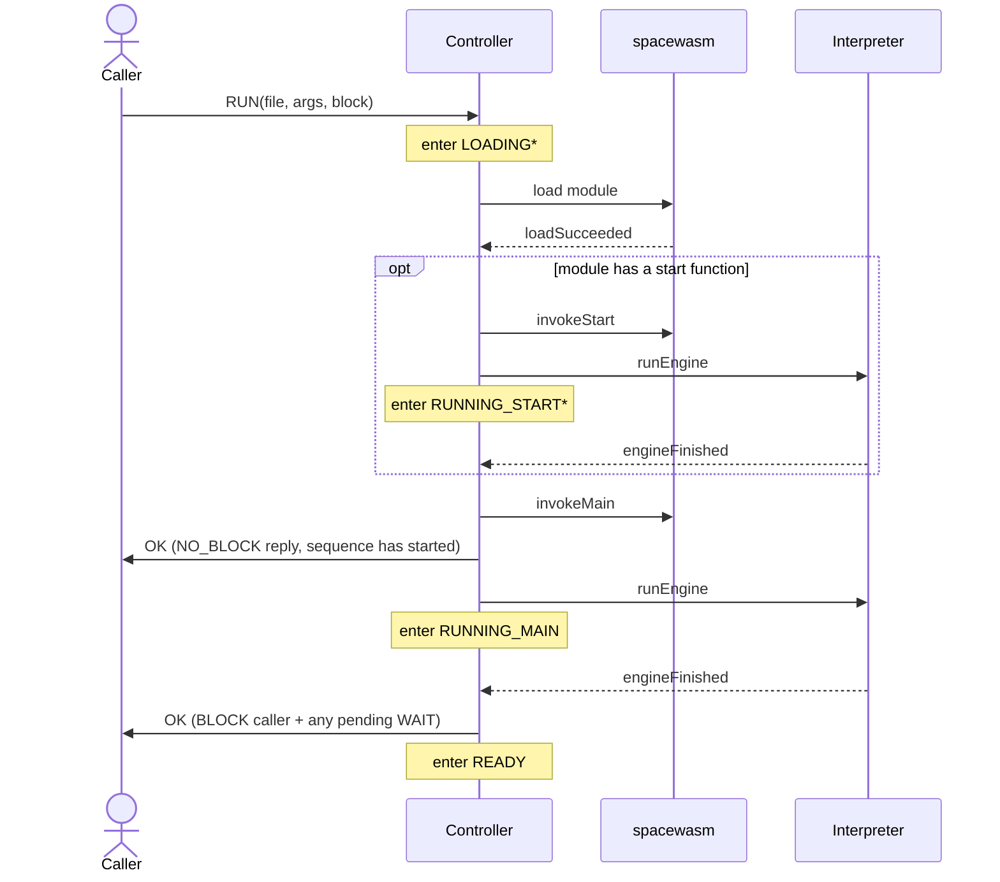

# Svc::WasmSequencer

A sequence engine based around a WebAssembly (Wasm) interpreter.

## Introduction

WasmSequencer is a component that implements the F Prime sequencing paradigm to dispatch commands, events read telemetry parameters and more. It is based around the [WebAssembly](https://webassembly.org/) standard.

The component integrates a [WebAssembly interpreter](https://github.com/nasa/spacewasm) capable of loading validating and executing WebAssembly modules two state machines to manage the life-cycle and execution of the interpreter.

This document assumes a general familiarity with the capabilities and design of WebAssembly and Wasm nomenclature, for more information, please see [WebAssembly Docs](https://webassembly.org/) for in-depth documentation and specification of the Wasm standard.

## Build Dependencies

The [spacewasm](https://github.com/nasa/spacewasm) engine is written in Rust and compiled into a static library at build time, so building this component requires a [Rust toolchain](https://www.rust-lang.org/tools/install) (`cargo` and `rustc`) on the `PATH`. This is the framework's only Rust dependency, so it is treated as optional: `cmake/required.cmake` detects `cargo`, and `Svc/CMakeLists.txt` skips `Svc::WasmSequencer`.

## Requirements

| Name         | Description                                                                                                                                                                                 | Rationale                                                                                                                                                                                                                                                                                       | Validation |
| ------------ | ------------------------------------------------------------------------------------------------------------------------------------------------------------------------------------------- | ----------------------------------------------------------------------------------------------------------------------------------------------------------------------------------------------------------------------------------------------------------------------------------------------- | ---------- |
| WASM-SEQ-001 | The sequencer shall support loading and validating WebAssembly modules.                                                                                                                     | Sequences are distributed as WebAssembly binaries; a module must be decoded and validated before execution so a malformed or untrusted binary cannot corrupt the host.                                                                                                                          | Unit Test  |
| WASM-SEQ-002 | The sequencer shall support loading multiple named modules so that the exports of one module may be referenced by another.                                                                  | Larger sequences are composed from reusable library modules; naming lets inter-module imports and exports resolve within a single store.                                                                                                                                                        | Unit Test  |
| WASM-SEQ-003 | The sequencer shall allocate its module store for a fixed, configured capacity and shall reset it on a failed load.                                                                         | Flight software forbids heap fragmentation; a fixed-capacity store with a full reset on failure keeps allocation deterministic and returns to a known-good state.                                                                                                                               | Unit Test  |
| WASM-SEQ-004 | The sequencer shall resolve sequence file paths relative to a configurable base directory.                                                                                                  | Onboard sequence storage varies by deployment; a parameterized base directory avoids hard-coding filesystem layout into the flight software.                                                                                                                                                    | Unit Test  |
| WASM-SEQ-005 | The sequencer shall support running sequences with arguments.                                                                                                                               | Passing arguments at dispatch time lets a single sequence binary be parameterized, so operators can reuse one module across scenarios instead of rebuilding per run.                                                                                                                            | Unit Test  |
| WASM-SEQ-006 | The sequencer shall support invoking a previously loaded module's entry point on demand.                                                                                                    | Decoupling load from invoke lets a module be validated and staged ahead of time, then executed without re-reading the file.                                                                                                                                                                     | Unit Test  |
| WASM-SEQ-007 | The sequencer shall support both blocking and non-blocking sequence execution.                                                                                                              | Blocking lets a controlling sequence or operator serialize on completion; non-blocking allows fire-and-forget dispatch. Both are needed depending on the caller's intent.                                                                                                                       | Unit Test  |
| WASM-SEQ-008 | The sequencer shall bound the number of interpreter instructions executed per cycle.                                                                                                        | Fuelling the interpreter keeps a long-running or malicious guest from starving the component thread and preserves responsiveness to pause and cancellation.                                                                                                                                     | Unit Test  |
| WASM-SEQ-009 | The sequencer shall support pausing a running sequence before the next directive and later resuming it.                                                                                     | Operators need to halt a sequence at a safe point for inspection or intervention and resume it without restarting from the beginning.                                                                                                                                                           | Unit Test  |
| WASM-SEQ-010 | The sequencer shall support cancelling a loading, ready, or running sequence and returning to the idle state.                                                                               | An operator must be able to abort a misbehaving or unneeded sequence at any point and clear the store to a known-good idle state.                                                                                                                                                               | Unit Test  |
| WASM-SEQ-011 | The sequencer shall fail a sequence whose current blocking host function does not complete within a configurable timeout.                                                                   | A command or serial reply that never arrives would block the sequencer indefinitely; a per-host-function timeout bounds the wait and fails the sequence safely.                                                                                                                                 | Unit Test  |
| WASM-SEQ-012 | The sequencer shall let a sequence read the current spacecraft time, telemetry channel values, and parameter values.                                                                        | Time-aware and conditional sequences must branch on the host's authoritative time, live telemetry, and configured parameters rather than guest-local state.                                                                                                                                     | Unit Test  |
| WASM-SEQ-013 | The sequencer shall support sending commands for dispatch.                                                                                                                                  | Command dispatch is the primary mechanism by which a sequence actuates the spacecraft, driving the F´ command dispatcher exactly as a ground command would.                                                                                                                                     | Unit Test  |
| WASM-SEQ-014 | The sequencer shall let a sequence emit events at the non-reserved F´ severities.                                                                                                           | Guest programs need operator-visible logging; restricting to non-reserved severities prevents untrusted code from triggering the FATAL handler or spoofing command events.                                                                                                                      | Unit Test  |
| WASM-SEQ-015 | The sequencer shall let a sequence sleep for a relative or absolute duration.                                                                                                               | Sequences must pace their actions against wall-clock time (settling delays, timed maneuvers) without busy-waiting and consuming interpreter fuel.                                                                                                                                               | Unit Test  |
| WASM-SEQ-016 | The sequencer shall let a sequence send a fire-and-forget message out a serial output port.                                                                                                 | One-way and telemetry-style peripherals are driven by pushing bytes to a selected serial port index without stalling the sequence; the send resumes the sequence as soon as the port accepts it, and fails gracefully if the port is unconnected or the payload exceeds the configured maximum. | Unit Test  |
| WASM-SEQ-017 | The sequencer shall let a sequence read a message from a serial input port, either blocking until one arrives or returning immediately when none is queued.                                 | Request/response peripherals answer on a serial input; a blocking read lets a sequence wait for the reply (bounded by the per-host-function timeout) while a non-blocking read lets it poll without stalling. Inbound messages are buffered in a per-port queue.                                | Unit Test  |
| WASM-SEQ-018 | The sequencer shall treat a sequence that terminates with a zero return value or a zero exit code as a success, and a non-zero return value, a non-zero exit code, or a panic as a failure. | Guests need a clean way to end execution; treating a zero return or exit(0) as success and any non-zero return value, non-zero exit code, or panic as a failure lets the host report the correct verdict to the awaiting command.                                                               | Unit Test  |
| WASM-SEQ-019 | The sequencer shall validate all host-function arguments from the guest and never fault the host on invalid input, reporting an event and failing or trapping the sequence instead.         | Untrusted guest code must never be able to crash the host. This covers oversized/undersized buffers, out-of-range or unconnected serial ports, invalid guest memory pointers, and reserved-severity event requests, all of which are rejected gracefully rather than asserting.                 | Unit Test  |
| WASM-SEQ-020 | The sequencer shall report its current state, running sequence name, and most recent trap reason as telemetry.                                                                              | Operators need continuous visibility into what the sequencer is doing and why a sequence stopped without pulling a full event log.                                                                                                                                                              | Unit Test  |
| WASM-SEQ-021 | The sequencer shall count and report sequences succeeded, failed, and cancelled, and commands dispatched and failed.                                                                        | Aggregate counters give operators a quick health indicator and let ground trend sequence and command reliability over a mission.                                                                                                                                                                | Unit Test  |

## Design

The design of this component is tightly coupled with the [spacewasm](https://github.com/nasa/spacewasm) WebAssembly engine, which performs module loading, validation, and instruction execution. `Svc::WasmSequencer` is an active component built around two FPP state machines: a **controller** that manages the module lifecycle (load, validate, initialize, run) and an **interpreter** that executes Wasm instructions and services the host functions a running sequence calls.

### WebAssembly Engine

The engine, [spacewasm](https://github.com/nasa/spacewasm), implements the official WebAssembly [specification](https://www.w3.org/TR/2019/REC-wasm-core-1-20191205/) with the following features:

| Feature                                                                           | Description                        |
| --------------------------------------------------------------------------------- | ---------------------------------- |
| [MVP](https://github.com/WebAssembly/design/blob/main/MVP.md)                     | The Wasm MVP                       |
| [Import/Export of mutable globals](https://github.com/WebAssembly/mutable-global) | Mutable globals (part of Wasm 1.0) |
| [Custom Page Sizes](https://github.com/WebAssembly/custom-page-sizes)             | Linear memory page sizes < 64 KiB  |

Unlike most production-grade Wasm engines, spacewasm is an _interpreter_ — more precisely an _IR interpreter_: during load it translates Wasm byte-code into a resolved intermediate representation that it then decodes and executes in a loop. This is slower than a production JIT but gives the determinism and safety guarantees as well as extremely low memory footprint. This document does not cover the engine's internals; see the [spacewasm repository](https://github.com/nasa/spacewasm). A few of its design choices drive this component:

- **Fuel.** The interpreter loop runs at most a bounded number of IR instructions per call and then yields, so a long-running or malicious guest cannot starve the component thread and pause/cancel stay responsive. The bound is the `INSTRUCTION_FUEL` parameter. This bounds per-cycle work, not total CPU; see [Scheduling and CPU Budget](#scheduling-and-cpu-budget).
- **Dynamic memory.** spacewasm allocates its module data structures and compiled byte-code from a "global allocator" the embedder provides. This component backs it with a fixed static pool (`SPACEWASM_PAGE_SIZE` × `SPACEWASM_MAX_PAGES`), keeping peak memory deterministic and free of heap fragmentation. Guest linear memory is served from a separate per-load pool (`GUEST_MEMORY_SIZE`).
- **Panics.** spacewasm is written in Rust and compiled with `panic = "abort"`. A panic is routed through a `spacewasm_panic` callback that logs the location to `Os::Console` and then `FW_ASSERT(false)` — terminal for the FSW, and distinct from a guest-level `panic()` (which fails only the sequence). This path is reserved for a engine invariant violation: untrusted or malformed module bytes are contractually handled by graceful `SPACEWASM_ERR_*` load-failure codes (surfaced as load-failure events), not panics. To keep the panic path from firing on arbitrary input, the upstream engine is [fuzzed](https://github.com/nasa/spacewasm/tree/main/fuzz/fuzz_targets) against valid and invalid Wasm modules using industry standard practices.

**Specification divergences.** spacewasm diverges from the spec in a few documented ways for determinism and adherence to flight-software standards:

1. `memory.grow` can be disabled at load time; WasmSequencer disables it to keep its allocator simple (this may be relaxed in the future).
2. A failed module load invalidates the whole store (the engine compiles all modules into one append-only IR arena and commits guest memory eagerly, neither of which can be partially rolled back), so the controller rebuilds the store from scratch on any load failure — the behavior required by WASM-SEQ-003.
3. A module's optional `start` function must resolve to a Wasm function, not a host function, so it can be driven through the same fuel-bounded run loop as `main`.
   - This divergence is a minor detail/technically and cannot surface to users as start function must be of signature `[] -> []` and WasmSequener does not expose any `[] -> []` host functions.

### Modules, Names, and Linking

The engine holds a single _store_ — a fixed-capacity table of up to `MAX_GUEST_MODULES` guest modules plus the reserved host module — that every loaded module shares. Each guest module is loaded under a **name**, which is how other modules (and later commands) refer to it. Loading is additive: each `LOAD` adds another module to the current store.

- **`LOAD`** loads a module under a caller-chosen name (which must not already be in use). Naming a module is what lets _another_ module import its exports, and lets `INVOKE`, `GLOBAL_GET`, and `GLOBAL_SET` address it afterward. An empty name is the single-module shorthand — a normal name that only one module can occupy.
- **`INVOKE`** runs the `main` entry point of an already-loaded module named by the caller (the empty name for a module loaded without one).
- **`RUN`** is the one-shot convenience for a self-contained module: it _resets the store_, loads the file under the empty name, and invokes its `main`. Because it resets the store first, `RUN` discards any modules previously staged with `LOAD`; stage libraries with `LOAD` and then `INVOKE` the top module when a run needs them.

**Linking.** A guest module's Wasm imports are `(module, field)` pairs resolved at load time against what is already in the store: the reserved host module **`fprime_v1`** (the host functions listed under [Host Functions](#host-functions)) and any guest module already loaded under the referenced name. Each import is checked for a matching signature, so a missing target or a type mismatch fails the _load_ rather than the run. Because resolution happens at load time, **a library module must be loaded before the module that imports it.** A multi-module sequence therefore stages its libraries first:

```
LOAD    mathlib.wasm  "math"    ; exports add, mul
LOAD    app.wasm      "app"     ; imports ("math", "add"), ...
INVOKE  "app"
```

A loaded module's exported, mutable globals can additionally be read and written from the ground between runs with `GLOBAL_GET` / `GLOBAL_SET`, addressed by module name.

### Guest Module Entry Points

`LOAD` only decodes, validates, and links a module — it has no entry-point requirements. A module intended purely as a library (imported by another module, or only read/written via `GLOBAL_GET`/`GLOBAL_SET`) needs neither a `main` nor a `start` function.

`RUN` and `INVOKE` need a resolvable `main`, and this is where entry-point requirements apply:

- **`main`** must be exported under the name `main` with signature `[] -> []` or `[] -> [i32]`. No arguments are passed through `main` itself — a sequence reads its invocation arguments via the `args` host function instead. A void `main` counts as returning `0`; any other non-zero return fails the run (WASM-SEQ-018). A module with no `main`, or a `main` of some other signature, fails validation and emits `InvalidModuleEntrypoint` — the module stays loaded (the store is still valid) but the `RUN`/`INVOKE` request itself fails with `ERROR`.
- **`start`** is optional and, if present, runs once before `main` — intended for guest-side setup. It is the Wasm-spec `start` section (not a named export), so it can only be a guest-defined function, never a host import (checked at load time), and the spec fixes its signature at `[] -> []`.
- `start` only runs once per load. `RUN` runs it (if present) followed by `main`; a plain `LOAD` runs it (if present) but does not run `main`; `INVOKE` runs only `main` — it assumes any `start` already ran during the module's original `LOAD`.

### State Machines

The component is driven by two state machines whose (flattened) leaf states are reported on telemetry. The transition detail is in the diagrams below; the FPP sources are `WasmSequencerControllerStateMachine.fppi` and `WasmSequencerInterpreterStateMachine.fppi`.

#### Controller


The controller owns the module lifecycle: load, validate, and run. It starts in `IDLE` with no store. `LOAD` reads and validates a module into the store and settles in `READY`. `RUN` resets the store, does the same load, and then chains into the module's optional `start` function and its `main` entry point.

A few rules apply regardless of which state the controller is in:

- **A failed load invalidates the whole store.** spacewasm cannot partially roll back a load, so any load failure sends the controller back to `IDLE`, whose entry rebuilds a fresh store.
- **Acknowledgement timing depends on `BLOCK`.** A `NO_BLOCK` caller is acknowledged as soon as the sequence starts running; a `BLOCK` caller (and any pending `WAIT`) is acknowledged only once the run finishes. A run only counts as a success if it exits with a zero return/exit code.
- **The controller rejects concurrent requests.** A `RUN`/`LOAD`/`INVOKE` that arrives while the controller is already loading or running is rejected with `BUSY`.
- **Cancellation goes through the interpreter.** `CANCEL` signals the interpreter, which unwinds execution and reports back so the controller can count the sequence as cancelled.

The diagram below traces a `RUN`'s nominal life cycle end-to-end. `LOAD` follows the same load/start path but settles in `READY` without invoking `main`; `INVOKE` skips straight to the main-invoke step on a module already loaded by an earlier `LOAD`.



#### Interpreter


The interpreter executes the loaded program and services the host functions it calls, one fuel-bounded slice at a time.

- **Slices are fuel-bounded.** Each slice spins the interpreter loop until it finishes, traps, exhausts its `INSTRUCTION_FUEL`, or a guest host call pauses it. Running out of fuel simply starts another slice; a pending `PAUSE` or `CANCEL` is checked between slices, which is where either takes effect.
- **Every host function pauses the interpreter and is dispatched through `AWAITING_RESPONSE`**, but most resolve immediately within that same dispatch: reading time, telemetry, parameters, or invocation arguments, emitting an event, and sending serial output all signal their own resume before the guest ever waits.
- **Two host functions wait for an asynchronous reply.** A dispatched command (`cmd`) awaits its response on `cmdResponseIn`, and a blocking `serial_recv` awaits an inbound message on `serialIn`. Both are bounded by the `HOST_FUNCTION_TIMEOUT_SECS` parameter, checked on each `checkTimers` tick.
- **Sleeps run on their own timer.** `rsleep`/`asleep` wait on a guest-requested wake time rather than the host-function timeout, but are likewise checked each `checkTimers` tick.
- **Completion hands back execution to the controller.** When the program ends, the interpreter records why — a normal finish (with its return code), a guest `exit`/`panic` (with its code), or a byte-code trap (with its reason) — and signals the controller, which emits the matching completion event.

### Dynamic Allocation

spacewasm never calls a general-purpose allocator itself: every allocation — the store's compiled byte-code and metadata, and a loaded module's guest linear memory — comes from a fixed-capacity pool the component supplies up front (see the _Dynamic memory_ bullet under [WebAssembly Engine](#webassembly-engine) for what those two pools are and how they're sized). spacewasm exposes only one active allocator process-wide with no per-call context, so a deployment running more than one `WasmSequencer` needs its own bookkeeping to share it safely.

- **Each instance holds a registry slot.** A fixed-capacity registry (capacity `MAX_SEQUENCERS`) of per-instance page pools tracks a single "currently active" slot; an instance registers its slot at construction and releases it at destruction, which caps the number of live instances at `MAX_SEQUENCERS`.
- **A process-wide mutex provides the mutual exclusion.** Store creation, store teardown, and module load each take a process-wide mutex, select the calling instance's slot as active for their duration, and release it afterward — serializing those three operations across every instance process-wide. An assertion-checked internal integrity check backs this up, but it can never fire under correct locking; the mutex is what does the work.
- **Execution runs outside the lock, and normally allocates nothing.** `memory.grow` is disabled, and a module containing it fails to load rather than being loaded and merely rejected at the call site, so a running sequence only ever touches guest memory already reserved for it. This invariant is only partially self-checking on the store side — if a different instance's slot happens to be active at the time, an unexpected allocation there could silently target the wrong pool instead of being caught — so execution's safety rests on `memory.grow` never reaching a running module in the first place, not on a guard catching one after the fact.
- **Limitation: a load holds the lock for as long as its file read takes.** Loading streams the module file from disk while holding the lock, so a slow or large load blocks every other instance's store creation, teardown, or load (though not their execution) for its duration. This is acceptable because loads are infrequent and module files are small, but operators should avoid concurrent loads across instances and stage modules during quiet periods.

### Scheduling and CPU Budget

The interpreter runs a loaded program in fuel-bounded slices: each slice executes at most `INSTRUCTION_FUEL` instructions and then yields. The bound is per slice, not a total budget, so a guest that loops forever simply keeps producing slices. Between slices the component drains its own message queue, which keeps `PAUSE`, `CANCEL`, and the host-function timeout responsive while a sequence runs.

**Fuel yields to the component queue, not the OS scheduler.** Yielding between slices does not sleep the thread: a compute-only guest that never blocks on a host function or sleep stays in the run loop and can consume a full core. `INSTRUCTION_FUEL` trades responsiveness for throughput; it does not cap total CPU. Fairness between threads is the scheduler's job, set by task priority.

**Operator guidance.** Give the `WasmSequencer` instance a task priority below the deployment's mission-critical threads (rate groups, the command dispatcher, control loops) so a runaway guest cannot starve them, and keep the scheduler preemptive. Priority is set where the instance is defined in the topology.

### Ports

| Port Type          | Name             | Direction | Kind         | Usage                                                                  |
| ------------------ | ---------------- | --------- | ------------ | ---------------------------------------------------------------------- |
| `Fw.Com`           | `cmdOut`         | Output    | —            | Dispatches commands to the command dispatcher (backs the guest `cmd`). |
| `Fw.CmdResponse`   | `cmdResponseIn`  | Input     | async        | Receives responses to dispatched commands.                             |
| `Fw.TlmGet`        | `getTlmChan`     | Output    | —            | Reads telemetry channel values (backs the guest `tlm`).                |
| `Fw.PrmGet`        | `getParam`       | Output    | —            | Reads parameter values (backs the guest `prm`).                        |
| `Svc.Sched`        | `checkTimers`    | Input     | async        | Periodically drives sleep-wake and host-function-timeout checks.       |
| `Svc.Sched`        | `writeTelemetry` | Input     | async (drop) | Optional periodic telemetry write.                                     |
| `serial`           | `serialOut[]`    | Output    | —            | Serial output triggered by the guest `serial_send`.                    |
| `serial`           | `serialIn[]`     | Input     | guarded      | Inbound serial messages, queued per port.                              |
| `Svc.CmdSeqIn`     | `seqRunIn`       | Input     | async        | Request to run a sequence (as the `RUN` command).                      |
| `Svc.CmdSeqCancel` | `seqCancelIn`    | Input     | async        | Request to cancel the running sequence (as `CANCEL`).                  |
| `Svc.CmdSeqIn`     | `seqStartOut`    | Output    | —            | Signalled when a sequence begins running.                              |
| `Fw.CmdResponse`   | `seqDoneOut`     | Output    | —            | Signalled when a sequence finishes.                                    |

The serial-port array bound comes from the `Svc.Wasm.SerialPortOutIndex` / `SerialPortInIndex` enums in `config/WasmSequencerCfg.fpp`. The component also uses the standard command, event, telemetry, parameter, and time special ports.

## Commands

All commands are asynchronous except `CANCEL`, which is synchronous.

| Command                                     | Description                                                                                                                                                         |
| ------------------------------------------- | ------------------------------------------------------------------------------------------------------------------------------------------------------------------- |
| `RUN`                                       | Reset the store, then load, invoke `main`, and run a module in one step; waits for completion when `$block == BLOCK`.                                               |
| `LOAD`                                      | Load and validate a module into the store under the given name (an empty name for a single standalone module); its exports can then be referenced by other modules. |
| `INVOKE`                                    | Invoke `main` on an already-loaded module.                                                                                                                          |
| `WAIT`                                      | Wait for the running sequence to finish and return its result.                                                                                                      |
| `CANCEL`                                    | Cancel a loading/running sequence and return to idle.                                                                                                               |
| `PAUSE` / `CONTINUE`                        | Pause the running sequence at the next boundary / resume it.                                                                                                        |
| `GLOBAL_SET_I32` / `_I64` / `_F32` / `_F64` | Set an exported, mutable global of the given type.                                                                                                                  |
| `GLOBAL_GET`                                | Read an exported global's value and report it in an event.                                                                                                          |

## Host Functions

A running sequence reaches the host through a single Wasm import module, `fprime_v1`. These imports are the programming interface exposed to guest programs. Exact signatures, parameter/return semantics, and status enums are declared in [`spacewasm_include/fprime.h`](../spacewasm_include/fprime.h), the canonical guest header a Wasm module is compiled against; the table below only summarizes intent.

| Import              | Purpose                                                          |
| ------------------- | ---------------------------------------------------------------- |
| `exit` / `panic`    | End the sequence with an exit code / abort it with a panic code. |
| `args`              | Read the sequence's invocation arguments.                        |
| `time`              | Read the current spacecraft time.                                |
| `tlm` / `prm`       | Read a telemetry channel / parameter value.                      |
| `cmd`               | Dispatch an F´ command and await its response.                   |
| `event`             | Emit a log event (non-reserved F´ severities only).              |
| `rsleep` / `asleep` | Sleep for a relative / absolute duration.                        |
| `serial_send`       | Send bytes out a serial port (fire-and-forget).                  |
| `serial_recv`       | Read bytes from a serial input port (blocking or non-blocking).  |

Guest arguments are validated on every call; invalid input (bad pointers, oversized/undersized buffers, out-of-range or unconnected ports, reserved event severities) fails or traps the sequence and emits a warning event rather than faulting the host (WASM-SEQ-019).

## Parameters

| Parameter                    | Type         | Default | Description                                                                                                            |
| ---------------------------- | ------------ | ------- | ---------------------------------------------------------------------------------------------------------------------- |
| `SEQ_BASE_DIR`               | `string`     | `""`    | Base directory that sequence file paths are resolved against.                                                          |
| `INSTRUCTION_FUEL`           | `FwSizeType` | `1000`  | IR instructions executed per interpreter cycle; larger values run faster but respond to `PAUSE` less quickly.          |
| `HOST_FUNCTION_TIMEOUT_SECS` | `F32`        | `60`    | Timeout in seconds for a blocked host function (a dispatched command or a blocking `serial_recv`); `<= 0` disables it. |

## Telemetry and Events

The full set of telemetry channels and events, with their arguments, is defined in the FPP model and enumerated in the generated dictionary. In summary, the component reports the controller and interpreter state-machine states, cumulative counters (sequences succeeded / failed / cancelled, commands dispatched / failed), the most recent trap reason, and the running sequence name (WASM-SEQ-020, WASM-SEQ-021). Its events cover module-load and file errors, the sequence lifecycle and its per-branch completion outcomes (exited / panicked / trapped / host-failure / cancelled, each tagged with the `START` or `MAIN` phase), guest-argument-validation failures, and the guest-emitted log events produced by the `event` host function.

## Configuration

WasmSequencer configuration is split across three files, each with a different audience and rebuild cost.

### `config/WasmSequencerConfig.hpp`

C++ compile-time constants consumed directly by the component:

| Constant                        | Value         | Purpose                                                                                                                                                                      |
| ------------------------------- | ------------- | ---------------------------------------------------------------------------------------------------------------------------------------------------------------------------- |
| `DYNAMIC_MEMORY_SIZE`           | `32768`       | Fixed static pool backing the interpreter store and compiled byte-code (`SPACEWASM_PAGE_SIZE` x `SPACEWASM_MAX_PAGES`, sourced from `WasmSequencerSpacewasmConfig.h` below). |
| `GUEST_MEMORY_SIZE`             | `2048`        | Pool backing guest linear memory (bounds the largest guest memory accepted; `memory.grow` is disabled).                                                                      |
| `GUEST_STACK_SIZE`              | `256`         | Guest operand stack size per store.                                                                                                                                          |
| `MAX_GUEST_MODULES`             | `8`           | Maximum modules loadable into a store.                                                                                                                                       |
| `MAX_CODE_PAGES`                | `256`         | Maximum number of compiled code pages allowed across all modules loaded onto a store.                                                                                        |
| `MAX_SERIAL_OUT_SIZE`           | `256`         | Maximum `serial_send` payload; a larger request traps the guest.                                                                                                             |
| `SERIAL_IN_QUEUE_SIZE`          | `256`         | Size of each inbound `serialIn` queue.                                                                                                                                       |
| `SERIAL_IN_QUEUE_FULL_BEHAVIOR` | `DROP_OLDEST` | Overflow policy of each inbound `serialIn` queue.                                                                                                                            |
| `LOAD_READ_CHUNK_SIZE`          | `512`         | Buffer size for streaming a module file into the decoder.                                                                                                                    |
| `MAX_CONCURRENT_WAIT_COMMANDS`  | `8`           | Maximum number of concurrent `WAIT` commands each WasmSequencer can service.                                                                                                 |

### `config/WasmSequencerSpacewasmConfig.h`

Shared preprocessor constants that must agree between the C++ component and the Rust `spacewasm` crate; single-sourced here and read on the Rust side by `build.rs` so the two languages cannot drift:

| Constant                       | Value  | Purpose                                                                                                                                                                                                                         |
| ------------------------------ | ------ | ------------------------------------------------------------------------------------------------------------------------------------------------------------------------------------------------------------------------------- |
| `WASM_SEQ_SPACEWASM_PAGE_SIZE` | `8192` | Size in bytes of each page served to the spacewasm interpreter heap.                                                                                                                                                            |
| `WASM_SEQ_SPACEWASM_MAX_PAGES` | `4`    | Maximum number of interpreter-heap pages; backs the C++ static pool (`DYNAMIC_MEMORY_SIZE` above).                                                                                                                              |
| `WASM_SEQ_MAX_SEQUENCERS`      | `8`    | Maximum number of WasmSequencer instances that may register a global allocator slot process-wide (Rust `ALLOCATORS` array length). A component instantiated beyond this count fails allocator registration with `ERR_CAPACITY`. |

### `config/WasmSequencerCfg.fpp`

FPP dictionary constants and the serial-port index enums:

| Constant / Enum                            | Value                  | Purpose                                                                                                                                                                                         |
| ------------------------------------------ | ---------------------- | ----------------------------------------------------------------------------------------------------------------------------------------------------------------------------------------------- |
| `DEFAULT_SEQ_BASE_DIR`                     | `""`                   | Default value of the `SEQ_BASE_DIR` parameter: a literal prefix prepended to each requested sequence file path.                                                                                 |
| `MODULE_NAME_STRING_SIZE`                  | `16`                   | Buffer size (bytes) for a WebAssembly module name (LOAD/INVOKE and the commands/events that reference a loaded module by name).                                                                 |
| `GLOBAL_NAME_STRING_SIZE`                  | `16`                   | Buffer size (bytes) for a WebAssembly global export name (`GLOBAL_SET_*`/`GLOBAL_GET` and their events).                                                                                        |
| `GUEST_EVENT_MESSAGE_SIZE`                 | `128`                  | Maximum length (bytes) of a guest-emitted event message (`event` host function).                                                                                                                |
| `DEFAULT_INSTRUCTION_FUEL`                 | `1000`                 | Default value of the `INSTRUCTION_FUEL` parameter: number of Wasm instructions to execute per interpreter cycle.                                                                                |
| `SerialPortOutIndex` / `SerialPortInIndex` | `MAX_SERIAL_PORTS = 5` | Mission-specific serial-port index enums (the shipped `EXAMPLE_PORT_*` values are placeholders to be renamed per deployment); `MAX_SERIAL_PORTS` bounds the `serialOut`/`serialIn` port arrays. |

Runtime behavior is controlled through the `WasmSequencerConfig.hpp` parameters above.

## Unit Testing

Most tests exercise the interpreter by running a tiny WebAssembly module — one per host function or error path — staged from prebuilt fixtures in `test/wasm/`, assembled from the human-readable `.wat` sources in `test/wasm/src/`.

To add a new fixture, write a `.wat` file in `test/wasm/src/`, then regenerate all `.wasm` binaries with:

```
python3 test/wasm/build_wasm.py
```

This requires [`wat2wasm`](https://github.com/WebAssembly/wabt) (from WABT) on `PATH`, built with custom-page-size support. The `.wasm` binaries are committed alongside their `.wat` sources so the unit tests don't depend on WABT being installed to build or run.

To run the unit tests with coverage:

```
fprime-util check --coverage
```
