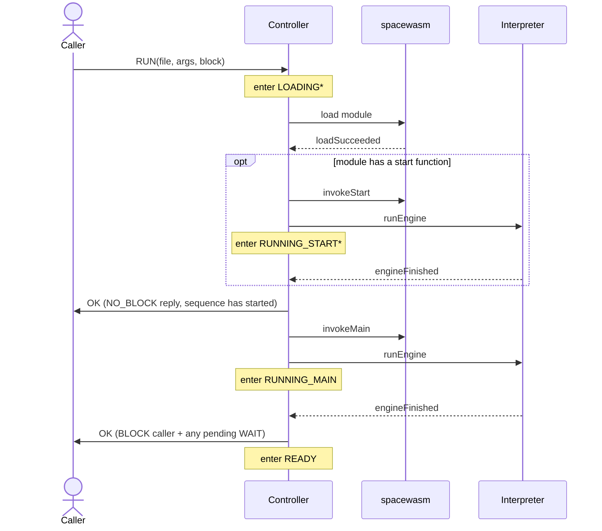
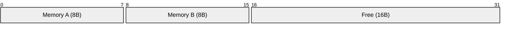
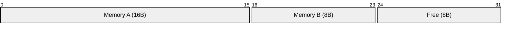
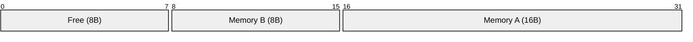

# Svc::WasmSequencer

A sequence engine based around a WebAssembly (Wasm) interpreter.

## Introduction

WasmSequencer is a component that implements the F´ sequencing paradigm to dispatch commands, events, read telemetry parameters and more. It is based around the [WebAssembly](https://webassembly.org/) standard.

The component integrates a [WebAssembly interpreter](https://github.com/nasa/spacewasm) capable of loading validating and executing WebAssembly modules. Two state machines to manage the life-cycle and execution of the interpreter.

## WebAssembly Overview

This section describes some important WebAssembly concepts and how WasmSequencer interacts with them. For complete documentation, see the [WebAssembly 1.0 Specification](https://www.w3.org/TR/wasm-core-1/).
### Types

There are four distict types who share the same name (and meaning) with their F´ equivalents: `i32`, `i64`, `f32`, `f64`.

Notice that these are a _subset_ of the typical representable scalars. These types are used to describe global variables, function parameters, return values, local variables etc. Wasm can still operate on memory using aribtrary bit-width scalars. This is similar to a standard computer instruction set with 32 and 64-bit floating and integer register.

### Functions

A function in Wasm consists of the following properties:

- A set of local variables defined as a set of (n, type) pairs where `n` is the number of locals and `type` the set of local's type.
- A signature that specifies the function's parameters and returns as lists of types.
  - For example: `[i32, i64] -> [f32]` describes a function that accepts an `i32` and `i64` parameter and returns an `f32`.
  - Wasm 1.0 only allows zero or one value in the return.

Functions can be invoked and executed by the engine. The combination of the parameters and locals creates a _frame_.

> [!NOTE]
> Functions do _not_ have names. They have a signature, local variables and a body (instruction sequence). Names are given only to _exported_ definitions (see section below).

### Modules

A module is a basic loadable Wasm unit. A `.wasm` file represents a single module.
Modules are represented as lists of certain definitions which you can read about in the [spec](https://www.w3.org/TR/wasm-core-1/#modules%E2%91%A0).
This document focuses on a subset of these members.

- **Functions**: A list of functions referenced by their index.
- **Start**: An optional function index. This function must be signature `[] -> []` and will be run when the module is _loaded_ before the entrypoint is run.
- **Globals**: A value that can be written/read externally and by the guest program. Optionally mutable.
- **Memory**: A region of RAM that can be accessed by the guest program.
  - The size is specified in the Wasm module. A `min` and optional `max` size is specified up-front.
  - The memory is instantiated at the `min` size. `memory.grow` is supported subject to the restrictions in [Guest Memory](#guest-memory).
  - Only a _single_ memory per module is supported in Wasm 1.0.
- **Imports**: Members of _other_ modules that are added to this module (linking). Imports specify both a module name (names another previously loaded module) and a definition's name (name of export in external module). The following imports are supported in WebAssembly:

  - Functions. Includes an expected signature.
  - Globals. Includes an expected type/mutability.
  - [More](https://www.w3.org/TR/wasm-core-1/#imports%E2%91%A0). These are typically not utilized and are not described in this document.

- **Exports**: Definitions in this module that are made accessible to other modules in the store. Exports have the following three properties:
  - Kind: Function, global, [etc](https://www.w3.org/TR/wasm-core-1/#exports%E2%91%A0).
  - Name: A string naming the definition. Another module can link to this export by naming it as an import.
  - Index: Index in the corresponding list in this module.

> [!TIP]
> Exports can name/re-export a definition listed as an _import_.

### Store

Holds the set of loaded modules. As a module is loaded, it is _linked_ against the store and the imports are resolved against exports of previously loaded modules.

> [!TIP]
> The name of a module is not defined inside the module itself. It is provided when loading the module. A module can be named by the `LOAD` command in WasmSequencer. See [linking](#Modules-Names-and-Linking).

### Engine

The engine encompasses the [store](#store) and the interpreter. The engine can load and validate modules, invoke functions and execute Wasm instructions in the interpreter. The interpreter holds the state of the Wasm execution. The interpreter state is initially seeded by a function _invocation_. The interpreter state consists of:

- `pc`: The program counter.
- `sp`: The stack pointer.
- `fp`: The frame pointer.
- [More](https://github.com/nasa/spacewasm/blob/main/src/engine.rs).

### Guest

The Wasm guest refers to the execution context _inside_ of the Wasm runtime. When you load a `.wasm` module and invoke it's entrypoint, the program executes as a guest. The engine isolates the guest from the rest of the flight-software.

### Host

The Wasm host refers to the context that surrounds the Wasm engine and provides access outside of the guest. WasmSequencer is the host. The host can provide special modules to the store called _host modules_. Host modules can bind native C++ functions (and other definitions) as Wasm exports. Guest modules can import host functions to interact with curated FSW behaviors. See [host functions](#host-functions) for a full description of the built-in `fprime_v1` host module.

## Build Dependencies

The [spacewasm](https://github.com/nasa/spacewasm) engine is written in Rust and compiled into a static library at build time, so building this component requires a [Rust toolchain](https://www.rust-lang.org/tools/install) (`cargo` and `rustc`) on the `PATH`. This is the framework's only Rust dependency, so it is treated as optional: `cmake/required.cmake` detects `cargo`, and `Svc/CMakeLists.txt` skips `Svc::WasmSequencer`.

## Requirements

| Name         | Description                                                                                                                                                                                    | Rationale                                                                                                                                                                                                                                                                                      | Validation |
| ------------ | ---------------------------------------------------------------------------------------------------------------------------------------------------------------------------------------------- | ---------------------------------------------------------------------------------------------------------------------------------------------------------------------------------------------------------------------------------------------------------------------------------------------- | ---------- |
| WASM-SEQ-001 | The sequencer shall support loading and validating WebAssembly modules.                                                                                                                        | Sequences are distributed as WebAssembly binaries; a module must be decoded and validated before execution so a malformed or untrusted binary cannot corrupt the host.                                                                                                                         | Unit Test  |
| WASM-SEQ-002 | The sequencer shall support loading multiple named modules so that the exports of one module may be referenced by another.                                                                     | Larger sequences are composed from reusable library modules; naming lets inter-module imports and exports resolve within a single store.                                                                                                                                                       | Unit Test  |
| WASM-SEQ-003 | The sequencer shall allocate its module store for a fixed, configured capacity and shall reset it on a failed load.                                                                            | Flight software forbids heap fragmentation; a fixed-capacity store with a full reset on failure keeps allocation deterministic and returns to a known-good state.                                                                                                                              | Unit Test  |
| WASM-SEQ-004 | The sequencer shall resolve sequence file paths relative to a configurable base directory.                                                                                                     | Onboard sequence storage varies by deployment; a parameterized base directory avoids hard-coding filesystem layout into the flight software.                                                                                                                                                   | Unit Test  |
| WASM-SEQ-005 | The sequencer shall support running sequences with arguments.                                                                                                                                  | Passing arguments at dispatch time lets a single sequence binary be parameterized, so operators can reuse one module across scenarios instead of rebuilding per run.                                                                                                                           | Unit Test  |
| WASM-SEQ-006 | The sequencer shall support invoking a previously loaded module's entry point on demand.                                                                                                       | Decoupling load from invoke lets a module be validated and staged ahead of time, then executed without re-reading the file.                                                                                                                                                                    | Unit Test  |
| WASM-SEQ-007 | The sequencer shall support both blocking and non-blocking sequence execution.                                                                                                                 | Blocking lets a controlling sequence or operator wait for completion; non-blocking allows fire-and-forget dispatch. Both are needed depending on the caller's intent.                                                                                                                          | Unit Test  |
| WASM-SEQ-008 | The sequencer shall bound the number of interpreter instructions executed per cycle.                                                                                                           | Fuelling the interpreter keeps a long-running or malicious guest from starving the component thread and preserves responsiveness to pause and cancellation.                                                                                                                                    | Unit Test  |
| WASM-SEQ-009 | The sequencer shall support pausing a running sequence before the next directive and later resuming it.                                                                                        | Operators need to halt a sequence at a safe point for inspection or intervention and resume it without restarting from the beginning.                                                                                                                                                          | Unit Test  |
| WASM-SEQ-010 | The sequencer shall support cancelling a loading, ready, or running sequence and returning to the idle state.                                                                                  | An operator must be able to abort a misbehaving or unneeded sequence at any point and clear the store to a known-good idle state.                                                                                                                                                              | Unit Test  |
| WASM-SEQ-011 | The sequencer shall fail a sequence whose current blocking host function does not complete within a configurable timeout.                                                                      | A command or serial reply that never arrives would block the sequencer indefinitely; a per-host-function timeout bounds the wait and fails the sequence safely.                                                                                                                                | Unit Test  |
| WASM-SEQ-012 | The sequencer shall let a sequence read the current spacecraft time, telemetry channel values, and parameter values.                                                                           | Time-aware and conditional sequences must branch on the host's authoritative time, live telemetry, and configured parameters rather than guest-local state.                                                                                                                                    | Unit Test  |
| WASM-SEQ-013 | The sequencer shall support dispatching commands.                                                                                                                                              | Command dispatch is the primary mechanism by which a sequence actuates the spacecraft.                                                                                                                                                                                                         | Unit Test  |
| WASM-SEQ-014 | The sequencer shall let a sequence emit events at the non-reserved F´ severities.                                                                                                              | Guest programs need operator-visible logging; restricting to `WARNING_LO`/`HI`, `ACTIVITY_LO`/`HI` and `DIAGNOSTIC` severities prevents untrusted code from triggering the FATAL handler or spoofing command events.                                                                           | Unit Test  |
| WASM-SEQ-015 | The sequencer shall let a sequence sleep for a relative or absolute duration.                                                                                                                  | Sequences must pace their actions against wall-clock time (settling delays, timed maneuvers) without busy-waiting and consuming interpreter fuel.                                                                                                                                              | Unit Test  |
| WASM-SEQ-016 | The sequencer shall let a sequence support invoking a serial output port at a given index.                                                                                                     | General communication with other components (or sequencers) is useful for synchronizing actions or communicating state. Projects can decide how and what capabilities are exposed to sequences.                                                                                                | Unit Test  |
| WASM-SEQ-017 | The sequencer shall let a sequence read a message from a serial input port, either blocking until one arrives or returning immediately when none is queued.                                    | The inverse of WASM-SEQ-016 is needed to support general communication between other components or sequences. Blocking and non-blocking receives are useful mechanisms to implement event driven and polling workloads.                                                                        | Unit Test  |
| WASM-SEQ-018 | The sequencer shall treat a sequence that terminates with a zero return value or a zero exit code as a success, and a non-zero return value, a non-zero exit code, or a panic as a failure.    | Guests need a clean way to end execution; treating a zero return or exit(0) as success and any non-zero return value, non-zero exit code, or panic as a failure lets the host report the correct verdict to the awaiting command.                                                              | Unit Test  |
| WASM-SEQ-019 | The sequencer shall validate all host-function arguments from the guest and never fault the host on invalid input, reporting an event and failing or trapping the sequence instead.            | Untrusted guest code must never be able to crash the host. This covers oversized/undersized buffers, out-of-range or unconnected serial ports, invalid guest memory pointers, and reserved-severity event requests, all of which are rejected gracefully rather than asserting.                | Unit Test  |
| WASM-SEQ-020 | The sequencer shall report its current state, running sequence name, and most recent trap reason as telemetry.                                                                                 | Operators need continuous visibility into what the sequencer is doing and why a sequence stopped without pulling a full event log.                                                                                                                                                             | Unit Test  |
| WASM-SEQ-021 | The sequencer shall count and report sequences succeeded, failed, and cancelled, and commands dispatched and failed.                                                                           | Aggregate counters give operators a quick health indicator and let ground trend sequence and command reliability over a mission.                                                                                                                                                               | Unit Test  |
| WASM-SEQ-022 | The sequencer shall let a running sequence grow its linear memory via `memory.grow` in strictly O(1) time complexity. Disallowed growth shall telemetry reason to operator.                    | Guests that size working buffers at run time need `memory.grow`. Certain kinds of memory growth are O(1) (i.e. increment a counter) while others require O(n) data copy or move (these are not allowed).                                                                                       | Unit Test  |
| WASM-SEQ-023 | The sequencer shall let an operator read, and write (when mutable), a loaded module's exported globals addressed by module and global name.                                                    | Exposing module globals lets ground inspect and adjust sequence state (tuning constants, flags, thresholds) without reloading, and enables coordination through shared globals; type mismatches, immutable targets, and unknown module/global names are rejected without disturbing the store. | Unit Test  |
| WASM-SEQ-024 | The sequencer shall reject a `RUN`, `LOAD`, or `INVOKE` request that arrives while it is already loading or running a sequence, responding `BUSY` without disturbing the in-progress sequence. | The store and interpreter serve one sequence at a time. Reject overlapping requests with `BUSY` keeps execution deterministic and prevents a late or spurious request from corrupting an in-flight sequence.                                                                                   | Unit Test  |

## Design

The design of this component is tightly coupled with the [spacewasm](https://github.com/nasa/spacewasm) WebAssembly engine, which performs module loading, validation, and instruction execution. `Svc::WasmSequencer` is an active component built around two FPP state machines: a **controller** that manages the module lifecycle (load, validate, initialize, run) and an **interpreter** that executes Wasm instructions and services the host functions a running sequence calls.

### WebAssembly Engine

The engine, [spacewasm](https://github.com/nasa/spacewasm), implements the official WebAssembly [specification](https://www.w3.org/TR/2019/REC-wasm-core-1-20191205/) with the following features:

| Feature                                                                           | Description                        |
| --------------------------------------------------------------------------------- | ---------------------------------- |
| [MVP](https://github.com/WebAssembly/design/blob/main/MVP.md)                     | The Wasm MVP                       |
| [Import/Export of mutable globals](https://github.com/WebAssembly/mutable-global) | Mutable globals (part of Wasm 1.0) |
| [Custom Page Sizes](https://github.com/WebAssembly/custom-page-sizes)             | Linear memory page sizes < 64 KiB  |

Unlike most production-grade Wasm engines, spacewasm is an _interpreter_ — more precisely an _IR interpreter_: during load it translates Wasm byte-code into a resolved intermediate representation (IR) that it then decodes and executes in a loop. This is slower than a typical production just-in-time (JIT) compiler but provides determinism and safety guarantees as well as an extremely low memory footprint. This document does not cover the engine's internals, see the [spacewasm repository](https://github.com/nasa/spacewasm) for more details. A few of its design choices drive this component:

- **Fuel**: The interpreter loop runs at most a bounded number of IR instructions per call and then yields. A long-running or malicious guest cannot starve the component thread and `PAUSE`/`CANCEL` stay responsive. The bound is the `INSTRUCTION_FUEL` parameter. This bounds per-cycle work, not total CPU; see [Scheduling and CPU Budget](#scheduling-and-cpu-budget). This parameter is clamped to be greater than zero so that each execution slice progresses the program counter.
- **Dynamic memory**: spacewasm allocates its module data structures and compiled IR from a "global allocator" the embedder (WasmSequencer) provides. This component backs it with a per-instance pool of up to `SPACEWASM_MAX_PAGES` fixed-size (`SPACEWASM_PAGE_SIZE`) pages, allocated up front in `configure()`, keeping peak memory deterministic and free of heap fragmentation. Guest linear memory is served from a second per-instance pool, also sized in `configure()`. See [Heap Memory](#heap-memory) and [Guest Memory](#guest-memory).
- **Panics**:
  - **Guest Panics**: The Wasm guest can panic due to some invariant which fails the sequence execution and emits an event with the reason. The store is reset.
  - **Rust Panics**: spacewasm is written in Rust and compiled with `panic = "abort"`. A panic is routed through a `spacewasm_panic` callback that logs the location to `Os::Console` and then `FW_ASSERT(false)`. This path is reserved for an engine invariant violation: untrusted or malformed module bytes are contractually handled by graceful `SPACEWASM_ERR_*` load-failure codes (surfaced as load-failure events), not panics. To keep the panic path from firing on arbitrary input, the upstream engine is [fuzzed](https://github.com/nasa/spacewasm/tree/main/fuzz/fuzz_targets) against valid and invalid Wasm modules using industry standard practices.

**Specification divergences.** spacewasm diverges from the spec in a few documented ways for determinism and adherence to flight-software standards:

1. A failed module load invalidates the whole store, so the controller rebuilds the store from scratch on any load failure — the behavior required by WASM-SEQ-003.
2. A module's optional `start` function must resolve to a Wasm function (not a host function), so it can be driven through the same fuel-bounded run loop as `main`.
   - This divergence is a minor detail/technicality and cannot surface to users as start function must be of signature `[] -> []` and WasmSequencer does not expose any `[] -> []` host functions.
3. `memory.grow` has some restrictions when using multiple modules. This is not imposed by SpaceWasm but by how WasmSequencer implements the memory allocator to adhere to FSW restrictions. See [guest memory](#guest-memory).

### Modules, Names, and Linking

Each WasmSequencer holds a single store with a fixed-capacity table of up to `MAX_GUEST_MODULES` guest modules plus the reserved host module. Each guest module is loaded under a **name**, which is how other modules (and later commands) refer to it. Loading is additive: each `LOAD` adds another module to the current store.

- **`LOAD`** loads a module under a caller-chosen name (which must not already be in use). Naming a module is what lets _another_ module import its exports, and lets `INVOKE`, `GLOBAL_GET`, and `GLOBAL_SET` address it afterward. An empty name is the single-module shorthand.
- **`INVOKE`** runs the `main` entry point of an already-loaded module named by the caller (the empty name for a module loaded without one). See [guest module entry point](#Guest-Module-Entry-Points).
- **`RUN`** is the one-shot convenience for a self-contained module: it _resets the store_, loads the file under the empty name, and invokes its `main`. Because it resets the store first, `RUN` discards any modules previously staged with `LOAD`.

**Linking.** A guest module's Wasm imports are `(module, field)` pairs resolved at load time against what is already in the store: the reserved host module `fprime_v1` (with functions listed in [Host Functions](#host-functions)) and any guest module already loaded under the referenced name. `fprime_v1` is always available in the store (restored when the store is reset). Since resolution happens at load time, **a library module must be loaded before the module that imports it**. A multi-module sequence therefore stages its libraries first:

```
LOAD    mathlib.wasm  "math"    ; exports add, mul
LOAD    app.wasm      "app"     ; imports ("math", "add"), ...
INVOKE  "app"
```

A module's exported globals can be printed in an event using `GLOBAL_GET` and written to (if mutable) using `GLOBAL_SET`.

### Guest Module Entry Points

`LOAD` only decodes, validates, and links a module into the store. It has no entry-point requirements. A module intended purely as a library (imported by another module, or only read/written via `GLOBAL_GET`/`GLOBAL_SET`) needs neither a `main` nor a `start` function.

`RUN` and `INVOKE` require an exported `main` function with the one following signatures:

- `[] -> []`. In C: `void main()`. A sequence that returns from this function is counted as a successful run. Sequences with void returns can exit with failure by using the `exit` with a non-zero code or `panic` host functions.
- `[] -> [i32]` In C: `int main()`. Supports `exit`/`panic` like the void return version. Returning from this function has the same behavior as `exit` (zero for success, non-zero for failure).

`start` is optional and, if present, runs once before `main`. It is indended for host-side setup. It is the Wasm-spec `start` section (not a named export), so it can only be a guest-defined function, never a host import (checked at load time), and the spec fixes its signature to `[] -> []`. `LOAD` will execute the optional `start` function before completing.

### State Machines

This component is driven by two state machines whose (flattened) leaf states are reported in telemetry.

#### Controller

The controller owns the module lifecycle: load, validate, and run. It starts in `IDLE` with no store. `LOAD` reads and validates a module into the store executes it's optional start function and settles in `READY`. `RUN` resets the store, does the same load, and then chains into the module's optional start function and its `main` entry point before returning to `READY`. In the `READY` state an operator may `INVOKE` a loaded module to execute the `main` function. A module's state (memory and globals) is maintained across successful `INVOKE`s. If any failure occurs, the controller will return to `IDLE` which clears the store and drops all state.

A few rules apply regardless of which state the controller is in:

- **A failed load invalidates the whole store.** spacewasm cannot partially roll back a load, so any load failure sends the controller back to `IDLE`, whose entry rebuilds a fresh store.
- **Acknowledgement timing depends on `BLOCK`.** A `NO_BLOCK` caller is acknowledged as soon as the sequence finishes loading (i.e. After the option start finishes running). a `BLOCK` caller (and any pending `WAIT`) is acknowledged only once the `main` run finishes. A run only counts as a success if it exits with a zero return/exit code.
- **The controller rejects concurrent requests.** A `RUN`/`LOAD`/`INVOKE` that arrives while the controller is already loading or running is rejected with `BUSY`.
- **Cancellation goes through the interpreter.** `CANCEL` signals the interpreter, which unwinds execution and reports back so the controller can count the sequence as cancelled. Cancellation will return the controller to idle which clears the store.

The diagram below traces a `RUN`'s nominal life cycle end-to-end. `LOAD` follows the same load/start path but settles in `READY` without invoking `main`. `INVOKE` skips straight to the main-invoke step on a module already loaded by an earlier `LOAD`.



The full state machine including all the failure points is much more complex though captures the full scope of what the controller manages:


The controller manages the following failure points during a module's load, initialization and execution:

- A module fails to load/validate.
- A cancellation mid-load.
- A module's start function could not be invoked<sup>*</sup>.
- A module has an invalid `main` (missing or invalid signature)<sup>+</sup>.
- A module's `main` function could not be invoked<sup>*</sup>.
- The start function exited with error (or trapped).
- The `main` function exited with error (or trapped).

Most failures will clear the store and return to `IDLE`.

**<sup>*</sup>** Function invocations can fail if the stack frame required to run the function overflows the interpreter's allocated stack.

**<sup>+</sup>** Invalid `main` signatures detected during `INVOKE` are the only recoverable error and will return to `READY` _without_ clearing the store.

#### Interpreter


The interpreter executes the loaded program and services the host functions it calls, one fuel-bounded slice at a time.

- **Slices are fuel-bounded.** Each slice spins the interpreter loop until it finishes, traps, exhausts its `INSTRUCTION_FUEL`, or a host function call pauses it. Running out of fuel simply starts another slice. A pending `PAUSE` or `CANCEL` is checked between slices, which is where either takes effect.
- **Every host function pauses the interpreter and is dispatched through `AWAITING_RESPONSE`**, but most resolve immediately within that same dispatch: reading time, telemetry, parameters, or invocation arguments, emitting an event, and sending serial output all signal their own resume before the guest ever waits.
- **Two host functions wait for an asynchronous reply.** A dispatched command (`cmd`) awaits its response on `cmdResponseIn`, and a blocking `serial_recv` awaits an inbound message on `serialIn`. Both are bounded by the `HOST_FUNCTION_TIMEOUT_SECS` parameter, checked on each `checkTimers` tick.
- **Sleeps run on their own timer.** `rsleep`/`asleep` wait on a guest-requested wake time rather than the host-function timeout, but are likewise checked each `checkTimers` tick.
- **Completion hands back execution to the controller.** When the program ends, the interpreter records why — a normal finish (with its return code), a guest `exit`/`panic` (with its code), or a byte-code trap (with its reason) — and signals the controller, which emits the matching completion event.

### Guest Memory

This section describes the restrictions that WasmSequencer places on guest (linear) memory and it's growth (`memory.grow` instruction). First it is important to give a bit of context on how linear memory works in Wasm. Wasm defines every guest memory (linear memory) in units of _pages_. Wasm 1.0 defines each page as 64KiB however SpaceWasm implements the [custom page sizes](https://github.com/WebAssembly/custom-page-sizes) proposal which also allows pages to be 1 byte, effectively allowing arbitrarily sized linear memory allocations. Wasm memories are defined as a single minimum size and an optional maximum in page units (1 or 64k bytes). When a module is first instantiated, the linear memory (if defined) is sized to the minimum size. Finally, Wasm 1.0 defines a single instruction `memory.grow` that allows the guest to request a linear memory to grow by given number of pages. The total pages a module can request is bounded by the memory maximum (if it exists) _and_ 4GiB as Wasm 1.0 uses a 32-bit address space.

Now we will define how WasmSequencer implements guest linear memory. Guest memory in WasmSequencer is a single pool of memory allocated in the `configure()` stage of the component initialization. This pool provides the guest memory pages across every module loaded into the store. WasmSequencer keeps track of the currently allocated memory in this pool using an offset relative to the start of the pool (starts at zero). When a new module is loaded, WasmSequencer's guest allocator will bump this offset up to the guest pool size before rejecting a new guest memory allocation.

Since the guest memory allocator is a simple bump allocator, `memory.grow` can _only_ succeed if the requested growth is at the tail end of the bump allocator. The guest allocator does not implement any sort of `realloc`-like move as this would be very complex and cause memory fragmentation. Here is an example to illustrate the fragmentation that is not allowed:

We start with two memories allocated and some free space:



Now when we try to `memory.grow` Memory A to 16B we must either move Memory B out of the way:



...or move memory A to another slot:



Both of these behaviors are _NOT_ supported in WasmSequencer's guest allocator. In this scenario we would reject any Memory A `memory.grow` requests. Only Memory B growth requests are allowed. Guest memory growth failures emit an event noting the reason for the failure (not last memory or out of memory). This restriction allows `memory.grow` to have O(1) time complexity and avoids any memory fragmentation.

This means that only the _final_ allocated linear memory (usually in the last module) can actually service `memory.grow`s. For single module stores, there is no `memory.grow` restriction.

Happy `malloc`ing!

### Heap Memory

SpaceWasm never calls a general-purpose allocator itself. Every allocation comes from a heap memory pool the component supplies up front (see the _Dynamic memory_ bullet under [WebAssembly Engine](#webassembly-engine) for what those two pools are and how they're sized). SpaceWasm exposes only one active allocator process-wide with no per-call context, so a deployment running more than one `WasmSequencer` needs its own bookkeeping to share it safely.

- **Each instance holds a registry slot.** A fixed-capacity registry (capacity `MAX_SEQUENCERS`) of per-instance page pools tracks a single "currently active" slot. An instance registers its slot at construction and releases it at destruction, which caps the number of live instances at `MAX_SEQUENCERS`.
- **A process-wide mutex.** Store creation, store teardown, and module load each take a process-wide mutex, select the calling instance's slot as active for their duration, and release it afterward. An assertion-checked internal integrity check backs this up, but it can never fire under correct locking; the mutex is what does the work.
- **Execution runs outside the lock.** Outside of the three noted points, WasmSequencer does not hold the process-wide mutex. No heap-pool (store/IR) allocation happens during execution; a running guest can still grow its linear memory via `memory.grow`, which draws from the separate per-instance guest pool (not this lock — see [Guest Memory](#guest-memory)).
- **Limitation: a load holds the lock for as long as its file read takes.** Loading streams the module file from disk while holding the lock, so a slow or large load blocks every other instance's store creation, teardown, or load (though not their execution) for its duration. This is acceptable because loads are infrequent and module files are small and complete in milliseconds (depending on the module).

### Scheduling and CPU Budget

The interpreter runs a loaded program in fuel-bounded slices: each slice executes at most `INSTRUCTION_FUEL` instructions and then yields. The bound is per slice, not a total budget, so a guest that loops forever simply keeps producing slices. Between slices the component drains its own message queue, which keeps `PAUSE`, `CANCEL`, and the host-function timeout responsive while a sequence runs.

**Fuel yields to the component queue, not the OS scheduler.** Yielding between slices does not sleep the thread: a compute-only guest that never blocks on a host function or sleep stays in the run loop and can consume a full core. `INSTRUCTION_FUEL` trades responsiveness for throughput; it does not cap total CPU. Fairness between threads is the OS scheduler's job, set by task priority.

**Operator guidance.** Give the `WasmSequencer` instance a task priority below the deployment's mission-critical threads (rate groups, the command dispatcher, control loops) so a runaway guest cannot starve them, and keep the scheduler preemptive. Priority is set where the instance is defined in the topology.

### Ports

| Port Type          | Name             | Direction | Kind         | Usage                                                                  |
| ------------------ | ---------------- | --------- | ------------ | ---------------------------------------------------------------------- |
| `Fw.Com`           | `cmdOut`         | Output    | —            | Dispatches commands to the command dispatcher (backs the guest `cmd`). |
| `Fw.CmdResponse`   | `cmdResponseIn`  | Input     | async        | Receives responses to dispatched commands.                             |
| `Fw.TlmGet`        | `getTlmChan`     | Output    | —            | Reads telemetry channel values (backs the guest `tlm`).                |
| `Fw.PrmGet`        | `getParam`       | Output    | —            | Reads parameter values (backs the guest `prm`).                        |
| `Svc.Sched`        | `checkTimers`    | Input     | async        | Periodically drives sleep-wake and host-function-timeout checks.       |
| `Svc.Sched`        | `writeTelemetry` | Input     | async (drop) | Optional periodic telemetry write.                                     |
| `serial`           | `serialOut[]`    | Output    | —            | Serial output triggered by the guest `serial_send`.                    |
| `serial`           | `serialIn[]`     | Input     | guarded      | Inbound serial messages, queued per port.                              |
| `Svc.CmdSeqIn`     | `seqRunIn`       | Input     | async        | Request to run a sequence (as the `RUN` command).                      |
| `Svc.CmdSeqCancel` | `seqCancelIn`    | Input     | sync         | Request to cancel the running sequence (as `CANCEL`).                  |
| `Svc.CmdSeqIn`     | `seqStartOut`    | Output    | —            | Signalled when a sequence begins running.                              |
| `Fw.CmdResponse`   | `seqDoneOut`     | Output    | —            | Signalled when a sequence finishes.                                    |

The serial-port array bounds come from the `Wasm.MAX_SERIAL_OUT_PORTS` / `Wasm.MAX_SERIAL_IN_PORTS` constants in `config/WasmSequencerCfg.fpp`. The component also uses the standard command, event, telemetry, parameter, and time special ports.

## Commands

All commands are asynchronous except `CANCEL`, which is synchronous.

| Command                                     | Description                                                                                                                                                         |
| ------------------------------------------- | ------------------------------------------------------------------------------------------------------------------------------------------------------------------- |
| `RUN`                                       | Reset the store, then load, invoke `main`, and run a module in one step; waits for completion when `$block == BLOCK`.                                               |
| `LOAD`                                      | Load and validate a module into the store under the given name (an empty name for a single standalone module); its exports can then be referenced by other modules. |
| `INVOKE`                                    | Invoke `main` on an already-loaded module.                                                                                                                          |
| `WAIT`                                      | Wait for the running sequence to finish and return its result.                                                                                                      |
| `CANCEL`                                    | Cancel a loading/running sequence and return to idle.                                                                                                               |
| `PAUSE` / `CONTINUE`                        | Pause the running sequence at the next boundary / resume it.                                                                                                        |
| `GLOBAL_SET_I32` / `_I64` / `_F32` / `_F64` | Set an exported, mutable global of the given type.                                                                                                                  |
| `GLOBAL_GET`                                | Read an exported global's value and report it in an event.                                                                                                          |

## Host Functions

A running sequence reaches the host through a single Wasm import module, `fprime_v1`. These imports are the programming interface exposed to guest programs. Exact signatures, parameter/return semantics, and status enums are declared in [`spacewasm_include/fprime.h`](../spacewasm_include/fprime.h), the canonical guest header a Wasm module is compiled against. The table below only summarizes intent.

| Import              | Purpose                                                                                                         |
| ------------------- | --------------------------------------------------------------------------------------------------------------- |
| `exit` / `panic`    | End the sequence with an exit code / abort it with a panic code.                                                |
| `args`              | Read the sequence's invocation arguments.                                                                       |
| `time`              | Read the current spacecraft time.                                                                               |
| `tlm` / `prm`       | Read a telemetry channel / parameter value.                                                                     |
| `cmd`               | Dispatch an F´ command and await its response.                                                                  |
| `event`             | Emit an F´ event the given string content. Only `WARNING_[LO/HI]`, `ACTIVITY_[LO/HI]` and `DIAGNOSTIC` allowed. |
| `rsleep` / `asleep` | Sleep for a relative / absolute duration.                                                                       |
| `serial_send`       | Send bytes out a serial port. (See [serial ports](#serial-ports)).                                              |
| `serial_recv`       | Read bytes from a serial input port (blocking or non-blocking). (See [serial ports](#serial-ports)).            |

Guest arguments are validated on every call; invalid input (bad pointers, oversized/undersized buffers, out-of-range or unconnected ports, reserved event severities) fails or traps the sequence and emits a warning event rather than faulting the host (WASM-SEQ-019).

## Timeouts

This section describes asynchronous host function reply timeouts and how late replies are handled. Timeout length is controlled by the `HOST_FUNCTION_TIMEOUT_SECS` parameter. Timeouts can be disabled by setting the parameter to `0` (or `<0`). Two host functions are subject to timeouts: `cmd` and a blocking `serial_recv`.

A blocking `serial_recv` timeout simply fails the sequence. Later messages coming in on `serialIn` will be added to the serial queue. If a serial port index implements the standard F´ asynchronous send/reply pattern, it is recommended that before the `serial_out`, the queue is unloaded by calling `serial_recv` (non-blocking) and discarding any lingering items in the queue.

Every command dispatch will block until a response (or timeout) is reached. Each command is dispatched with a unique identifier (UID). The UID consists of the following:

-  **Sequence Execution ID** (`seqId`): Incremented every time the interpreter starts executing a start/main.
-  **Command Index** (`cmdId`): Incremented on every command dispatch.

The UID is sent to the `CmdDispatcher` along with the `ComBuffer` holding the serialized command. Once the implementing component responds, the dispatcher will reply to WasmSequencer with a reply code and the same UID.

When a command response times out, the sequence exits with failure. If the operator starts another sequence, `seqId` will be incremented and `cmdId` will be cleared. If the timeout from the previous `seqId` comes during the execution of this new sequence, WasmSequencer will drop response and emit a `CmdResponseFromOldSequence` event.

## Serial Ports

Most of the host functions in `fprime_v1` interface with F´ framework functionality. The two serial functions `serial_out` and `serial_recv` provide generic functionality where projects can interface with any other components in F´ outside of the interfaces of the base framework. This allows arbitrary data to be passed across the sequence/flight-software boundary as needed by a project.

Serial ports (both in and out) can utilize each index for a distinct purpose. There are a couple of patterns that are important to understand when using this functionality. This section will outline an example that show-cases these patterns.

In this example we will instantiate two WasmSequencer instances with different behaviors assigned to their serial ports. The first sequencer is responsible for performing a "visual odometry" for a rover and sending a pose refinement after tracking subsequent images. The second sequence is responsible to responding faults that are announced on an input.

It is best practice is to specify the serial interface up-front in FPP using `dictionary` type definition so that sequences that rely on the dictionary-defined types can serialize the data-structures properly:

```fpp
#############
# Vo Seq    #
#############

dictionary struct VoRefinePoseParam {
    dx: F64  @< Delta X to apply to position estimate in meters
    dy: F64  @< Delta Y to apply to position estimate in meters
    dz: F64  @< Delta Z to apply to position estimate in meters
    dh: F64  @< Delta heading to apply to quaternion estimate in radians
}

dictionary struct GetImageParam {
    camId: CameraId  @< Which camera to take picture with
}

@ Port index for voSeq (output ports)
dictionary enum VoSequencerOutPorts {
    @ Take a picture and get it's contents (asynchronously through SerialInPortIndex = 1)
    ACQUIRE_IMAGE = 0

    @ VoRefinePoseParam. Apply a VO refinement to the current pose. No reply.
    VO_REFINE = 1
}

array ImageData = [512 * 512] U8 default 0

dictionary struct GetImageReply {
    camId: CameraId
    data: ImageData
}

@ Port index for voSeq (input ports)
dictionary enum VoSequencerInPorts {
   @ GetImageReply. An asynchronous reply from `ACQUIRE_IMAGE`
   REPLY_IMAGE = 0
}

#############
# Fp Seq    #
#############

dictionary struct FaultAnnouncement {
    $id: FaultId
    context: U32
}

dictionary enum FpPortInPorts : U8 {
    @ FaultAnnouncement. Fault announcement from any component implementing a monitor
    FAULT_ANNOUNCEMENT = 0
}
```

Now let's instantiate the sequencer instances and connect this to an example topology:

```fpp
instance voSeq: Svc.WasmSequencer base id 0x10007000 \
    queue size Default.QUEUE_SIZE \
    stack size Default.STACK_SIZE \
    priority 20 {
        phase Fpp.ToCpp.Phases.configConstants """
        // Config is default-constructed and then populated field by field.
        Svc::WasmSequencer::Config wasmConfig;
        wasmConfig.heapPages       = Svc::WasmSequencerConfig::SPACEWASM_MAX_PAGES;
        wasmConfig.guestMemorySize = ImageData::SERIALIZED_SIZE + 4096;  // an image plus guest scratch
        wasmConfig.stackSize       = 256;   // 32-bit words
        wasmConfig.serialOutMax    = 256;
        // Size the REPLY_IMAGE queue to hold a single image plus its 4-byte length frame,
        // and keep the latest image if an unprocessed one is still queued.
        wasmConfig.serialIn[VoSequencerInPorts::REPLY_IMAGE] = {
            /* size         */ sizeof(U32) + ImageData::SERIALIZED_SIZE,
            /* fullBehavior */ Svc::WasmSequencer::SerialInQueueFullBehavior::DROP_OLDEST
        };
        """

        phase Fpp.ToCpp.Phases.configComponents """
        voSeq.configure(ConfigObjects::voSeq::wasmConfig, mallocator);
        """
    }

instance fpSeq: Svc.WasmSequencer base id 0x10008000 \
    queue size Default.QUEUE_SIZE \
    stack size Default.STACK_SIZE \
    priority 20 {
        phase Fpp.ToCpp.Phases.configConstants """
        Svc::WasmSequencer::Config wasmConfig;
        wasmConfig.heapPages       = Svc::WasmSequencerConfig::SPACEWASM_MAX_PAGES;
        wasmConfig.guestMemorySize = 4096;
        wasmConfig.stackSize       = 256;   // 32-bit words
        wasmConfig.serialOutMax    = 0;     // fpSeq only receives faults; no serialOut
        // Hold up to 10 FaultAnnouncement messages (each with its 4-byte length frame),
        // and assert if we don't process them fast enough!
        wasmConfig.serialIn[FpPortInPorts::FAULT_ANNOUNCEMENT] = {
            /* size         */ 10 * (sizeof(U32) + FaultAnnouncement::SERIALIZED_SIZE),
            /* fullBehavior */ Svc::WasmSequencer::SerialInQueueFullBehavior::ASSERT
        };
        """

        phase Fpp.ToCpp.Phases.configComponents """
        fpSeq.configure(ConfigObjects::fpSeq::wasmConfig, mallocator);
        """
    }

topology AwesomeTopology {
    instance voSeq
    instance fpSeq

    instance cameraMgr
    instance scAttitude

    instance monitor1
    instance monitor2

    connections VoSerial {
        # Camera connections asynchronous send/reply
        voSeq.serialOut[VoSequencerOutPorts.ACQUIRE_IMAGE] -> cameraMgr.takeImage
        cameraMgr.replyImage -> voSeq.serialIn[VoSequencerInPorts.REPLY_IMAGE]

        # Vo refinement (out only)
        voSeq.serialOut[VoSequencerOutPorts.VO_REFINE] -> scAttitude.refineIn
    }

    connections FpSerial {
        # Fault announcement (in only)
        monitor1.faultAnnounce -> fpSeq.serialIn[FpPortInPorts.FAULT_ANNOUNCEMENT]

        monitor2.faultAnnounce -> fpSeq.serialIn[FpPortInPorts.FAULT_ANNOUNCEMENT]
    }
}
```

This lengthy example show-cases three serial port patterns:

1. Asynchronous send/reply using output and input serial ports
   - `ACQUIRE_IMAGE` -> `REPLY_IMAGE`
2. Synchronous port invocation using only an output serial port
   - `VO_REFINE`
3. Event-driven input queues using only an input serial port
   - `FAULT_ANNOUNCEMENT`

When using serial ports on WasmSequencer, size each `serialIn` queue and pick its overflow policy per that port's purpose through the `serialIn[]` field of the `Config` passed to `configure()`: `DROP_OLDEST` for latest-value streams (e.g. imagery), `DROP_NEWEST` to preserve an existing backlog, or `ASSERT` for events that must never be dropped. `serialOut` carries no queue — a guest `serial_send` synchronously invokes the connected input port.

The Wasm guest and host do not share address spaces. This means that pointers in Wasm (`i32`) are simply offsets in the respective linear memory not true pointers. Pointers from the host cannot be accessed by the guest. When passing data across the guest/host boundary, the data must be serialized by _value_ rather than by reference (no serializing addresses) otherwise the data will not be accessible from the other end.

## Parameters

| Parameter                    | Type         | Default | Description                                                                                                                |
| ---------------------------- | ------------ | ------- | -------------------------------------------------------------------------------------------------------------------------- |
| `SEQ_BASE_DIR`               | `string`     | `""`    | Base directory that sequence file paths are resolved against.                                                              |
| `INSTRUCTION_FUEL`           | `FwSizeType` | `1000`  | IR instructions executed per interpreter cycle. Larger values run faster but respond to `PAUSE` and `CANCEL` less quickly. |
| `HOST_FUNCTION_TIMEOUT_SECS` | `F32`        | `60`    | Timeout in seconds for a blocking host function. See [timeouts](#timeouts). `<= 0` disables it.                            |

## Telemetry and Events

The full set of telemetry channels and events, with their arguments, is defined in the FPP model and enumerated in the generated dictionary. In summary, the component reports the controller and interpreter state-machine states, cumulative counters (sequences succeeded / failed / cancelled, commands dispatched / failed), the most recent trap reason, and the running sequence name (WASM-SEQ-020, WASM-SEQ-021). Its events cover module-load and file errors, the sequence lifecycle and its per-branch completion outcomes (exited / panicked / trapped / host-failure / cancelled, each tagged with the `START` or `MAIN` phase), guest-argument-validation failures, and the guest-emitted log events produced by the `event` host function.

## Configuration

WasmSequencer configuration has two layers: **per-instance runtime setup** through the required `configure()` call (memory-pool sizes and per-port serialIn policy, chosen when the instance is created in the topology), and **compile-time constants** split across three files with different audiences.

### Per-instance setup: `configure()`

Each instance **must** be configured exactly once at setup — in the topology's `configComponents` phase, after `init()` and before the instance runs anything (see the [Serial Ports](#serial-ports) example). `configure()` takes a single `Config` struct plus the allocator; it allocates the instance's backing pools from the supplied `Fw::MemAllocator` (retained so the destructor can free them) and creates the initial interpreter store:

```cpp
void configure(const Config& cfg, Fw::MemAllocator& mallocator);
```

`Config` is default-constructed and then populated field by field. All fields have sensible defaults, so a minimal setup only overrides what it needs:

```cpp
struct SerialInQueueConfig {
    FwSizeType                size         = 0;  // queue size in bytes; 0 = no queue
    SerialInQueueFullBehavior fullBehavior = SerialInQueueFullBehavior::DROP_NEWEST;  // overflow policy
};

struct Config {
    FwSizeType heapPages       = 8;      // interpreter-heap pages to allocate (<= SPACEWASM_MAX_PAGES)
    FwSizeType guestMemorySize = 8192;   // bytes for the shared guest linear-memory pool
    FwSizeType stackSize       = 1024;   // Wasm operand-stack size in 32-bit words (carved from the heap pool)
    U32        maxCodePages    = 256;    // capacity of the code-page pointer table (see below)
    FwSizeType serialOutMax    = 0;      // max serial_send payload; 0 leaves serialOut unconfigured
    SerialInQueueConfig serialIn[NUM_SERIALIN_INPUT_PORTS];  // per-index queue size + overflow policy
};
```

For example, in an `instances.fpp`:

```fpp
instance wasmSeq: Svc.WasmSequencer base id 0x10007000 \
    queue size Default.QUEUE_SIZE \
    stack size Default.STACK_SIZE \
    priority 20 {
      phase Fpp.ToCpp.Phases.configConstants """
        Svc::WasmSequencer::Config wasmConfig;
        wasmConfig.heapPages       = 4;
        wasmConfig.guestMemorySize = 1024 * 8;
        wasmConfig.stackSize       = 1024 * 2;   // 32-bit words
        wasmConfig.serialOutMax    = 0;
        // serialIn queues left at their defaults (all sizes 0)
        """
      phase Fpp.ToCpp.Phases.configComponents """
        wasmSeq.configure(ConfigObjects::wasmSeq::wasmConfig, memAllocator);
        """
    }
```

To use the default settings (serial ports disabled)

```fpp
instance wasmSeq: Svc.WasmSequencer base id 0x10007000 \
  queue size Default.QUEUE_SIZE \
  stack size Default.STACK_SIZE \
  priority 20 {
    phase Fpp.ToCpp.Phases.configComponents """
      wasmSeq.configure(Svc::WasmSequencer::Config(), memAllocator);
      """
  }
```


| Field             | Purpose                                                                                                                                                                                                      |
| ----------------- | ------------------------------------------------------------------------------------------------------------------------------------------------------------------------------------------------------------ |
| `heapPages`       | Number of `SPACEWASM_PAGE_SIZE` pages for the interpreter heap (store + compiled IR). Must be `> 0` and `<= SPACEWASM_MAX_PAGES`.                                                                            |
| `guestMemorySize` | Size in bytes of the guest linear-memory pool, shared by every loaded module (see [Guest Memory](#guest-memory)).                                                                                            |
| `stackSize`       | Wasm operand-stack size in 32-bit words, carved from the heap pool when the store is created.                                                                                                                |
| `maxCodePages`    | Capacity of the compiled-code-page pointer table across all loaded modules. Costs `maxCodePages * sizeof(void*)` in the heap pool up front; the code pages themselves (512 bytes each) are allocated lazily. |
| `serialOutMax`    | Largest `serial_send` payload copied out of guest memory; a larger request traps the guest. `0` leaves `serialOut` unconfigured (any send traps).                                                            |
| `serialIn`        | Per-`serialIn`-index queue config (`.size` in bytes, `.fullBehavior` policy). A `.size` of `0` leaves that index without a queue (all inbound frames on it are dropped). See below.                          |
| `mallocator`      | `Fw::MemAllocator` used for every allocation above; the same instance is retained and used to free the pools at destruction.                                                                                 |

Each `serialIn[]` element defaults to size `0` (unconfigured indices drop all inbound frames) and `DROP_NEWEST`, then is populated per port index:

```cpp
Svc::WasmSequencer::Config cfg;
cfg.serialIn[PORT] = {
    /* size         */ /* bytes */,   // 0 leaves that index without a queue
    /* fullBehavior */ Svc::WasmSequencer::SerialInQueueFullBehavior::DROP_OLDEST  // or DROP_NEWEST / ASSERT
};
```

Each `serialIn` frame is stored framed as `[U32 length][payload]`, so size a queue as `N * (sizeof(U32) + maxPayload)` to hold `N` messages. The overflow policy applies when a new frame does not fit: `DROP_OLDEST` evicts oldest frames until it fits, `DROP_NEWEST` drops the incoming frame, and `ASSERT` faults the component (reserve this for ports where losing a message is a mission failure).

### `config/WasmSequencerConfig.hpp`

C++ compile-time constants consumed directly by the component. Per-instance memory sizing — heap page count, guest pool size, Wasm stack size, code-page table capacity, serialOut buffer size, and each serialIn queue's size and overflow policy — is **not** compile-time; it is passed to `configure()` when the instance is set up (see the [Serial Ports](#serial-ports) example).

| Constant                       | Value   | Purpose                                                                                     |
| ------------------------------ | ------- | ------------------------------------------------------------------------------------------- |
| `SPACEWASM_PAGE_SIZE`          | -       | Must map to `WASM_SEQ_SPACEWASM_PAGE_SIZE` in `WasmSequencerSpacewasmConfig.h` (see below). |
| `SPACEWASM_MAX_PAGES`          | -       | Must map to `WASM_SEQ_SPACEWASM_MAX_PAGES` in `WasmSequencerSpacewasmConfig.h` (see below). |
| `MAX_GUEST_MODULES`            | `8`     | Maximum modules loadable into a store.                                                      |
| `MAX_BACKPATCH_ITERATIONS`     | `32768` | Upper bound on the control-flow backpatch-resolution loop during module load.               |
| `LOAD_READ_CHUNK_SIZE`         | `512`   | Buffer size for streaming a module file into the decoder.                                   |
| `MAX_CONCURRENT_WAIT_COMMANDS` | `8`     | Maximum number of concurrent `WAIT` commands each WasmSequencer can service.                |

### `config/WasmSequencerSpacewasmConfig.h`

Shared preprocessor constants that must agree between the C++ component and the Rust `spacewasm` crate; single-sourced here and read on the Rust side by `build.rs` so the two languages cannot drift:

| Constant                       | Value  | Purpose                                                                                                                                                                                                                         |
| ------------------------------ | ------ | ------------------------------------------------------------------------------------------------------------------------------------------------------------------------------------------------------------------------------- |
| `WASM_SEQ_SPACEWASM_PAGE_SIZE` | `8192` | Size in bytes of each page served to the spacewasm interpreter heap.                                                                                                                                                            |
| `WASM_SEQ_SPACEWASM_MAX_PAGES` | `32`   | Maximum interpreter-heap pages a single instance may allocate; caps `configure()`'s `Config::heapPages`                                                                                                                         |
| `WASM_SEQ_MAX_SEQUENCERS`      | `8`    | Maximum number of WasmSequencer instances that may register a global allocator slot process-wide (Rust `ALLOCATORS` array length). A component instantiated beyond this count fails allocator registration with `ERR_CAPACITY`. |

### `config/WasmSequencerCfg.fpp`

FPP dictionary constants and the serial-port index enums:

| Constant / Enum            | Value  | Purpose                                                                                                                                  |
| -------------------------- | ------ | ---------------------------------------------------------------------------------------------------------------------------------------- |
| `DEFAULT_SEQ_BASE_DIR`     | `""`   | Default value of the `SEQ_BASE_DIR` parameter: a literal prefix prepended to each requested sequence file path.                          |
| `MODULE_NAME_STRING_SIZE`  | `16`   | Buffer size (bytes) for a WebAssembly module name (LOAD/INVOKE and the commands/events that reference a loaded module by name).          |
| `GLOBAL_NAME_STRING_SIZE`  | `16`   | Buffer size (bytes) for a WebAssembly global export name (`GLOBAL_SET_*`/`GLOBAL_GET` and their events).                                 |
| `GUEST_EVENT_MESSAGE_SIZE` | `128`  | Maximum length (bytes) of a guest-emitted event message (`event` host function).                                                         |
| `DEFAULT_INSTRUCTION_FUEL` | `1000` | Default value of the `INSTRUCTION_FUEL` parameter: number of Wasm instructions to execute per interpreter cycle.                         |
| `MAX_SERIAL_OUT_PORTS`     | `5`    | Number of `serialOut` port indices per instance. Each port index can map to other input ports in a project's topology.                   |
| `MAX_SERIAL_IN_PORTS`      | `5`    | Number of `serialIn` port indices per instance. Each port index includes it's own serial queue which can be polled/read by the sequence. |

Runtime behavior is controlled through the `WasmSequencerConfig.hpp` parameters above.

## Unit Testing

Most tests exercise the interpreter by running a tiny WebAssembly module — one per host function or error path — staged from prebuilt fixtures in `test/wasm/`, assembled from the human-readable `.wat` sources in `test/wasm/src/`.

To add a new fixture, write a `.wat` file in `test/wasm/src/`, then regenerate all `.wasm` binaries with:

```
python3 test/wasm/build_wasm.py
```

This requires [`wat2wasm`](https://github.com/WebAssembly/wabt) (from WABT) on `PATH`, built with custom-page-size support. The `.wasm` binaries are committed alongside their `.wat` sources so the unit tests don't depend on WABT being installed to build or run.

These tests are meant to test the WasmSequencer rather than every instruction and Wasm behavior. The SpaceWasm engine includes it's own set of unit and integration [tests](https://github.com/nasa/spacewasm).

To run the unit tests with coverage:

```
fprime-util check --coverage
```
