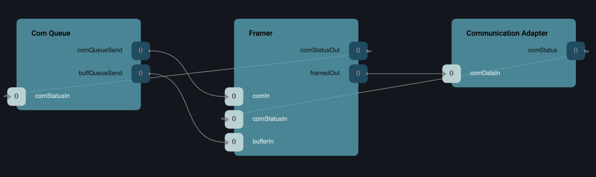

# Communication Adapter Interface

Any communication component (e.g. a radio component) that is intended for use with the standard F´ uplink and downlink
stack should implement the *Communication Adapter Interface*. This interface specifies both the ports and protocols used
to operate with the standard F´ uplink and downlink components.

Implementors of this interface are referred to as *Communication Adapters*.

## Ports

The communication adapter interface is composed of three ports. These ports are used to transmit outgoing data through
some communication hardware and receive incoming data from that same hardware. These ports share types with the byte
stream driver model for backwards compatibility.

| Kind     | Suggested Name | Port Type             | Usage                                                          |
|----------|----------------|-----------------------|----------------------------------------------------------------|
| `input`  | `comDataIn`    | `Drv.ByteStreamSend`  | Port receiving `Fw::Buffer` objects for outgoing transmission. |
| `output` | `comDataOut`   | `Drv.ByteStreamRecv`  | Port producing incoming `Fw::Buffer` objects.                  |
| `output` | `comStatus`    | `Fw.SuccessCondition` | Port indicating status of outgoing transmission. See protocol. |

> Note: components implementing the *Communication Adapter Interface* must deallocate any `Fw::Buffer` received on the
> `comDataIn` port or must delegate the deallocation to another component (e.g. a driver).
> See [Memory Management in F´](./memory.md)

### comDataIn Description

This port receives data from an F´ application in the form of an argument of `Fw::Buffer` type. This data is intended to
be sent out the communications interface managed by this component. From the perspective of the application this is
the outgoing data port.

### comDataOut Description

This port receives data from the communication interface managed by this component and provides it to the F´ application
in the form of an argument of `Fw::Buffer` type. From the perspective of the application this is the incoming data port.

### comStatus Description

This port carries a status of `Fw::Success::SUCCESS` or `Fw::Success::FAILURE` typically in response to a call to the
`comDataIn` port described above. 

> Note: it is critical to obey the protocol as described in the protocol section below.

## Communication Adapter Protocol

The `comStatus` port must obey a specific protocol to indicate to F´ applications the status of outgoing transmissions.
A communication status is one of two possibilities:

| Status               | Description                                                                       |
|----------------------|-----------------------------------------------------------------------------------|
| Fw::Success::SUCCESS | *Communication adapter* transmission succeeded*  and is ready for more data.      |
| Fw::Success::FAILURE | Last transmission failed; *communication adapter* is unable to receive more data. |

> * Fw::Success::SUCCESS may also indicate a connection/reconnection success when a retransmission is often desired.

A *Communication Adapter* shall emit either Fw::Success::SUCCESS or Fw::Success::FAILURE via the `comStatus` port once
for each call received on `comDataIn`. Additionally, a *Communication Adapter* shall emit Fw::Success::SUCCESS once at
startup to indicate communication is initially ready and once after each Fw::Success::FAILURE event to indicate that
communication has been restored.

> It is imperative that *Communication Adapters* implement the `comStatus` protocol correctly. 
