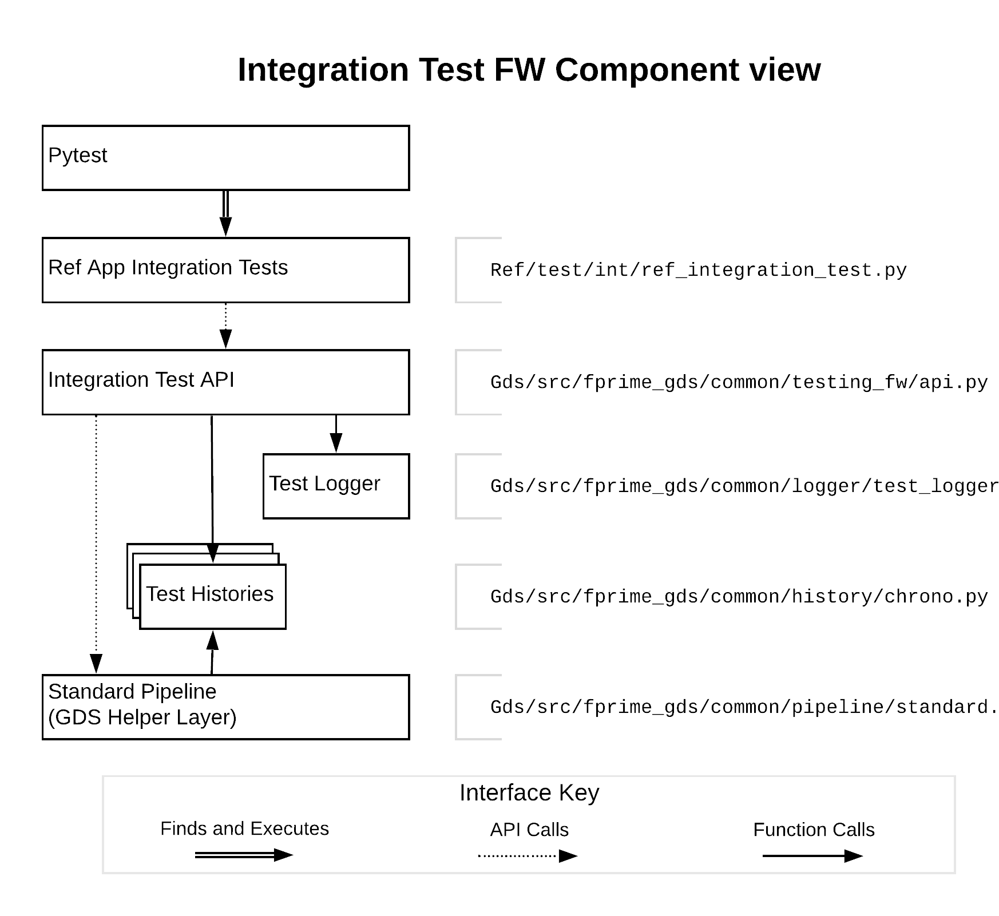

## Integration Test API Design

This covers the design of the integration test API.

### Integration Test API Outline

The actual Test API is a very long class that has helpful doc-strings, but these don't convey its organization while skimming. Below is a table of how the API is organized with a brief summary of each section:

| Test API Section| Section Description| Methods|
| :----| :----| :----|
| API Functions| These functions give access to helpful API features.| start_test_case, log, get_latest_time, test_assert, predicate_assert, clear_histories, set_event_log_filter|
| History Functions| These functions give the user access to test histories and the ability to create sub-histories.| get_command_test_history, get_telemetry_test_history, get_event_test_history, get_telemetry_subhistory, remove_telemetry_subhistory, get_event_subhistory, remove_event_subhistory|
| Command Functions| These functions provide the ability to send commands and search for events/telemetry.| translate_command_name, send_command, send_and_await_telemetry, send_and_await_event|
| Command Asserts| These functions send commands then perform search and asserts on the histories| send_and_assert_telemetry, send_and_assert_event|
| Telemetry Functions| These functions help specify and search for telemetry updates.| translate_telemetry_name, get_telemetry_pred, await_telemetry, await_telemetry_sequence, await_telemetry_count|
| Telemetry Asserts| These functions search and assert for telemetry updates.| assert_telemetry, assert_telemetry_sequence, assert_telemetry_count|
| Event Functions| These functions help specify and search for event messages.| translate_event_name, get_event_pred, await_event, await_event_sequence, await_event_count|
| Event Asserts| These functions search and assert for event messages.| assert_event, assert_event_sequence, assert_event_count|
| History Searches| These functions implement the various searches in the API. They aren't meant for the user, but are mentioned to highlight where searches are actually performed.| __search_test_history, find_history_item, find_history_sequence, find_history_count|

One thing to note about the API's implementation is that the API uses layering so that all searches can be defined by common arguments and share similar behaviors. A diagram of this layering is provided below. In the diagram, each box is an API call. The arrows show how the calls are layered.

The table below outlines the additional functionality provided by each layer in above diagram.

|Layer Name| Diagram Row| Delegated Functionality|
| :---| ---:| :---|
| Assert Layer| 1| This layer adds an assert to the end of the search to check if the search completed successfully.|
| Await Layer| 2| This layer differentiates whether the particular search is acting on the event or telemetry history.|
| Search Type Layer| 3| This layer determines what kind of search is being conducted. The API provides 3 types: item, count, and sequence.|
| Search Helper| 4| The search helper provides the logic, logging, search scoping. and sub-history functionality for all searches.|

### Integration Test Classes

The API uses several classes to support its features. They were organized within the already-present GDS class folder structure. A component view of the integration test API and its relationship to the Integration Tests and the GDS is shown in the diagram below. For simplicity, the predicates library has been left out, but it can be used by Integration tests and is presently used by the Test API and Test History layers.

