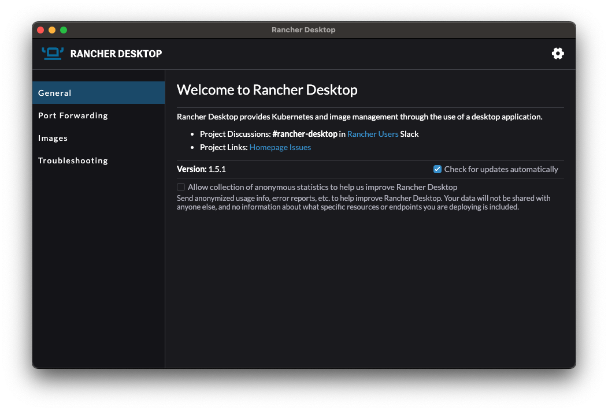

# Appendix I: Installing Rancher Desktop and the F´ ARM Container

Some users may with to run cross-compilers within docker to minimize the impact of those tools on their systems. Macintosh users will be required to use docker as the ARM/Linux cross-compilers are not available natively for macOS and simple virtualization of a Linux box is no longer practical since the introduction of M1 and M2 hardware.

## Rancher Desktop Setup

Rancher Desktop is an alternative to Docker Desktop that allows users to run docker containers directly on their desktop  computer. It does not require a license for use like Docker Desktop does and also supports both intel and ARM based  Macintosh computers.

> Non-Macintosh users are advised to run without the below Docker container

To install [Rancher Desktop](https://rancherdesktop.io/), follow the instructions for your operating system. When presented with a "Welcome to Rancher Desktop" dialog, choose the following settings:
1. Disable Kubernetes
2. Select `dockerd`
3. Configure PATH Automatic


Ensure that Rancher Desktop is running and that the VM it uses has been started. You can confirm this by ensuring no pop-ups nor progress bars are visible in Rancher Desktop's main window as shown below.



Once this is done, users can install the container by running the following command in their host terminal. It should  complete without errors.

```bash
docker pull nasafprime/fprime-arm:latest
```

## Running The Container

In order to run the commands provided by the docker container (i.e. the cross-compilers), users must start the container and attach to a terminal inside. This should be done **after** the user has created a project to work within.

To run this container, users may wish to download [this script](https://github.com/fprime-community/fprime-workshop-led-blinker/blob/main/bin/macos-docker) to a `bin` directory in the root of their project. This will start the docker container with appropriate settings. 

Alternatively, the user may run the following command to start the terminal
```bash 
docker run --platform=linux/amd64 --net host -e USER=$USER -u "`id -u`:`id -g`" -v "/path/to/project:/project" -it \
    docker pull nasafprime/fprime-arm:latest
```

> Anytime Macintosh users run cross-compilation commands, they **must** do so in a terminal inside the docker container.

[Return to Macintosh tutorial.](./MacOS.md)