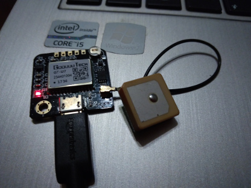
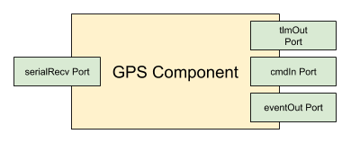
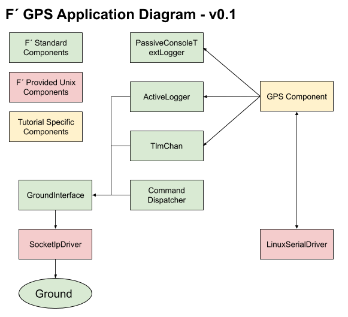
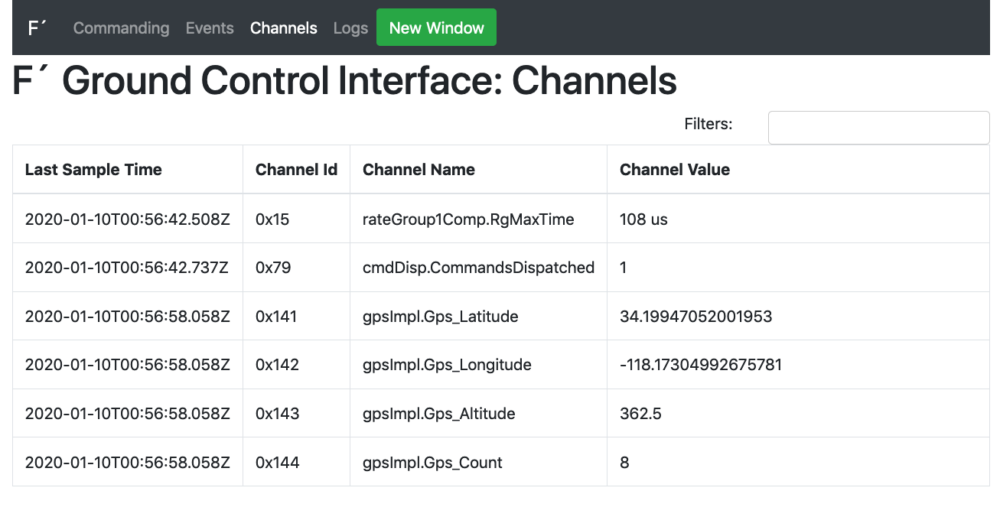
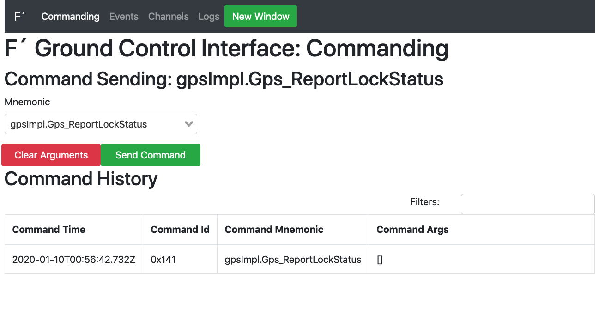
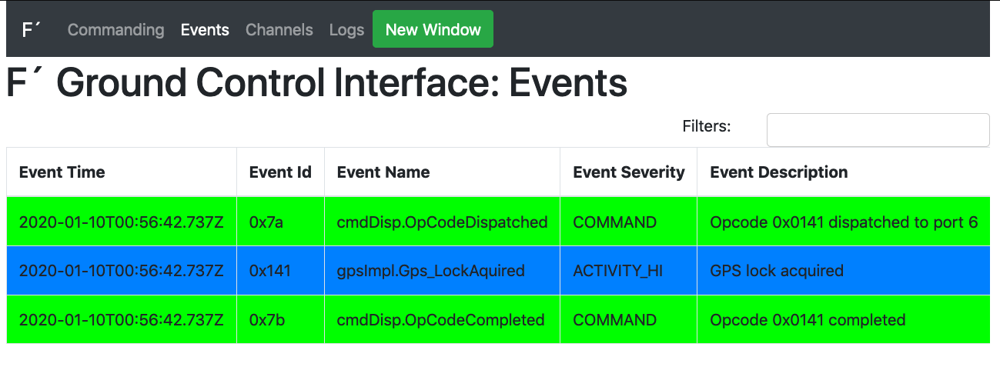

# F´ GPS Tutorial

**WARNING:** This tutorial is under revision for use with F´ 2.0.0.

In this guide, we will cover the basics of working with F´ by attaching a GPS receiver to a serial driver and running
the application on a Raspberry PI. In order to fully benefit from this tutorial, the user should acquire any NMEA-compatible UART GPS receiver and a raspberry pi.  In this tutorial, we use a NMEA GPS receiver with micro-USB such that
the code may be run on both the laptop and the Raspberry PI.

In the DIY electronics community there is an abundance of cheap GPS receivers based around the NMEA protocol. These
receivers may support a USB interface pretending to be an ACM device for basic serial communication. The messages these
receivers send are NMEA formatted ASCII text.



This tutorial will show how to integrate one of these GPS receivers with the F´ framework by wrapping it in a Component
and defining commands, telemetry, and log events. We will create a GpsApp deployment for the Component where it will
be wired to a standard UART driver in order to receive messages. Then we can cross-compile it for the Raspberry PI and
run the application against the F´ ground system.

**Note:** A completed version of this tutorial app is available [here](https://github.com/fprime-community/gps-tutorial)
for use as a demo or to help debug issues that come up when going through the tutorial.

## Prerequisites

This tutorial assumes the user has gone through and understood [Getting Started Tutorial](../GettingStarted/Tutorial.md)
and [MathComponent Tutorial](../MathComponent/Tutorial.md)

This tutorial requires the user to have some basic software skills and have installed F´. The prerequisite skills to
understand this tutorial are as follows:

1. Working knowledge of Unix; how to navigate in a shell and execute programs
2. An understanding of C++, including class declarations and inheritance
3. An understanding of how XML is structured
4. An understanding of the raspberry pi, specifically SSHing into the pi and running applications

Installation can be done by following the installation guide found at: [INSTALL.md](../../INSTALL.md). This guide
will walk the user through the installation process and verify the installation. In addition, users may wish to
follow the [Getting Started Tutorial](../GettingStarted/Tutorial.md) in order to get a feel for the F´ environment and
tools.

## Creating a Custom F´ Component

In this next section, we will create a custom F´ component for reading GPS data off a UART-based GPS module. It will
receive data from a UART read port, process the data, and report telemetry from that data. We will then finish up by
adding an event to report GPS lock status when it changes and a command to report lock status on demand.

Our custom component has the following functional block diagram:



**Note:** There are a few other ports our component will need to wire to other components in the system, the above
diagram captures the ports needed for our desired functionality.

### Designing the GPS Component

The F’ designs are specified by XML files that are processed by code generators to create C++ source and header files.
An XML file represents a single entity in the F´ system (Component, Port, Serializable, or Deployment). Command, Event,
and Telemetry Channel specifications are also written in XML.  Further information is in the full F´ user guide.
[User Guide](../../UsersGuide/FprimeUserGuide.pdf). This application does not need any custom ports, as we are using the
standard ports to create our GPS handler. Custom ports can be seen in the [Math Component Tutorial](../MathComponent/Tutorial.md).

In this section, we will create a directory for our GPS component, and design the component through XML. The first step in making the component is to make a project directory to hold our project, and a component subdirectory for our GPS.

```shell
cd fprime
mkdir -p GpsApp/Gps
cd GpsApp/Gps
```
All files in this component section will be created in the `Gps` subdirectory.

Next, in the GPS subdirectory, we will create a file called *GpsComponentAi.xml* filled with the below text. This
represents our component's design by defining the ports it uses to connect with other components and the files used to
specify commands, telemetry, and events. As can be seen, we are creating our component with 8 ports, the 4 functional
ports defined above, and 4 additional ports described below:

1. **cmdIn**: an input port of *Fw::Cmd* type used to process commands sent to this component.
2. **cmdRegOut**: an output port of *Fw::CmdReg* type used to register this component with the command dispatcher
3. **cmdResponseOut**: an output port of *Fw::CmdResponse* type used respond to dispatched commands
4. **eventOut**: an output port of *Fw::Log* type used to send events out
5. **textEventOut**: an output port of *Fw::LogText* type used to send events in a text form
6. **tlmOut**: an output port of *Fw::Tlm* type used to send out telemetry channels
7. **serialRecv**: an input port of type *Drv::SerialRead* used to receive serial data buffers,
8. **serialBufferOut**: an output port of type *Fw::BufferSend* used at startup to supply buffers to the serial driver

Input ports are invoked from external components, and must be handled by the component. Output ports are used by this
component to invoke actions of other components. Here **cmdIn** and **serialRecv** are inputs for commands and serial
data respectively. Each will define a handler (seen later) to handle these invocations.  All other ports are used to
invoke other components to send data buffers, events, telemetry, etc.

The `GpsComponentAi.xml` file in the `Gps` subdirectory should look like:
```xml
<?xml version="1.0" encoding="UTF-8"?>
<!-- GPS Tutorial: GpsComponentAi.xml

This is the design of GPS component. The goal is to read GPS messages from a UART port, and produce Events and
Telemetry that represents the GPS link. This will also have a command to emit the lock status of the GPS signal. This
is an active component, meaning it will have its own thread. It will therefore process messages at its own pace, and
will not need an external thread of execution to run on.

It has 3 standard command ports, 2 standard event ports, 1 standard telemetry port, and 2 ports to interact with the
serial driver.
-->

<component name="Gps" kind="active" namespace="GpsApp" modeler="true">
    <!-- Import command ports -->
    <import_port_type>Fw/Cmd/CmdPortAi.xml</import_port_type>
    <import_port_type>Fw/Cmd/CmdRegPortAi.xml</import_port_type>
    <import_port_type>Fw/Cmd/CmdResponsePortAi.xml</import_port_type>
    <!-- Import event ports -->
    <import_port_type>Fw/Log/LogPortAi.xml</import_port_type>
    <import_port_type>Fw/Log/LogTextPortAi.xml</import_port_type>
    <!-- Import telemetry ports -->
    <import_port_type>Fw/Tlm/TlmPortAi.xml</import_port_type>
    <!-- Import ports for serial driver -->
    <import_port_type>Drv/SerialDriverPorts/SerialReadPortAi.xml</import_port_type>
    <import_port_type>Fw/Buffer/BufferSendPortAi.xml</import_port_type>
    <!-- Import command, telemetry, and event dictionaries -->
    <import_dictionary>GpsApp/Gps/Commands.xml</import_dictionary>
    <import_dictionary>GpsApp/Gps/Telemetry.xml</import_dictionary>
    <import_dictionary>GpsApp/Gps/Events.xml</import_dictionary>

    <ports>
        <!-- Command port definitions: command input receives commands, command reg out, and response out are
        ports used to register with the command dispatcher, and return responses to it -->
        <port name="cmdIn" data_type="Fw::Cmd"  kind="input" role="Cmd"    max_number="1">
        </port>
        <port name="cmdRegOut" data_type="Fw::CmdReg" kind="output" role="CmdRegistration" max_number="1">
        </port>
        <port name="cmdResponseOut" data_type="Fw::CmdResponse" kind="output" role="CmdResponse" max_number="1">
        </port>
        <!-- Event ports: send events, and text formatted events -->
        <port name="eventOut" data_type="Fw::Log"  kind="output" role="LogEvent"  max_number="1">
        </port>
        <port name="textEventOut" data_type="Fw::LogText" kind="output" role="LogTextEvent" max_number="1">
        </port>
        <!-- Telemetry ports -->
        <port name="tlmOut" data_type="Fw::Tlm"  kind="output" role="Telemetry" max_number="1">
        </port>
        <!-- Serial ports: one to receive serial data, and one to provide buffers for the serial driver to use -->
        <port name="serialRecv" data_type="Drv::SerialRead"  kind="async_input" max_number="1">
        </port>
        <port name="serialBufferOut" data_type="Fw::BufferSend"  kind="output"  max_number="1">
        </port>
    </ports>
</component>
```
This file first imports all *Ai.xml files needed for each port type, imports our command, telemetry channel, and event
definition XMLs, and then defines all ports as we saw described above. There are several things to note:

1. The GPS component is an *active* component, which has a thread of its own to execute on. This was chosen as the GPS
component has no real-time deadlines and is expected to run in parallel with other components in the system.
2. *async_input* is used for the input port from the serial driver. The handler should be run on the *active*
component's thread, as opposed to the invoking component's thread.

*active* components with *async_input* ports are a fairly common initial design for components. They are typically used
unless the system has no thread scheduler, there are firm real-time deadlines, or other off-nominal requirements must be
met. Port and component types are described in more detail in the aforementioned User Guide.

Instantiating the GPS component, and connecting it with other components in the system is done at the system level,
enabling the individual components to be reused in different applications. We will see this step later after we design
our Commands, Events, and Telemetry. We will also implement the C++ code as well.

### Creating Commands.xml, Events.xml, and Telemetry.xml Dictionaries

These three XML dictionaries define the structure of commands, events, and telemetry that our component uses. This will
allow the autocoder to automatically generate the needed code to process commands, and emit events and telemetry. This
allows the developer to concentrate on the specific code for the component as opposed to hand coding the structure of
these entities.

First, we will create a command dictionary. The purpose of our command is to report the lock status of the GPS unit. This
command will trigger code to emit an event, which will report if the GPS has "locked" status or not. `Commands.xml` in
the `Gps` subdirectory should look like the following:
```xml
<?xml version="1.0" encoding="UTF-8"?>
<!-- GPS Tutorial: GpsApp/Gps/Commands.xml

This defines a single command to report the lock status of the GPS. This demonstrates a simple command that is useful
when working with GPS to determine if the data should be trusted.
-->
<commands>
    <!-- Define a single command that runs asynchronously on the component's own thread. The opcode "0" is relative to
    the GPS component's command space.  The mnemonic is the string a user will use to refer to this command. -->
    <command kind="async" opcode="0" mnemonic="Gps_ReportLockStatus" >
        <comment>A command to force an EVR reporting lock status.</comment>
    </command>
</commands>
```
There are several notes to consider:

1. We use an *async*s command for the same reason as we use *async_input* ports above.
2. Each component defines its own set of opcodes indexed from 0. The autocoder will prevent collisions between
components by adding a prefix to the component's final opcode.
3. Users typically refer to the component's mnemonic and the opcode is typically internal to the F´ system.

Next we will create an Events.xml dictionary that setup the events our component can emit. In this case we have two
events, GPS locked and GPS lock lost. The `Events.xml` file in the `Gps` subdirectory should look like:

```xml
<?xml version="1.0" encoding="UTF-8"?>
<!-- GPS Tutorial: GpsApp/Gps/Events.xml

This defines two events, one at activity hi level to report that lock has been acquired, and one at warning hi level to
indicate lock lost.
-->
<events>
    <event id="0" name="Gps_LockAcquired" severity="ACTIVITY_HI" format_string="GPS lock acquired">
        <comment>A notification on GPS lock acquired</comment>
    </event>
    <event id="1" name="Gps_LockLost" severity="WARNING_HI" format_string="GPS lock lost">
        <comment>A warning on GPS lock lost</comment>
    </event>
</events>
```
Here it should be noted that:
1. *id*s are indexed per-component, like opcodes
2. Typically users refer to names of telemetry channels
3. Format strings are not downlinked, but stored for display purposes

Finally, we should create a Telemetry.xml dictionary. It will specify that we will downlink GPS latitude, GPS longitude,
GPS altitude, GPS time, and the current number of satellites visible to the GPS unit. These are all standard fields emitted
GPS units and are the heart of our application. Our `Telemetry.xml` file in the `Gps` subdirectory should look like:

```xml
<?xml version="1.0" encoding="UTF-8"?>
<!-- GPS Tutorial: GpsApp/Gps/Telemetry.xml

This defines four telemetry channels to report basic GPS information.
-->
<telemetry>
    <channel id="0" name="Gps_Latitude" data_type="F32" abbrev="GPS-0000">
        <comment>The current latitude</comment>
    </channel>
    <channel id="1" name="Gps_Longitude" data_type="F32" abbrev="GPS-0001">
        <comment>The current longitude</comment>
    </channel>
    <channel id="2" name="Gps_Altitude" data_type="F32" abbrev="GPS-0002">
        <comment>The current altitude</comment>
    </channel>
    <channel id="3" name="Gps_Count" data_type="U32" abbrev="GPS-0003">
        <comment>The current number of satellites</comment>
    </channel>
</telemetry>
```
Some notes:
1. *id*s are indexed per component, like opcodes, and event ids
2. Typically users refer to names of telemetry channels, but a shorthand for display is the abbrev
3. Telemetry channels can be primitive types and serializable.  All of the GPS data could be reimplemented as a single
serializable channel.

At this stage, the design of the Gps component has been completed. Before we can implement the code, we need to integrate
the GPS component with the build system. This will be described next.

## Setting Up the Build System for Gps and GpsApp

Now it is time to create *CMakeList.txt* files for the GPS component and GpsApp deployment. This will allow us to run
our GPS component through the autocoder, and receive implementation templates in order to save time/effort.

First, in the `Gps` directory, create a module-specific *CMakeLists.txt* file. Since we have not created any C++ files,
our *CMakeLists.txt* will only contain the Ai.xml file we created. We'll add C++ files once we have created them.

The `CMakeLists.txt` created in the `Gps` directory should look like this:
```
####
# GPS Tutorial: GpsApp/Gps/CMakeLists.txt
#
# SOURCE_FILES: combined list of source and autocoding files
# MOD_DEPS: (optional) module dependencies
#
# This file will setup the build for the Gps component. This is done by defining the SOURCE_FILES variable and then
# registering the component as an F prime module. This allows autocoding and more!
####
set(SOURCE_FILES
	"${CMAKE_CURRENT_LIST_DIR}/GpsComponentAi.xml"
)
register_fprime_module()
```
All the user has to do for components, and ports is to specify a list of source files (including autocoder inputs) and
call `register_fprime_module()`. Next we will create an F´ deployment makefile. This links in the full F´ build system
and defines our deployment. This is needed to be able to build our Gps module. We do not yet need a full system design
(Topology), so we can perform this step now and build the Topology later.

First change to the `GpsApp` we created earlier. It should be the parent of the `Gps` subdirectory we are currently in.

```shell
cd ..
```

Now we will create the `CMakeLists.txt` file here with the following content:
```
####
# GPS Tutorial 'GpsApp' Deployment CMakeLists.txt: GpsApp/CMakeLists.txt
#
# This sets up the build for the 'GpsApp' Application, including the custom
# components. In addition, it imports FPrime.cmake, which includes the core F Prime
# components.
#
# This file has several sections.
#
# 1. Header Section: define basic properties of the build
# 2. F prime core: includes all F prime core components, and build-system properties
# 3. Local subdirectories: contains all deployment specific directory additions
####

##
# Section 1: Basic Project Setup
#
# This contains the basic project information. Specifically, a cmake version and project definition. It also defines our
# default paths to the F prime framework, and sets a default toolchain.
##
project(GpsApp C CXX)  # Should match the directory it is in
cmake_minimum_required(VERSION 3.5)
set(FPRIME_FRAMEWORK_PATH "${CMAKE_CURRENT_LIST_DIR}/.." CACHE PATH "Location of F prime framework" FORCE)
set(FPRIME_PROJECT_ROOT "${CMAKE_CURRENT_LIST_DIR}/.." CACHE PATH "Root path of F prime project" FORCE)

##
# Section 2: F prime Core
#
# This includes all of the F prime core components, and imports the make-system. F prime core
# components will be placed in the F-Prime binary subdirectory to keep them from
# colliding with deployment specific items.
##
include("${CMAKE_CURRENT_LIST_DIR}/../cmake/FPrime.cmake")
# NOTE: register custom targets between these two lines
include("${CMAKE_CURRENT_LIST_DIR}/../cmake/FPrime-Code.cmake")
# Note: when building a deployment outside of the F prime core directories, then the
# build root must be re-mapped for use with the standard build system components.
#
# In this way, the module names can be predicted as an offset from the (new) build
# root, without breaking the standard locations of F prime.
#
# Uncomment the following lines, and set them to the BUILD_ROOT of your deployment,
# which is typically one directory up from the CMakeLists.txt in the deployment dir.
#set(FPRIME_CURRENT_BUILD_ROOT "${CMAKE_CURRENT_LIST_DIR}/..")
#message(STATUS "F prime BUILD_ROOT currently set to: ${FPRIME_CURRENT_BUILD_ROOT}")

##
# Section 3: Components and Topology
#
# This section includes deployment specific directories. This allows use of non- core components in the topology,
# which is also added here.
##
# Add component subdirectories
add_fprime_subdirectory("${CMAKE_CURRENT_LIST_DIR}/Gps/")
```
Most of this file is boilerplate code and is commented to provide guidance. There are still several things to be aware
of:

1. `project(GpsApp C CXX)` sets up our project. The name "GpsApp" should be the same as our chosen directory.
2. `include("${CMAKE_CURRENT_LIST_DIR}/../cmake/FPrime.cmake")` includes all the CMake based build utilities for F´.
3. `include("${CMAKE_CURRENT_LIST_DIR}/../cmake/FPrime-Code.cmake")` includes all the F´ core code.
4. `add_fprime_subdirectory("${CMAKE_CURRENT_LIST_DIR}/Gps/")` adds in our custom component as it isn't F´ core code.

Next, the user may generate an F´ build in order to begin implementing and coding our module. This can be done with the
following commands run from the `GpsApp` directory:
```shell
fprime-util generate
```
This command should pass and we can then begin coding our module. If the command is not found, ensure that F´ has been
installed correctly, and, if using a virtual environment for Python, ensure this environment has been activated.

If the command reports errors, ensure the files match those above (or borrow the sample code from this Tutorial's
directory) and try again.

## Coding Our Module

Now it is time to code our module to read the GPS module and downlink the GPS telemetry. This is where the framework
will help us considerably. All these previous steps set us up to use the autocoding features of F´. We can generate the
basic implementation of the code by using the `fprime-util` *impl* command, which generates needed
*GpsComponentImpl.cpp-tmpl* and *GpsComponentImpl.hpp-tmpl* files. We can use these as the basis for our implementation.
In addition, the framework will also generate * *Ac.?pp* files, which handle the work of connecting ports allowing us
to write minimal code to support the component interface. First we generate code templates, and move them into place.
Since we don't already have implementations we can safely rename the template files without first checking for existing
files.

Change back to the `Gps` subdirectory and generate implementations with:
```shell
cd Gps
fprime-util impl
mv GpsComponentImpl.cpp-template GpsComponentImpl.cpp
mv GpsComponentImpl.hpp-template GpsComponentImpl.hpp
```
*Note:* If the developer regenerates the templates, care must be taken to not overwrite already implemented code by
copying the templates to the implementation files.

At this point, the user may open up the `GpsComponentImpl.cpp` file and the `GpsComponentImpl.hpp` file in order to see
what has been generated. The critical sections for our implementation are in `GpsComponentImpl.cpp` and are shown below:
```cpp
 51   // ----------------------------------------------------------------------
 52   // Handler implementations for user-defined typed input ports
 53   // ----------------------------------------------------------------------
 54
 55   void GpsComponentImpl ::
 56     serialRecv_handler(
 57         const NATIVE_INT_TYPE portNum,
 58         Fw::Buffer &serBuffer,
 59         Drv::SerialReadStatus &status
 60     )
 61   {
 62     // TODO
 63   }
 64
 65   // ----------------------------------------------------------------------
 66   // Command handler implementations
 67   // ----------------------------------------------------------------------
 68
 69   void GpsComponentImpl ::
 70     Gps_ReportLockStatus_cmdHandler(
 71         const FwOpcodeType opCode,
 72         const U32 cmdSeq
 73     )
 74   {
 75     // TODO
 76     this->cmdResponse_out(opCode,cmdSeq,Fw::CmdResponse::OK);
 77   }
```

### Implementation

In the generated implementations, we can see that we have two actions "TODO". First we will need to implement a
function called *serialRecv_handler* and the second is to implement a command handler for
*Gps_ReportLockStatus_cmdHandler*. The other functions of our code are provided as functions we can use when we
implement these two pieces. Those available functions are described below:

1. log_ACTIVITY_HI_Gps_LockAcquired: used to emit the event *Gps_Lock_acquired* as defined in Events.xml
2. log_WARNING_HI_Gps_LockLost: used to emit the event *Gps_LockLost* as defined in Events.xml
3. tlmWrite_Gps_Latitude: used to send down *Latitude* telemetry as defined in Telemetry.xml
4. tlmWrite_Gps_Longitude: used to send down *Longitude* telemetry as defined in Telemetry.xml
5. tlmWrite_Gps_Altitude: used to send down *Altitude* telemetry as defined in Telemetry.xml
6. tlmWrite_Gps_Count: used to send down *Count* telemetry as defined in Telemetry.xml
7. sendCommandResponse: used to respond to a sent command. Call this in the above cmdHandler.

In order to make a GPS processor that works well, we need to take the following steps:

0. Create a preamble function and send some buffers for the serial driver to use
1. Implement the serialRecv_handler function (called by the serial driver with one of the above buffers)
2. Break down the GPS message
3. Return the buffer to the serial driver
4. Downlink telemetry in serialRecv_handler
5. If lock is newly found, downlink a *LockAcquired* EVR
6. If lock is newly lost, downlink a *LockLost* EVR
7. Downlink a *LockAcquired* EVR in commandHandler, if lock is currently held
8. Downlink a *LockLost* EVR in commandHandler, if lock is not currently held
9. Respond to the commandHandler with a sendCommandResponse call

These steps are called out in the following implementations of these two files. Since the purpose of this tutorial
is not to demonstrate how to write each line of code, the steps above are called out in comments in the code.

### GpsApp/Gps/GpsComponentImpl.cpp (Sample)
```cpp
// ======================================================================
// \title  GpsComponentImpl.cpp
// \author lestarch
// \brief  cpp implementation of the F' sample GPS receiver for a
//         NMEA GPS receiver device.
//
// \copyright
// Copyright 2018, lestarch.
// ======================================================================

#include <GpsApp/Gps/GpsComponentImpl.hpp>
#include <FpConfig.hpp>
#include "Fw/Logger/Logger.hpp"

#include <cstring>

namespace GpsApp {

  // ----------------------------------------------------------------------
  // Construction, initialization, and destruction
  // ----------------------------------------------------------------------

  GpsComponentImpl ::
#if FW_OBJECT_NAMES == 1
    GpsComponentImpl(
        const char *const compName
    ) :
      GpsComponentBase(compName),
#else
      GpsComponentBase(),
#endif
      // Initialize the lock to "false"
      m_locked(false)
  {

  }

  void GpsComponentImpl ::
    init(
        const NATIVE_INT_TYPE queueDepth,
        const NATIVE_INT_TYPE instance
    )
  {
    GpsComponentBase::init(queueDepth, instance);
  }

  //Step 0: The linux serial driver keeps its storage externally. This means that we need to supply it some buffers to
  //        work with. This code will loop through our member variables holding the buffers and send them to the linux
  //        serial driver.  'preamble' is automatically called after the system is constructed, before the system runs
  //        at steady-state. This allows for initialization code that invokes working ports.
  void GpsComponentImpl :: preamble()
  {
      for (NATIVE_INT_TYPE buffer = 0; buffer < NUM_UART_BUFFERS; buffer++) {
          //Assign the raw data to the buffer. Make sure to include the side of the region assigned.
          this->m_recvBuffers[buffer].setData((U64)this->m_uartBuffers[buffer]);
          this->m_recvBuffers[buffer].setSize(UART_READ_BUFF_SIZE);
          // Invoke the port to send the buffer out.
          this->serialBufferOut_out(0, this->m_recvBuffers[buffer]);
      }
  }

  GpsComponentImpl ::
    ~GpsComponentImpl()
  {

  }

  // ----------------------------------------------------------------------
  // Handler implementations for user-defined typed input ports
  // ----------------------------------------------------------------------

  // Step 1: serialIn
  //
  // By implementing this "handler" we can respond to the serial device sending us data buffers containing the GPS
  // data. This handles our serial messages. It should perform the actions we expect from the design phases.
  void GpsComponentImpl ::
    serialRecv_handler(
        const NATIVE_INT_TYPE portNum, /*!< The port number*/
        Fw::Buffer &serBuffer, /*!< Buffer containing data*/
        Drv::SerialReadStatus &serial_status /*!< Status of read*/
    )
  {
      // Local variable definitions
      int status = 0;
      float lat = 0.0f, lon = 0.0f;
      GpsPacket packet;
      // Grab the size (used amount of the buffer) and a pointer to the data in the buffer
      U32 buffsize = static_cast<U32>(serBuffer.getSize());
      char* pointer = reinterpret_cast<char*>(serBuffer.getData());
      // Check for invalid read status, log an error, return buffer and abort if there is a problem
      if (serial_status != Drv::SER_OK) {
          Fw::Logger::logMsg("[WARNING] Received buffer with bad packet: %d\n", serial_status);
          // We MUST return the buffer or the serial driver won't be able to reuse it. The same buffer send call is used
          // as we did in "preamble".  Since the buffer's size was overwritten to hold the actual data size, we need to
          // reset it to the full data block size before returning it.
          serBuffer.setsize(UART_READ_BUFF_SIZE);
          this->serialBufferOut_out(0, serBuffer);
          return;
      }
      // If not enough data is available for a full message, return the buffer and abort.
      else if (buffsize < 24) {
          // We MUST return the buffer or the serial driver won't be able to reuse it. The same buffer send call is used
          // as we did in "preamble".  Since the buffer's size was overwritten to hold the actual data size, we need to
          // reset it to the full data block size before returning it.
          serBuffer.setsize(UART_READ_BUFF_SIZE);
          this->serialBufferOut_out(0, serBuffer);
          return;
      }
      //Step 2:
      //  Parse the GPS message from the UART (looking for $GPGGA messages). This uses standard C functions to read all
      //  the defined protocol messages into our GPS package struct. If all 9 items are parsed, we break. Otherwise we
      //  continue to scan the block of data looking for messages further in.
      for (U32 i = 0; i < (buffsize - 24); i++) {
          status = sscanf(pointer, "$GPGGA,%f,%f,%c,%f,%c,%u,%u,%f,%f",
              &packet.utcTime, &packet.dmNS, &packet.northSouth,
              &packet.dmEW, &packet.eastWest, &packet.lock,
              &packet.count, &packet.filler, &packet.altitude);
          //Break when all GPS items are found
          if (status == 9) {
              break;
          }
          pointer = pointer + 1;
      }
      //If we failed to find the GPGGA then return the buffer and abort.
      if (status == 0) {
          // We MUST return the buffer or the serial driver won't be able to reuse it. The same buffer send call is used
          // as we did in "preamble".  Since the buffer's size was overwritten to hold the actual data size, we need to
          // reset it to the full data block size before returning it.
          serBuffer.setsize(UART_READ_BUFF_SIZE);
          this->serialBufferOut_out(0, serBuffer);
          return;
      }
      // If we found some of the message but not all of the message, then log an error, return the buffer and exit.
      else if (status != 9) {
          Fw::Logger::logMsg("[ERROR] GPS parsing failed: %d\n", status);
          // We MUST return the buffer or the serial driver won't be able to reuse it. The same buffer send call is used
          // as we did in "preamble".  Since the buffer's size was overwritten to hold the actual data size, we need to
          // reset it to the full data block size before returning it.
          serBuffer.setsize(UART_READ_BUFF_SIZE);
          this->serialBufferOut_out(0, serBuffer);
          return;
      }
      //GPS packet locations are of the form: ddmm.mmmm
      //We will convert to lat/lon in degrees only before downlinking
      //Latitude degrees, add on minutes (converted to degrees), multiply by direction
      lat = (U32)(packet.dmNS/100.0f);
      lat = lat + (packet.dmNS - (lat * 100.0f))/60.0f;
      lat = lat * ((packet.northSouth == 'N') ? 1 : -1);
      //Longitude degrees, add on minutes (converted to degrees), multiply by direction
      lon = (U32)(packet.dmEW/100.0f);
      lon = lon + (packet.dmEW - (lon * 100.0f))/60.f;
      lon = lon * ((packet.eastWest == 'E') ? 1 : -1);
      //Step 4: call the downlink functions to send down data
      tlmWrite_Gps_Latitude(lat);
      tlmWrite_Gps_Longitude(lon);
      tlmWrite_Gps_Altitude(packet.altitude);
      tlmWrite_Gps_Count(packet.count);
      //Lock status update only if changed
      //Step 5,6: note changed lock status
      // Emit an event if the lock has been acquired, or lost
      if (packet.lock == 0 && m_locked) {
          m_locked = false;
          log_WARNING_HI_Gps_LockLost();
      } else if (packet.lock == 1 && !m_locked) {
          m_locked = true;
          log_ACTIVITY_HI_Gps_LockAcquired();
      }
      // We MUST return the buffer or the serial driver won't be able to reuse it. The same buffer send call is used
      // as we did in "preamble".  Since the buffer's size was overwritten to hold the actual data size, we need to
      // reset it to the full data block size before returning it.
      serBuffer.setsize(UART_READ_BUFF_SIZE);
      this->serialBufferOut_out(0, serBuffer);
  }

  // ----------------------------------------------------------------------
  // Command handler implementations
  // ----------------------------------------------------------------------
  //Step 7,8: respond to a command to report lock status.
  //
  // When a status command is received, respond by emitting the
  // current lock status as an Event.
  void GpsComponentImpl ::
    Gps_ReportLockStatus_cmdHandler(
        const FwOpcodeType opCode,
        const U32 cmdSeq
    )
  {
    //Locked-force print
    if (m_locked) {
        log_ACTIVITY_HI_Gps_LockAcquired();
    } else {
        log_WARNING_HI_Gps_LockLost();
    }
    //Step 9: complete command
    this->cmdResponse_out(opCode, cmdSeq, Fw::CmdResponse::OK);
  }
} // end namespace GpsApp

```
### GpsApp/Gps/GpsComponentImpl.hpp (Sample)
```hpp
// ======================================================================
// \title  GpsComponentImpl.hpp
// \author lemstarch
// \brief  hpp header file for the sample F' GPS component, based on a
//         NMEA GPS receiver.
//
// \copyright
// Copyright 2018, lestarch
// ======================================================================

#ifndef GpsComponentImpl_HPP
#define GpsComponentImpl_HPP

#include "GpsApp/Gps/GpsComponentAc.hpp"

// Need to define the memory footprint of our buffers. This means defining a count of buffers, and how big each is. In
// this example, we will allow the Gps component to manage its own buffers.
#define NUM_UART_BUFFERS 20
#define UART_READ_BUFF_SIZE 1024

namespace GpsApp {

  class GpsComponentImpl :
    public GpsComponentBase
  {
      /**
       * GpsPacket:
       *   A structure containing the information in the GPS location packet
       * received via the NMEA GPS receiver.
       */
      struct GpsPacket {
          float utcTime;
          float dmNS;
          char northSouth;
          float dmEW;
          char eastWest;
          unsigned int lock;
          unsigned int count;
          float filler;
          float altitude;
      };
    public:

      // ----------------------------------------------------------------------
      // Construction, initialization, and destruction
      // ----------------------------------------------------------------------

      //! Construct object Gps
      //!
      GpsComponentImpl(
#if FW_OBJECT_NAMES == 1
          const char *const compName /*!< The component name*/
#else
          void
#endif
      );

      //! Initialize object Gps
      //!
      void init(
          const NATIVE_INT_TYPE queueDepth, /*!< The queue depth*/
          const NATIVE_INT_TYPE instance = 0 /*!< The instance number*/
      );

      //! Preamble
      //!
      void preamble();

      //! Destroy object Gps
      //!
      ~GpsComponentImpl();

    PRIVATE:
      // ----------------------------------------------------------------------
      // Handler implementations for user-defined typed input ports
      // ----------------------------------------------------------------------

      //! Handler implementation for serialRecv
      //!
      void serialRecv_handler(
          const NATIVE_INT_TYPE portNum, /*!< The port number*/
          Fw::Buffer &serBuffer, /*!< Buffer containing data*/
          Drv::SerialReadStatus &serial_status /*!< Status of read*/
      );

    PRIVATE:

      // ----------------------------------------------------------------------
      // Command handler implementations
      // ----------------------------------------------------------------------

      //! Implementation for Gps_ReportLockStatus command handler
      //! A command to force an EVR reporting lock status.
      void Gps_ReportLockStatus_cmdHandler(
          const FwOpcodeType opCode, /*!< The opcode*/
          const U32 cmdSeq /*!< The command sequence number*/
      );
      //!< Has the device acquired GPS lock?
      bool m_locked;
      //!< Create member variables to store buffers and the data array that those buffers use for storage
      Fw::Buffer m_recvBuffers[NUM_UART_BUFFERS];
      BYTE m_uartBuffers[NUM_UART_BUFFERS][UART_READ_BUFF_SIZE];
    };

} // end namespace GpsApp

#endif

```

Next, we need to add (or uncomment) our .cpp and .hpp to the `CMakeLists.txt` in the `GpsApp/Gps` subdirectory.  The
final version will look like this:

### GpsApp/Gps/CMakeListst.txt (final)
```
####
# GPS Tutorial: GpsApp/Gps/CMakeLists.txt
#
# SOURCE_FILES: combined list of source and autocoding files
# MOD_DEPS: (optional) module dependencies
#
# This file will setup the build for the Gps component. This is done by defining the SOURCE_FILES variable and then
# registering the component as an F prime module. This allows autocoding and more!
####
set(SOURCE_FILES
	"${CMAKE_CURRENT_LIST_DIR}/GpsComponentAi.xml"
	"${CMAKE_CURRENT_LIST_DIR}/GpsComponentImpl.cpp"
)
register_fprime_module()

```

Finally, run the F´ utility to build this component using `fprime-util build`. This will regenerate the CMake build
file, which we made with the `fprime-util generate` command earlier. This should pass and the code should be ready.
We'll then integrate it into a new topology.

```shell
fprime-util build
```

We are now ready to make a Topology for this application, and test it!

## Topology

We are finally ready to build our topology to connect the GPS module up to the standard F´ components. Then we can see
if this design works by cross-compiling and running it on the RPI. We'll be modifying the existing `Ref` topology in
order more quickly create one of our own. A more useful system diagram is shown below.



There are many components that will come "for free" by copying the Reference application. However, the key components
that represent our application's flow are shown in the diagram. We to make sure that all 8 of our ports for the Gps
component have been hooked-up. This involves two major steps:

1. Instantiate `LinuxSerialDriver` and `Gps` components
2. Add new port connections to wire up the `Gps` and `LinuxSerialDriver`

We'll work through these steps below.

### Clone the Ref Application

First, the Reference application's topology is copied into the *Top* folder of *GpsApp* application and we'll grab. We
do this as a convenience to save time during this tutorial. It is easier and faster to start with the Reference
application's files and modify them to construct our topology.

From the `GpsApp` directory run the following:
```shell
cp -r ../Ref/Top ./Top
rm ./Top/RefTopologyAppDictionary.xml ./Top/RefTopologyAppAi_IDTableLog.txt ./Top/RefTopologyAppID.csv
```
**Note:** Do not worry if the removed files do not exist, the remove is there to clean up files generated during a build.

### Update the GpsApp CmakeLists.txt

Now that we have a topology, we'll go ahead and update the `CMakeLists.txt` file in the `GpsApp` folder. This will
nearly complete the modifications we need for this file. You may choose later to make the `raspberrypi` toolchain to be
default once we start cross-compiling. We do this by adding a single line to include the `Top` directory at the very end
of the file.

Make sure the `CMakeLists.txt` in the `GpsApp` directory has the following line added to the end:
```
add_fprime_subdirectory("${CMAKE_CURRENT_LIST_DIR}/Top/")
```

### Build the Topology Sources

A topology consists of several files that instantiate the components in C++, construct and initialize the system, and
represent the "main function" or entry point into the code. These files are shown below:

1. **GpsTopologyAppAi.xml**: the design file showing the list of components, and the connections between components.
This file is based on RefTopologyAppAi.xml from the reference application with new ports added. GpsTopologyAppAi.xml
should replace RefTopologyAppAi.xml.
2. **Components.hpp**: the header file declaring in code the same components as listed in the topology ai XML, along
with includes of the headers that define them.
3. **Topology.cpp**: top level code and initialization of the components, threads, and registration of commands.
4. **Main.cpp**: entry point to the code.

Essentially, GpsTopologyAppAi.xml is the design, Components.hpp is the definitions, and Topology.cpp is the system
initialization code. All of these files are referenced by the CMake files we inherited from the reference app. Building
the distribution (fprime/GpsApp) will include the topology (GpsApp/Top) as its entry-point creating a single binary,
which represents our software.

Sample versions of these files are provided below and are annotated with comments representing the changes
made to support the Gps Application. **Note:** These files are available in a working repository at:
[https://github.com/LeStarch/fprime/tree/gps-application](https://github.com/LeStarch/fprime/tree/gps-application)
in case the user prefers a direct checkout of working code.  The files are linked below:

1. [Top/GpsAppTopologyAi.xml](GpsApp/Top/GpsAppTopologyAppAi.xml)
2. [Top/Components.hpp](GpsApp/Top/Components.hpp)
3. [Top/Topology.cpp](GpsApp/Top/Topology.cpp)
4. [Top/Main.cpp](GpsApp/Top/Main.cpp)


We will also need to update the `CMakeLists.txt` in the `Top` directory to change the name of "RefTopologyAppAi.xml" to
"GpsTopologyAppAi.xml".

Once these files have been added to the *GpsApp/Top* folder, we have a complete project. The project can be built
by changing the directory to the deployment directory, issuing our build commands, and then running the executable.

## Running the Executable On the Native Host with the Ground System

We'll start by removing the old build generation. By adding the top folder, this will remove any issues with the build.
Then we can build, and run it right on the local machine. If the user has a USB-based GPS receiver, the code should work.

In the `GpsApp` directory, build the code.
```shell
cd GpsApp
fprime-util purge
fprime-util generate
fprime-util build
```

Now run the ground system in one terminal and the Gps app in the other. Here we inform the ground system that we will
run the application independently.
```shell
# In GpsApp directory
fprime-gds -d . -n
```

Run the application binary. **Note:** We are currently compiling for the native OS. Linux is assumed and so is the path
to the USB GPS device. If the device doesn't exist, the system will run but log an error opening it.

```shell
cd fprime/GpsApp
# For "Linux":
./bin/Linux/GpsApp -a 127.0.0.1 -p 50000 -d /dev/ttyACM0
# For "macOS":
./bin/Darwin/GpsApp -a 127.0.0.1 -p 50000 -d /dev/ttyACM0
```

If you see output similar to the following, when running with the USB GPS you have successfully, completed the
development of our tutorial. We'll discuss how to cross compile for the Raspberry PI and run on the Raspberry pi next.

Once the ground system loads in the user's browser, the user can start seeing what the software is doing. If it doesn't
load, then the user should go navigate to: https://localhost:5000.

First, click on the "Channels" tab at the top. The user should at least see the "rateGroup1Comp.RgMaxTime" channel. If
the GPS is working and has lock, then the user should see the GPS channels as well. This is seen below.  Later we will
discuss what to do if this did not show up.



Next, the user should navigate to the "Commanding" tab and select "gpsImpl.Gps_ReportLockStatus" from the dropdown.
The user may start to type in the dropdown to subset the list. Press the green "Send" button and the command should be
sent as seen below.



Finally, the user can check the "Events" tab at the top to see the lock status as we asked it to be reported.



To exit the ground system, CTRL-C the terminal process.


If the above code did not work, the user should check the following:

1. Issue the `cmdDisp.CMD_NO_OP` command from the "Commanding" tab and check the "Events" tab. The user should expect to
see NO_OP events, proving the executable is working and the data flow is working. If this does not work, then rerun the
ground system and binary. Ensure no errors have been reported.  Check the "Logs" tab for logs in the system and ensure
there are no errors there. Make sure port 50000 is free, and that no other ground systems are running.

2. Assuming the user has working `cmdDisp.CMD_NO_OP`, the code is running. Thus the users should rerun the
"gpsImpl.Gps_ReportLockStatus" command. If the lock status is not acquired, then the user will not see GPS channels.
Sometimes the ground connection is not fast enough to see the startup events and channels, so the ground system is blank
until an event happens, like the one from `cmdDisp.CMD_NO_OP`.

Again, ensure the ground system and running binary have been stopped with the CTRL-C to kill the process.

## Cross Compiling for the Raspberry PI

Once we have the code building for Linux, it is time to engage the raspberry pi cross compilation tools in order to
build a binary that will run on the Raspberry PI. We'll be working with code for the Raspberry PI 3, but it should work
on the RPI 2 as well.

### Cross Compiling Explicitly

The first step is to follow the installation of the tools for the RPI cross compile as documented here:
[RPI Deployment README.md](../../../RPI/README.md).

In order to cross-compile for a specific architecture, the user needs to generate a new build directory using a
toolchain file for that architecture. F´ includes a toolchain for the raspberry PI, assuming the tools are installed in
the manner described in the above readme.  This toolchain is called "raspberrypi". The build can be generated by running
the following commands in the `GpsApp` directory:

```shell
fprime-util generate raspberrypi
fprime-util build raspberrypi
```

This will generate the binary at `GpsApp/bin/arm-linux-gnueabihf/GpsApp`. The user then may run the ground system as
before. Ensure that the system and network firewall allow through port 50000 from the PI to the host, and then run:

```shell
fprime-gds -n
```

Assuming there is no firewall or other network limits between the PI and the host, the user can run the following from a
separate terminal:

```shell
cd fprime/GpsApp
scp build-artifacts/arm-linux-gnueabihf/bin/GpsApp pi@<raspberry pi IP>
ssh pi@<raspberry pi IP>
./GpsApp -a <ground system IP> -p 50000 -d <serial port, /dev/ttyACM0 for USB>
```

Now the PI should be powered up and running the embedded Linux binary, and our host system should be running the ground
system. If the code work when running natively, and isn't connecting for this example the cause it likely a firewall
issue. Again make sure port 50000 is exposed to the PI, and that the pi can ping the ground system machine.

### Setting the Cross Compile Build as Default

As we saw above, cross compile builds can be done explicitly by setting the toolchain. However, some users may wish to
make this the default, and need not specify it.

Adding the following line the deployment's [settings.ini file](../../UsersGuide/user/settings.md) will cause F´
to use the raspberry pi toolchain by default:

```ini
[fprime]
... other options in file ...
default_toolchain: raspberrypi
```

Now the "raspberrypi" build can be created with a call to `fprime-util generate` and the original native build can be
made by explicitly setting the native toolchain: `fprime-util generate native`.

```
# Raspberry PI by default
fprime-util generate
fprime-util build

# Native builds now explicit
fprime-util generate native
fprime-util build native
```

## Conclusion

The GPS tutorial has shown us how to do cross-compiling, and running on an embedded Linux system. We have seen how to add components and wire them to existing drivers. We've seen how to run the ground system, and collect data!

The user is now directed back to the [Tutorials](../README.md) for future reading. More work with the Raspberry PI can
be found here: [RPI README.md](../../../RPI/README.md).