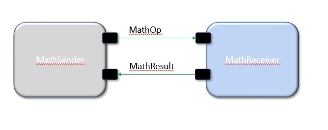

= Math Component Tutorial

== Introduction

This tutorial shows how to develop and test a simple topology
consisting of two components:

. `MathSender`: A component that receives commands and forwards work to `MathReceiver`.
. `MathReceiver`: A component that carries out arithmetic operations and returns the results
to `MathSender`.

See the diagram below.

.A simple topology for arithmetic computation

*What is covered:* The tutorial covers the following concepts:

. Using the https://fprime-community.github.io/fpp[FPP modeling language]
and the F Prime CMake build system to specify the types and ports used by the components.
. Using FPP and CMake to specify the components.
. Completing the C++ component implementations.
. Writing component unit tests.
. Adding the new components and connections to the topology for the F Prime
`Ref` application.
. Using the F Prime Ground Data System (GDS) to run the updated `Ref`
application.

*Prerequisites:* This tutorial assumes the following:

. Basic knowledge of Unix: how to navigate in a shell and execute programs.
. Basic knowledge of git: How to create a branch.
. Basic knowledge of {cpp}, including class declarations and inheritance.

If you have not yet installed F Prime on your system, do so now.
Follow the installation guide at `INSTALL.md`
in the https://github.com/nasa/fprime[F Prime git repository].
You may also wish to work through the Getting Started tutorial at
`docs/GettingStarted/Tutorial.md`.

*Git branch:* This tutorial is designed to work on the branch `release/v3.0.0`.

Working on this tutorial will modify some files under version control in the
F Prime git repository.
Therefore it is a good idea to do this work on a new branch.
For example:

[source,bash]
----
% git checkout release/v3.0.0
% git checkout -b math-tutorial
----

If you wish, you can save your work by committing to this branch.

== The MathOp Type

In F Prime, a *type* defines a kind of data that you can pass
between components or use in commands and telemetry.

For this tutorial, we need one type.
It is an enumeration type called `MathOp`.
It represents a mathematical operation.

We will add the specification for the `MathOp` type to the
`Ref` topology.
We will do this in three stages:

. Construct the FPP model.
. Add the model to the project.
. Build the model.

These steps are typical when adding a new type to
a project.
We discuss each of these steps in a subsection below.

=== Construct the FPP Model

*In directory Ref:*
Go to the directory `Ref` at the top-level of the
F Prime repository and run `mkdir MathTypes`.
This step creates a new directory `Ref/MathTypes`.
This directory will contain our new type.

*In directory Ref/MathTypes:*
Now go into the directory `Ref/MathTypes`.
Create a file `MathTypes.fpp` with the following contents:

[source,fpp]
----
module Ref {

  @ A math operation
  enum MathOp {
    ADD
    SUB
    MULT
    DIVIDE
  }

}
----

You can do this by typing, or by copy-paste.

This file defines an enumeration type or *enum*
with enumerated constants `ADD`, `SUB`, `MULT`, and `DIVIDE`.
These four constants represent the operations
of addition, subtraction, multiplication, and division.
For more information on enums, see
https://fprime-community.github.io/fpp/fpp-users-guide.html#Defining-Enums[_The FPP User's Guide_].

The enum `MathTypes` resides in an FPP module `Ref`.
An FPP module is like a {cpp} namespace: it encloses
several definitions, each of which is qualified with the
name of the module.
For more information on FPP modules, see
https://fprime-community.github.io/fpp/fpp-users-guide.html#Defining-Modules[_The FPP User's Guide_].

=== Add the Model to the Project

*In directory Ref/MathTypes:*
Create a file `Ref/MathTypes/CMakeLists.txt` with the following contents:

[source,cmake]
----
set(SOURCE_FILES
  "${CMAKE_CURRENT_LIST_DIR}/MathTypes.fpp"
)

register_fprime_module()
----

This file will tell the build system how to build the FPP model.

*In directory Ref:*
Now we need to add the new directory to the `Ref` project.
To do that, open the file `Ref/CMakeLists.txt`.
This file should already exist; it was put there by the developers
of the `Ref` topology.
In this file, you should see several lines starting with `add_fprime_subdirectory`.
Immediately after the last of those lines, add the following new line:

[source,cmake]
----
add_fprime_subdirectory("${CMAKE_CURRENT_LIST_DIR}/MathTypes/")
----

=== Build the Model

*In directory Ref/MathTypes:*
Do the following:

. Go to the directory `Ref/MathTypes`.
. If you have not already run `fprime-util generate`, then do so now.
. Run the command `fprime-util build`.

The output should indicate that the model built without any errors.
If not, see if you can identify and correct what is wrong,
either by deciphering the error output, or by going over the steps again.

*In directory Ref/build-fprime-automatic-native/Ref/MathTypes:*
Now go to the directory `Ref/build-fprime-automatic-native/Ref/MathTypes`
(you may want to use `pushd`, or do this in a separate shell).
The directory `build-fprime-automatic-native` is where all the
generated code lives for the "automatic native" build of the `Ref`
project.
Within that directory is a directory tree that mirrors the project
structure.
In particular, `Ref/build-fprime-automatic-native/Ref/MathTypes`
contains the generated code for `Ref/MathTypes`.

Run `ls`.
You should see something like this:

[source,bash]
----
CMakeFiles            MathOpEnumAc.cpp      MathOpEnumAi.xml.prev cmake_install.cmake
Makefile              MathOpEnumAc.hpp      autocoder
----

The files `MathOpEnumAc.hpp` and
`MathOpEnumAc.cpp` are the auto-generated {cpp} files
corresponding to the `MathOp` enum.
You may wish to study the file `MathOpEnumAc.hpp`.
This file gives the interface to the {cpp} class `Ref::MathOp`.
All enum types have a similar auto-generated class
interface.
