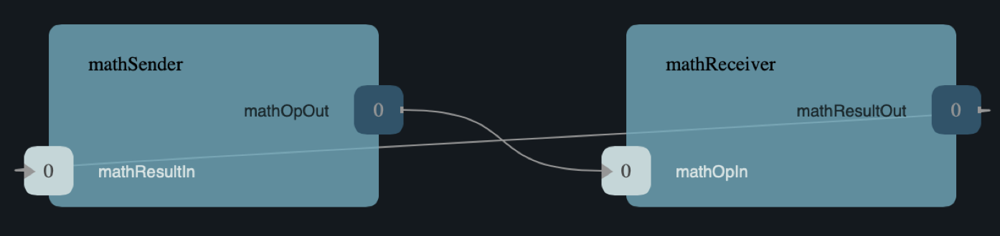

# 1. Introduction

This tutorial shows how to develop, test, and deploy a simple topology
consisting of two components:

1. `MathSender`: A component that receives commands and forwards work to
   `MathReceiver`.

1. `MathReceiver`: A component that carries out arithmetic operations and
   returns the results to `MathSender`.

See the diagram below.



**What is covered:** The tutorial covers the following concepts:

1. Using the [FPP modeling language](https://fprime-community.github.io/fpp) to
   specify the types and ports used by the components.

1. Using the F Prime build system to build the types and ports.

1. Developing the `MathSender` component: Specifying the component, building
   the component, completing the C++ component implementation, and writing
   component unit tests.

1. Developing the `MathReceiver` component.

1. Adding the new components and connections to the F Prime `Ref` application.

1. Using the F Prime Ground Data System (GDS) to run the updated `Ref`
   application.

**Prerequisites:** This tutorial assumes the following:

1. Basic knowledge of Unix: How to navigate in a shell and execute programs.

1. Basic knowledge of git: How to create a branch.

1. Basic knowledge of C++, including class declarations, inheritance,
and virtual functions.

If you have not yet installed F Prime on your system, do so now.
Follow the installation guide at `INSTALL.md`
in the [F Prime git repository](https://github.com/nasa/fprime).
You may also wish to work through the Getting Started tutorial at
`docs/GettingStarted/Tutorial.md`.

**Git branch:** This tutorial is designed to work on the branch `release/v3.0.0`.

Working on this tutorial will modify some files under version control in the
F Prime git repository.
Therefore it is a good idea to do this work on a new branch.
For example:

```bash
git checkout release/v3.0.0
git checkout -b math-tutorial
```

If you wish, you can save your work by committing to this branch.

# 2. The MathOp Type

In F Prime, a **type definition** defines a kind of data that you can pass
between components or use in commands and telemetry.

For this tutorial, we need one type definition.
It defines an enumeration called `MathOp`, which
represents a mathematical operation.

We will add the specification for the `MathOp` type to the
`Ref` topology.
We will do this in three stages:

1. Construct the FPP model.

1. Add the model to the project.

1. Build the model.

## 2.1. Construct the FPP Model

**Create the MathTypes directory:**
Go to the directory `Ref` at the top-level of the
F Prime repository and run `mkdir MathTypes`.
This step creates a new directory `Ref/MathTypes`.
This directory will contain our new type.

**Create the FPP model file:**
Now go into the directory `Ref/MathTypes`.
In that directory, create a file `MathTypes.fpp` with the following contents:

```fpp
module Ref {

  @ A math operation
  enum MathOp {
    ADD @< Addition
    SUB @< Subtraction
    MUL @< Multiplication
    DIV @< Division
  }

}
```

You can do this by typing, or by copy-paste.

This file defines an enumeration or **enum** with enumerated constants `ADD`,
`SUB`, `MUL`, and `DIV`.
These four constants represent the operations of addition, subtraction,
multiplication, and division.
The enum also defines a type `MathOp`; the enumerated constants are the values
of this type.
For more information on enums, see [_The FPP User's 
Guide_](https://fprime-community.github.io/fpp/fpp-users-guide.html#Defining-Enums).

The enum `MathTypes` resides in an FPP module `Ref`.

An FPP module is like a C++ namespace: it encloses several definitions, each of
which is qualified with the name of the module.
For more information on FPP modules, see [_The FPP User's
Guide_](https://fprime-community.github.io/fpp/fpp-users-guide.html#Defining-Modules).

The text following a symbol `@` or `@<` is called an **annotation**.
These annotations are carried through the parsing and become comments in the
generated code.
For more information, see [_The FPP User's
Guide_](https://fprime-community.github.io/fpp/fpp-users-guide.html#Writing-Comments-and-Annotations).

<a name="types_add"></a>
## 2.2. Add the Model to the Project

**Create Ref/MathTypes/CMakeLists.txt:**
Create a file `Ref/MathTypes/CMakeLists.txt` with the following contents:

```cmake
set(SOURCE_FILES
  "${CMAKE_CURRENT_LIST_DIR}/MathTypes.fpp"
)

register_fprime_module()
```

This code will tell the build system how to build the FPP model.

**Update Ref/CMakeLists.txt:**
Now we need to add the new directory to the `Ref` project.
To do that, open the file `Ref/CMakeLists.txt`.
This file should already exist; it was put there by the developers
of the `Ref` topology.
In this file, you should see several lines starting with `add_fprime_subdirectory`.
Immediately after the last of those lines, add the following new line:

```cmake
add_fprime_subdirectory("${CMAKE_CURRENT_LIST_DIR}/MathTypes/")
```

<a name="types_build"></a>
## 2.3. Build the Model

**Run the build:**
Do the following:

1. Go to the directory `Ref/MathTypes`.

1. If you have not already run `fprime-util generate`, then do so now.

1. Run the command `fprime-util build`.

The output should indicate that the model built without any errors.
If not, try to identify and correct what is wrong,
either by deciphering the error output, or by going over the steps again.
If you get stuck, you can look at the
<a href="#types_ref">reference implementation</a>.

**Inspect the generated code:**
Now go to the directory `Ref/build-fprime-automatic-native/Ref/MathTypes`
(you may want to use `pushd`, or do this in a separate shell,
so you don't lose your current working directory).
The directory `build-fprime-automatic-native` is where all the
generated code lives for the "automatic native" build of the `Ref`
project.
Within that directory is a directory tree that mirrors the project
structure.
In particular, `Ref/build-fprime-automatic-native/Ref/MathTypes`
contains the generated code for `Ref/MathTypes`.

Run `ls`.
You should see something like this:

```bash
CMakeFiles            MathOpEnumAc.cpp      MathOpEnumAi.xml.prev cmake_install.cmake
Makefile              MathOpEnumAc.hpp      autocoder
```

The files `MathOpEnumAc.hpp` and
`MathOpEnumAc.cpp` are the auto-generated C++ files
corresponding to the `MathOp` enum.
You may wish to study the file `MathOpEnumAc.hpp`.
This file gives the interface to the C++ class `Ref::MathOp`.
All enum types have a similar auto-generated class
interface.

<a name="types_ref"></a>
## 2.4. Reference Implementation

A reference implementation for this section is available at
`docs/Tutorials/MathComponent/MathTypes`.
To build this implementation from a clean repository,
do the following:

1. Go to the `Ref` directory.

1. Run `cp -R ../docs/Tutorials/MathComponent/MathTypes .`

1. Update `Ref/CMakeLists.txt` as stated <a href="#types_add">above</a>.

1. Follow the steps for <a href="#types_build">building the model</a>.

If you have modified the repo, revise the steps accordingly.
For example, switch git branches, use `git stash` to stash
your changes, or move `MathTypes` to another directory such
as `MathTypes-saved`.

<a name="ports"></a>
# 3. The MathOp and MathResult Ports

A **port** is the endpoint of a connection between
two components.
A **port definition** is like a function signature;
it defines the type of the data carried on a port.

For this tutorial, we need two port definitions:

* `MathOp` for sending an arithmetic operation request from
`MathSender` to `MathReceiver`.

* `MathResult` for sending the result of an arithmetic
operation from `MathReceiver` to `MathSender`.

We follow the same three steps as in the previous section.

## 3.1. Construct the FPP Model

**Create the MathPorts directory:**
Go to the directory `Ref` at the top-level of the
F Prime repository and run `mkdir MathPorts`.
This directory will contain our new ports.

**Create the FPP model file:**
Now go into the directory `Ref/MathPorts`.
Create a file `MathPorts.fpp` with the following contents:

```fpp
module Ref {

  @ Port for requesting an operation on two numbers
  port MathOp(
               val1: F32 @< The first operand
               op: MathOp @< The operation
               val2: F32 @< The second operand
             )

  @ Port for returning the result of a math operation
  port MathResult(
                   result: F32 @< the result of the operation
                 )

}
```

This file defines the ports `MathOp` and `MathResult`.
`MathOp` has three formal parameters: a first operand, an
operation, and a second operand.
The operands have type `F32`, which represents a 32-bit
floating-point number.
The operation has type `MathOp`, which is the enum type
we defined in the previous section.
`MathResult` has a single formal parameter, the value of type `F32`
returned as the result of the operation.

For more information about port definitions, see
[_The FPP User's Guide_](https://fprime-community.github.io/fpp/fpp-users-guide.html#Defining-Ports).

## 3.2. Add the Model to the Project

Add add the model
`Ref/MathPorts/MathPorts.fpp` to the `Ref` project.
Carry out the steps in the
<a href="#types_add">previous section</a>, after
substituting `MathPorts` for `MathTypes`.

## 3.3. Build the Model

Carry out the steps in the
<a href="#types_build">previous section</a>,
in directory `MathPorts` instead of `MathTypes`.
The generated code will go in
`Ref/build-fprime-automatic-native/Ref/MathPorts`.
For port definitions, the names of the auto-generated C++
files end in `PortAc.hpp` and `PortAc.cpp`.
You can look at this code if you wish.
However, the auto-generated C++ port files are used
by the autocoded component implementations (described below);
you won't ever program directly against their interfaces.

## 3.4. Reference Implementation

A reference implementation for this section is available at
`docs/Tutorials/MathComponent/MathPorts`.
To build this implementation, follow the steps
described for <a href="#types_ref">`MathTypes`</a>.

<a name="math-sender"></name>
# 4. The MathSender Component

Now we can build and test the `MathSender` component.
There are five steps:

1. Construct the FPP model.
1. Add the model to the project.
1. Build the stub implementation.
1. Complete the implementation.
1. Write and run unit tests.

## 4.1. Construct the FPP Model

**Create the MathSender directory:**
Go to the directory `Ref` at the top-level of the
F Prime repository.
Run `mkdir MathSender` to create a directory for the new component.

**Create the FPP model file:**
Now go into the directory `Ref/MathSender`.
Create a file `MathSender.fpp` with the following contents:

```fpp
module Ref {

  @ Component for sending a math operation
  active component MathSender {

    # ----------------------------------------------------------------------
    # General ports
    # ----------------------------------------------------------------------

    @ Port for sending the operation request
    output port mathOpOut: MathOp

    @ Port for receiving the result
    async input port mathResultIn: MathResult

    # ----------------------------------------------------------------------
    # Special ports
    # ----------------------------------------------------------------------

    @ Command receive port
    command recv port cmdIn

    @ Command registration port
    command reg port cmdRegOut

    @ Command response port
    command resp port cmdResponseOut

    @ Event port
    event port eventOut

    @ Telemetry port
    telemetry port tlmOut

    @ Text event port
    text event port textEventOut

    @ Time get port
    time get port timeGetOut

    # ----------------------------------------------------------------------
    # Commands
    # ----------------------------------------------------------------------

    @ Do a math operation
    async command DO_MATH(
                           val1: F32 @< The first operand
                           op: MathOp @< The operation
                           val2: F32 @< The second operand
                         )

    # ----------------------------------------------------------------------
    # Events
    # ----------------------------------------------------------------------

    @ Math command received
    event COMMAND_RECV(
                        val1: F32 @< The first operand
                        op: MathOp @< The operation
                        val2: F32 @< The second operand
                      ) \
      severity activity low \
      format "Math command received: {f} {} {f}"

    @ Received math result
    event RESULT(
                  result: F32 @< The math result
                ) \
      severity activity high \
      format "Math result is {f}"

    # ----------------------------------------------------------------------
    # Telemetry
    # ----------------------------------------------------------------------

    @ The first value
    telemetry VAL1: F32

    @ The operation
    telemetry OP: MathOp

    @ The second value
    telemetry VAL2: F32

    @ The result
    telemetry RESULT: F32

  }

}
```

This code defines a component `Ref.MathSender`.
The component is **active**, which means it has its
own thread.

Inside the definition of the `MathSender` component are
several specifiers.
We have divided the specifiers into five groups:

1. **General ports:** These are user-defined ports for
application-specific functions.
There are two general ports: an output port `mathOpOut`
of type `MathOp` and an input port `mathResultIn` of
type `MathResult`.
Notice that these port specifiers use the ports that
we defined <a href="#ports">above</a>.
The input port is **asynchronous**.
This means that invoking the port (i.e., sending
data on the port) puts a message on a queue.
The handler runs later, on the thread of this component.

1. **Special ports:** These are ports that have a special
meaning in F Prime.
There are ports for registering commands with the dispatcher,
receiving commands, sending command responses, emitting
event reports, emitting telemetry, and getting the time.

1. **Commands:** These are commands sent from the ground
or from a sequencer and dispatched to this component.
There is one command `DO_MATH` for doing a math operation.
The command is asynchronous.
This means that when the command arrives, it goes on a queue
and its handler is later run on the thread of this component.

1. **Events:** These are event reports that this component
can emit.
There are two event reports, one for receiving a command
and one for receiving a result.

1. **Telemetry:** These are **channels** that define telemetry
points that the this component can emit.
There are four telemetry channels: three for the arguments
to the last command received and one for the last
result received.

For more information on defining components, see
[_The FPP User's Guide_](https://fprime-community.github.io/fpp/fpp-users-guide.html#Defining-Components).

<a name="math-sender_add-model"></a>
## 4.2. Add the Model to the Project

**Create Ref/MathSender/CMakeLists.txt:**
Create a file `Ref/MathSender/CMakeLists.txt` with the following contents:

```cmake
# Register the standard build
set(SOURCE_FILES
  "${CMAKE_CURRENT_LIST_DIR}/MathSender.cpp"
  "${CMAKE_CURRENT_LIST_DIR}/MathSender.fpp"
)
register_fprime_module()
```

This code will tell the build system how to build the FPP model
and component implementation.

**Update Ref/CMakeLists.txt:**
Add `Ref/MathSender` to `Ref/CMakeLists.txt`, as we did
for <a href="#types_add">`Ref/MathTypes`</a>.

<a name="math-sender_build-stub"></a>
## 4.3. Build the Stub Implementation

**Run the build:**
Go into the directory `Ref/MathTypes`.
Run the following commands:

```bash
touch MathSender.cpp
fprime-util impl
```

The first command creates an empty file `MathSender.cpp`.
The build rules we wrote in the previous section expect
this file to be there.
After the second command, the build system should
run for a bit.
At the end there should be two new files
in the directory:
`MathSenderComponentImpl.cpp-template` and
`MathSenderComponentImpl.hpp-template`.

Run the following commands:

```bash
mv MathSenderComponentImpl.cpp-template MathSender.cpp
mv MathSenderComponentImpl.hpp-template MathSender.hpp
```

These commands produce a template, or stub implementation,
of the `MathSender` implementation class.
You will fill in this implementation class below.

Now run the command `fprime-util build --jobs 4`.
The model and the stub implementation should build.
The option `--jobs 4` says to use four cores for the build.
This should make the build go faster.
You can use any number after `--jobs`, up to the number
of cores available on your system.

**Inspect the generated code:**
The generated code resides in the directory
`Ref/fprime-build-automatic-native-ut/Ref/MathSender`.
You may wish to look over the file `MathSenderComponentAc.hpp`
to get an idea of the interface to the auto-generated
base class `MathSenderComponentBase`.
The `MathSender` implementation class is a derived class
of this base class.

## 4.4. Complete the Implementation

Now we can complete the stub implementation.
In an editor, open the file `MathSender.cpp`.

**Fill in the DO_MATH command handler:**
You should see a stub handler for the `DO_MATH`
command that looks like this:

```c++
void MathSender ::
  DO_MATH_cmdHandler(
      const FwOpcodeType opCode,
      const U32 cmdSeq,
      F32 val1,
      MathOp op,
      F32 val2
  )
{
  // TODO
  this->cmdResponse_out(opCode,cmdSeq,Fw::CmdResponse::OK);
}
```

The handler `DO_MATH_handler` is called when the `MathSender`
component receives a `DO_MATH` command.
This handler overrides the corresponding pure virtual
function in the auto-generated base class.
Fill in the handler so that it looks like this:

```c++
void MathSender ::
  DO_MATH_cmdHandler(
      const FwOpcodeType opCode,
      const U32 cmdSeq,
      F32 val1,
      MathOp op,
      F32 val2
  )
{
  this->tlmWrite_VAL1(val1);
  this->tlmWrite_OP(op);
  this->tlmWrite_VAL2(val2);
  this->log_ACTIVITY_LO_COMMAND_RECV(val1, op, val2);
  this->mathOpOut_out(0, val1, op, val2);
  this->cmdResponse_out(opCode, cmdSeq, Fw::CmdResponse::OK);
}
```

The first two arguments to the handler function provide
the command opcode and the command sequence number
(a unique identifier generated by the command dispatcher).
The remaining arguments are supplied when the command is sent,
for example, from the F Prime ground data system (GDS).
The implementation code does the following:

1. Emit telemetry and events.

1. Invoke the `mathOpOut` port to request that `MathReceiver`
perform the operation.

1. Send a command response indicating success.
The command response goes out on the special port
`cmdResponseOut`.

In F Prime, every execution of a command handler must end by
sending a command response.
The proper behavior of other framework components (e.g., command
dispatcher, command sequencer) depends upon adherence to this rule.

**Check the build:**
Run `fprime-util build` again to make sure that everything still builds.

**Fill in the mathResultIn handler:**
You should see a stub handler for the `mathResultIn`
port that looks like this:

```c++
void MathSender ::
  mathResultIn_handler(
      const NATIVE_INT_TYPE portNum,
      F32 result
  )
{
  // TODO
}
```

The handler `mathResultIn_handler` is called when the `MathReceiver`
component code returns a result by invoking the `mathResultIn` port.
Again the handler overrides the corresponding pure virtual
function in the auto-generated base class.
Fill in the handler so that it looks like this:

```c++
void MathSender ::
  mathResultIn_handler(
      const NATIVE_INT_TYPE portNum,
      F32 result
  )
{
    this->tlmWrite_RESULT(result);
    this->log_ACTIVITY_HI_RESULT(result);
}
```

The implementation code emits the result on the `RESULT`
telemetry channel and as a `RESULT` event report.

**Check the build:**
Run `fprime-util build`.

<a name="math-sender_unit"></a>
## 4.5. Write and Run Unit Tests

**Unit tests** are an important part of FSW development.
At the component level, unit tests typically invoke input ports, send commands,
and check for expected values on output ports (including telemetry and event
ports).

We will carry out the unit testing for the `MathSender` component
in three steps:

1. Set up the unit test environment

1. Write and run one unit test

1. Write and run additional unit tests

<a name="math-sender_unit_setup"></a>
### 4.5.1. Set Up the Unit Test Environment

**Create the stub Tester class:**
Do the following in directory `Ref/MathSender`:

1. Run `mkdir -p test/ut` to create the directory where
the unit tests will reside.

1. Run the command `fprime-util impl --ut`.
It should generate files `Tester.cpp` and `Tester.hpp`.

1. Move these files to the `test/ut` directory:

   ```bash
   mv Tester.* test/ut
   ```

**Create a stub main.cpp file:**
Now go to the directory `Ref/MathSender/test/ut`.
In that directory, create a file `main.cpp` with the
following contents:

```c++
#include "Tester.hpp"

int main(int argc, char **argv) {
  ::testing::InitGoogleTest(&argc, argv);
  return RUN_ALL_TESTS();
}
```

This file is a stub for running tests using the
[Google Test framework](https://github.com/google/googletest).
Right now there aren't any tests to run; we will add one
in the next section.

**Update Ref/MathSender/CMakeLists.txt:**
Go back to the directory `Ref/MathSender`.
Add the following lines to `CMakeLists.txt`:

```cmake
# Register the unit test build
set(UT_SOURCE_FILES
  "${CMAKE_CURRENT_LIST_DIR}/MathSender.fpp"
  "${CMAKE_CURRENT_LIST_DIR}/test/ut/Tester.cpp"
  "${CMAKE_CURRENT_LIST_DIR}/test/ut/main.cpp"
)
register_fprime_ut()
```

This code tells the build system how to build
and run the unit tests.

**Run the build:**
Now we can check that the unit test build is working.

1. If you have not yet run `fprime-util generate --ut`,
then do so now.
This step generates the CMake build cache for the unit
tests.

1. Run `fprime-util build --ut`.
Everything should build without errors.

**Inspect the generated code:**
The generated code is located at
`Ref/build-fprime-automatic-native-ut/Ref/MathSender`.
This directory contains two auto-generated classes:

1. `MathSenderGTestBase`: This is the direct base
class of `Tester`.
It provides a test interface implemented with Google Test
macros.

1. `MathSenderTesterBase`: This is the direct base
class of `MathSenderGTestBase`.
It provides basic features such as histories of port
invocations.
It is not specific to Google Test, so you can
use this class without Google Test if desired.

You can look at the header files for these generated classes
to see what operations they provide.
In the next sections we will provide some example uses
of these operations.

### 4.5.2. Write and Run One Test

Now we will write a unit test that exercises the
`DO_MATH` command.
We will do this in three phases:

1. In the `Tester` class, add a helper function for sending the command and
checking the responses.
That way multiple tests can reuse the same code.

1. In the `Tester` class, write a test function that
calls the helper to run a test.

1. In the `main` function, write a Google Test macro
that invokes the test function.

1. Run the test.

**Add a helper function:**
Go into the directory `Ref/MathSender/test/ut`.
In the file `Tester.hpp`, add the following lines
to the section entitled "Helper methods":

```c++
//! Test a DO_MATH command
void testDoMath(MathOp op);
```

In the file `Tester.cpp`, add the corresponding
function body:

```c++
void Tester ::
  testDoMath(MathOp op)
{

    // Pick values

    const F32 val1 = 2.0;
    const F32 val2 = 3.0;

    // Send the command

    // pick a command sequence number
    const U32 cmdSeq = 10;
    // send DO_MATH command
    this->sendCmd_DO_MATH(0, cmdSeq, val1, op, val2);
    // retrieve the message from the message queue and dispatch the command to the handler
    this->component.doDispatch();

    // Verify command receipt and response

    // verify command response was sent
    ASSERT_CMD_RESPONSE_SIZE(1);
    // verify the command response was correct as expected
    ASSERT_CMD_RESPONSE(0, MathSenderComponentBase::OPCODE_DO_MATH, cmdSeq, Fw::CmdResponse::OK);

    // Verify operation request on mathOpOut

    // verify that that one output port was invoked overall
    ASSERT_FROM_PORT_HISTORY_SIZE(1);
    // verify that the math operation port was invoked once
    ASSERT_from_mathOpOut_SIZE(1);
    // verify the arguments of the operation port
    ASSERT_from_mathOpOut(0, val1, op, val2);

    // Verify telemetry

    // verify that 3 channels were written
    ASSERT_TLM_SIZE(3);
    // verify that the desired telemetry values were sent once
    ASSERT_TLM_VAL1_SIZE(1);
    ASSERT_TLM_VAL2_SIZE(1);
    ASSERT_TLM_OP_SIZE(1);
    // verify that the correct telemetry values were sent
    ASSERT_TLM_VAL1(0, val1);
    ASSERT_TLM_VAL2(0, val2);
    ASSERT_TLM_OP(0, op);

    // Verify event reports

    // verify that one event was sent
    ASSERT_EVENTS_SIZE(1);
    // verify the expected event was sent once
    ASSERT_EVENTS_COMMAND_RECV_SIZE(1);
    // verify the correct event arguments were sent
    ASSERT_EVENTS_COMMAND_RECV(0, val1, op, val2);

}
```

This function is parameterized over different
operations.
It is divided into five sections: sending the command,
checking the command response, checking the output on
`mathOpOut`, checking telemetry, and checking events.
The comments explain what is happening in each section.
For further information about the F Prime unit test
interface, see the F Prime User's Guide.

Notice that after sending the command to the component, we call
the function `doDispatch` on the component.
We do this in order to simulate the behavior of the active
component in a unit test environment.
In a flight configuration, the component has its own thread,
and the thread blocks on the `doDispatch` call until another
thread puts a message on the queue.
In a unit test context, there is only one thread, so the pattern
is to place work on the queue and then call `doDispatch` on
the same thread.

There are a couple of pitfalls to watch out for with this pattern:

1. If you put work on the queue and forget to call `doDispatch`,
the work won't get dispatched.
Likely this will cause a unit test failure.

1. If you call `doDispatch` without putting work on the queue,
the unit test will block until you kill the process (e.g.,
with control-C).

**Write a test function:**
Next we will write a test function that calls
`testDoMath` to test an `ADD` operation.
In `Tester.hpp`, add the following line in the
section entitled "Tests":

```c++
//! Test an ADD command
void testAddCommand();
```

In `Tester.cpp`, add the corresponding function
body:

```c++
void Tester ::
    testAddCommand()
{
    this->testDoMath(MathOp::ADD);
}
```

This function calls `testDoMath` to test an `ADD` command.

**Write a test macro:**
Add the following code to the file `main.cpp`,
before the definition of the `main` function:

```c++
TEST(Nominal, AddCommand) {
    Ref::Tester tester;
    tester.testAddCommand();
}
```

The `TEST` macro is an instruction to Google Test to run a test.
`Nominal` is the name of a test suite.
We put this test in the `Nominal` suite because it addresses
nominal (expected) behavior.
`AddCommand` is the name of the test.
Inside the body of the macro, the first line declares a new
object `tester` of type `Tester`.
We typically declare a new object for each unit test, so that
each test starts in a fresh state.
The second line invokes the function `testAddCommand`
that we wrote in the previous section.

**Run the test:**
Go back to directory `Ref/MathSender`.
Run the command `fprime-util check`.
The build system should compile and run the unit
tests.
You should see output indicating that the test ran
and passed.

As an exercise, try the following:

1. Change the behavior of the component
so that it does something incorrect.
For example, try adding one to a telemetry
value before emitting it.

1. Rerun the test and observe what happens.

### 4.5.3. Write and Run More Tests

**Add more command tests:**
Try to follow the pattern given in the previous
section to add three more tests, one each
for operations `SUB`, `MUL`, and `DIV`.
Most of the work should be done in the helper
that we already wrote.
Each new test requires just a short test function
and a short test macro.

Run the tests to make sure everything compiles and
the tests pass.

**Add a result test:**
Add a test for exercising the scenario in which the `MathReceiver`
component sends a result back to `MathSender`.

1. Add the following function signature in the "Tests"
   section of to `Tester.hpp`:

   ```c++
   //! Test receipt of a result
   void testResult();
   ```

1. Add the corresponding function body in `Tester.cpp`:

   ```c++
   void Tester ::
     testResult()
   {
       // Generate an expected result
       const F32 result = 10.0;
       // reset all telemetry and port history
       this->clearHistory();
       // call result port with result
       this->invoke_to_mathResultIn(0, result);
       // retrieve the message from the message queue and dispatch the command to the handler
       this->component.doDispatch();
       // verify one telemetry value was written
       ASSERT_TLM_SIZE(1);
       // verify the desired telemetry channel was sent once
       ASSERT_TLM_RESULT_SIZE(1);
       // verify the values of the telemetry channel
       ASSERT_TLM_RESULT(0, result);
       // verify one event was sent
       ASSERT_EVENTS_SIZE(1);
       // verify the expected event was sent once
       ASSERT_EVENTS_RESULT_SIZE(1);
       // verify the expect value of the event
       ASSERT_EVENTS_RESULT(0, result);
   }
   ```

   This code is similar to the helper function in the previous section.
   The main difference is that it invokes a port directly
   (the `mathResultIn` port) instead of sending a command.

1. Add the following test macro to `main.cpp`:

   ```c++
   TEST(Nominal, Result) {
       Ref::Tester tester;
       tester.testResult();
   }
   ```

1. Run the tests.
Again you can try altering something in the component code
to see what effect it has on the test output.

<a name="math-sender_exercise"></a>
### 4.5.4. Exercise: Random Testing

F Prime provides a module called `STest`
that provides helper classes and functions for writing
unit tests.
As an exercise, use the interface provided by
`STest/STest/Pick.hpp` to pick random values to use in the
tests instead of using hard-coded values such as 2.0, 3.0,
and 10.

**Modifying the code:** You will need to do the following:

1. Add `#include "STest/Pick/Pick.hpp"` to `Tester.cpp`.

1. Add the following
   line to `Ref/MathSender/CMakeLists.txt`, before `register_fprime_ut`:

   ```cmake
   set(UT_MOD_DEPS STest)
   ```

   This line tells the build system to make the unit test build
   depend on the `STest` build module.

1. Add `#include STest/Random/Random.hpp` to `main.cpp`.

1. Add the following line to the `main` function of `main.cpp`,
   just before the return statement:

   ```c++
   STest::Random::seed();
   ```

   This line seeds the random number generator used by STest.

**Running the tests:**
Recompile and rerun the tests.
Now go to
`Ref/build-fprime-automatic-native-ut/Ref/MathSender` and inspect the
file `seed-history`.
This file is a log of random seed values.
Each line represents the seed used in the corresponding run.

**Fixing the random seed:**
Sometimes you may want to run a test with a particular seed value,
e.g., for replay debugging.
To do this, put the seed value into a file `seed` in the same
directory as `seed-history`.
If the file `seed` exists, then STest will use the seed it contains instead
of generating a new seed.

Try the following:

1. Copy the last value _S_ of `seed-history` into `seed`.

1. In `Ref/MathSender`, re-run the unit tests a few times.

1. Inspect `Ref/build-fprime-automatic-native-ut/Ref/MathSender/seed-history`.
You should see that the value _S_ was used in the runs you just did
(corresponding to the last few entries in `seed-history`).

### 4.5.5. Reference Implementation

A reference implementation for this section is available at
`docs/Tutorials/MathComponent/MathSender`.

