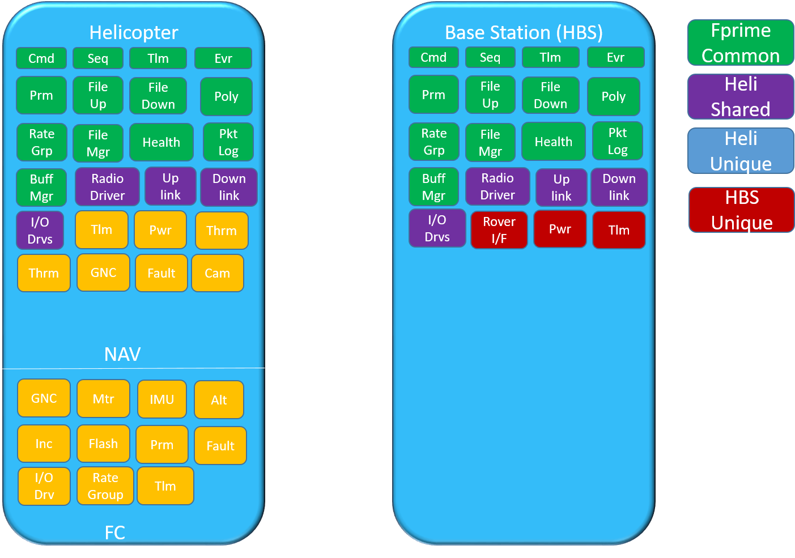

4\. iii. Document Projects and Deployments \#412

> a. What is a project?
> 
> b. What is a deployment?
> 
> c. How do projects and deployments differ from topology?

**4. Concepts of F′**

**iii. Document Projects and Deployments**

F´ is naturally organized into projects and deployments. Projects are a
related set of code that uses F´, and may consist of one or more
deployments that are tied to build(s) of code; for each build of the
code there is a deployment. Topology is a specific set of interconnected
components, which comprise the binary built as a deployment. Further
explanation of projects and deployments and how they differ from
topology are described below.

**a. What is a project?**

A project may consist of one or more deployments. Each deployment is one
instance of F´ software.

Projects are used to organize F´ code that is closely related. They
define at least one deployment (see below), but may define multiple
deployments. Projects can define components that are shared between
these related deployments.

There are several reasons a project may contain multiple deployments. A
project consists of multiple spacecraft/electronic
platforms/CPUs/systems. F´ can be used on multiple nodes in these
systems that are used in a single project. Figure 1 shows an example of
a project, the Mars Helicopter flight software. The flight code for the
Mars Helicopter is built using the F´ framework. The Mars Helicopter
project is broken down into two deployments: one designated for the
helicopter, and one designated for the base station allowing the
helicopter to call back.

**Figure 1. Mars Helicopter flight software components.**

A project has test deployments, mocked-deployments, or other deployments
that allow for specific testing setups. This strategy is often employed
to enable system testing in early stages of development before the
system has been completed. It can also be used to create deployments to
test without access to specific hardware available to the final
hardware.

**b. What is a deployment?**

Deployments are tied to builds; for each build of the code there is a
deployment. A project is tied to code; code (like components and ports)
can be shared across deployments used in a project. For example, a
deployment is built into a running F´ instance. It represents one
executable in the F´ system. A project with multiple non-homogenous
spacecraft, like the Mars Helicopter, would have multiple deployments as
each spacecraft would have a separate unique executable to control it.

Deployments can define custom components and ports that are only used in
that specific deployment. They may also inherit other components, like
those defined by the F´ framework. Each F´ deployment uses a set of
components and ports, and has a single topology. Components and ports
are organized into the deployments topology. A topology has a number of
component instances, and the connections between the ports of those
instances represent the deployment. In addition, deployments contain the
needed build system artifacts to build the F´ framework, components,
ports, and the topology into an executable that can be deployed onto
embedded hardware, or even run on the user’s computer.

**c. How do projects and deployments differ from topology?**

Topology is a specific set of interconnected components that represent a
network of components. Topologies contain instantiations of each
component, and list connections between the ports of the components.
Projects contain one or more deployments that are closely related, as
discussed above, while deployments contain the topology, ports, and
components needed for the specific instance of F´.
