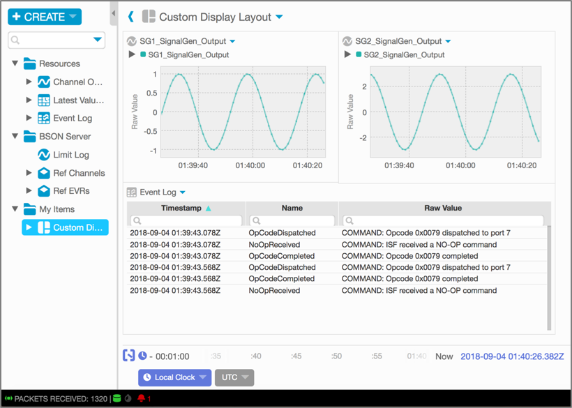
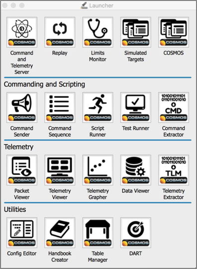

**Outline (content from 13\_CFW\_GDS.pdf)**

4\. Concepts of F′

> vi. Ground System and Interface
> 
> a. Ground Data System/Ground Support Equipment (GDS/GSE) Fundamental
> Concept
> 
> b. Interface
> 
> 1\. Client Graphical User Interface (GUI)
> 
> 2\. Open Mission Control Technologies (MCT) Telemetry Monitoring and
> Browsing Capability
> 
> 3\. COSMOS

**4. Concepts of F′**

**vi. Ground System and Interface**

The F′ user experience is intended to be an out-of-box ready to use
ground data system (GDS) solution than can easily run on Linux, Mas OSX,
or Windows platforms without any mission specific tailoring. The GDS
provides an end-user graphical user interface (GUI) tool and an
integration test application programming interface (API) to enable
integration testing and quick-look telemetry monitoring. Initially, the
user defines the mission specific dictionaries such as commands and
telemetry, and then the dictionaries are automatically generated from a
topology model.

**a. Ground Data System/Ground Support Equipment (GDS/GSE) Fundamental
Concept**

The GDS is the operation function where the end-user communicates with
the command and telemetry processing, storage, and visualization (the
GDS) via the radio frequency command and telemetry data channel. The GSE
is the lab function where the equipment communicates with the command
and telemetry processing, storage, and visualization (the GDS) to
simulate solar, battery, and load. See Figure 1.

**Figure 1.** The GDS functions as an operation; the GSE functions as a
lab.

**b. Interface**

**1. Client GUI**

The improved F′ GDS client GUI (Figure 2) looks identical to the legacy
GSE client GUI; however, it is built on WxPython for improved widget
functionality, and with added stripcharting and histograms. This new GDS
client GUI replaces the old GSE client GUI built on Python 3.

**Figure 2.** The new F′ Prime GDS client GUI.

**2. Open Mission Control Technologies (MCT) Telemetry Monitoring and
Browsing Capability**

The F′ Open MCT is an open source mission control software application
interface developed at NASA’s Ames Research Center in collaboration with
JPL. It is the next-generation web framework providing data
visualization and mission control on desktop and mobile platforms. The
web-based design simplifies the support, removing the need to deliver
updates to multiple machines. Supporting mobile devices enables off-duty
operators to remotely monitor the system, and allows them to quickly get
up to speed once they are back on-duty. Open MCT is object-oriented and
allows the end-user to compose their own display layout (Figure 2). Data
can be displayed with rich graphical views such as plots, historical
data, imagery, timelines, procedures, and other data visualizations; and
can appear on the same screen using the drag and drop feature for any
desired element. Open MCT is adaptable for planning and operations of
any system that produces telemetry. The ground dictionaries allow the
flight software (FSW) and the GDS to converse back and forth.
Information such as commands, event log messages, telemetry channels,
parameters, and serializables are sharable because of the FSW and GDS
dictionary concept.

**Figure 2.** User-customizable display layout.

**3. COSMOS**

There are other GDS solutions such as COSMOS that can be connected to F´
developed systems. COSMOS is an open source GSE with multi-target
capability. It is configurable for hardware interfaces and software
protocols.

COSMOS is a suite of applications (Figure 3) that can be used to control
a set of embedded systems that implement a client server architecture
with the command and telemetry server and the various other tools
typically acting as clients to retrieve data.

**Figure 3.** COSMOS launcher application.

The Command and Telemetry Server (Figure 4) connects to targets, such as
the GSE and the FSW, and sends commands and receives telemetry (status
data). Interfaces can be over TCP/IP, serial, UDP/IP, or a defined
customizable interface.

**Figure 4.** COSMOS Command and Telemetry Server.
