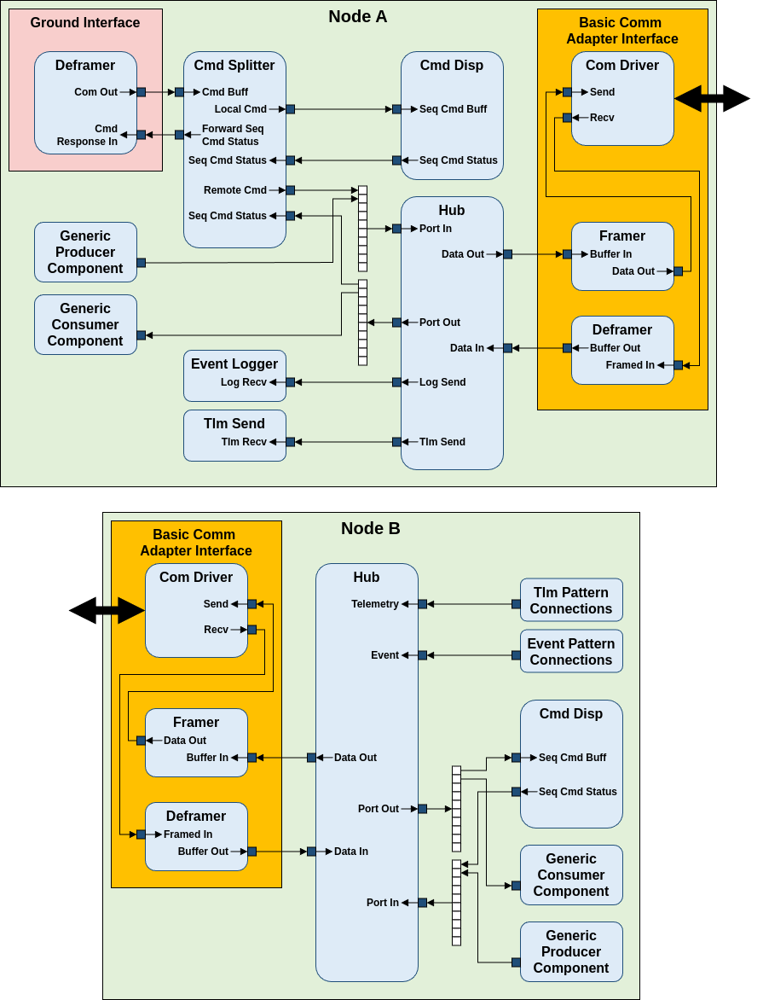

# A Quick Look at the Hub Pattern

The Hub pattern is a way to distribute F´ applications across some barriers. These barriers may be address-space barriers, platform barriers, or other divides. With the hub pattern, we connect F´ ports through a serialized comm link
and then out the interface on the other side of the barrier. It is built around the hub.

A hub is a component with multiple serialization input and output ports. Typed ports from a calling component are
connected to the Hub's serialization ports. These ports allow any inputs which serialize to the communication bridge
across the divide. On the other side of the divide, the Hub unwraps the calls back into the typed ports. In this way,
typed ports are connected to typed ports using the Hub as an intermediary to get across the divide.


**Figure 9. Hub pattern.** Each hub instance is responsible for connecting to a remote node. Input port calls are
repeated to corresponding output ports on a remote hub. These hubs have been demonstrated on Sockets,
ARINC 653 Channels, High-speed hardware buses between nodes, and UARTs between nodes in an embedded system.

## Generic Hub

There is now a standard implementation of the hub pattern. The 
[GenericHub](../api/c++/html/svc_generic_hub_component.html) is an implementation of the hub pattern 
that passes through F´ ports and `Fw::Buffer`s.

## Detailed Example Generic Hub Setup

A sample F´ project featuring a two-deployment hub setup can be found on [fprime-community](@FIXME).

A possible usage of the Hub pattern includes running F´ on multiple computers acting as one F´ system. 
This example could serve as a base for a multi-computer system running F´.



In this example, a basic implementation of the 
[Communication Adapter Interface](../../Design/communication-adapter-interface.md) facilitates the 
transfer of serialized data between the two nodes across two different deployments.  While they are 
excluded from this example for simplicity, a `Fw::ComStub` and `Fw::ComQueue` components could be 
added to make this communication link between hubs more robust. The Hub uses the `Data Out` port to 
export serialized data to the remote hub, which receives them on the `Data In` port. This connection 
works reflexively, allowing the two hubs to communicate and transmit data between each other. 

A [Command Splitter](../api/c++/html/svc_cmd_splitter.html) sits between the Ground Interface and a 
local [Command Dispatcher](../api/c++/html/svc_cmd_dispatcher_component.html) and splits command 
opcodes to either a local or remote command dispatcher. The command opcode offset of the command 
splitter should match the commands on the external node. An offset of 0x10000 will route any command 
received above the offset directly to the hub, while commands below the offset will be routed to the 
local Command Dispatcher.Instance ids must also match this offset, which may be implemented as the 
following for each instance in instances.fpp:
```shell
# In Node B's instances.fpp
module NodeBDeployment {
  constant CMD_SPLITTER_OFFSET = 0x10000
  ...
  instance b_hub: Svc.GenericHub base id CMD_SPLITTER_OFFSET + 0x9000
  ...
}
```
> Configure the Command Splitter by calling `cmdSplitter.configure(0x10000);` in Node A's topology.cpp


`Port In` and `Port Out` are arrays of serial ports that should be parallel to each other across 
hubs. A connection to Hub A's `Port In` index 0 will be routed to Hub B's `Port Out` index 0. In 
this example, the Command Splitter in Node A is connected to the Command Dispatcher in Node B 
through the hub port arrays. Data flow from Node B to A work in the same way, such that Hub B's 
`Port In` will be parallel to Hub A's `Port Out`.

To receive telemetry from Node B through the Ground Interface from Node A, Telemetry and Event 
Connections can be defined through the pattern graph specifiers. The hub replaces 
`Svc::ActiveLogger` and `Svc::TlmChan` in the pattern graph specifiers of Node B, which would 
reroute all events and logs to the hub and to the ActiveLogger and TlmChan of Node A. Events and 
Telemetry have a dedicated `Port In` the hub, which are connected to Node A's Event Logger and Tlm 
Send through the Log Send and Tlm Send port of the hub.

```shell
  # In Node B's topology.fpp  
    ...
    # event connections instance b_eventLogger
    event connections instance b_hub 

    # telemetry connections instance b_tlmSend
    telemetry connections instance b_hub
    ...
```
```shell
  # In Node A's topology.fpp  
    ...
    connections hub {
      a_hub.LogSend -> a_eventLogger.LogRecv
      a_hub.TlmSend -> a_tlmSend.TlmRecv
    } 
    ...
```

### Implementation Notes
All instances names should be unique across the entire F´ System. Instances with the same name may 
mix telemetry and logging together with no differentiation between deployments.

## Creating a Combined Dictionary for a Multi-deployment System

Since this system is running on two deployments, the comand, telemetry, and event dictionaries need 
to be merged together so the GDS can process data received from both deployments. Running 
`fprime-gds` using a dictionary from build-artifacts of one deployment but not both would drop 
telemetry and logging from the other deployment, and GDS will not display any inner-deployment 
commands. Using [FPP Tools](https://nasa.github.io/fpp/fpp-users-guide.html#Specifying-Models-as-Files_Computing-Dependencies), 
we can generate a list of dependencies for topologies of both deployments and create a combined 
dictionary.

Create a new directory structure on the same level as the two other deployments. Additionally, 
create a new topology.fpp file and a shell script file within the directory. The directory structure 
should look like this:

```
  FPrimeProject
  ├── build
  ├── build-artifacts
  ├── ...
  ├── NodeADeployment
  ├── NodeBDeployment
  └── GDSDictionary
    ├── generate_dictionary.sh
    └── topology.fp
```

In the new topology.fpp file, import the topologies from the two deployments like this:

```shell
  # In GDSDictionary/Topology.fpp
  topology GDSDictionary {
    import obcA.obcA
    import obcB.obcB 
  } 
```

Using FPP-Tools, we can manually generate a ground dictionary by finding the dependencies of 
GDSDictionary, which includes the dependencies of Node A and Node B. 
`fpp-depend` writes out the names of generated files during dependency analysis. This uses the 
locs.fpp file generated when running `fprime-util generate` and retrieves the files needed to build 
the dictionaries for both Node A and Node B. `fpp-to-dict` uses these dependencies and builds a 
dictionary. These can be either ran in the terminal or executed with a shell script.

```shell
#!/bin/bash

fpp-depend ../build-fprime-automatic-native/locs.fpp topology.fpp -g deps.txt
tr '\n' ',' < deps.txt | sed 's/,$//' > deps-comma.txt
fpp-to-dict -i `cat deps-comma.txt` topology.fpp
```
> See [FPP User's Guide](https://nasa.github.io/fpp/fpp-users-guide.html#Analyzing-and-Translating-Models_Generating-Ground-Dictionaries)
  for using generating dictionaries using `fpp-to-dict`.