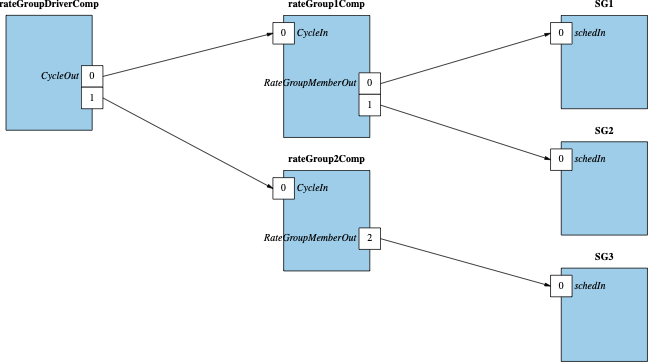

# Rate Groups and Timeliness

Often embedded software must perform actions at a fixed rate. In a given system there are usually collections of actions
that must run at similar rates. For example, control algorithms may run at 10Hz while telemetry collection may run at
1Hz and background tasks may be updated at 0.1Hz. F´ provides a mechanism to trigger time-based actions called "rate
groups". The `ActiveRateGroup` component contains multiple output `Sched` ports that it sends a message to at a repeated
rate. Thus components having an input `Sched` port can run a repeated action at this rate. Rate groups are driven by a
central rate group driver and achieve their rates by dividing the incoming signal from the rate group driver.

## Rate Group Driver

The `RateGroupDriver` component is the source of the "clock" for the various rate groups. It is usually driven off a
system timing interrupt or some other reliable clock source. On the incoming cycle call from that source, it sends a
message to each rate group attached to it thus starting each cycle.

### System Clock Sources

A system clock source needs to be supplied to the rate group driver. This clock source must run at a multiple of the rates of the various rate groups and drives the `CycleIn` port of the rate group driver. Most projects implement a
clock component that translates between the system clock and the port call to rate group driver's `CycleIn` port.

The reference application calls the `CycleIn` port followed by a sleep for the system clock time within a while loop to simulate a system-driven clock. 

## Active Rate Group

The active rate group receives the input source signal at the system rate and divides that signal to provide a fixed
rate for the components attached to it. It then calls each of those components at the subdivided rate. For example, if
the rate group driver is being called at 1000Hz it will provide a repeated 1000Hz call to each active rate group. To
achieve repeated signals at 10Hz, 1Hz, and 0.1Hz, the project would need to set up 3 rate groups diving by 100, 1000, and
10000 respectively. These divisors are set up at active rate group instantiation time.

Active rate groups run on a thread and thus there is some jitter between the system driver and the execution of the rate
group. However, multiple active rate groups can start up in unison. A passive rate group could be created that is
synchronous and would remove jitter at the expense of synchronous execution.

Should the synchronous work done by a rate group take longer than the rate group's cycle time to complete, the rate
group will be unable to run the next cycle. This is known as a rate group slip and will produce a WARNING_HI event.
Frequent slips indicate that the system is failing to keep up with the repetitive work and the cycle time may need to
be increased or child components need to be moved to slower rate groups.

### Active Rate Groups, Ordering, and Priority

Active rate groups are dependent on thread priority. Typically, rate groups are the highest priority components in the
system. This is because they are fairly low impact but start components that are of high priority and thus should be
assigned a thread priority higher than that of its children. Faster rate groups tend to be the highest priority of the
rate groups.

The active rate group sends messages in order to each of the attached components. Thus, higher priority children tend to
be attached to lower index `Sched` ports than lower priority children.

### Passive and Active Components

Passive components will run synchronously on the rate group. This has the advantage that if too many things are done on
one clock cycle the rate group will slip. However, each child will run in sequence. Active components will receive the
message from the active rate group but will not start until their thread becomes active. This allows children to run
without blocking each other, however; it becomes harder to detect when more work is scheduled in a cycle than can be
completed during the cycle because all work runs concurrently and competes for time across multiple threads.

## Rate Group Example: `Ref`

The `Ref` application uses rate groups to drive several system components as well as the demonstration SignalGen components.
In the `Ref` application, the `blockDrv` component is used to drive the rate group driver. That drives active rate groups
that then drive the components.

The topology connections for rate groups can be seen here:
[Rate Group Topology](https://github.com/nasa/fprime/blob/ddcb2ec138645da34cd4c67f250b67ee8bc67b26/Ref/Top/topology.fpp#L97-L124)

A sample schedule handler can be found here:
[Sample Schedule Handler](https://github.com/nasa/fprime/blob/ddcb2ec138645da34cd4c67f250b67ee8bc67b26/Ref/SignalGen/SignalGen.cpp#L98-L140)