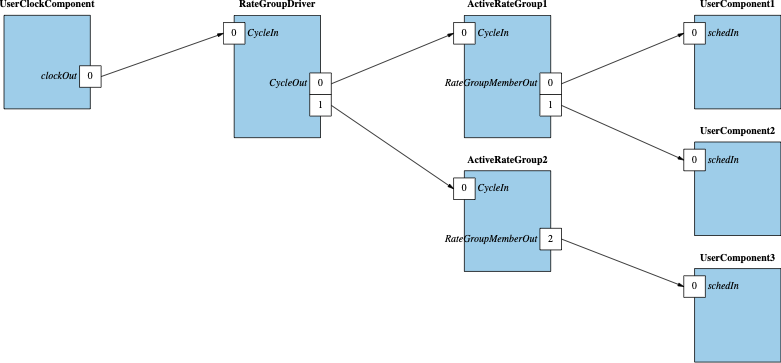

# Rate Groups and Timeliness

Often embedded software must perform actions at a fixed rate. In a given system there are usually collections of actions
that must run at the same rate. For example, control algorithms may run at 10Hz while telemetry collection may run at
1Hz and background tasks may be updated at 0.1Hz. F´ provides a mechanism to trigger time-based actions called "rate
groups". The `ActiveRateGroup` component implements a single rate group. It contains multiple output `Sched` ports that get invoked in order during each cycle of the rate group. Components having an input `Sched` port can run a repeated action at this rate. Rate groups are driven by a
central rate group driver that invokes.

## Rate Group Driver

The `RateGroupDriver` component is the source of the "clock" for the various rate groups. It is usually driven off a
system timing interrupt or some other reliable clock source. On the incoming cycle call from that source, it sends a
message to each rate group attached to it based on a divider table provided at initialization. This can be used to drive the attached rate groups (See Active Rate Group below) at different rates. 

### System Clock Sources

A system clock source needs to be supplied to the rate group driver. This clock source must run at a multiple of the rates of the various rate groups and drives the `CycleIn` port of the rate group driver. Most projects implement a
clock component that translates between the system clock and the port call to rate group driver's `CycleIn` port.

The reference application calls the `CycleIn` port followed by a sleep for the system clock time within a while loop to simulate a system-driven clock. 

## Active Rate Group

A `Svc.ActiveRateGroup` component instance receives an incoming `CycleIn` port at a rate determined by a clock source (typically divided down by `Svc.RateGroupDriver`). The `ActiveRateGroup` instance will then call in order any of its connected `Sched` ports. This allows a set of tasks that need to run at a certain rate be executed in a repeatable way. Note that if the system requirement is that higher frequency rate groups must run to completion before lower frequency rate groups (knows as "earliest deadline first"), the priority of the rate group task should be set to ensure it will run first. Note that higher priority rate groups can (and should if OS priorities are set correctly) preempt lower priority rate groups so scheduling should be carefully characterized. 

It is typical that components that need to run at a certain rate 

Should the execution time of a rate group be higher than the rate group's cycle time, the rate
group will be unable to run the next cycle at the required rate. This is known as cycle slip and will produce a WARNING_HI event.
Frequent slips indicate that the system is failing to keep up with the required rate and the cycle time may need to
be increased or child components need to be moved to slower rate groups.

### Passive and Active Components

Passive components will run synchronously on the rate group. This has the advantage that if too many things are done on
one clock cycle the rate group will slip. However, each child will run in sequence. Active components will receive the
message from the active rate group but will not start until their thread becomes active. This allows children to run
without blocking each other, however; it becomes harder to detect when more work is scheduled in a cycle than can be
completed during the cycle because all work runs concurrently and competes for time across multiple threads.

## Rate Group Example: `Ref`

The `Ref` application uses rate groups to drive several system components as well as the demonstration SignalGen components.
In the `Ref` application, the `blockDrv` component is used to drive the rate group driver. That drives active rate groups
that then drive the components.

The topology connections for rate groups can be seen here:
[Rate Group Topology](https://github.com/nasa/fprime/blob/ddcb2ec138645da34cd4c67f250b67ee8bc67b26/Ref/Top/topology.fpp#L97-L124)

A sample schedule handler can be found here:
[Sample Schedule Handler](https://github.com/nasa/fprime/blob/ddcb2ec138645da34cd4c67f250b67ee8bc67b26/Ref/SignalGen/SignalGen.cpp#L98-L140)