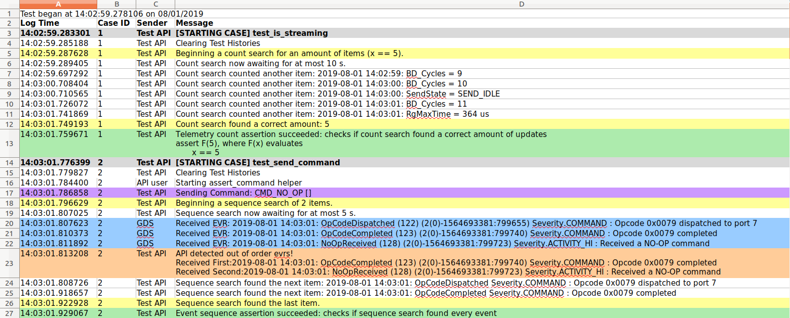

# GDS Integration Test API User Guide

The GDS integration test API is a tool that provides useful functions and asserts for creating integration or system tests for an F´ deployment. These tests run through the ground system attached to a running F´ deployment. This document hopes to give an overview of the main features associated with the Test API and demonstrates common use patterns and highlight some anti-patterns. 

This integration test API was developed by Kevin Oran in the summer of 2019.

## Quick Start

Integration tests are implemented using [pytest](https://docs.pytest.org/) a custom fixture called `fprime_test_api` is
provided that configures `pytest` to attach to the GDS framework, and provides access to the API functions.

To create a simple test, place the following function in a python file in `test/int/test_my_deployment.py` typically in your deployment folder.

```python
def test_send_command(fprime_test_api):
    """ Ensure commanding works as expected

    Tests that commands may be sent and the expected command severity events are returned.
    """
    fprime_test_api.send_and_assert_command("cmdDisp.CMD_NO_OP", max_delay=0.1)
    assert fprime_test_api.get_command_test_history().size() == 1
```

To run this test, ensure the GDS is running (by invoking `fprime-gds`) and then run `pytest test/int/test_my_deployment.py`.

> You must ensure that your deployment has been built as this is required by `fprime-gds` and the integration test API.


## Usage Patterns

All usage patterns are written such that they would be compatible with the test framework example described above: each test case assumes that the histories were recently emptied and that the `fprime_test_api` is provided as a pytest fixture.  You may also browse sample [Ref app integration tests](https://github.com/nasa/fprime/blob/devel/Ref/test/int/ref_integration_test.py).

### Sending Commands

The Integration Test API provides several methods for sending commands. The most simple is the `send_command` method. **NOTE**: The command arguments must be Python strings (str) instead of a literal.

```python
fprime_test_api.send_command("TEST_CMD_1") # sending a command via mnemonic
fprime_test_api.send_command(0x01)         # sending the same command via opcode

fprime_test_api.send_command("TEST_CMD_2", ["235", "43"]) # sending a command with arguments
```

These calls do not ensure that command severity events were seen they just ensure that the command was sent.  To do both users should use `send_and_assert_command` with a `max_delay` of the time to wait for those events

```python
fprime_test_api.send_and_assert_command("TEST_CMD_2", ["235", "43"], max_delay=0.1)
```

### Searching for Telemetry

The integration Test API provides several different [types of searches](#types-of-searches). Using a telemetry_predicate will enable the user to better specify the fields of the ChData object to be searched for.  **NOTE**: all searches in the API will return the results of the search. This is so the user may perform additional checks on the results. Whether the search was successful is left to the user to check.

```python
# awaits a telemetry update on the Counter Channel
result = fprime_test_api.await_telemetry("Counter")

# same search, but using an id
result = fprime_test_api.await_telemetry(3)

# awaits a Counter update with a value of 8
result = fprime_test_api.await_telemetry("Counter", 8)

# searches for an existing telemetry update on the Counter Channel
result = fprime_test_api.await_telemetry("Counter", start=0, timeout=0)

# awaits for 7 telemetry updates that are not guaranteed to be in order
results = fprime_test_api.await_telemetry_count(7, "Counter")

ch_seq = []
for i in range(0,10):
    ch_seq.append(fprime_test_api.get_telemetry_pred("Counter", i))

# awaits for 10 Counter updates with the values 0 through 9 (inclusive).
# the resulting sequence must follow the history's enforced order
results = fprime_test_api.await_telemetry_sequence(ch_seq)
```


### Asserting on Telemetry

The integration Test API provides several different [types of searches](#types-of-searches) that can be followed by an assert on whether the search succeeded. Using a telemetry_predicate will enable the user to better specify the fields of the ChData object to be searched for.

**NOTE**: all successful search-then-assert calls in the API will return the results of the search. This is so the user may perform additional checks on the results. Because an assertion is raised on search failure, the user can be sure the results reflect a successful test.

```python
# asserts a telemetry update exists in the current history
result = fprime_test_api.assert_telemetry("Counter")

# same search, but using an id
result = fprime_test_api.assert_telemetry(3)

# asserts a "Counter" update with a value of 8 exists in the current history
result = fprime_test_api.assert_telemetry("Counter", 8)

# awaits and asserts a "Counter" update was received
result = fprime_test_api.assert_telemetry("Counter", start="END", timeout=5)

# asserts a count of exactly 7 "Counter" updates exist in the current history
results = fprime_test_api.assert_telemetry_count(7, "Counter")

ch_seq = []
for i in range(0,10):
    ch_seq.append(fprime_test_api.get_telemetry_pred("Counter", i))

# asserts the history contains a sequence of "Counter" updates with vals 0 through 9
# the resulting sequence must follow the history's enforced order
results = fprime_test_api.assert_telemetry_sequence(ch_seq)
```

### Searching for Events

The integration Test API provides several different [types of searches](#types-of-searches). Using an event_predicate will enable the user to better specify the fields of the EventData object to be searched for.  **NOTE**: all searches in the API will return the results of the search. This is so the user may perform additional checks on the results. Whether the search was successful is left to the user to check.

```python
# awaits a "CommandReceived" event
result = fprime_test_api.await_event("CommandReceived")

# same search, but using an id
result = fprime_test_api.await_event(0x01)

# awaits a "CommandReceived" event with arguments that match
result = fprime_test_api.await_event("CommandReceived", [0x01])

# searches for an existing "CommandReceived" event
result = fprime_test_api.await_event("CommandReceived", start=0, timeout=0)

# awaits for any 7 events updates that are not guaranteed to be in order
results = fprime_test_api.await_event_count(7)

evr_seq = []
for i in range(0,10):
    evr_seq.append(fprime_test_api.get_event_pred("CommandReceived", [i]))

# awaits for 10 "CommandReceived" events with the argument values 0 through 9 (inclusive).
# the resulting sequence must follow the history's enforced order
results = fprime_test_api.await_event_sequence(evr_seq)
```

### Asserting on Events

The integration Test API provides several different [types of searches](#types-of-searches) that can be followed by an assert on whether the search succeeded. Using an event_predicate will enable the user to better specify the fields of the EventData object to be searched for.

**NOTE**: all successful search-then-assert calls in the API will return the results of the search. This is so the user may perform additional checks on the results. Because an assertion is raised on search failure, the user can be sure the results reflect a successful test.

```python
# asserts a "CommandReceived" event is in the history
result = fprime_test_api.assert_event("CommandReceived")

# same search, but using an id
result = fprime_test_api.assert_event(0x01)

# asserts a "CommandReceived" event with arguments is in the history
result = fprime_test_api.assert_event("CommandReceived", [0x01])

# awaits and asserts on a single "CommandReceived" event
result = fprime_test_api.assert_event("CommandReceived", start="END", timeout=5)

# asserts that exactly 7 of any event are in the history
results = fprime_test_api.assert_event_count(7)

evr_seq = []
for i in range(0,10):
    evr_seq.append(fprime_test_api.get_event_pred("CommandReceived", [i]))

# asserts tha history has a sequence of 10 "CommandReceived" events with the argument vals 0 through 9 (inclusive).
# the resulting sequence must follow the history's enforced order
results = fprime_test_api.assert_event_sequence(evr_seq)
```

### Sending and Searching/Asserting

The Test API provides 4 versions of send and search to enable searching for telemetry and events following a command. Internally, these calls record the current position of the history, then send a command then begin a search from the recorded position. All 4 versions support both item and sequence searches depending on whether the channels/events arguments are a list.

```
# sends "TEST_CMD_1" then awaits a "CommandCounter" channel update
result = fprime_test_api.send_and_await_telemetry("TEST_CMD_1", channels="CommandCounter")

# sends "TEST_CMD_1" then awaits a sequence of "CommandCounter" then five "Counter" updates
seq = ["CommandCounter"] + ["Counter"] * 5
results = fprime_test_api.send_and_await_telemetry("TEST_CMD_1", channels=seq)

# sends "TEST_CMD_1" then awaits and asserts a "CommandCounter" channel update
result = fprime_test_api.send_and_assert_telemetry("TEST_CMD_1", channels="CommandCounter")

# sends "TEST_CMD_1" then awaits a "CommandReceived" event
result = fprime_test_api.send_and_await_event("TEST_CMD_1", events="CommandReceived")

# sends "TEST_CMD_1" then awaits a sequence of "CommandReceived" then five "SeverityDIAGNOSTIC" events
seq = ["CommandReceived"] + ["SeverityDIAGNOSTIC"] * 5
results = fprime_test_api.send_and_await_event("TEST_CMD_1", events=seq)

# sends "TEST_CMD_1" then awaits and asserts "CommandReceived" event
result = fprime_test_api.send_and_assert_event("TEST_CMD_1", events="CommandReceived")
```

> Unlike `send_and_assert_command` command severity events are not automatically checked with these commands.

### Using predicates

The API uses predicates to identify valid values in searches and filter data objects into histories.
The provided [predicates](#predicates) can be combined to make specifying an event message or channel update incredibly flexible. When using predicates, it is important to understand that a predicate is used to determine if a value belongs to a set of values that satisfies a rule. Not satisfying a rule [**DOES NOT** imply](#Interpreting-predicates-correctly) that a value satisfies a second complementary rule.

#### Combining Predicates

One pattern is to have multiple predicate specifications and want to combine these.

```python
from fprime_gds.common.testing_fw import predicates

gt_pred = predicates.greater_than(8)
eq_pred = predicates.equal_to("some_string")

# satisfies any will evaluate true if any of it's predicates are valid
or_pred = predicates.satisfies_any([gt_pred, eq_pred])

or_pred(121)           # evaluates True
or_pred("some_string") # evaluates True

rng_pred = predicates.within_range(0, 100)
ne_pred = predicates.not_equal_to(50)

# a valid value must be within the range 0 to 100 and must not be 50.
and_pred = predicates.satisfies_all([rng_pred, ne_pred])

or_pred(15) # evaluates True
or_pred(50) # evaluates False
```


#### Set Predicates

Another pattern is to specify a collection and check if the value is a member of that collection.

```python
from fprime_gds.common.testing_fw import predicates

is_in_pred = predicates.is_a_member_of(["A", 2, False])
isnt_in_pred = predicates.is_not_a_member_of(["A", 3])

is_in_pred(2)     # evaluates True
is_in_pred(False) # evaluates True

is_in_pred("A")   # evaluates True
isnt_in_pred("A") # evaluates False
```

This pattern is useful for creating filters. For example, if we want to search or filter for certain event severities.

```python
from fprime_gds.common.testing_fw import predicates
from fprime_gds.common.utils.event_severity import EventSeverity

severities = []
severities.append(EventSeverity.FATAL)
severities.append(EventSeverity.WARNING_HI)
sev_pred = predicates.is_a_member_of(severities)

# event pred will now identify any event with either Fatal or HI Warning severity
event_pred = fprime_test_api.get_event_pred(severity=sev_pred)
```

#### Specifying data objects

The test API has two methods to help create event and telemetry predicates: `api.get_telemetry_pred` and `api.get_event_pred`. These methods overload argument types such that fields can be specified as a value (becomes an equal_to predicate) or they can be specified by user-created predicates. To specify the type of event/telemetry, the helpers can accept both mnemonics (str) or ids (int).

```python
from fprime_gds.common.testing_fw import predicates
from fprime_gds.common.utils.event_severity import EventSeverity

# both predicates will now identify any event with a command severity
sev_pred = predicates.equal_to(EventSeverity.COMMAND)
event_pred1 = fprime_test_api.get_event_pred(severity=sev_pred)
event_pred2 = fprime_test_api.get_event_pred(severity=EventSeverity.COMMAND)

# both predicates will now identify any "CommandCounter" Update
ch_pred1 = fprime_test_api.get_telemetry_pred("CommandCounter")
ch_pred2 = fprime_test_api.get_telemetry_pred(1)
```

### Using sub-histories

One pattern that the API supports is creating a sub-history of telemetry or event objects. There are several [behaviors](#Substituting-a-history-with-History-Argument) to understand with sub-histories that are outlined in the API features section. Below is an example of how to create sub-histories, search on sub-histories, and remove sub-histories. Sub-histories can be created for both telemetry and event data objects.

```python
from fprime_gds.common.testing_fw import predicates
from fprime_gds.common.utils.event_severity import EventSeverity

# Creates an event sub-history with the default object ordering (fsw_order).
fsw_subhist = fprime_test_api.get_event_subhistory()

# Creates a filtered sub-history with all events of COMMAND severity
event_filter = fprime_test_api.get_event_pred(severity=EventSeverity.COMMAND)
filt_subhist = fprime_test_api.get_event_subhistory(event_filter)

# Creates an event sub-history with ERT ordering
ert_subhist = fprime_test_api.get_event_subhistory(fsw_order=False)

# Substitutes a sub-history into an API assert
result = fprime_test_api.assert_event("SeverityCOMMAND", history=filt_subhist)

# If a sub-history hasn't been removed. It can also be awaited on.
results = fprime_test_api.await_event_count(5, history=fsw_subhist)

# De-register a sub-history from the GDS
fprime_test_api.remove_event_subhistory(ert_subhist)
```

### Search returns

API calls that perform a search and do not end by raising an Assertion Error will return the results of the search. This is so that the user can find some event or channel updates then perform additional checks on the results or use the results to specify a future search.

Here is an example of awaiting a counter sequence and verifying that the sequence always ascends.

```python
search_seq = ["Counter"] * 5
results = fprime_test_api.await_telemetry_sequence(search_seq)

last = None
for update in results:
    if last is not None:
        assert update.get_val() > last.get_val()
    last = update
```

### Assert Helpers

Another feature provided to the user is the ability to raise asserts with formatted assert messages reflected in the test logs.

```python
from fprime_gds.common.testing_fw import predicates

# assert on values that can be evaluated as True or False
fprime_test_api.test_assert(2 < 3, "The number two should be less than three")

# assert a predicate on a value the log message will be more descriptive.
lt_pred = predicates.less_than(3)
fprime_test_api.predicate_assert(lt_pred, 2, "The number two should be less than three")
```

Assert helpers can be configured not to raise an assertion error. They will also return True if the assertion passed or False if it failed. This can be used to perform multiple checks. This behavior is referred to as expecting instead of asserting.

```python
# a variable to accumulate whether all checks were successful
all_passed = True
all_passed &= fprime_test_api.test_assert(1 < 3, "1 should be less than 3", expect=True)
all_passed &= fprime_test_api.test_assert(2 < 3, "2 should be less than 3", expect=True)
# this call will not raise an assert, but will return False
all_passed &= fprime_test_api.test_assert(3 < 3, "3 should not be less than 3", expect=True)

# checks that previous expectations passed.
fprime_test_api.test_assert(all_passed, "All checks should have passed, see log")
```

### Using TimeTypes

The TimeType serializable stores timestamp information for both events and telemetry. As part of the development for the integration test API, the TimeType object was updated to support rich comparison and math operations. These are implemented with python special methods and are compatible with floating point numbers.

**NOTE**: Math operations will return a new TimeType object with the resulting value and the TimeType serializable does not allow negative values.

**NOTE**: Math operations between TimeType objects of different time_bases or time_context will return a TimeType with the same base and context as the left operand.

```python
from fprime.common.models.serialize.time_type import TimeType

t0 = TimeType() # 0.0 seconds

t1 = t0 + 1   # Assigns a TimeType with a time of 1.0 seconds
t3 = t0 + 3   # Assigns a TimeType with a time of 3.0 seconds
t2 = t3 - t1  # Assigns a TimeType with a time of 2.0 seconds
t0 = t1 - t3  # Assigns a TimeType with a time of 0.0 seconds (negatives are set to 0)
t15 = t3 / 2  # Assigns a TimeType with a time of 1.5 seconds
t6 =  t2 * t3 # Assigns a TimeType with a time of 6.0 seconds


t1 > 0   # evaluates True
t1 > t0  # evaluates True
t6 == 6  # evaluates True
t3 >= t2 # evaluates True
```

Accessing TimeStamps from event and channel data types can be done with the `get_time()` getter. These comparisons can be very useful in testing whether FSW meets timing requirements.

```python
seq = ["Counter"] * 5
results = fprime_test_api.await_telemetry_sequence(seq)

# checks that all adjacent elements in the sequence happened within 2 seconds of each other
last = None
for result in results:
    if last is not None:
        assert result.get_time() - last.get_time() < 2
    last = result
```

### Recording a point in the histories

**NOTE** There is an issue with how get_latest_time() is implemented. Getting history markers should be updated to be more robust.

If a user wants to record a marker, send some commands and then come back and evaluate items after that marker, then they can do the following: This all will return the latest FSW TimeStamp when the histories are ordered by FSW time.

```python
# if using time-ordered histories
fsw_start = fprime_test_api.get_latest_time()

# do some stuff
fprime_test_api.send_command("TEST_CMD_1")

# search
results = fprime_test_api.assert_telemetry("Counter", start=fsw_start)
```

If using receive-ordered histories, this point should be marked as an index.

```python
# if using re-ordered histories
ro_start = fprime_test_api.get_telemetry_test_history().size()

# do some stuff
fprime_test_api.send_command("TEST_CMD_1")

# search
results = fprime_test_api.assert_telemetry("Counter", start=ro_start)
```

## Anti-patterns

These patterns do not operate as expected within the integration test API. You should ensure that you understand the issues using these patterns and perform them correctly.

### Asserting none of a data object were received

One thing a user might want to do is assert that no instances of a certain update or message were received. This can be done using a count search for zero items on **existing history items only**.  This constraint is because the count search behaves as follows:

1. Count all items in the search scope of the current history
2. Await future updates until a correct count is received.

So, if count search is awaiting zero items, it will exit immediately and claim success where the user may believe it searched future objects.

```python
# incorrect, this will exit as the search found 0 items and was looking for 0 items
fprime_test_api.assert_telemetry_count(0, start="END", timeout=5)
```

If the user wants to assert that none of a certain type of object were received in the future scope, they should wait for items to accumulate then assert on existing scope.

```python
import time

# correct, way to say no telemetry was received in now or in the next 5 seconds.
time.sleep(5)
fprime_test_api.assert_telemetry_count(0)
```

### Specifying sequence searches with timestamps

The doc-strings in the API recommend not specifying FSW timestamps when searching for sequences. This is simply because the timestamps can change depending on when tests are run. The easiest way to verify timing is to process timestamps after a search is completed.

### No-scope search

Because searches allow the user to define the [existing and future scope to search](#specifying-search-scope-start-and-timeout-arguments), it is possible to completely de-scope a search.

```python
# setting timeout to zero on await functions w/o a start, results in no scope
fprime_test_api.await_telemetry_count(5, timeout=0)

# setting start to END on assert functions w/o a timeout, results in no scope
fprime_test_api.assert_telemetry_count(5, start="END")

# setting start to END and timeout to zero on any search, results in no scope
fprime_test_api.assert_telemetry_count(5, start="END", timeout=0)
fprime_test_api.await_telemetry_count(5, start="END", timeout=0)
```

### Interpreting predicates correctly

Predicates may compare a value to another, but their purpose isn't to compare two objects, rather to identify objects that satisfy a certain property or rule. If a user uses a greater_than predicate to see if a string is greater than a numeric value, 8, the predicate will return False. The correct interpretation is that the string is not in the set of values that are greater than 8. It is incorrect to say the string is less than 8.

```python
from fprime_gds.common.testing_fw import predicates

gt_pred = predicates.greater_than(8)
gt_pred(9)        # evaluates True
gt_pred(7)        # evaluates False
gt_pred("string") # evaluates False: String is not a value that is greater than 8

lte_pred = predicates.less_than_or_equal_to(8)
lte_pred(8)        # evaluates True
lte_pred(7)        # evaluates True
lte_pred("string") # evaluates False: String is not a value that is less than 8
```

**Takeaway**: using invert to try to convert a greater_then predicate to a less_than_or_equal_to predicate will introduce false positives if the user isn't aware of what a predicate is describing.

```python
from fprime_gds.common.testing_fw import predicates

gt_pred = predicates.greater_than(8)
lte_pred = predicates.less_than_or_equal_to(8)
not_lte_pred = predicates.invert(lte_pred) # inverts how a predicate evaluates.

not_lte_pred("string") # evaluates True: because "string" is not a value that is less than 8
gt_pred("string") # evaluates False: String is not a value that is greater than 8
```

## Important API Features

This section discusses important API features.

### Specifying Search Scope (start and timeout arguments)

All searches in the integration test API can be configured to search part of the existing history (Current Search Scope) and/or part of the future history (Future Search Scope). The API relies on two common variables to define the scope of what is searched: `start` and `timeout`.

The `start` argument specifies the Current Search Scope in an existing history. `start` is used to choose the earliest item that the search will evaluate in a given history's ordering. `start` can be either an index in the history's ordering, a predicate, or a TimeType timestamp. Because the Test API's histories support re-ordering, the TimeType timestamp is the most reliable marker for `start`. A predicate can also be used to specify a `start`. For example, if the assert is only to begin after a certain EVR was received then an event_predicate instance could be used to find the first element to search. If `start` is not specified, see the particular API function to learn the default behavior. For convenience, the API includes a member variable, `NOW`, that will begin the search after all existing history when `NOW` is passed as the `start` argument.

The `timeout` argument specifies the Future Search Scope (FSS) in seconds. FSS is how long a search should await until the search criteria is met. Searches that await a yet-to-be-received item can only specify how long in seconds. A `timeout` of zero seconds will skip awaiting at all.


All search methods can either be configured with CSS, FSS, or both.

```python
# An example of FSS await 10 seconds
fprime_test_api.await_telemetry_count(5, timeout=10)

# An example of CSS searching from the beginning of history
fprime_test_api.assert_telemetry_count(5, start=0)
```

### Types of searches

The integration test API defines three types of searches: item, count, and sequence. Each of these searches has an [assert version and an await version](#default-search-scope-for-await-and-assert-calls) as well as a version for both telemetry and event versions. This means the API has a total of 12 search calls.

| Search Type| Description|
| :---| :---|
| item search| an item search is searching for a specific item in the history. The result will return a single data object|
| count search| a count search is searching for a number of items in history. The result is a group of items that isn't necessarily ordered according to the history. |
| sequence search| a sequence search is searching for an ordered sequence of items in the history. The result is an ordered list of items that is ordered with respect to the given history's order.|

#### Default Search Scope for await and assert calls

The integration test API provides to versions of each type of search: the await version will always return results and the assert version will search and then assert on whether the search completed successfully. For any given combination of search type (item, count, sequence) and search behavior (await or assert), the API allows the user to reconfigure the search scope with CSS, FSS, or both. Because all search calls in the API can manipulate this scope, the API doesn't provide different combinations of search scopes as different API calls. However, the API does provide default arguments for its searches and name its searches accordingly. This was done to satisfy the common request to support await functionality explicitly even though this behavior is already being provided by all search types.

| Prefix| Default Behavior|
| :---| :---|
| `await_`| By default, all search-only calls begin with `await_` and will only search for future data objects for at most 5 seconds|
| `assert_`| By default, all search and assert calls begin with `assert_` and will search all current data objects from the beginning of the history|

### Substituting a History With History Argument

Another useful feature in the integration test API is the ability to create filtered sub-histories and substitute them into any regular API call. This feature provides the user with the ability to manage their own histories. The API methods that support this are` get_telemetry_subhistory`, `remove_telemetry_subhistory`, `get_event_subhistory`, `remove_event_subhistory`. There are several behaviors to know when creating sub-histories.

- When creating a sub-history, the get_ calls allow the user to specify whether the history will be ordered by receive order or by flight software time (FSW) order. This is done with the `fsw_order` argument (ordered by FSW time is default).
- When creating a sub-history, the get_ calls allow the user to optionally specify a predicate filter to determine which items to allow into the sub-history (allows all by default). These filters should be a predicate composed of either telemetry_predicate's or event_predicate's depending on the type of sub-history.
- A new subhistory WILL be registered with the GDS to automatically receive data objects from its respective decoder (event/telemetry).
- A new subhistory will NOT be managed by the Test API. It will not be cleared nor de-registered when a test case ends.

Removing a sub-history is currently permanent as the API doesn't provide for sub-histories to be re-registered. Removing a sub-history will unsubscribe it from the GDS and it will no longer receive new data objects.

### Data object specifiers (event and channel arguments)

Throughout the API specifying an event message or channel update to search for is very flexible. This is because all search types use predicates to specify a single or multiple objects when searching. The word used to describe this overloading behavior in the API is `specifier`. The phrases to look for in doc-strings are channel specifiers and event specifiers.

Providing this flexibility in the `event` and `channel` arguments is done via the get_event_predicate and get_telemetry_predicate calls. These calls provide argument-overloading when specifying different fields of ChData or EventData objects. The way this works for most fields is that if the user specifies the field as a value, the returned predicate will check that data object's corresponding field against that value; however, if the user specifies the field as a predicate, then the user's predicate will be called on that field instead. This enables using the predicates library to do more complex checks on certain fields.

In addition to specifying values by value or predicate, the get_event_predicate and get_telemetry_predicate calls also access the deployment dictionary to allow the user to specify a data object type by mnemonic or ID.

### API Test Log

When an output location is specified, the integration test API will generate a formatted test log as a .xlsx file.
There are four columns in this file. They are summarized in the table below:

| Log Column| Description|
| :---| :---|
| Log Time| A time stamp of when the message was logged. Format "HH:mm:ss.us"|
| Case ID| An identifier for a test case. This field will help navigate when looking through long logs.|
| Sender| Describes where the message originated (GDS, Test API, API user). Note: all log messages are still made through API calls.|
| Message| A string message recording test behavior.

The following image is an excerpt from an API log generated by the Ref App integration tests.


The following table summarizes the color meanings from API-generated messages.

| Color| Meaning|
| :---| :---|
| Red| red indicates failed asserts. If a red log message is from the Test API, then an assertion error was raised by an API call.|
| Orange| orange indicates failed expectations and warnings.|
| Yellow| yellow indicates the beginning and end of any search.|
| Green| green indicates successful asserts and expectations within API calls.|
| Blue| blue indicates interlaced EVR's.|
| Purple| purple indicates commands that were sent to flight software.|
| Gray| gray indicates the beginning of a new test case.|
| White| white or blank fill is used for diagnostic messages.|

### Predicates

The integration test API uses predicates for filtering, searching and asserting. A predicate is a callable class that evaluates if an object/value satisfies a certain property. Predicates used by the API are defined [here](https://github.com/fprime-community/fprime-gds/blob/devel/src/fprime_gds/common/testing_fw/predicates.py). The API uses Duck Typing to determine what can and cannot be used as a predicate; therefore, a user of the API can very easily create their own. Below is a table of how predicates are organized with a brief summary of each section:

| Predicate Section| Section Description| Functions/predicates|
| :----| :----| :----|
| Base class/helpers| This section contains the parent class for predicates and helpers to carry out duck-typing and string formatting.| class predicate, is_predicate(), get_descriptive_string()|
| Comparison Predicates| These predicates evaluate basic comparison rules (<, =, >, !=).| less_than, greater_than, equal_to, not_equal_to, less_than_or_equal_to, greater_than_or_equal_to, within_range|
| Set Predicates| These predicates evaluate whether predicates belong to a set of objects.| is_a_member_of, is_not_a_member_of|
| Logic Predicates| These predicates can be used to combine/manipulate other predicates with basic boolean logic.| always_true, invert (not), satisfies_all (and), satisfies_any (or)|
| Test API Predicates| These predicates operate specifically on the fields on the ChData and EventData objects. They are used by the API to specify event and telemetry messages.| args_predicate, event_predicate, telemetry_predicate|


## Known Bugs and Idiosyncrasies


Known bugs and idiosyncrasies are tracked here: [Test API Issues](https://github.com/nasa/fprime/labels/Test%20API)