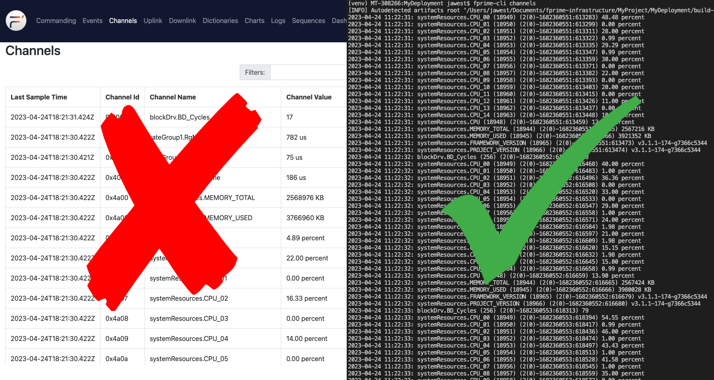

# The Discerning User's Guide to the F´ GDS CLI

This guide will give you a quick introduction to the F´ Ground Data System  Command Line Interface (`fprime-cli`),
how it can be used, and a detailed reference for interested users. `fprime-cli` allows for use of the most common F´ GDS
features without the need for a graphical environment. This enables projects easier access to F´ testing and operations
in more environments.

**Note:** Developer documentation is available in the [developer's CLI guide](../dev/gds-cli-dev.md).

- [What is `fprime-cli`?](#what-is-fprime-cli)
- [Getting Started](#getting-started)
    - [The Basics](#the-basics)
    - [Supplying F´ Dictionary](#supplying-f-dictionary)
    - [Using the Tools](#using-the-tools)
        - [Receiving Events and Channels](#receiving-events-and-channels)
        - [Sending Commands](#sending-commands)
- [Command Details](#command-details)
    - [channels](#channels)
    - [command-send](#command-send)
    - [events](#events)
- [Conclusion](#conclusion)



## What is `fprime-cli`?

The `fprime-cli` tool provides a command-line interface for working with F´s Ground Data System, as an alternative to
using the browser-based GUI. While graphical interfaces are often convenient, a command-line interface is still handy to
have for situations like the following:

-  Working remotely on a headless server
-  Analyzing data with existing command-line tools
-  Automating certain tasks through scripts
-  Pacifying hardcore command-line users in your office

In particular, the CLI tools for the GDS let you do 3 essential operations from the comfort of your shell:

- Send commands to the embedded system through the GDS layer
- View events emitted by the embedded into the F´ GDS
- Receive system telemetry through the GDS

Let's see how you can use these for yourself!

## Getting Started

`fprime-cli` is automatically installed when installing F´. In order to use it, make sure that your virtual environment
has been activated. To ensure the tool is ready, run `fprime-cli -h` and you should see the help usage. If an error is
received, ensure F´ is properly installed via [the installation guide](../../INSTALL.md) and that your virtual
environment has been activated.

`fprime-cli` connects to the `fprime-gds` ground system layer. Should the user wish to run `fprime-cli` make sure to
start an instance of the `fprime-gds` in headless mode `fprime-gds -g none`. More information can be found in the
[F´ GDS guide](./gds-introduction.md).  If the GDS is running on a non-standard port, supply the `-p` and `-id` flags
on any command below to connect to it. Without these flags, the default address of `127.0.0.1:50050` will be used.

### The Basics

All of the GDS CLI commands are run through the `fprime-cli` tool; if you run that all by itself, you should see a
help message like this:

```
$ fprime-cli
usage: fprime-cli [-h] [-V] {channels,command-send,events} ...

provides utilities for interacting with the F´ Ground Data System (GDS)

positional arguments:
  {channels,command-send,events}

optional arguments:
  -h, --help            show this help message and exit
  -V, --version         show the program's version number and exit
```

We can see there are 3 "positional arguments" we can provide here, corresponding to the 3 commands we can run:

- `channels` lets us receive the values of open telemetry channels on the embedded system
- `command-send` lets us send commands to the embedded system
- `events` lets us receive events the embedded system is recording

You can use each command by running `fprime-cli [COMMAND NAME]`, e.g. `fprime-cli events` or `fprime-cli channels`. To
learn more about each one, you can include the `-h` or `--help` flag after the command to print out the individualized
 command help messages (e.g. `fprime-cli events --help`) described below.

```bash
$ fprime-cli events --help
usage: fprime-cli events [-h] [-d DICTIONARY] [-ip IP] [-p PORT] [-t SECONDS]
                         [-l] [-i ID [ID ...]] [-c COMP [COMP ...]]
                         [-s STRING] [-j]

print out new events that have occurred on the F Prime instance, sorted by
timestamp

optional arguments:
  -h, --help            show this help message and exit
  -d DICTIONARY, --dictionary DICTIONARY
                        path from the current working directory to the
                        "<project name>Dictionary.xml" file for the project
                        you're using the API with; if unused, tries to search
                        the current working directory for such a file
  -ip IP, --ip-address IP
                        connect to the GDS server using the given IP or
                        hostname (default=127.0.0.1 (i.e. localhost))
  -p PORT, --port PORT  connect to the GDS server using the given port number
                        (default=50050)
  -t SECONDS, --timeout SECONDS
                        wait at most SECONDS seconds for a single new message,
                        then exit (defaults to listening until the user exits
                        via CTRL+C, and logging all messages)
  -l, --list            list all possible event types the current F Prime
                        instance could produce, based on the events
                        dictionary, sorted by event type ID
  -i ID [ID ...], --ids ID [ID ...]
                        only show events matching the given type ID(s) "ID";
                        can provide multiple IDs to show all given types
  -c COMP [COMP ...], --components COMP [COMP ...]
                        only show events from the given component name "COMP";
                        can provide multiple components to show events from
                        all components given
  -s STRING, --search STRING
                        only show events whose name or output string exactly
                        matches or contains the entire given string "STRING"
  -j, --json            return the JSON response of the API call, with events
                        filtered based on other flags provided
```

### Supplying F´ Dictionary

As mentioned, these CLI commands let you interact with the GDS through events and commands, and telemetry channels.
Through a *project F´ dictionary* the CLI can understand what commands, events and telemetry channels are available.
Every F´ project deployment will have a `*Dictionary.xml` file that's created when the project's deployment is built
In the `Ref` example project, it'll be the `Ref/Top/RefTopologyAppDictionary.xml` file.  By reading this file, the CLI
tool knows what to look for when it's reading or sending data to the GDS. If it doesn't know where the dictionary is,
then the CLI tool can't do much beyond printing out help messages.

When you run one of the CLI commands, the tool will automatically look for files ending in `Dictionary.xml` in your
current working directory and use the first one it can find. This behavior is similar to how `fprime-gds` searches for
dictionaries it uses to construct the browser GUI. If it can't find any dictionaries, it will print out an error message
like this:

```
fprime-cli: error: No valid project dictionary found
```

Running commands from your project folder (e.g. inside `fprime/Ref`) should work to find a dictionary, but if you want
to run commands for a different deployment or project, you can specify the dictionary file exactly using the
`--dictionary` option with the file's path. `fprime-cli command-send --dictionary Ref/Top/RefTopologyAppDictionary.xml`.

### Using the Tools

The `fprime-cli` commands can roughly be grouped into 2 categories:

- Ones that receive data through the GDS (`channels`, `events`)
- Ones that send data through the GDS (`command-send`)

#### Receiving Events and Channels

The first category contains `channels` and `events`. There are two very similar commands to respectively listen for any
telemetry channels or logged events coming from the embedded system through the GDS. These commands print out all the
data they receive to the console until the user stops them with `CTRL+C`. Since this can be quite a lot of data,
the user will often want to limit the data to items the user specifically cares about. There are several options to
filter which items are displayed:

- `-i`/`--ids` only prints data matching specified numeric IDs. e.g. `fprime-cli events --ids 1 2 3` will display events
    with IDs: 1, 2, or 3
- `-c`/`--components` only prints items generated by the specified component instance.
    e.g `fprime-cli channels --components pingRcvr` will only display data sent from the component named `pingRcvr`
- `s`/`--search` only prints strings containing the (case-sensitive) search term you provide. e.g. `fprime-cli events
    --search WARNING_LO` will only display `WARNING_LO` events
    -   Note that unlike the other two options, `--search` will only take a *single* search string

These filters can be combined together to further narrow your search (e.g. `fprime-cli channels -c pingRcvr
-s WARNING_LO` will only show `WARNING_LO` events from `pingRcvr`).

If you want to view a full list of all the events or channels available, you can use the `-l`/`--list` flag on a command
to list everything in the dictionary (e.g. `fprime-cli events -l` will list all known events for the project) and if
that's too much information, the same filtering options we just talked about work on `--list`'s output, too!

If you ever need the full programmatic guts of a response, you can also pass in the `-j/--json` flag to print out the
full data objects being received in JSON format. While this will include some redundant information, it's guaranteed to
show you all the information available and allow interaction with other tools.

#### Sending Commands

In the second category is the `command-send` command, which can be used to send commands through the GDS to the embedded
system. You can send commands by giving the *full name* of the command. These are typically formed by joining the
component instance name and command name with a '.' (e.g. `health.HLTH_CHNG_PING`). When the command needs arguments,
these can be passed in as a space-separated list using the `-args`/`--arguments` option. To send a command that does not
need arguments like `cmdDisp.CMD_NO_OP`, you would just run the following:

```
$ fprime-cli command-send cmdDisp.CMD_NO_OP
```

To send one that *does* need arguments like `health.HLTH_CHNG_PING`, the following would be run passing in all three
needed arguments.

```
$ fprime-cli command-send health.HLTH_CHNG_PING --arguments eventLogger 50 20
```


**Note:** If you need to pass in a string with spaces as an argument, just enclose it in quotes `"like this"`.

Similar to the other CLI tools, you can run `fprime-cli command-send -l` to get a list of the available commands and
the arguments they take. The same filter options are available to search for particular commands. If you have tab
completion enabled, you can also double-tap tab to view a list of potential commands based on what you've typed so far.

## Command Details

Each command's available interface is shown below for reference.  When in doubt use the `--help`  flag with the command
directly.

### `channels`

Help Message:

```
usage: fprime-cli channels [-h] [-d DICTIONARY] [-ip IP] [-p PORT]
                           [-t SECONDS] [-l] [-i ID [ID ...]]
                           [-c COMP [COMP ...]] [-s STRING] [-j]

print out new telemetry data that has been received from the F Prime instance,
sorted by timestamp

optional arguments:
  -h, --help            show this help message and exit
  -d DICTIONARY, --dictionary DICTIONARY
                        path from the current working directory to the
                        "<project name>Dictionary.xml" file for the project
                        you're using the API with; if unused, tries to search
                        the current working directory for such a file
  -ip IP, --ip-address IP
                        connect to the GDS server using the given IP or
                        hostname (default=127.0.0.1 (i.e. localhost))
  -p PORT, --port PORT  connect to the GDS server using the given port number
                        (default=50050)
  -t SECONDS, --timeout SECONDS
                        wait at most SECONDS seconds for a single new message,
                        then exit (defaults to listening until the user exits
                        via CTRL+C, and logging all messages)
  -l, --list            list all possible channel types the current F Prime
                        instance could produce, based on the channels
                        dictionary, sorted by channel type ID
  -i ID [ID ...], --ids ID [ID ...]
                        only show channels matching the given type ID(s) "ID";
                        can provide multiple IDs to show all given types
  -c COMP [COMP ...], --components COMP [COMP ...]
                        only show channels from the given component name
                        "COMP"; can provide multiple components to show
                        channels from all components given
  -s STRING, --search STRING
                        only show channels whose name or output string exactly
                        matches or contains the entire given string "STRING"
  -j, --json            return the JSON response of the API call, with
                        channels filtered based on other flags provided
```

### `command-send`

Help Message:

```
usage: fprime-cli command-send [-h] [-d DICTIONARY] [-ip IP] [-p PORT]
                               [-args [ARGUMENTS [ARGUMENTS ...]]] [-l]
                               [-i ID [ID ...]] [-c COMP [COMP ...]]
                               [-s STRING] [-j]
                               [command-name]

sends the given command to the spacecraft via the GDS

positional arguments:
  command-name          the full name of the command you want to execute in
                        "<component>.<name>" form

optional arguments:
  -h, --help            show this help message and exit
  -d DICTIONARY, --dictionary DICTIONARY
                        path from the current working directory to the
                        "<project name>Dictionary.xml" file for the project
                        you're using the API with; if unused, tries to search
                        the current working directory for such a file
  -ip IP, --ip-address IP
                        connect to the GDS server using the given IP or
                        hostname (default=127.0.0.1 (i.e. localhost))
  -p PORT, --port PORT  connect to the GDS server using the given port number
                        (default=50050)
  -args [ARGUMENTS [ARGUMENTS ...]], --arguments [ARGUMENTS [ARGUMENTS ...]]
                        provide a space-separated set of arguments to the
                        command being sent
  -l, --list            list all possible command types the current F Prime
                        instance could produce, based on the commands
                        dictionary, sorted by command type ID
  -i ID [ID ...], --ids ID [ID ...]
                        only show commands matching the given type ID(s) "ID";
                        can provide multiple IDs to show all given types
  -c COMP [COMP ...], --components COMP [COMP ...]
                        only show commands from the given component name
                        "COMP"; can provide multiple components to show
                        commands from all components given
  -s STRING, --search STRING
                        only show commands whose name or output string exactly
                        matches or contains the entire given string "STRING"
  -j, --json            return the JSON response of the API call, with
                        commands filtered based on other flags provided
```

### `events`

Help message:

```
usage: fprime-cli events [-h] [-d DICTIONARY] [-ip IP] [-p PORT] [-t SECONDS]
                         [-l] [-i ID [ID ...]] [-c COMP [COMP ...]]
                         [-s STRING] [-j]

print out new events that have occurred on the F Prime instance, sorted by
timestamp

optional arguments:
  -h, --help            show this help message and exit
  -d DICTIONARY, --dictionary DICTIONARY
                        path from the current working directory to the
                        "<project name>Dictionary.xml" file for the project
                        you're using the API with; if unused, tries to search
                        the current working directory for such a file
  -ip IP, --ip-address IP
                        connect to the GDS server using the given IP or
                        hostname (default=127.0.0.1 (i.e. localhost))
  -p PORT, --port PORT  connect to the GDS server using the given port number
                        (default=50050)
  -t SECONDS, --timeout SECONDS
                        wait at most SECONDS seconds for a single new message,
                        then exit (defaults to listening until the user exits
                        via CTRL+C, and logging all messages)
  -l, --list            list all possible event types the current F Prime
                        instance could produce, based on the events
                        dictionary, sorted by event type ID
  -i ID [ID ...], --ids ID [ID ...]
                        only show events matching the given type ID(s) "ID";
                        can provide multiple IDs to show all given types
  -c COMP [COMP ...], --components COMP [COMP ...]
                        only show events from the given component name "COMP";
                        can provide multiple components to show events from
                        all components given
  -s STRING, --search STRING
                        only show events whose name or output string exactly
                        matches or contains the entire given string "STRING"
  -j, --json            return the JSON response of the API call, with events
                        filtered based on other flags provided
```

## Conclusion

The user should now be able to successfully use the GDS cli to connect to a running GDS, send commands, receive events
and telemetry, and filter the results to be manageable. All this is done through the command line using this tool.