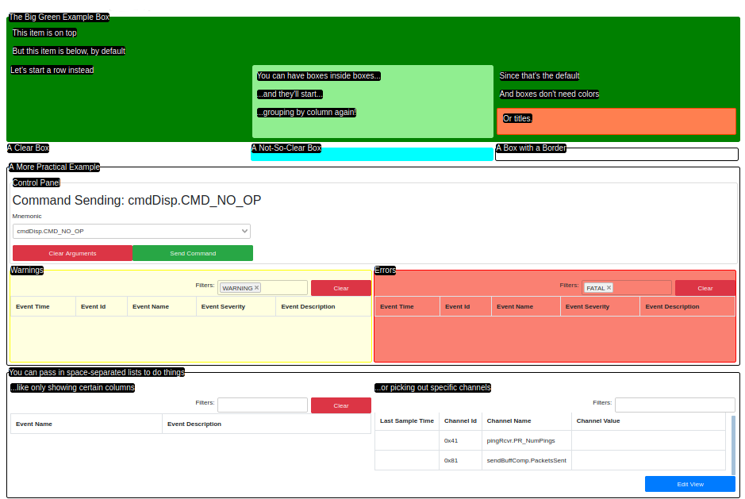

# The GDS Dashboard

The GDS Dashboard lets users create a customizable view for displaying data available to the GDS. Each of these views is
customizable for the project to display exactly what they need to see and nothing else. Users are able to choose view
components and modify them to suit project needs. Currently, there are 7 components to choose from:

-   `dashboard-box` groups components together visually
-   `dashboard-row` helps organize components horizontally
-   `command-input` sends commands to the embedded system
-   `command-history` displays previously-sent commands
-   `event-list` displays events the GDS receives
-   `channel-table` displays telemetry data from the spacecraft
-   `logging` displays logged messages stored as the GDS runs

Through an XML specification, users can set up their dashboard and upload it to the F´ GDS to enable it in the system.
Once uploaded, the Dashboard should load the file and assemble the specified GUI as long as the XML is error-free.

A more complete reference is available here: [GDS Dashboard Reference](../dev/gds-dashboard-reference.md).

- [How to Use the Dashboard](#how-to-use-the-dashboard)
- [Setting Up XML Configuration Files](#setting-up-xml-configuration-files)
- [Customizing Components](#customizing-components)
- [An Example Dashboard Configuration](#an-example-dashboard-configuration)
- [Conclusion](#conclusion)


## How to Use the Dashboard

1.  Start running the GDS GUI for your application by running `fprime-gds` in your deployment folder. Further
    instructions can be found here: [GDS Introduction](./gds-introduction.md)
2.  Navigate to the "Dashboard" tab using the navigation buttons at the top
3.  Click "Browse" and select an XML configuration file containing your dashboard setup
4.  The new Dashboard should render in the Dashboard tab.

The browser will save your most recently-used Dashboard configuration and use it automatically when you restart the GUI.
At any point, you can upload a new configuration file to change your Dashboard.

## Setting Up XML Configuration Files

The dashboard is driven by loading an XML file that specifies the layout of this tab.  In this, and the next few
sections the XML format will be discussed.  At its most basic, the XML format is HTML with a few extra custom F´ tags
used to display our components.  HTML may be used to help the user achieve the display they'd like, however; the entire
display can be configured from our custom components and thus no HTML knowledge is required.

Here are some basic rules on how the layout will be displayed:
- Components will stack top to bottom using 100% width, unless components are inside a `dashboard-row`
- Components inside a `dashboard-row` will instead layout horizontally left to right.
    - If multiple components are inside a `dashboard-row` the elements will split the width. e.g. Four components each
      get 25% of the page width.
- `dashboard-box` and `dashboard-row` grow to contain all the components included and are limited to the maximum width
- Other components have a fixed height and variable width with scrollbars that appear when the component overflows
- Components will stay in the same row regardless of the page size and always maintain relative ordering

The dashboard supports the following components shown below.

| Component | Function | Available F´ Fields |
|----|----|----|
| <dashboard-row>...</dashboard-row> | Horizontal container for other components | |
| <dashboard-box>...</dashboard-box> | Box container for other components        | title  |
| <command-input/>   | Command builder and transmission component     | fields, filter-text, items-shown, compact |
| <command-history/> | List of commands sent as tracked by the GDS    | fields, filter-text, items-shown, compact |
| <event-list/>      | Ordered list of events received by the GDS     | fields, filter-text, items-shown, compact |
| <channel-table/>   | Latest channel readings as received by the GDS | fields, filter-text, items-shown, compact |

## Customizing Components

Individual components may be customized by passing in properties to them in the form of XML attributes. There are
several general properties available to many components. Some components allow for other properties that are shown in
the above table.

| Property | Description | Type | Valid values |
|---|---|---|---|
| title        | Title added as a label for box      | string  | any |
| color        | Background color applied to box     | string  | [Any CSS color](https://www.w3.org/wiki/CSS/Properties/color/keywords) |
| border-color | Color of border around the box      | string  | [Any CSS color](https://www.w3.org/wiki/CSS/Properties/color/keywords) |
| fields       | List of fields (columns) shown      | list    | any column field names |
| filter-text  | Text to filter displayed items      | string  | any |
| items-shown  | Names of items to restrict display  | list    | any |
| compact      | Use minimalist display of component | keyword | |

Two of the most basic properties are described below. These were chosen because they show an example of using a string
property and a space-separated list property.  Keyword properties are specified without the `=...` portion and thus are
not described.

### Title Property

The title property is used to add a title to other components. This helps label the display such that it is easier to
understand. The title property can be set by specifying the XML attribute as a string just as it is shown below.

```xml
    <dashboard-box title="A Giant Blob of Data">
    ...
```

### Fields Property

The fields property is used to restrict any of the table-driven components to minimize the number of columns that are
shown. Thus, users can show just the columns of interest and ignore the others associated with the table owned by the
component. This property is a list of space-separated values, and uses single quotes (') to contain values that
included spaces. An example of both is shown below:

```xml
    <channel-table fields="Description 'Channel Value' 'Channel Name'">
 ```

Each component type has different properties that can be used to customize it. All properties for components are
completely optional and omitted properties will use a default value. These properties are described in full below.

## An Example Dashboard Configuration

This section will provide an example dashboard configuration file. It shows how to compose various structures using the
structural components as well as examples of using the existing F´ display components.  The dashboard we will explore
will be rendered into the following display.



This view was rendered from the following XML.  It is designed to be somewhat self-descriptive and should act as a good
starting point for building your own dashboards.

```xml
<dashboard-box title="The Big Green Example Box" color="green">
    <dashboard-box title="This item is on top"/>
    <dashboard-box title="But this item is below, by default"/>
    <dashboard-row>
        <dashboard-box title="Let's start a row instead"/>
        <dashboard-box color="lightgreen">
            <dashboard-box title="You can have boxes inside boxes..."/>
            <dashboard-box title="...and they'll start..."/>
            <dashboard-box title="...grouping by column again!"/>
        </dashboard-box>
        <dashboard-box>
            <dashboard-box title="Since that's the default"/>
            <dashboard-box title="And boxes don't need colors"/>
            <dashboard-box color="coral" border-color="orangered">
                <dashboard-box title="Or titles."/>
            </dashboard-box>
        </dashboard-box>
    </dashboard-row>
</dashboard-box>

<dashboard-row>
    <dashboard-box title="A Clear Box"/>
    <dashboard-box title="A Not-So-Clear Box" color="aqua"/>
    <dashboard-box title="A Box with a Border" border-color="black"/>
</dashboard-row>

<dashboard-box title="A More Practical Example" border-color="black">
    <dashboard-box title="Control Panel" border-color="gainsboro">
        <command-input/>
    </dashboard-box>

    <dashboard-row>
        <dashboard-box title="Warnings" color="lightyellow" border-color="yellow">
            <event-list filter-text="WARNING"/>
        </dashboard-box>
        <dashboard-box title="Errors" color="salmon" border-color="red">
            <event-list filter-text="FATAL"/>
        </dashboard-box>
    </dashboard-row>
</dashboard-box>

<dashboard-box title="You can pass in space-separated lists to do things" border-color="black">
    <dashboard-row>
        <dashboard-box title="...like only showing certain columns">
            <event-list fields="'Event Name' 'Event Description'"/>
        </dashboard-box>
        <dashboard-box title="...or picking out specific channels">
            <channel-table items-shown="pingRcvr.PR_NumPings sendBuffComp.PacketsSent"/>
        </dashboard-box>
    </dashboard-row>
</dashboard-box>
```

## Conclusion

This guide has introduced and walked through an example of the XML dashboards available to help customize the F´ GDS
GUI. Users may use the technology to build their own views into the system. A more complete reference for the components
used to build the GUI is available here: [GDS Dashboard Reference](../dev/gds-dashboard-reference.md).