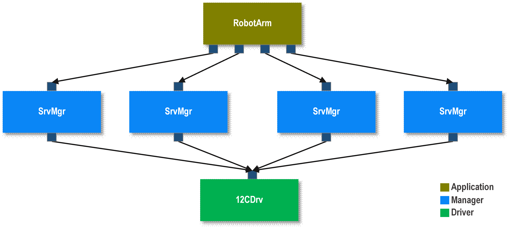

# Application-Manager-Driver Architecture

Standard F´ applications typically break down into various layers. This is done to apply standard software layering
techniques to F´ applications. Each layer is dependent on layers below it, however; these layers do not depend on layers
above them. These layers are composed of individual modules (usually **Components**) that represent concrete units of
functionality. These units have defined interfaces for communicating with other modules. In F´ these interfaces are the
list of **Ports** the component uses.

This guide covers the following:
- [A Brief on Software System Architecture](#a-brief-on-software-system-architecture)
    - [Software Layering](#software-layering)
- [Application Manager Driver Pattern](#application-manager-driver-pattern)
    - [Application Component](#application-component)
    - [Manager Component](#manager-component)
    - [Driver Component](#driver-component)
-[Conclusion](#conclusion)

## A Brief on Software System Architecture

The software system architecture is designed to break down software into modules. These modules provide separation of functions, definitions of interfaces, behavioral characteristics, testing at the unit level, and ownership. These modules are known as **Components** in F´ and all external functions of the component are defined as an interface for interacting with the component. In F´ the component’s **Port** list is its external interface. In addition, initialization functions and Constructors allow for setup and construction from the main thread.

### Software Layering

Software layering allows the separation of concerns by implementing logic such that a module only interacts with the layer below it. In addition, layering allows for decoupling code dependencies, as upper layers depend down the later stack, but layers do not depend up the stack. Thus preventing circular dependencies.

Layers can be replaced to support reusability, simulation, and testing. Fault protection can be isolated to a single layer and thus handled at the appropriate level.

## Application Manager Driver Pattern

The F′ component architecture comfortably fits into a layered software architecture. This can be done using an F´ design
pattern known as the Application Manager Driver pattern. F´ applications are assembled into layers of components. There
are typically three layers to this design pattern:

 1. application
 2. manager
 3. driver

These layers are further discussed below using the example shown in Figure 1. Each layer defines components for only
that layer’s functionality.

**Figure 1.** The three layers to a component model as shown in an example that drives a robotic arm using four servos
attached to an I2C bus.

## Application Component

The application layer implements mission specific functionality. It is the layer that defines cross-cutting
functionality that links together many parts of the system. However, it is not privy to the details of the parts of the
system. It represents system logic and uses peripherals and other components to perform the detailed behaviors of the F´
application.

In our example, the application level performs the function of a robotic arm, however; it only knows that the arm is
composed of servos and the high-level interface to those servos, but knows nothing of the hardware interface to
run those servos nor how to translate high-level servo interface into data packets.

## Manager Component

The manager layer manages a particular peripheral by using the interface driver at the abstract level (through the
driver’s interface of ports). The manager does not know how the peripheral will be used by the application. It does not
even know that it is used at all by the Application. However, the manager does know of the driver that is used
to talk to its peripheral and how to translate high-level commands into driver messages.

In our example, a servo manager is defined to know how to control servos through a driver and provides a generic
high-level servo interface to any application that might use servos.

## Driver Component

The driver layer is dedicated to a particular hardware interface. It is written to interact with only that type of
device, and does not need to know the use of hardware connected at the other end of the driver.

In the example, the driver provides an interface to the hardware device (I2C), but not an interface to the servo. It is
up to the manager to know how to control the servo via the driver. In our example, the driver runs an I2C bus but doesn't
know what I2C hardware it is talking to.

## Conclusion

By layering F´ projects using the Application Manager Driver pattern, standard software architecture techniques can be
adapted to an F´ project. In complex systems, there are often more components (multiple drivers, multiple managers) at
each layer, but these components should still fit into a single layer.