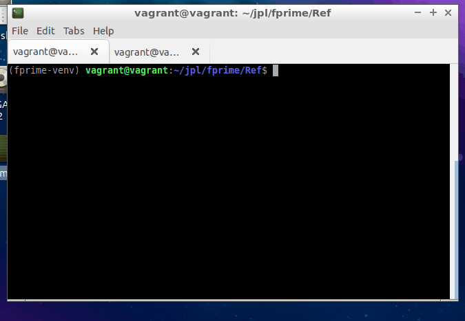

# Autocomplete: Tab Completion for Command-Line Tools

This guide will walk the user through installing command line tools autocomplete feature. This works when being run on
many common shells including bash, fish, and tcsh. Due to the support library we use, we are unable to support shells outside of the shells supported by this library.

While you can start using the GDS command line tools immediately after installing F´, turning on autocomplete will
require the few additional steps described herein. Using autocomplete is as simple as pressing the `[TAB]` and the
active command line options will fill in. If more than one option is available, you can hit `[TAB]` twice to display
all possible choices and continue typing until there is only one matching choice left.

This guide will cover:
- [Installing Autocomplete](#installing-autocomplete)
    - [Manual Activation (Run In Each New Shell)](#manual-activation-run-in-each-new-shell)
    - [Activating With Python Virtual Environment](#activating-with-python-virtual-environment)
- [Autocomplete Tool Support](#autocomplete-tool-support)
- [Further Information](#further-information)
- [Conclusion](#conclusion)



## Installing Autocomplete

Once F´ is installed the following commands can be used to set up autocomplete. Autocomplete operates by registering some
variables into the active shell. Thus, the user has two options to work with these tools: manual setup in each shell and
activating along with the virtual environment. Manually activating per-shell requires a manual step but does not
change the Python-managed virtual environment file. Activating along with the virtual environment is convenient, but
edits a file that is managed by Python and issues may arise across Python versions.

**Note:** It is possible to add these commands to a `.bashrc` or `.cshrc` file but this is outside the scope of this
guide.

### Manual Activation (Run In Each New Shell)

These Commands can be run directly in each shell to provide autocomplete. This setup will end when the shell process is
closed, so they should be run on each new shell that is opened.

**Bash:** `eval "$(register-python-argcomplete fprime-cli)"`

**zsh**:
1. Enable `bashcompinit` by running the following:
    ```bash
    autoload -U bashcompinit
    bashcompinit
    ```
2.  Run `eval "$(register-python-argcomplete fprime-cli)"`

**fish**: Run `register-python-argcomplete --shell fish fprime-cli | source`

**tcsh**: Run ``eval `register-python-argcomplete --shell tcsh fprime-cli` ``

### Activating With Python Virtual Environment

Since most users run F´ through a virtual environment, it would be easy to place the above commands into the virtual
environment activation script. In this way, every time the user activates the environment to work with F´, autocomplete
is also activated. However, making these changes change the virtual environment's activation scripts, which could have
unanticipated effects should the virtual environment file format change.  This is unlikely and reinstalling F´ while
omitting this section would fix any problems caused by this.

**zsh pre-setup**: Enable `bashcompinit` by running the following:
```bash
autoload -U bashcompinit
bashcompinit
```

**Bash/zsh**: `register-python-argcomplete fprime-cli >> $VIRTUAL_ENV/bin/activate`

**fish**: `register-python-argcomplete --shell fish fprime-cli >> $VIRTUAL_ENV/bin/activate.fish`

**tcsh**: `register-python-argcomplete --shell tcsh fprime-cli >> $VIRTUAL_ENV/bin/activate.csh`

**Note:** to take advantage of these changes immediately, reactivate the virtual environment at this point.

## Autocomplete Tool Support

Autocomplete is currently available with the `fprime-cli` tool.  Support for `fprime-util` and `fprime-gds` is coming
soon. Currently, you can use tab completion in the GDS CLI tool to complete sub-command names, options, file paths, and
even the available commands on the F´ instance you're running.

## Further Information

F´ has its CLI tools written in Python, and we've implemented tab completion through the
[argcomplete](https://github.com/kislyuk/argcomplete) library. If you have any troubleshooting concerns, want to extend
these tools, or need to explore more advanced settings, this documentation would be the starting point for
troubleshooting.

## Conclusion

This guide walked the user through several options to install command line autocompletion where it is supported. The
user is completely capable of running without this support but it may prove helpful to some users.