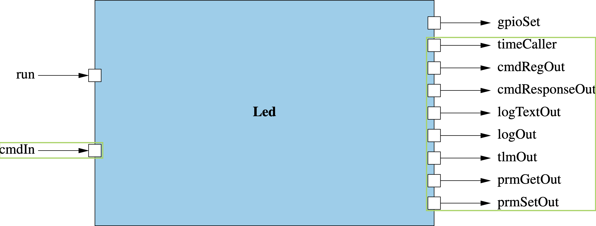

# LED Blinker: An F´ Tutorial on Physical Hardware
Reference: [LED Blinker Tutorial Github Repository](https://github.com/fprime-community/fprime-workshop-led-blinker)

This is designed to be an extended introductory F´ tutorial taking the user through the basics of creating components,
using events, telemetry, commands, and parameters, and integrating topologies with the goal of running F´ on embedded
hardware. Users will be guided through the process of software development and testing on embedded Linux running on an
ARM processor (e.g. RaspberryPI, Odroid, etc).

## Prerequisites

In order to run through this tutorial, you must first do the following:

1. Meet the [F´ System Requirements](../../../getting-started/installing-fprime.md#system-requirements)
2. Install an IDE or text editor supporting copy-paste. [VSCode](https://code.visualstudio.com/) has [plugins](https://marketplace.visualstudio.com/items?itemName=unlv-team5.fpptools) to work with FPP.
3. Attempt the [Hello World Tutorial](../hello-world.md)

To run on hardware with cross-compiling, you must also:

1. Acquire and set up the appropriate [hardware](hardware.md) for this tutorial
2. Set up a [cross-compiling environment](../cross-compilation.md#cross-compilation-setup) for their ARM processor

!!! note
    Attendees to an in-person F´ workshop will have access to 64-bit ARM hardware and should set up the 64-bit cross compiling environment.

## Tutorial Steps

This tutorial is composed of the following steps:

1. [Project Setup](#1-led-blinker-project-setup)
2. [Requirements Specification](#2-specifying-requirements)
3. [Component Design and Initial Implementation](#3-led-blinker-component-design-and-initial-implementation)
4. [Initial Component Integration](#4-led-blinker-initial-component-integration)
5. [Continuing Component Implementation](#5-led-blinker-continuing-component-implementation)
6. [Full System Integration](#6-led-blinker-full-system-integration)
7. [Running on Hardware](#7-led-blinker-running-on-hardware)
8. [Unit-Testing](#8-led-blinker-unit-testing)
9. [System Testing](#9-system-testing)
10. [Conclusion](#10-led-blinker-conclusion)

---

## 1. LED Blinker: Project Setup

!!! note
    if you have followed the [HelloWorld tutorial](../hello-world.md) previously, this should feel very familiar...

An F´ Project ties to a specific version of tools to work with F´. In order to create
this project and install the correct version of tools, you should perform a bootstrap of F´.

To do this you should follow the following steps from the [F´ installation guide](../../../getting-started/installing-fprime.md):

1. Ensure you meet the [F´ System Requirements](../../../getting-started/installing-fprime.md#system-requirements)
2. [Bootstrap your F´ project](../../../getting-started/installing-fprime.md#creating-a-new-f-project) with the name `led-blinker`

Bootstrapping your F´ project created a folder called `led-blinker` (or any name you chose) containing the standard F´ project structure as well as the virtual environment up containing the tools to work with F´.

Next, generate a build cache using the following commands:

```
cd led-blinker
fprime-util generate
```

---

## 2. Specifying Requirements

In this addendum to the tutorial, you will learn a bit about specifying requirements. Software requirements are derived from higher-level system requirements and represent the detail needed to implement the software.

### System Requirements

For this tutorial we have several higher-level system requirements. These requirements would be defined by requirements specified by the electronics subsystem which are themselves derived by requirements defined at the full system level.

| Requirement     | Description                                              |
|-----------------|----------------------------------------------------------|
| ELECTRONICS-001 | The system shall blink an LED in response to a command.  |
| ELECTRONICS-002 | The blink rate of the LED shall be changeable in-flight. |

### Software Requirements

These are the requirements that the software team cares about. These dictate how the software should operate and trace to the higher-level system requirements. These also come with a verification method to ensure the software meets these requirements.

Ideally, the software engineer would be handed these requirements, however; in-practice this is often a discussion between the software engineer and their system engineers. A sample requirement is provided below.

| Requirement     | Description                                                     | Derives From    | Verification |
|-----------------|-----------------------------------------------------------------|-----------------|--------------|
| LED-BLINKER-001 | The software shall start LED blinking in response to a command. | ELECTRONICS-001 | Unit Test    |

!!! warning
    Take a moment to identify some other requirements you might derive from the above electronics requirements. Do this before moving on to the next section.

### LED Blinker

Here we list a number of requirements for our LED software to implement.

| Requirement     | Description                                                     | Derived From    | Verification |
|-----------------|-----------------------------------------------------------------|-----------------|--------------|
| LED-BLINKER-001 | The software shall start LED blinking in response to a command. | ELECTRONICS-001 | Unit Test    |
| LED-BLINKER-002 | The software shall stop LED blinking in response to a command.  | ELECTRONICS-001 | Unit Test    |
| LED-BLINKER-003 | The software shall telemeter the current LED blinking state.    | ELECTRONICS-001 | Unit Test    |
| LED-BLINKER-004 | The software shall emit events when the blinking state changes. | ELECTRONICS-001 | Unit Test    |
| LED-BLINKER-005 | The software shall store the blink interval as a parameter.     | ELECTRONICS-002 | Unit Test    |
| LED-BLINKER-006 | The software shall blink the LED using GPIO pin 13              | Electrical ICD  | Unit Test    |

!!! note
    Notice how the software also includes a requirement that derived from the Electrical Interface Control Document. This captures the details of the software/hardware interface and is captured here as a requirement.

---


## 3. LED Blinker: Component Design and Initial Implementation

The purpose of this exercise is to walk you through the creation and initial implementation of an F´ component to control the blinking of an LED. This section will discuss the design of the full component, the implementation of a command to start/stop the LED blinking, and the sending of events.  Users will then proceed to the initial ground testing before finishing the implementation in a later section.

### Component Design

In order for our component to blink an LED, it needs to accept a command to turn on the LED and drive a GPIO pin via a port call to the GPIO driver. It will also need a [rate group](../../user-manual/design/rate-group.md) input port to control the timing of the blink. Additionally, we will define events and telemetry channels to report component state, and a parameter to control the period of the blink.

This component design is captured in the block diagram below with input ports on the left and output ports on the right. Ports for standard F´ functions (e.g. commands, events, telemetry, and parameters) are circled in green.



In this exercise, the `BLINKING_ON_OFF` command shall toggle the blinking state of the LED. The period of the blinking is controlled by the `BLINK_INTERVAL` parameter. Blinking is implemented on the `run` rate group input port. The component also defines several telemetry channels and events describing the various actions taken by the component.

#### Design Summary

**Component Ports:**

1. `run`: invoked at a set rate from the rate group, used to control the LED blinking
2. `gpioSet`: invoked by the `Led` component to control the GPIO driver

!!! note
    Standard component ports (circled in green) are not listed here.

**Commands:**

1. `BLINKING_ON_OFF`: turn the LED blinking on/off

**Events:**

1. `InvalidBlinkArgument`: emitted when an invalid argument was supplied to the `BLINKING_ON_OFF` command
2. `SetBlinkingState`: emitted when the component sets the blink state
3. `BlinkIntervalSet`: emitted when the component blink interval parameter is set
4. `LedState`: emitted when the LED is driven to a new state

**Telemetry Channels:**

1. `BlinkingState`: state of the LED blinking
2. `LedTransitions`: count of the LED transitions

**Parameters:**

1. `BLINK_INTERVAL`: LED blink period in number of rate group calls

### Create the component

It is time to create the basic component. In a terminal, navigate to the project's root directory and run the following:

```bash
# In led-blinker
cd Components

fprime-util new --component
```
You will be prompted for information regarding your component. Fill out the prompts as shown below:

```bash
[INFO] Cookiecutter source: using builtin
Component name [MyComponent]: Led
Component short description [Example Component for F Prime FSW framework.]: Component to blink an LED driven by a rate group
Component namespace [Components]: Components
Select component kind:
1 - active
2 - passive
3 - queued
Choose from 1, 2, 3 [1]: 1
Enable Commands?:
1 - yes
2 - no
Choose from 1, 2 [1]: 1  
Enable Telemetry?:
1 - yes
2 - no
Choose from 1, 2 [1]: 1
Enable Events?:
1 - yes
2 - no
Choose from 1, 2 [1]: 1
Enable Parameters?:
1 - yes
2 - no
Choose from 1, 2 [1]: 1
[INFO] Found CMake file at 'led-blinker/Components/CMakeLists.txt'
Add component Led to led-blinker/Components/CMakeLists.txt at end of file (yes/no)? yes
Generate implementation files (yes/no)? yes
```
Your new component is located in the directory `led-blinker/Components/Led`.

### Component State

Many of the behaviors of the component discussed in the [Component Design](#component-design) section require the tracking of some state. Before diving into the implementation of the behavior let us set up and initialize that state.

Open `Led.hpp` in `led-blinker/Components/Led`. Add the following to the top of the `Led.hpp`:

```c++
#include <Os/Mutex.hpp>
```

Next, add the following private member variables to the end of the file just before the two closing `}` of the class defintion and namespace.

```cpp
    Os::Mutex lock; //! Protects our data from thread race conditions
    Fw::On state; //! Keeps track if LED is on or off
    U64 transitions; //! The number of on/off transitions that have occurred from FSW boot up
    U32 count; //! Keeps track of how many ticks the LED has been on for
    bool blinking; //! Flag: if true then LED blinking will occur else no blinking will happen
```

Open `Led.cpp` in `led-blinker/Components/Led`, and initialize your member variables in the constructor:

```cpp
Led ::Led(const char* const compName) : LedComponentBase(compName),
    state(Fw::On::OFF),
    transitions(0),
    count(0),
    blinking(false)
{}
```

Now that the member variables are set up, we can continue into the component implementation.

!!! note
    The above code will fail to find the `Fw::On` enum type until we use it in the FPP model in the next section. To fix immediately, add `#include <Fw/Types/OnEnumAc.hpp>` to the top of `Led.hpp`.

#### Commands

Commands are used to command the component from the ground system or a command sequencer. We will add a command named `BLINKING_ON_OFF` to turn on or off the blinking LED. This command will take in an argument named `on_off` of type `Fw.On`.


Inside your `led-blinker/Components/Led` directory, open the file `Led.fpp` and search for the following:

```
        # One async command/port is required for active components
        # This should be overridden by the developers with a useful command/port
        @ TODO
        async command TODO opcode 0
```

Replace that block with the following:

```
        @ Command to turn on or off the blinking LED
        async command BLINKING_ON_OFF(
            on_off: Fw.On @< Indicates whether the blinking should be on or off
        )
```

Save the file, exit the text editor, and run the following in the `led-blinker/Components/Led` directory:

```bash
# In led-blinker/Components/Led
fprime-util impl
```

This command will auto generate two files: Led.hpp-template and Led.cpp-template. These files contain the stub implementation for the component. These should now include stubs for this newly added command.

Inside your `led-blinker/Components/Led` directory, open `Led.hpp-template` and copy the following block of code. Paste it in replacement of the `TODO_cmdHandler` block in `Led.hpp`.

```cpp
      //! Implementation for BLINKING_ON_OFF command handler
      //! Command to turn on or off the blinking LED
      void BLINKING_ON_OFF_cmdHandler(
          const FwOpcodeType opCode, /*!< The opcode*/
          const U32 cmdSeq, /*!< The command sequence number*/
          Fw::On on_off /*!< 
          Indicates whether the blinking should be on or off
          */
      );
```

Inside your `led-blinker/Components/Led` directory, open `Led.cpp-template` and copy the following block of code and paste it into `Led.cpp` replacing the `TODO_cmdHandler` block.

```cpp
  void Led ::
    BLINKING_ON_OFF_cmdHandler(
        const FwOpcodeType opCode,
        const U32 cmdSeq,
        Fw::On on_off
    )
  {
    // TODO
    this->cmdResponse_out(opCode,cmdSeq,Fw::CmdResponse::OK);
  }
```

!!! note
    This pattern of copying implementations from *-template files into our cpp and hpp files will be repeated throughout the rest of this tutorial.


Now we will implement the behavior of the `BLINKING_ON_OFF` command. An initial implementation is shown below and may be copied into `Led.cpp` in-place of the stub we just copied in.

```cpp
  void Led ::
    BLINKING_ON_OFF_cmdHandler(
        const FwOpcodeType opCode,
        const U32 cmdSeq,
        Fw::On on_off
    )
  {
    // Create a variable to represent the command response
    auto cmdResp = Fw::CmdResponse::OK;

    // Verify if on_off is a valid argument.
    // Note: isValid is an autogenerate helper function for enums defined in fpp.
    if(!on_off.isValid())
    {
        // TODO: Add an event that indicates we received an invalid argument.
        // NOTE: Add this event after going through the "Events" exercise.

        // Update command response with a validation error
        cmdResp = Fw::CmdResponse::VALIDATION_ERROR;
    }
    else
    {
      this->count = 0; // Reset count on any successful command
      this->lock.lock();
      this->blinking = Fw::On::ON == on_off; // Update blinking state
      this->lock.unlock();

      // TODO: Add an event that reports the state we set to blinking.
      // NOTE: This event will be added during the "Events" exercise.

      // TODO: Report the blinking state via a telemetry channel.
      // NOTE: This telemetry channel will be added during the "Telemetry" exercise.
    }

    // Provide command response
    this->cmdResponse_out(opCode,cmdSeq,cmdResp);
  }
```
!!! note
    `lock.lock()` locks the mutex used to protect the `blinking` member variable as it is set in `BLINKING_ON_OFF_cmdHandler` but will be read elsewhere.

Save the file then run the following command in the terminal to verify your component is building correctly.

```bash
# In led-blinker/Components/Led
fprime-util build
```

!!! warning
    Fix any errors that occur before proceeding with the rest of the tutorial.

### Events

Events represent a log of system activities. Events are typically emitted any time the system takes an action. Events are also emitted to report off-nominal conditions. Our component has four events, two that this section will show and two are left to the student.

Back inside your `led-blinker/Components/Led` directory, open the `Led.fpp` file. After the command you added in the previous section, add two events:

```
        @ Indicates we received an invalid argument.
        event InvalidBlinkArgument(badArgument: Fw.On) \
            severity warning low \
            format "Invalid Blinking Argument: {}"

        @ Reports the state we set to blinking.
        event SetBlinkingState(state: Fw.On) \
            severity activity high \
            format "Set blinking state to {}."
```

Save the file and in the terminal, run the following to verify your component is building correctly.

```bash
# In led-blinker/Components/Led
fprime-util build
```
!!! warning
    Resolve any errors before continuing.

Now open `Led.cpp` in your `led-blinker/Components/Led` directory and navigate to the `BLINKING_ON_OFF` command. Report via our new event when there is an error in the input argument.

To do so, replace:
```cpp
        // TODO: Add an event that indicates we received an invalid argument.
        // NOTE: Add this event after going through the "Events" exercise.
```

with:
```cpp
        this->log_WARNING_LO_InvalidBlinkArgument(on_off);
```

Similarly, use an event to report the blinking state has been set.

Replace the following:
```cpp
      // TODO: Add an event that reports the state we set to blinking.
      // NOTE: This event will be added during the "Events" exercise.
```

with:
```cpp
      this->log_ACTIVITY_HI_SetBlinkingState(on_off);
```

Save the file and in the terminal, run the following to verify your component is building correctly.

```bash
fprime-util build
```

!!! warning
    Resolve any `fprime-util build` errors before continuing

### Try it yourself

Below is a table with tasks you should complete. These tasks require you to go back into the component's files and add the missing lines.

| Task | Missing lines |
|-------|-------------|
| 1. Add an event named `BlinkIntervalSet` to the fpp. The event takes an argument of `U32` type to indicate the set interval. | `event BlinkIntervalSet(interval: U32) severity activity high format "LED blink interval set to {}"` |
| 2. Add an event named `LedState` to the fpp. The event takes an argument of `Fw.On` type to indicate the LED has been driven to a different state. | `event LedState(on_off: Fw.On) severity activity low format "LED is {}"` |

Save all files and in the terminal, run the following to verify your component is building correctly.

```bash
# In led-blinker/Components/Led
fprime-util build
```

!!! warning
    Resolve any `fprime-util build` errors before continuing

### LED Blinker Step 3 Conclusion

Congratulations!  You have now implemented some basic functionality in a new F´ component. Before finishing the implementation, let's take a break and try running the above command through the ground system. This will require integrating the component into the system topology, which we will get into in the next section.

---


## 4. LED Blinker: Initial Component Integration

In this section, users will create a deployment and perform the initial integration of the LED component into that deployment. This deployment will automatically include the basic command and data handling setup needed to interact with the component. Wiring the `Led` component to the GPIO driver component will be covered in a later section after the component implementation has finished.

!!! note
    Users must have created the [initial Led component implementation](#4-led-blinker-initial-component-integration) in order to run through this section. Users may continue to define commands, events, telemetry, and ports after this initial integration.

### Creating the `LedBlinker` Deployment

In order to produce an executable to run the software, users need to create a deployment. A deployment is one software executable that contains the main entry point, and an F´ system topology.

Create a new deployment in the `led-blinker` directory with:

```shell
#In led-blinker
fprime-util new --deployment
```

This will ask for some input, respond with the following answers:
```shell
[INFO] Cookiecutter: using builtin template for new deployment
Deployment name [MyDeployment]: LedBlinker
Select communication driver type:
1 - TcpClient
2 - TcpServer
3 - UART
Choose from 1, 2, 3 [1]: 2
[INFO] Found CMake file at 'led-blinker/project.cmake'
Add component LedBlinker to led-blinker/project.cmake at end of file? (yes/no) [yes]: 
```
!!! note
    Use the default response for any other questions asked.

In order to check that the deployment was created successfully, the user can build the deployment. This will build the code for the current host system, not the remote embedded hardware allowing local testing during development. 

```shell
# In led-blinker
cd LedBlinker
fprime-util build
```

!!! note
    This will reuse the build cache created during the project creation. CMake warnings may appear to indicate that the build cache is refreshing. The build should start shortly thereafter.

### Adding `Led` Component To The Deployment

The component can now be added to the deployment's topology effectively adding this component to the running system. This is done by modifying `instances.fpp` and `topology.fpp` in the `Top` directory.

Add the following to `led-blinker/LedBlinker/Top/instances.fpp`.  Typically, this is added to the "Active component instances" section of that document.

```
  instance led: Components.Led base id 0x0E00 \
    queue size Default.QUEUE_SIZE \
    stack size Default.STACK_SIZE \
    priority 95
```

This defines an instance of the `Led` component called `led`. Since the component is active it needs a queue size, stack size, and priority for the thread of the component and the queue that thread serves. We have chosen the topology specified defaults and a priority of 95.

Next, the topology needs to use the above definition. This is done by adding the `led` instance to the list of instances defined in `led-blinker/LedBlinker/Top/topology.fpp`:

```
    # ----------------------------------------------------------------------
    # Instances used in the topology
    # ----------------------------------------------------------------------

    instance led
```

!!! note
    No port connections need to be added because thus far the component only defines standard ports and those are connected automatically.

### Testing the Topology

The topology may now be run. This can be done with the `fprime-gds` command. Since we are currently building for the host platform, that command will run the ground data system (GDS) and the deployment executable automatically in-tandem.

!!! note
    Make sure to build the deployment first with `fprime-util build`

```shell
fprime-gds --ip-client
```
This will likely open up your browser and show the running flight software.  If it does not open a browser, navigate to `http://localhost:5000`.

Test the component integration with the following steps:
1. **Verify connection**: confirm that there is a green circle and not a red X in the upper right corner.
2. **Send a Command**: select the 'Commanding' tab, search for `led.BLINKING_ON_OFF` and send it with the argument set to `ON`.
3. **Verify Event**: select the 'Events' tab and verify that the `SetBlinkingState` event reports the blinking state was set to `ON`.

`CTRL-C` to stop the F´ GDS program.

### LED Blinker Step 4 Conclusion

Congratulations! You have now integrated your component and tested that integration.

Return to the `led-blinker/LedBlinker` and run the following commands to test whenever you desire.

```
#In led-blinker/LedBlinker
fprime-util build
fprime-gds  --ip-client

# CTRL-C to exit
```

This tutorial will return to the component implementation before finishing the integration of the component and testing on hardware.

---

## 5. LED Blinker: Continuing Component Implementation

In this section, we will complete the component implementation by transmitting a telemetry channel, and implementing the behavior of the `run` port, which is called by the rate-group.

!!! note
    Refer back to the [component design](#component-design) for explanations of what each of these items is intended to do.

### Telemetry Channels

Telemetry channels represent the state of the system. Typically, telemetry channels are defined for any states that give crucial insight into the component's behavior. This tutorial defines two channels: one will be shown, and the other is left up to the student.

Inside your `led-blinker/Components/Led` directory, open the `Led.fpp` file. After the events you added in the previous implementation section, add a telemetry channel of type `Fw.On` to report the blinking state.

```
        @ Telemetry channel to report blinking state.
        telemetry BlinkingState: Fw.On
```

Save the file. In the terminal, run the following to verify your component is building correctly.

```bash
# In led-blinker/Components/Led
fprime-util build
```

!!! warning
    Fix any errors that occur before proceeding with the rest of the tutorial.

Inside your `led-blinker/Components/Led` directory, open `Led.cpp`, and navigate to the `BLINKING_ON_OFF` command. Report the blinking state via the telemetry channel we just added. To do so, replace the following:

```cpp
      // TODO: Report the blinking state via a telemetry channel.
      // NOTE: This telemetry channel will be added during the "Telemetry" exercise.
```

with the command to send the telemetry channel:

```cpp
this->tlmWrite_BlinkingState(on_off);
```

Save the file. In the terminal, run the following to verify your component is building correctly.

```bash
# In led-blinker/Components/Led
fprime-util build
```
!!! warning
    Fix any errors that occur before proceeding with the rest of the tutorial.

### Try it yourself

Below is a table with tasks you should complete. These tasks require you to go back into the component's files and add the missing lines.

| Task | Missing lines |
|-------|-------------|
| 1. Add a telemetry channel `LedTransitions` of type `U64` to Led.fpp. You will emit this telemetry channel in a further section. | `telemetry LedTransitions: U64` |

Save all files and in the terminal, run the following to verify your component is building correctly.

```bash
# In led-blinker/Components/Led
fprime-util build
```

!!! warning
    Resolve any `fprime-util build` errors before continuing

#### Adding `Led` Channels To the Packet Specification

Some users choose to send telemetry packets instead of raw channels to the ground system. Although this tutorial will not use telemetry packets, it is best practice to keep the packet definitions up-to-date to make switching to telemetry packets seamless should the user choose to do so.

Add the following to `led-blinker/LedBlinker/Top/LedBlinkerPackets.xml`:

```xml
    <packet name="LedChannels" id="8" level="1">
        <channel name="led.LedTransitions"/>
        <channel name="led.BlinkingState"/>
    </packet>
```
!!! note
    Add this after the opening `<packets>` tag and before the closing `</packets>` tag as a separate block.

Now that this has been added, build the topology:

```shell
# In led-blinker/LedBlinker
fprime-util build
```
!!! warning
    Fix any errors before continuing

### Parameters

Parameters are ground-controllable settings for the system. Parameters are used to set settings of the system that the ground may need to change at some point during the lifetime of the system. This tutorial sets one parameter, the blink interval.

For each parameter you define in your fpp, the F´ autocoder will autogenerate a SET and SAVE command. The SET command allows ground to update the parameter. The SAVE command allows ground to save the current value of the parameter for use even after FSW reboots.

In your `led-blinker/Components/Led` directory, open the `Led.fpp` file. After the telemetry channels you added previously, add a parameter for the blinking interval. Give the parameter the name `BLINK_INTERVAL` and type `U32`.

```
        @ Blinking interval in rate group ticks
        param BLINK_INTERVAL: U32
```

Save the file. In the terminal, run the following to verify your component is building correctly.

```bash
# In led-blinker/Components/Led
fprime-util build
```

In your `led-blinker/Components/Led` directory, open the file `Led.hpp` and add the following function signature in the `PRIVATE:` scope:

```cpp
    //! Emit parameter updated EVR
    //!
    void parameterUpdated(FwPrmIdType id /*!< The parameter ID*/
    ) override;
```

!!! note
    This function is called when a parameter is updated via the generated SET command. Although the value is updated automatically, this function gives developers a chance to respond to changing parameters. This tutorial uses it to emit an updated Event.

Save file and in your `led-blinker/Components/Led` directory, open `Led.cpp` and add the implementation for `parameterUpdated`:

```cpp
void Led ::parameterUpdated(FwPrmIdType id) {
    // Read back the parameter value
    Fw::ParamValid isValid;
    U32 interval = this->paramGet_BLINK_INTERVAL(isValid);
    // NOTE: isValid is always VALID in parameterUpdated as it was just properly set
    FW_ASSERT(isValid == Fw::ParamValid::VALID, isValid);

    // Check the parameter ID is expected
    if (PARAMID_BLINK_INTERVAL == id) {
        // Emit the blink interval set event
        // TODO: Add an event with, severity activity high, named BlinkIntervalSet that takes in an argument of type U32 to report the blink interval.
    }
}
```

When you are done, save the file. In the terminal, run the following to verify your component is building correctly.

```bash
# In led-blinker/Components/Led
fprime-util build
```
!!! warning
    Resolve any errors before continuing

### Additional Ports

Any communication between components should be accomplished through F´ ports. Thus far we have been using a set of standard ports for handling Commands, Telemetry, Events, and Parameters. This section will add two specific ports to our component: input `run` to be called from the rate group, and output `gpioSet` to drive the GPIO driver.

In your `led-blinker/Components/Led` directory, open the `Led.fpp` file. After the parameters you added previously, add the following two ports:

```
        @ Port receiving calls from the rate group
        sync input port run: Svc.Sched

        @ Port sending calls to the GPIO driver
        output port gpioSet: Drv.GpioWrite
```

!!! note
    Input ports can be given any name that you choose. In this example, we choose `run` and `gpioSet` since these names capture the behavioral intent. The types of `Svc.Sched` and `Drv.GpioWrite` are significant as these types must match the remote component.

In your `led-blinker/Components/Led` directory, run the following to autogenerate stub functions for the `run` input port we just added.

```bash
# In led-blinker/Components/Led
fprime-util impl
```

In your `led-blinker/Components/Led` directory, open `Led.hpp-template` file and copy this block over to `Led.hpp` as we did before

```cpp
    PRIVATE:

      // ----------------------------------------------------------------------
      // Handler implementations for user-defined typed input ports
      // ----------------------------------------------------------------------

      //! Handler implementation for run
      //!
      void run_handler(
          const NATIVE_INT_TYPE portNum, /*!< The port number*/
          NATIVE_UINT_TYPE context /*!< 
      The call order
      */
      );
```

In your `led-blinker/Components/Led` directory, open `Led.cpp-template` file and copy this block over to `Led.cpp`.
```cpp
  // ----------------------------------------------------------------------
  // Handler implementations for user-defined typed input ports
  // ----------------------------------------------------------------------

  void Led ::
    run_handler(
        const NATIVE_INT_TYPE portNum,
        NATIVE_UINT_TYPE context
    )
  {
    // TODO
  }
```

The `run` port will be invoked repeatedly on each cycle of the rate group. Each invocation will call into the `run_handler` function such that the component may perform behavior on each cycle.

Here we want to turn the LED on or OFF based on a cycle count to implement the "blinking" behavior we desire.


In your `led-blinker/Components/Led` directory, open `Led.cpp`, copy in the following block of code, and try filling-in the TODOs based on what you learned and defined in previous sections.

!!! note
    Don't forget to read the code and comments to understand more about how to use F´.

```cpp
    void Led ::
        run_handler(
            const NATIVE_INT_TYPE portNum,
            NATIVE_UINT_TYPE context)
    {
        // Read back the parameter value
        Fw::ParamValid isValid;
        U32 interval = 0; // TODO: Get BLINK_INTERVAL parameter value

        // Force interval to be 0 when invalid or not set
        interval = ((Fw::ParamValid::INVALID == isValid) || (Fw::ParamValid::UNINIT == isValid)) ? 0 : interval;

        // Only perform actions when set to blinking
        this->lock.lock();
        bool is_blinking = this->blinking;
        this->lock.unlock();
        if (is_blinking)
        {
            Fw::On new_state = this->state;
            // Check for transitions
            if ((0 == this->count) && (this->state == Fw::On::OFF))
            {
                new_state = Fw::On::ON;
            }
            else if (((interval / 2) == this->count) && (this->state == Fw::On::ON))
            {
                new_state = Fw::On::OFF;
            }

            // A transition has occurred
            if (this->state != new_state)
            {
                this->transitions = this->transitions + 1;
                // TODO: Add an channel to report the number of LED transitions (this->transitions)

                // Port may not be connected, so check before sending output
                if (this->isConnected_gpioSet_OutputPort(0))
                {
                    this->gpioSet_out(0, (Fw::On::ON == new_state) ? Fw::Logic::HIGH : Fw::Logic::LOW);
                }

                // TODO: Add an event to report the LED state (new_state).
                this->state = new_state;
            }

            this->count = ((this->count + 1) >= interval) ? 0 : (this->count + 1);
        }
        else
        {
          if(this->state == Fw::On::ON)
          {
            // Port may not be connected, so check before sending output
            if (this->isConnected_gpioSet_OutputPort(0))
            {
              this->gpioSet_out(0, Fw::Logic::LOW);
            }

            this->state = Fw::On::OFF;
            // TODO: Add an event to report the LED state (this->state).
          }
        }
    }
```
!!! note
    Notice we use `lock` to lock the mutex while reading the `blinking` member variable.

Save the file and in the terminal, run the following to verify your component is building correctly.

```bash
# In led-blinker/Components/Led
fprime-util build
```
!!! warning
    Resolve any errors and finish any TODOs before continuing.

### Try it yourself

Below is a table with tasks you should complete. These tasks require you to go back into the component's code and add the missing function calls.

| Task | Missing function calls |
|-------|-------------|
| Inside the `parameterUpdated` function, add a severity activity high event named `BlinkIntervalSet` that takes in an argument of type `U32` to report the blink interval. | Left as an exercise for the reader. |
| Inside the `run_handler` port handler, get the `BLINK_INTERVAL` parameter value. | Left as an exercise for the reader. |
| Inside the `run_handler` port handler, add a telemetry channel to report the number of LED transitions. | Left as an exercise for the reader. |
| Inside the `run_handler` port handler, add an event to report the new LED state. | Left as an exercise for the reader. |

### LED Blinker Step 5 Conclusion

Congratulations! You just completed the implementation of your component. It is time to finish implementation and run on hardware!

---

## 6. LED Blinker: Full System Integration

 Now it is time to add a GPIO driver to our system and attach it to the `led` component instance. We'll also connect the `led` component instance to a 1 Hz rate group. Finally, we'll configure the driver to manage the GPIO 13 pin on our hardware. Once this section is finished, the system is ready for running on hardware.

### Adding the GPIO Driver to the Topology

F´ provides a GPIO driver for Linux systems called `Drv.LinuxGpioDriver`. This should be added to both the instance definition list and the topology instance list just like we did for the `led` component. Since the GPIO driver is a passive component, its definition is a bit more simple.

Add to "Passive Component" section of `led-blinker/LedBLinker/Top/instance.fpp`:
```
  instance gpioDriver: Drv.LinuxGpioDriver base id 0x4C00
```

Add to the instance list of `led-blinker/LedBLinker/Top/topology.fpp`:
```
    instance gpioDriver
```

!!! warning
    In `led-blinker/LedBLinker` build the deployment and resolve any errors before continuing.

### Wiring The `led` Component Instance to the `gpioComponent` Component Instance and Rate Group

The `Led` component defines the `gpioSet` output port and the `LinuxGpioDriver` defines the `gpioWrite` input port. These two ports need to be connected from output to input. The `ActiveRateGroup` component defines an array of ports called `RateGroupMemberOut` and one of these needs to be connected to `run` port defined on the `Led` component.

We can create a named connections block in the topology and connect the two port pairs. Remember to use the component instances and not the component definitions for each connection.

To do this, add the following lines to `led-blinker/LedBLinker/Top/topology.fpp`:
```
    # Named connection group
    connections LedConnections {
      # Rate Group 1 (1Hz cycle) ouput is connected to led's run input
      rateGroup1.RateGroupMemberOut[3] -> led.run
      # led's gpioSet output is connected to gpioDriver's gpioWrite input
      led.gpioSet -> gpioDriver.gpioWrite
    }
```

!!! note
    `rateGroup1` is preconfigured to call all `RateGroupMemberOut` at a rate of 1 Hz. We use index `RateGroupMemberOut[3]` because `RateGroupMemberOut[0]` through `RateGroupMemberOut[2]` were used previously in the `RateGroups` connection block.

### Configuring The GPIO Driver

So far the GPIO driver has been instantiated and wired, but has not been told what GPIO pin to control. For this tutorial, GPIO pin 13 will be used. To configure this, the `open` function needs to be called in the topology's C++ implementation and passed the pin's number and direction.

This is done by adding the following at the end of the `configureTopology` function defined in `led-blinker/LedBLinker/Top/LedBLinkerTopology.cpp`:

```
    bool gpio_success = gpioDriver.open(13, Drv::LinuxGpioDriver::GpioDirection::GPIO_OUT);
    if (!gpio_success) {
        Fw::Logger::logMsg("[ERROR] Failed to open GPIO pin\n");
    }
```

This code tells the GPIO driver to open pin 13 as an output pin. If this fails, an error is printed to the console, but the system continues to start.

!!! warning
    In `led-blinker/LedBLinker` build the deployment and resolve any errors before continuing.

### LED Blinker Step 6 Conclusion

Congratulations!  You've wired your component to the rate group driver and GPIO driver components. It is time to try it on hardware.

---

## 7. LED Blinker: Running on Hardware

In order to run on hardware, the deployment needs to be built for the given hardware target (a process called cross-compiling). Then the executable needs to be uploaded to the hardware, and the executable needs to be run connecting back to the host running the F´ GDS. This section will walk the user through cross-compiling, uploading, and running on hardware.

### Cross-Compiling for Embedded Arm Linux

In the prerequisites for this tutorial, the ARM Linux cross-compilers were installed. In this section, we will use these compilers to cross-compile for ARM Linux by utilizing integration files called "CMake Toolchain". Follow the steps in [ARM cross compilation tutorial](../cross-compilation.md#cross-compilation-tutorial-compiling-for-arm) on how to compile for ARM.

!!! note
    During the step for running the `fprime-util generate` and `fprime-util build` commands, macOS users must run from within the Docker container in the directory `/project/LedBlinker`

### Running on Hardware

Now it is time to run on hardware. For this tutorial, the assumption is that the Arm Linux machine is available on the network, is running SSH, and the username, password, device address, and host address are known to the student. Without this configuration, users should skip to the next section of the tutorial. 

Follow the [F´ Running on ARM Linux Tutorial](../cross-compilation.md#f-running-on-arm-linux-tutorial) for step-by-step instructions on how to upload the software to the hardware platform, launching F´ GDS, and for running the uploaded software.

### LED Blinker Step 7 Conclusion

Congratulations you've now run on hardware. It is time to unit test!


---

## 8. LED Blinker: Unit Testing

This exercise will walk through development of basic unit tests for the `Led` component created in the component implementation section.

### Unit Test Generation

To start off, use `fprime-util` to generate a unit test outline for the `Led` component.

First, register unit tests for the `Led` component with the build system by adding these lines at the very end of the component `CMakeLists.txt` file in your `led-blinker/Components/Led` directory, **after** the `register_fprime_module()` call.

```
set(UT_SOURCE_FILES
    "${CMAKE_CURRENT_LIST_DIR}/Led.fpp"
)
set(UT_AUTO_HELPERS ON) # Additional Unit-Test autocoding
register_fprime_ut()
```

Next, generate a unit test build cache by running the following terminal commands:

```shell
#In led-blinker/Components/Led
fprime-util generate --ut
```
!!! note
    Unit tests run with special build settings and as such need their own build cache generated.


Next we will generate unit test template files. This is similar to the component implementations we have run, but will set up the complete unit test harness. 

To do so, run the implementation command in the terminal within your `led-blinker/Components/Led` directory:
```shell
#In led-blinker/Components/Led
fprime-util impl --ut
```

This step should create the files `LedTester.cpp`, `LedTester.hpp`, and `LedTestMain.cpp` in your current directory. Move them to a new subdirectory called `test/ut`.

This is done with:
```shell
#In led-blinker/Components/Led
mkdir -p test/ut
mv LedTest* test/ut/
```

Next, update the `CMakeLists.txt` file in your `led-blinker/Components/Led` directory to add those files to the list of unit-test source files. Include a module dependency of `Os` for the mutex we used. That section should look like this:

```cmake
set(UT_SOURCE_FILES
    "${CMAKE_CURRENT_LIST_DIR}/Led.fpp"
    "${CMAKE_CURRENT_LIST_DIR}/test/ut/LedTestMain.cpp"
    "${CMAKE_CURRENT_LIST_DIR}/test/ut/LedTester.cpp"
)
set(UT_MOD_DEPS
    Os
)
set(UT_AUTO_HELPERS ON) # Additional Unit-Test autocoding
register_fprime_ut()
```

Finally, test the skeleton unit tests with the following command:

```shell
#In led-blinker/Components/Led
fprime-util check
```
!!! note
    `check` will build and run unit tests. To simply build them, run `fprime-util build --ut`.

### Add a New Test Case

Now that unit tests have been written, we can add our first unit test case. First, remove the default `ToDo` test and add a new test case called `testBlinking`. 
In `led-blinker/Components/Led/test/ut/LedTester.hpp` rename the declaration for `testToDo` to be `testBlinking` instead:

```c++
    void testBlinking();
```

In `led-blinker/Components/Led/test/ut/LedTester.cpp` rename the definition for `testToDo` to be `testBlinking`:

```c++
  void LedTester ::
    testBlinking()
  {

  }
```

In `led-blinker/Components/Led/test/ut/LedTestMain.cpp`:

```c++
TEST(Nominal, TestBlinking) {
    Components::LedTester tester;
    tester.testBlinking();
}
```

Use `fprime-util check` to make sure the new check builds and passes. 

!!! warning
    Ensure all errors are resolved before continuing.


### Write a Test Case

The first test we will write is to test that the LED doesn't blink when blinking is disabled.

Add the following code to the `testBlinking` method in `led-blinker/Components/Led/test/ut/LedTester.cpp`:

```c++
// Ensure LED stays off when blinking is disabled
// The Led component defaults to blinking off
this->invoke_to_run(0,0); // invoke the 'run' port to simulate running one cycle
ASSERT_EVENTS_LedState_SIZE(0); // ensure no LedState change events we emitted
ASSERT_from_gpioSet_SIZE(0); // ensure gpio LED wasn't set
ASSERT_TLM_LedTransitions_SIZE(0); // ensure no LedTransitions were recorded
```

The `this->invoke_to_<port-name>()` methods are used to call input ports on the component under test acting like a port invocation in the system topology but driven by out test harness.

The F´ unit testing framework generates a series of history buffers to store a fixed amount of events, telemetry, and output ports emitted from the component.

The `ASSERT_<>_SIZE(size)` (e.g. `ASSERT_EVENTS_LedState_SIZE(0)`) macros are used to assert the size of the history buffer matches your expectations. The `ASSERT_<>(index, <arg 1>, <arg 1>, <arg N>)` macros are used to check that items in the history buffer match expectations.

Use `fprime-util check` to make sure the test case builds and passes.

Next, enable blinking, then step through 3 cycles to verify the LED component blinks the LED on, off, and the on again.

```c++
// Send command to enable blinking
this->sendCmd_BLINKING_ON_OFF(0, 0, Fw::On::ON);
this->component.doDispatch(); // Trigger execution of async command
```

The F´ unit test framework provides `this->sendCmd_COMMAND_NAME(args)` function that allows calling a command on the component under test. `BLINKING_ON_OFF` is an `async` command, it's not dispatched immediately, but instead added to an execution queue that would normally be driven off the component's thread. 

To dispatch a queued command, unit tests must explicitly call the `doDispatch()` function to dispatch the first message on the queue.

Now, check that the state of the component matches expectations after each of three cycles. Write assertions to fill in the todo comments.

```c++
// Step through 3 run cycles to observe LED turning on and off 3 times
// Cycle 1: LED initalization->On
this->invoke_to_run(0,0);
ASSERT_EVENTS_LedState_SIZE(1);
ASSERT_EVENTS_LedState(0, Fw::On::ON);
ASSERT_from_gpioSet_SIZE(1);
ASSERT_from_gpioSet(0, Fw::Logic::HIGH);
ASSERT_TLM_LedTransitions_SIZE(1);
ASSERT_TLM_LedTransitions(0, 1);

// Cycle 2: LED On->Off
this->invoke_to_run(0,0);
ASSERT_EVENTS_LedState_SIZE(2);
ASSERT_EVENTS_LedState(1, Fw::On::OFF);
ASSERT_from_gpioSet_SIZE(2);
ASSERT_from_gpioSet(1, Fw::Logic::LOW);
//TODO: Add assertions for LedTransitions telemetry

// Cycle 3: LED Off->On
this->invoke_to_run(0,0);
//TODO: Write assertions for third cycle
```

Run `fprime-util check` and make sure the new assertions pass.

### Adding a Parameter Test Case

This second test will test that adjusting `BLINK_INTERVAL` will impact the blink interval.

Add a new test case called `testBlinkInterval` and use the following code as a starting point:

```c++
  void LedTester ::
    testBlinkInterval()
  {
    // Enable LED Blinking
    this->sendCmd_BLINKING_ON_OFF(0, 0, Fw::On::ON);
    this->component.doDispatch(); // Trigger execution of async command

    // Adjust blink interval to 4 cycles
    U32 blinkInterval = 4;
    this->paramSet_BLINK_INTERVAL(blinkInterval, Fw::ParamValid::VALID);
    this->paramSend_BLINK_INTERVAL(0, 0);
    ASSERT_EVENTS_BlinkIntervalSet_SIZE(1);

    // TODO: Add logic to test adjusted blink interval
  }
```
!!! warning
    Don't forget to add `testBlinkInterval()` to `LedTester.hpp` as well. Run `fprime-util check and resolve any issues before continuing.

### Checking Coverage

Coverage of the code can be easily checked by adding the `--coverage` flag and opening the report with your web browser.

```shell
# In led-blinker/Components/Led
fprime-util check --coverage
```

Now open the file `led-blinker/Components/Led/coverage/coverage.html` with your web browser and explore the coverage report.

### LED Blinker Step 8 Conclusion

Congratulations!  You've tested the `Led` component with some unit-tests!

The final section of this tutorial is to test the component via some system tests!

---

## 9. System Testing

In this section, we will walk through the creation of system tests, also known as integration tests, for the LED component created in prior steps.

Fprime system tests use a python api to dispatch commands to a deployment using the fprime GDS, verifying components behave as expected as part of deployment running on actual hardware.

Before starting this guide, users should have the LedBlinking deployment running on their hardware and connected to the fprime GDS running on a development machine. If hardware is not available, this guide can be followed by running the LedBlinking deployment locally on a development machine instead.

!!! note
    If running the LedBlinker deployment locally instead of on the intended hardware, make sure to rebuild fprime with stubbed GPIO drivers so the LedBlinker deployment doesn't attempt to write to physical GPIO ports. Regenerate the native deployment with `fprime-util generate -DFPRIME_USE_STUBBED_DRIVERS=ON`. MacOS defaults to stubbed drivers and does not require explicitly setting this option.

### Intro to Fprime System Testing

Installing the fprime-gds also installs a pytest fixture called `fprime_test_api`. When used, this allows the pytest testing library to automatically connect to the currently running fprime-gds.

!!! note
    if running the fprime GDS on non-default ports, you can use the same command line arguments used with `fprime-cli` with `pytest` to point the system testing library to the correct GDS instance

First, create a basic test case to verify the system testing library is correctly setup.


Open the file `Components/Led/test/int/led_integration_tests.py` and add the following contents:

```python
def test_cmd_no_op(fprime_test_api):
    """Test command CMD_NO_OP

    Test that CMD_NO_OP can be sent and return without and errors
    """
    fprime_test_api.send_and_assert_command("cmdDisp.CMD_NO_OP")
```

This test will send a `CMD_NO_OP` command and verify if successfully returns.

Next, after verifying the fprime GDS is connected to your deployment, run the new system test and confirm it executes successfully.

```shell
# In led-blinker/LedBlinker
# Requires fprime-gds to be running and connected to LedBlinker deployment
$ pytest ../Components/Led/test/int/led_integration_tests.py
```

### Fprime System Testing Assertions

The typical pattern for fprime system tests is to send a command, then wait until some condition is met, such as receiving an event. If the system test don't receive the expected results, they will time out and fail.

`fprime_test_api.send_and_assert_command` will send a command and wait for its completion, but there are several other variants we will use in this guide.

For example, `fprime_test_api.send_and_assert_event` will send a command, then wait for specific events to be emitted.

Independently from sending commands, you can also search the history of received of events and telemetry to make sure deployments are sending the expected data.

There are several variants of these assertions, but this guide will use `fprime_test_api.assert_telemetry` is used to check the expected telemetry values arrive and `fprime_test_api.assert_telemetry_count` to assert that the expected amount of telemetry arrives.

### Testing SetBlinking On/Off

Next, we will develop a test for the `SetBlinkingState` command.


Add the following to your previously created system test ``Components/Led/test/int/led_integration_tests.py`:


```python
import time

from fprime_gds.common.testing_fw import predicates

def test_blinking(fprime_test_api):
    """Test that LED component can respond to ground commands"""
```

First, we will turn blinking on, verify that we receive a `SetBlinkingState` event, then check that `LedState` on and off events start arriving. After, we will turn blinking off, and make sure that a `SetBlinkingState` off event arrives.

Add the following to the `test_blinking()` method:

```python
# Send command to enable blinking, then assert expected events are emitted
blink_start_evr = fprime_test_api.get_event_pred("led.SetBlinkingState", ["ON"])
led_on_evr = fprime_test_api.get_event_pred("led.LedState", ["ON"])
led_off_evr = fprime_test_api.get_event_pred("led.LedState", ["OFF"])

fprime_test_api.send_and_assert_event(
    "led.BLINKING_ON_OFF",
    args=["ON"],
    events=[blink_start_evr, led_on_evr, led_off_evr, led_on_evr],
)

# Send command to stop blinking, then assert blinking stops
#TODO: Define blink_stop_evr
fprime_test_api.send_and_assert_event(
    "led.BLINKING_ON_OFF", args=["OFF"], events=[blink_stop_evr]
)
```

Now, run `pytest` and verify the new test passes. Open the fprime GDS webpage and see if the expected events from the test appear in the event viewer.

### Test BlinkingState Telemetry

Next, we will check that the BlinkingState telemetry channel is set ON and OFF when setting blinking on and off.

`fprime_test_api.assert_telemetry` can be used to check that telemetry matches expectations.

In `test_blinking()`, after turning blinking on, add the following the check that BlinkingState is set ON.

```python
# Assert that blink command sets blinking state on
blink_state_on_tlm = fprime_test_api.get_telemetry_pred("led.BlinkingState", "ON")
fprime_test_api.assert_telemetry(blink_state_on_tlm)
```

Run `pytest` and make sure the new assertion passes.

Now, add the similar assertion to verify the BlinkingState is set OFF after stopping blinking

```python
# Assert that blink command sets blinking state off
#TODO: use fprime_test_api.assert_telemetry to check that "led.BlinkingState" is off
```

Run `pytest` again. **Notice that this new telemetry check should fail.**

Events in fprime are emitted immediately, but telemetry is only emitted periodically. In the LedBlinker deployment, telemetry channels are sent once per second.

The `fprime_test_api.assert_telemetry` check will immediately search for a matching `led.BlinkingState` telemetry value.
However, because one second hasn't passed between setting blinking off and checking for telemetry, there hasn't been sufficient time for the updated telemetry value to be sent.

To correct this, add `timeout=2` to `fprime_test_api.assert_telemetry`. This will allow this check to wait for up to 2 seconds to receive the expected telemetry before failing.

Run `pytest` and the tests should now pass.

### Advanced: Test LedTransitions Telemetry

To check that blinking stops after turning blinking off, we can check that the `LedTransitions` channel is no longer being emitted.

Add the following assertion after disabling blinking:

```python
time.sleep(1)  # Wait one second to let any in-progress telemetry be sent
# Save reference to current telemetry history so we can search against future telemetry
telem_after_blink_off = fprime_test_api.telemetry_history.size()
time.sleep(2)  # Wait to receive telemetry after stopping blinking
# Assert that blinking has stopped and that LedTransitions is no longer updating
fprime_test_api.assert_telemetry_count(
    0, "led.LedTransitions", start=telem_after_blink_off
)
```

Because telemetry is sent once per second, some outdated telemetry may be sent after disabling blinking.
After waiting 1 second for old telemetry to be sent, we can save a reference to telemetry history size, allowing us to search any telemetry received after this point. We then search telemetry using that start reference to assert that 0 new values of the LedTransitions channel are received after this start time. This allows us to confirm that blinking is no longer occurring.


Finally, while blinking is enabled, verify that LedTransitions increments over time.
To verify this, `fprime_test_api.assert_telemetry_count` can be used to wait for and collect a number of LedTransitions values.

```python
# Assert that the LedTransitions channel increments
results = fprime_test_api.assert_telemetry_count(
    predicates.greater_than(2), "led.LedTransitions", timeout=4
)
ascending = True
prev = None
for res in results:
    if prev is not None:
        if not res.get_val() > prev.get_val():
            ascending = False
            fprime_test_api.log(
                f"led.LedTransitions not in ascending order: First ({prev.get_val()}) Second ({res.get_val()})"
            )
    prev = res
assert fprime_test_api.test_assert(
    ascending, "Expected all led.LedTransitions updates to ascend.", True
)
```

--- 

## 10. LED Blinker: Conclusion

Congratulations! You have now completed the F´ on-hardware tutorial. You should now have a solid understanding of building an F´ project that runs on hardware!

[Return to Tutorials](index.md){ .md-button .md-button--primary }