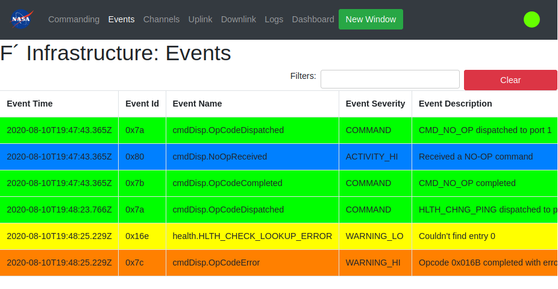
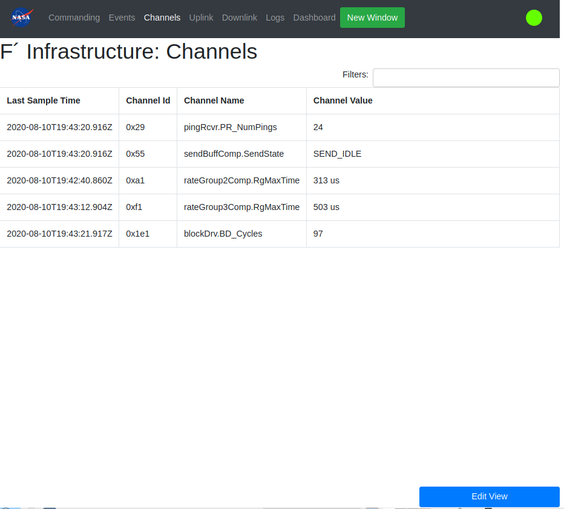
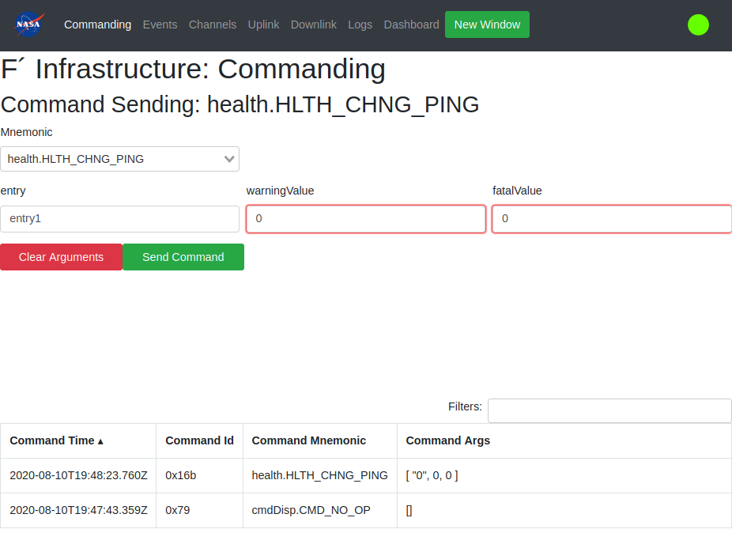
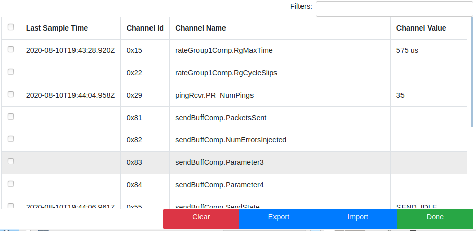
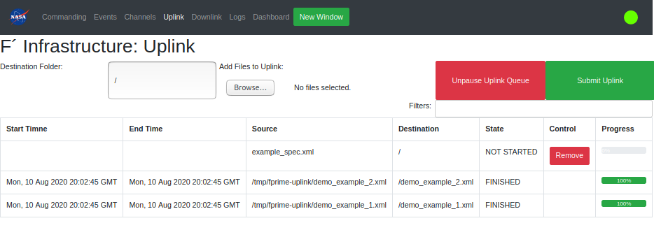
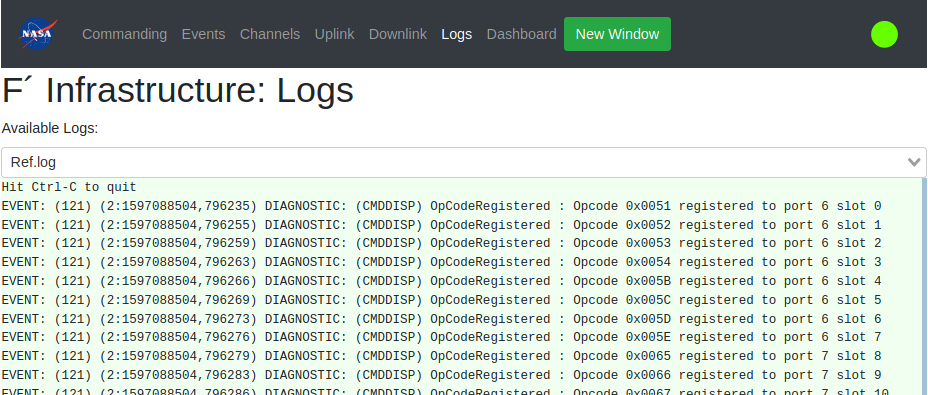
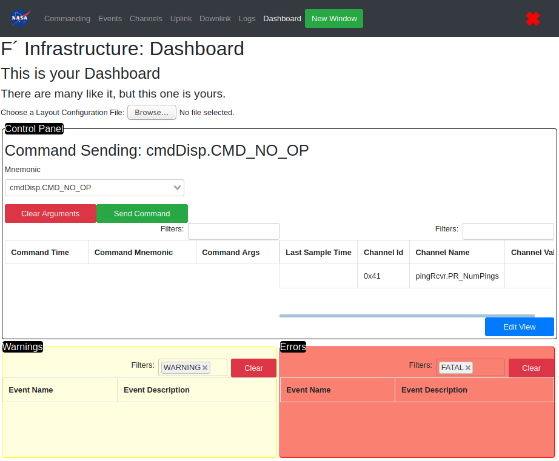

# A Brief Guide to the F´ GDS



This guide will give you a quick introduction to what the F´ GDS is and how you can use it. If you're interested in developing for the GDS instead, check out our [GDS developer information](../../Gds/README.md). If you want to, you can also [use F´ with your own GDS]() (TODO: Add this link) instead of the built-in one (TODO: Fact check).

- [What is the GDS?](#what-is-the-gds)
- [Getting Started](#getting-started)
    - [Running the GDS](#running-the-gds)
    - [GDS Options](#gds-options)
        - [I need to run the GDS from a different folder than my deployment](#i-need-to-run-the-gds-from-a-different-folder-than-my-deployment)
        - [I want to run just the GDS, without F´](#i-want-to-run-just-the-gds-without-f)
        - [I need to run the GDS itself on a custom port/IP address](#i-need-to-run-the-gds-itself-on-a-custom-portip-address)
        - [I need the GDS to connect to F´ on a custom port/IP address](#i-need-the-gds-to-connect-to-f-on-a-custom-portip-address)
        - [I want to run the GDS without the GUI](#i-want-to-run-the-gds-without-the-gui)
        - [Help and Other Options](#help-and-other-options)
    - [Navigating the GDS GUI](#navigating-the-gds-gui)
        - [Commanding](#commanding)
        - [Events](#events)
        - [Channels](#channels)
        - [Uplink](#uplink)
        - [Downlink](#downlink)
        - [Logs](#logs)
        - [Dashboard](#dashboard)
    - [Using the GDS CLI](#using-the-gds-cli)

## What is the GDS?

A GDS is the "Ground Data System" for a given satellite, which handles communications between the spacecraft running a piece of flight software and any computers on the ground. Any data being sent from a ground computer to the spacecraft, or vice versa, has to pass through the GDS first. If you want to send a command to the spacecraft, you can use the GDS to do that; if the spacecraft needs to send some sensor data back to earth, the GDS will handle receiving it, too.

While F´ is primarily a flight software package that's compatible with many external ground systems (TODO: Fact check), it also comes with an easy-to-use GDS right out of the box. This is especially convenient for system-level testing, but the built-in GDS is fully capable of serving as an actual ground system if it meets your needs.

The rest of this guide will talk about how to use that built-in GDS that F´ comes with; let's take a look!

## Getting Started

### Running the GDS

If you've installed F´ successfully, you should already have the GDS on your computer! Once you've followed the [installation guide](../INSTALL.md) and made sure F´ is set up correctly, you can start the GDS at any time by navigating to the `Ref` folder in your command line and running a special command, like so:

```bash
$ cd Ref
$ fprime-gds
```

Don't forget to have your virtual environment for F´ activated so the `fprime-gds` command is available, and remember that `Ref` is just an example application that comes with F´; you can run `fprime-gds` in any deployment project folder you have, and it should start the GDS right away!

By default, this command needs to be run in a deployment folder so the GDS knows what project it's connecting to and what commands and other pieces of data are available. Also, while the GDS is technically just the data-handling part of the system (TODO: Fact check), by default it will also bring up a browser-based GUI menu to show you the data it's receiving and to let you interact with the GDS.

### GDS Options

While fine for basic testing, you may want to change these and other default GDS options in the future to meet your needs. Here are a few common scenarios where it's useful to stray from the critical path; if you just want to learn more about using the GDS once you've got it running, feel free to [skip over this section](#navigating-the-gds-gui).

#### I need to run the GDS from a different folder than my deployment

By default, the GDS will try to use the current working directory you're in as the deployment it should connect to. If you're in a different directory than your deployment's root folder and don't want to `cd` there, you can instead specify the deployment using the `-d DEPLOY_DIR` option.

```bash
$ fprime-gds -d ~/jpl/fprime/Ref
```

#### I want to run just the GDS, without F´

By default, starting the GUI will also start running a new F´ flight software instance. If this isn't necessary and you just want to run the GDS alone, you can pass the `-n` flag to do so.

```bash
$ fprime-gds -n
```

#### I need to run the GDS itself on a custom port/IP address

TODO: Fact check that this is actually doing what I'm saying it's doing

By default, the GDS runs on the localhost (0.0.0.0) IP address, and uses 3 ports:

-   5000 for the REST interface providing data from the GDS to the GUI
-   50000 for communicating with the spacecraft
-   50050 for an internal data routing server providing raw data directly from the GDS
    -   Most external applications should use port 50000 instead of 50050, as 50000 includes extra features for robustness; 50050 should only be used for internal tools like the REST API and GDS CLI (TODO: Fact check)

If you need to change the IP or port of the internal server, you can do so by passing the `--tts-addr IP_ADDRESS` and `--tts-port TTS_PORT` options, respectively.

```bash
$ fprime-gds --tts-addr 1.2.3.4 --tts-port 12345
```

#### I need the GDS to connect to F´ on a custom port/IP address

TODO: Fact check that this is actually doing what I'm saying it's doing

TODO: Possibly add stuff about `comm-adapter` if needed for connecting to F´ stuff, although I'm not sure how that works?

If you need to connect to the spacecraft on a different IP address or port than the defaults, you can do so with the `--ip-address` and `--ip-port` options.

```bash
$ fprime-gds --ip-address 1.2.3.4 --ip-port 12345
```

#### I want to run the GDS without the GUI

In some cases (e.g. when using the GDS CLI), the GDS GUI isn't necessary; you can pass the `-g none` option to turn the GUI off.

```bash
$ fprime-gds -g none
```

#### Help and Other Options

To see the full list of options you have when running the `fprime-gds` command that starts the GDS, you can type `fprime-gds --help` at any time to view a help message, like this:

```
optional arguments:
  -h, --help            show this help message and exit
  -d DEPLOY, --deployment DEPLOY
                        Deployment directory for detecting dict, app, and
                        logging. [default: /home/vagrant/jpl/fprime-sw/Ref]
  -l LOGS, --logs LOGS  Logging directory. Created if non-existent. Default:
                        deployment directory.
  --log-directly        Logging directory is used directly, no extra dated
                        directories created.
  -g {none,html}, --gui {none,html}
                        Set the desired GUI system for running the deployment.
                        [default: html]
  --dictionary DICTIONARY
                        Path to dictionary. Overrides deploy if both are set
  -c CONFIG, --config CONFIG
                        Configuration for wx GUI. Ignored if not using wx.
  --tts-port TTS_PORT   Set the threaded TCP socket server port [default:
                        50050]
  --tts-addr TTS_ADDR   set the threaded TCP socket server address [default:
                        0.0.0.0]
  -n, --no-app          Do not run deployment binary. Overrides --app.
  --app APP             Path to app to run. Overrides deploy if both are set.
  --ip-address ADDRESS  Address of the IP adapter server. Default: 0.0.0.0
  --ip-port PORT        Port of the IP adapter server. Default: 50000
  --comm-adapter {ip}   Adapter for communicating to flight deployment.
                        [default: ip]
```

If you still have questions about what any of this means, or what you can and can't do when you're running the GDS, please [reach out to the F´ team](https://github.com/nasa/fprime#getting-help-with-f) and we'll be happy to help.

### Navigating the GDS GUI

Starting the F´ GDS by default should bring up a new menu in your browser, like so:



What does this screen mean? Let's go through it, piece by piece.

Across the top of the menu is a series of tabs: "Commanding", "Events", etc. Each of those tabs represent a piece of the GDS's functionality that you can use, which opens up below when you click on it. We'll go through each tab's functions in a lot more detail soon.

To the right of those tabs is a "New Window" button; if you want to open a new GUI window that will be connected to the same GDS (say, to use 2 monitors for testing purposes), it'll do that for you.

At the very top-right, there should be a green circle or a red X, representing the GUI's connection status; a green circle means the GUI is still connected to the GDS, while a red X means it's currently disconnected and not sending/receiving any data.

There's also a NASA logo on the far left. It doesn't do anything right now, but we still think it's nice.

The tabs contain the bulk of the GDS's functionality, though; let's take a look at each one.

#### Commanding



This contains the items needed to send commands to the spacecraft. All available commands are listed in the "Mnemonic" dropdown box, in `<COMPONENT>.<COMMAND>` format, where you can select or search for a command. If the selected command takes any arguments, they'll appear below, where you can type them in; invalid argument values will be outlined in red (TODO: How to know what the value should be when it's flagged as incorrect?). When pressed, the "Send Command" button will try to transmit the selected command with any arguments you've added to the spacecraft, while "Clear Arguments" will reset the arguments you've changed back to their default values.

Below this, the "Command History" table will record all the commands you've *tried* sending with their associated arguments (even if the command didn't actually succeed). To search for a set of commands, you can type something into the "Filters" box and press enter to only show rows containing that text. You can sort the rows by one of the table headers (e.g. "Command Time") by clicking on that header.

#### Events


This will display a table of all the "Events" that have happened on the spacecraft and been received by the GDS. An event is an informational, warning, or error message the spacecraft wants to record or notify us about, such as a command being received/succeeding, an error happening during a command, or a warning that the spacecraft has detected.

Each event is color-coded based on its "Event Severity;" there are 7 different kinds of severities (TODO: Fact check each description):

-   COMMAND (Green): Used to signify a command has been received or completed by the spacecraft (TODO: Isn't this also what ACTIVITY_HI is used for sometimes?)
-   ACTIVITY_LO (Gray): TODO: Difference between hi/lo activities?
-   ACTIVITY_HI (Blue):
-   WARNING_LO (Yellow): Used for minor, non-critical warnings
-   WARNING_HI (Orange): Used for critical warnings, such as a command failing to execute
-   DIAGNOSTIC (TODO: Color?): TODO: What are diagnostic events used for?
-   FATAL (Red): Used for catastrophic failures that may signify the spacecraft has stopped working or has encountered major issues

Just like the "Command History" table, these items can all be filtered or sorted by header; additionally, a "Clear" button will clear the table, opening it up for new events.

#### Channels


This displays an updating table of all the "Channels", or telemetry data, the GDS has received from the spacecraft; by default, only telemetry channels that the GDS has received data for are shown, with the rest of the channels hidden (even if they're open and may receive data later). Only the most recently received value for each channel (received at "Last Sample Time") is shown.



If you want to view a full list of all open channels available, you can click on the "Edit View" button to see them (channels that haven't received a value yet will have blank sample times). If you only want certain channels to be visible, you can tick the checkbox next to a channels name to show it; any unchecked channels will be hidden, and you can save these changes by clicking the "Done" button to go back to the regular channel view. If you want to save which channels you have shown/hidden, click on the "Export" button to save your list of open channel names. You can then "Import" this file later on to only show these channels.

Just like the other tables, you can sort or filter these channel items.

#### Uplink



TODO: Not sure I understand uplinking

#### Downlink


TODO: Not sure I understand downlinking

#### Logs



Here, you can select and view one of the plain-text log files where the GDS is writing down all its activities as it goes. There should be 5 log files to choose from (TODO: Fact check):

-   `Ref.log`, TODO: Unsure
-   `ThreadedTCP.log`, TODO: Unsure
-   `channel.log`, where the GDS logs all the channel data messages it's received from the spacecraft
-   `command.log`, where the GDS logs all the commands it's tried to send the spacecraft
-   `event.log`, where the GDS logs all the events received from the spacecraft

TODO: Unsure if there's more to logging or if that's all?

#### Dashboard



The dashboard lets users combine the tools from the other tabs on a single screen, designing their own custom interface for working with the GDS. You can learn more about how this works on the [Dashboard guide](./GUI_DASHBOARD.md).

### Using the GDS CLI

While the GUI can handle everything you need for the GDS, it's certainly not required to use it, and some users might prefer a command-line interface for certain tasks. You can learn more about how to do this through the [GDS CLI guide](./GDS_CLI_USER_GUIDE.md).
