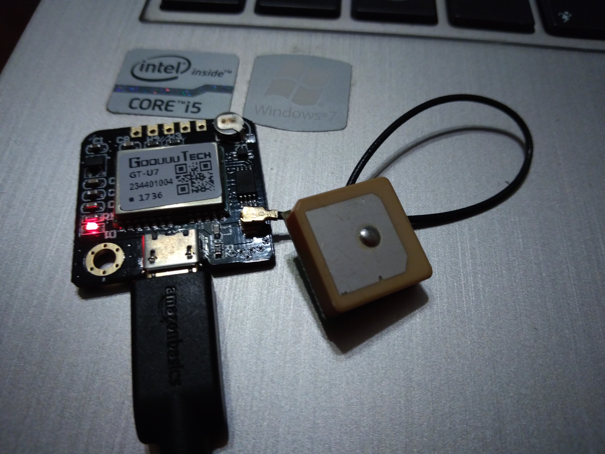

# Getting Started with F'

In this guide, we will cover the basics of working with F'. To start with, we retrieve the code, build the reference application, and verify
that the reference application will run. After that we will create a custom F' component and create our own application. Along the way
we will cover: Components, Topologies, Events, Telemetry, and Commands. In addition, we will see how to modify the build system to include our
new components and topologies.

## Getting Started with F' and the Reference Application

The first step to running F' is to ensure that the required build tools are available on your system. At its most basic, F' requires
several tools to be installed: Git, GNU make, lxml, and python 2 w/ cheetah. In order, to run the ground-system several more packages are required (see: Gse/bin/required.txt). Make is available on most systems, as well as git and lxml.

### Cloning the Software and Building the Reference Application

The first step is to clone the software from GitHub. The following command will clone the software straight from NASA's GitHub project page.

```
git clone https://github.com/nasa/fprime.git
```

### Installation

The next step is to install the software. Make sure git, and lxml are installed on your system. Then, using Python 2's pip tool the python dependencies can be installed. Both these steps can be accomplished on Ubuntu with the following commands:

#### Ubuntu Installation (sudo may be required)
```
sh fprime/mk/os-pkg/ubuntu-packages.sh
pip install numpy
pip install -r fprime/mk/python/pip_required_build.txt
pip install -r fprime/mk/python/pip_required_gui.txt
```
*Note:* other installation and setup instructions are availabe in the [user guide.](https://github.com/nasa/fprime/blob/master/docs/UsersGuide/FprimeUserGuide.pdf)
*Note 2:* numpy is required for some packages setup scripts, and thus must be install first.

### Building the Reference Application

The reference application is used to help developers develop F Prime applications by showing various features. It is also a useful test of the
installation and thus we will run it here.

Once the software is cloned and packages installed, the reference-application can be built by changing into the reference directory, generating make files,
cleaning and makeing the code.

```
cd fprime/Ref
make gen_make
make clean
make
```

If the build progresses to success, the reference application has been successfully built. The binary outputs can be found in a new directory named with
the architecture for which you built the reference application. i.e. *darwin-darwin-x86-debug-llvm-bin* or *linux-linux-x86-debug-gnu-bin*

### Running the Reference Application

In order to run the reference application, one needs to run the binary named *Ref* in the above created target directory. Running the application will 
show that the reference application was successfully built and runnable. Replace *darwin-darwin-x86-debug-llvm-bin* in the below commands by the target
used in building the reference application

**Running with the GUI:**
```
cd fprime/Ref
./scripts/run_ref.sh
```

**Note:** running with the gui is the recommended way of running the application. However, one can run the application directly from target output directory if desired.

Success!!! We have now successfully run the reference application, showing that the build tools work. We are ready to proceed to a custom application.

## Custom Application Goals

In the DIY electronics community there is an abundace of cheap GPS receivers based around the NMEA protocol. These receivers often suport a USB interface
pretending to be am ACM device for basic serial communication. The messages these receivers send are NMEA formatted text.



This quick-start guide will show how to integrate one of these GPS receivers with the F' framework by wrapping it in a Component and defining commands,
telemetry, and log events. Finally, we will modify the reference Topology to include this new component such that we can downlink our telemetry to
the F' supplied ground station (GSE).

**Note:** all the sample files, and a working deployment are available at [https://github.com/LeStarch/fprime/tree/gps-application](https://github.com/LeStarch/fprime/tree/gps-application).

## Creating a Custom F' Component

In this next section we will create a custom F' component for reading GPS data off a UART based GPS module. We will then downlink this data as telemetry
and finish up by adding an event to report GPS lock status and a command to report lock-status on demand.

### Designing the GPS Component

The F’ designs are specified by XML files that are compiled by code generators. An XML file represents a single component including the ports it uses
to communicate with other components as well as references to the dictonaries that define events/log messages, telmetry, and commands. Further discussion
of components, ports, events, telemetry, and commands can be found in the F' user guide. [User Guide](docs/UsersGuide/FprimeUserGuide.pdf). *Side note:* 
Ports are also defined with XML, however; this application does not need any customized ports and thus we need not elaborate here.

The first step to making a compnent is to make a project directory to hold our project's components, and a component directory for our GPS. This is do
as follows:

```
cd fprime
mkdir -p GpsApp/Gps
cd GpsApp/Gps
```

Next, in this directory, we will create a file called *GpsComponentAi.xml* filled with the below text. This represents our component's design by defining
the ports it uses to connect with other components and the files used to specify commands, telemetry, and events. As can be seen, we are creating our component
to have 5 ports:

1. **cmdRegOut**: an output port of *Fw::CmdReg* type used to register this component's commands with the command dispatcher
2. **eventOut**: an output port of *Fw::Log* type used to log events
3. **cmdIn**: an input port of *Fw::Cmd* type used to process commands sent to this component
4. **tlmOut**: an output port of *Fw::Tlm* type used to send out telemetry items
5. **cmdResponseOut**: an output port of *Fw::CmdResponse* type used to signal a command has finished


In addition, our component imports the above port types, and imports 3 dictionaries: Commands.xml, Events.xml, and Telemetry.xml. The GpsComponentAi.xml
file should look like this:

```
<?xml version="1.0" encoding="UTF-8"?>
<?xml-model href="../../Autocoders/schema/ISF/component_schema.rng" type="application/xml" schematypens="http://relaxng.org/ns/structure/1.0"?>

<component name="Gps" kind="active" namespace="GpsApp" modeler="true">

    <import_port_type>Fw/Cmd/CmdRegPortAi.xml</import_port_type>
    <import_port_type>Fw/Log/LogPortAi.xml</import_port_type>
    <import_port_type>Fw/Cmd/CmdPortAi.xml</import_port_type>
    <import_port_type>Svc/Sched/SchedPortAi.xml</import_port_type>
    <import_port_type>Fw/Tlm/TlmPortAi.xml</import_port_type>
    <import_port_type>Fw/Cmd/CmdResponsePortAi.xml</import_port_type>
    <import_dictionary>GpsApp/Gps/Commands.xml</import_dictionary>
    <import_dictionary>GpsApp/Gps/Telemetry.xml</import_dictionary>
    <import_dictionary>GpsApp/Gps/Events.xml</import_dictionary>
    <ports>


        <port name="cmdRegOut" data_type="Fw::CmdReg"  kind="output" role="CmdRegistration"    max_number="1">
        </port>

        <port name="eventOut" data_type="Fw::Log"  kind="output" role="LogEvent"    max_number="1">
        </port>

        <port name="cmdIn" data_type="Fw::Cmd"  kind="input" role="Cmd"    max_number="1">
        </port>

        <port name="schedIn" data_type="Svc::Sched"  kind="async_input"    max_number="1">
        </port>

        <port name="tlmOut" data_type="Fw::Tlm"  kind="output" role="Telemetry"    max_number="1">
        </port>

        <port name="cmdResponseOut" data_type="Fw::CmdResponse"  kind="output" role="CmdResponse"    max_number="1">
        </port>
    </ports>

</component>
```

Connecting these components together is done at the system level, enabling the individual components to be reused in different applications. We will
see this step later.

## Creating Commands.xml, Events.xml and Telemetry.xml Dictionaries

These three XML dictionaries define the structure of commands, events, and telemetry that our component uses. This allows the auto-coding system
to automatically generate the needed code to process commands, and emit events and telemetry. This allows the developer to concentrate on the specific code for the component.

First we will create a command dictionary. The purpose of our command is to report the lock status of the GPS unit. This command will trigger an event
which will report if the GPS is locked or not. Commands.xml should look like the following:

```
<?xml version="1.0" encoding="UTF-8"?>
<?oxygen RNGSchema="file:../xml/ISF_Component_Schema.rnc" type="compact"?>

<!--====================================================================== 

  GpsApp/Gps/Commands.xml

======================================================================-->

<commands>

  <command
    kind="async"
    opcode="0"
    mnemonic="Gps_ReportLockStatus"
  >
    <comment>A command to force an EVR reporting lock status.</comment>
  </command>

</commands>
```

Next we will create an Events.xml dictionary that setup the events our component can log. In this case we have two events, GPS locked and GPS lock lost.
Here again we have and ID base allowing us to fill in the event offsets later. The Events.xml file should look like:

```
<?xml version="1.0" encoding="UTF-8"?>
<?oxygen RNGSchema="file:../xml/ISF_Component_Schema.rnc" type="compact"?>

<!--====================================================================== 

  GpsApp/Gps/Events.xml

======================================================================-->

<events>

  <event
    id="0"
    name="Gps_LockAquired"
    severity="ACTIVITY_HI"
    format_string="GPS lock acquired"
  >
    <comment>A notification on GPS lock aquired</comment>
  </event>

  <event
    id="1"
    name="Gps_LockLost"
    severity="WARNING_HI"
    format_string="GPS lock lost"
  >
    <comment>A notification on GPS lock lost</comment>
  </event>

</events>
```

Finally, we should create a Telemetry.xml dictionary. It will specify that we will downlink latitude, longitude, altitude, time, and current number of 
satellites visible to the GPS unit. These are all standard fields emitted by a UART based GPS unit. Our file should look like:

```
<?xml version="1.0" encoding="UTF-8"?>
<?oxygen RNGSchema="file:../xml/ISF_Component_Schema.rnc" type="compact"?>

<!--====================================================================== 

  GpsApp/Gps/Telemetry

======================================================================-->

<telemetry>

  <channel
    id="0"
    name="Gps_Latitude"
    data_type="F32"
    abbrev="GPS-0000"
  >
    <comment>The current latitude</comment>
  </channel>

  <channel
    id="1"
    name="Gps_Longitude"
    data_type="F32"
    abbrev="GPS-0001"
  >
    <comment>The current longitude</comment>
  </channel>

  <channel
    id="2"
    name="Gps_Altitude"
    data_type="F32"
    abbrev="GPS-0002"
  >
    <comment>The current altitude</comment>
  </channel>

  <channel
    id="3"
    name="Gps_Count"
    data_type="U32"
    abbrev="GPS-0003"
  >
    <comment>The current number of satilites</comment>
  </channel>

</telemetry>
```

## Setting Up the Build System for Gps and GpsApp

The make system is configured to use *fprime/mk/configs/modules/modules.mk* as a place for specifying builds and various deployments. If we look
into this file, we can see REF_ and Ref_ setups for the Reference applications. We can replicate this for our GpsApp by adding the following lines
to the file right before the Autocoder sections.

```
...
GPS_MODULES := \
    GpsApp/Top \
    GpsApp/Gps
    
GpsApp_MODULES := \
    \
    $(GPS_MODULES) \
    \
    $(SVC_MODULES) \
    \
    $(DRV_MODULES) \
    \
    $(FW_MODULES) \
    \
    $(OS_MODULES) \
    \
    $(CFDP_MODULES) \
    \
    $(UTILS_MODULES)
...
```
This adds our (future) topology to the make system as well as the component we just created. This allows us to generate make files and make our component. In
addition, we will be able to build our project's topology one we add that. *Note:* since we already added a folder for our Topology to the make system we'll need
to create a placeholder folder (below) before we can build.

In addition, the line defining *DEPLOYMENTS :=* should be modified to add GpsApp like the following:

```
DEPLOYMENTS := Ref GpsApp acdev
```

Given that we have already defined our *Topology* folder in the *GpsApp/Top* line above, we will need to add a placeholder for the Topology of our
GpsApp, which we will fill later. Make the folder *fprime/GpsApp/Top* and add an empty file *mod.mk*. We will fill this folder and mod.mk file
later, but creating it here enables us to build our component. Now our make system should be ready for us to build our new module and take advantage of
 the code-generation that is available.

## Setting Up Module Make Files and Code

The first thing to do is to setup the Gps components's make files. Each module (component, port, topology) has two files: a Makefile and a mod.mk file. The makefile contains the module name and little else. The mod.mk file contains a list of all the files and submodules that makeup this module. We should now create the two file, *Makefile* and *mod.mk* using the following content in the *fprime/GpsApp/Gps* folder.

The makefile, called *Makefile*, looks like:
```
# ---------------------------------------------------------------------- 
# Makefile
# ---------------------------------------------------------------------- 

MODULE_DIR = GpsApp/Gps
MODULE = $(subst /,,$(MODULE_DIR))

BUILD_ROOT ?= $(subst /$(MODULE_DIR),,$(CURDIR))
export BUILD_ROOT

include $(BUILD_ROOT)/mk/makefiles/module_targets.mk
```
Apart from the *MODULE_DIR* variable, most Makefiles look the same.

The mod.mk file, called *mod.mk*, looks like:
```
# ---------------------------------------------------------------------- 
# mod.mk
# ---------------------------------------------------------------------- 

SRC = \
    GpsComponentAi.xml
    
#        GpsComponentImpl.cpp

HDR = \

#        GpsComponentImpl.hpp

#SUBDIRS = test
```
*Note:* since we have not created the code files yet, we leave them commented out. This allows us to test the make commands, without erring for
missing files. We can test the make system by running the following commands. *make gen_make* will auto-generate parts of the make system, *make 
clean* cleans the module, and *make* builds the module.

```
make gen_make
make clean
make
```
If these commands pass without errors, we are ready to start coding our module.

## Coding Our Module

Now it is time to code our module to read the GPS module and downlink the GPS telemetry. This is where the framework will help us considerably. All 
these previous steps set us up to use the auto-coding features of F'. We can generate the basic implementation of the code by using the make 
command *make impl*, which generates needed *GpsComponentImpl.cpp-tmpl* and *GpsComponentImpl.hpp-tmpl* files. We can use these as the basis for our 
implementation. In addition, the framework will also generate * *Ac.?pp* files, which handle the work of connecting ports allowing us to write 
minimal code to support the component interface. First we generate code templates, and move them into place (because 
don't already have implementations we can safely rename the template files).

```
make impl
mv GpsComponentImpl.cpp-template GpsComponentImpl.cpp
mv GpsComponentImpl.hpp-template GpsComponentImpl.hpp
```

*Note:* If the developer regenerates the templates, care must be taken to not overwrite already implemented code by copying the templates to the implementation files.

These template file contents are in the following sections.

### GpsComponentImpl.hpp
```
#ifndef Gps_HPP
#define Gps_HPP

#include "GpsApp/Gps/GpsComponentAc.hpp"

namespace GpsApp {

  class GpsComponentImpl :
    public GpsComponentBase
  {

    public:

      // ----------------------------------------------------------------------
      // Construction, initialization, and destruction
      // ----------------------------------------------------------------------

      //! Construct object Gps
      //!
      GpsComponentImpl(
#if FW_OBJECT_NAMES == 1
          const char *const compName /*!< The component name*/
#else
          void
#endif
      );

      //! Initialize object Gps
      //!
      void init(
          const NATIVE_INT_TYPE queueDepth, /*!< The queue depth*/
          const NATIVE_INT_TYPE instance = 0 /*!< The instance number*/
      );

      //! Destroy object Gps
      //!
      ~GpsComponentImpl(void);

    PRIVATE:

      // ----------------------------------------------------------------------
      // Handler implementations for user-defined typed input ports
      // ----------------------------------------------------------------------

      //! Handler implementation for schedIn
      //!
      void schedIn_handler(
          const NATIVE_INT_TYPE portNum, /*!< The port number*/
          NATIVE_UINT_TYPE context /*!< The call order*/
      );

    PRIVATE:

      // ----------------------------------------------------------------------
      // Command handler implementations 
      // ----------------------------------------------------------------------

      //! Implementation for Gps_ReportLockStatus command handler
      //! A command to force an EVR reporting lock status.
      void Gps_ReportLockStatus_cmdHandler(
          const FwOpcodeType opCode, /*!< The opcode*/
          const U32 cmdSeq /*!< The command sequence number*/
      );


    };

} // end namespace GpsApp

#endif
```

### GpsComponentImpl.cpp
```
#include <GpsApp/Gps/GpsComponentImpl.hpp>
#include "Fw/Types/BasicTypes.hpp"

namespace GpsApp {

  // ----------------------------------------------------------------------
  // Construction, initialization, and destruction 
  // ----------------------------------------------------------------------

  GpsComponentImpl ::
#if FW_OBJECT_NAMES == 1
    GpsComponentImpl(
        const char *const compName
    ) :
      GpsComponentBase(compName)
#else
    GpsImpl(void)
#endif
  {

  }

  void GpsComponentImpl ::
    init(
        const NATIVE_INT_TYPE queueDepth,
        const NATIVE_INT_TYPE instance
    )
  {
    GpsComponentBase::init(queueDepth, instance);
  }

  GpsComponentImpl ::
    ~GpsComponentImpl(void)
  {

  }

  // ----------------------------------------------------------------------
  // Handler implementations for user-defined typed input ports
  // ----------------------------------------------------------------------

  void GpsComponentImpl ::
    schedIn_handler(
        const NATIVE_INT_TYPE portNum,
        NATIVE_UINT_TYPE context
    )
  {
    // TODO
  }

  // ----------------------------------------------------------------------
  // Command handler implementations 
  // ----------------------------------------------------------------------

  void GpsComponentImpl ::
    Gps_ReportLockStatus_cmdHandler(
        const FwOpcodeType opCode,
        const U32 cmdSeq
    )
  {
    // TODO
  }

} // end namespace GpsApp
```

### Implementation

Here it can be seen that we have two actions "TODO". First we will need to implement a function called *schedIn_handler* and
the second is to implement a command handler for *Gps_ReportLockStatus_cmdHandler*. Both are port calls that will be made
into our component. Ports are found in the GpsComponentAi.xml, however; only our *schedIn* port is used directly. The 
rest are called as part of telemetry, event logging, or command processing and thus have helpful wrappers (seen below).
schedIn represents a call from a rate group driver. It is called at a set rate, e.g. 10Hz based on the rate group to which it 
is connected. We will use this schedIn call to read the UART interface at a set rate of 1Hz. *Gps_ReportLockStatus_cmdHandler* is a 
handler that implements the function for the command we defined in Command.xml. We also have the following outgoing port calls, 
and events that can be used as part of our code. 

1. log_ACTIVITY_HI_Gps_LockAquired: used to emit the event *Gps_Lock_aquired* as defined in Events.xml
2. log_WARNING_HI_Gps_LockLost: used to emit the event *Gps_LockLost* as defined in Events.xml
3. tlmWrite_Gps_Latitude: used to send down *Latitude* telemetry as defined in Telemetry.xml
4. tlmWrite_Gps_Longitude: used to send down *Longitude* telemetry as defined in Telemetry.xml
5. tlmWrite_Gps_Altitude: used to send down *Altitude* telemetry as defined in Telemetry.xml
6. tlmWrite_Gps_Count: used to send down *Count* telemetry as defined in Telemetry.xml
7. sendCommandResponse: used to respond to a sent command. Call this in the above cmdHandler.

In order to make a GPS processor, we need to take the following steps:

0. Implement the schedIn function (called at 1Hz)
1. (Re)initialize the UART in the call to schedIn
2. Read UART in schedIn
3. Parse UART data in schedIn
4. Downlink telmetry in schedIn
5. If lock is newly found, downlink a *LockAquired* EVR
6. If lock is newly lost, downlink a *LockLost* EVR
7. Downlink a *LockAquired* EVR in commandHandler, if lock is currently held
8. Downlink a *LockLost* EVR in commandHandler, if lock is not currently held
9. Respond from commandHandler with a sendCommandResponse call

These steps are called out in the following implementations of these two files. Since the purpose of the getting-started tutorial is not to demonstrate
how to write each line of code, the steps above are called out in comments in the code.

### GpsComponentImpl.cpp (Sample)
```
#include <GpsApp/Gps/GpsComponentImpl.hpp>
#include "Fw/Types/BasicTypes.hpp"

//File path to UART device on UNIX system
#define UART_FILE_PATH "/dev/ttyACM0"
#include <cstring>
#include <iostream>
//POSIX includes for UART communication
extern "C" {
    #include <unistd.h>
    #include <fcntl.h>
    #include <termios.h>
}

namespace GpsApp {

  // ----------------------------------------------------------------------
  // Construction, initialization, and destruction 
  // ----------------------------------------------------------------------

  GpsComponentImpl ::
#if FW_OBJECT_NAMES == 1
    GpsComponentImpl(
        const char *const compName
    ) :
      GpsComponentBase(compName),
#else
      GpsComponentBase(void),
#endif
      m_setup(false),
      m_locked(false),
      m_fh(-1)
  {

  }

  void GpsComponentImpl ::
    init(
        const NATIVE_INT_TYPE queueDepth,
        const NATIVE_INT_TYPE instance
    ) 
  {
    GpsComponentBase::init(queueDepth, instance);
  }

  GpsComponentImpl ::
    ~GpsComponentImpl(void)
  {

  }

  //Step 1: setup
  //
  // Each second, we should ensure that the UART is initialized
  // and if not, we should try to initialize it again.
  void GpsComponentImpl ::
    setup(void)
  {
      if (m_setup) {
          return;
      }
      //Open the GPS, and configure it for a raw-socket in read-only mode
      m_fh = open(UART_FILE_PATH, O_RDONLY);
      if (m_fh < 0) {
          std::cout << "[ERROR] Failed to open file: " << UART_FILE_PATH << std::endl;
          return;
      }
      //Setup the struct for termios configuration
      struct termios options;
      std::memset(&options, 0, sizeof(options));
      //Set to raw socket, remove modem control, allow input
      cfmakeraw(&options);
      options.c_cflag |= (CLOCAL | CREAD);
      //Set to 9600 baud
      cfsetispeed(&options, B9600);
      //Make the above options stick
      NATIVE_INT_TYPE status = tcsetattr(m_fh, TCSANOW, &options);
      if (status != 0) {
          std::cout << "[ERROR] Failed to setup UART options" << std::endl;
          return;
      }
      m_setup = true;
  }
  // ----------------------------------------------------------------------
  // Handler implementations for user-defined typed input ports
  // ----------------------------------------------------------------------

  // Step 0: schedIn
  //
  //  By implementing this "handler" we can respond to the 1Hz call allowing
  //  us to read the GPS UART every 1 second.
  void GpsComponentImpl ::
    schedIn_handler(
        const NATIVE_INT_TYPE portNum,
        NATIVE_UINT_TYPE context
    )
  {
      int status = 0;
      float lat = 0.0f, lon = 0.0f;
      GpsPacket packet;
      char buffer[1024];
      char* pointer = buffer;
      //During each cycle, attempt to setup if not setup
      //Step 1: setup
      // Each second, we should ensure that the UART is initialized
      // and if not, we should try to initialize it again.
      setup();
      if (!m_setup) {
          return;
      }
      //Then receive data from the GPS. Should block until available
      //and thus, this module should not be driven at a rate faster than 1Hz
      //Step 2: read the UART
      // Read the GPS message from the UART
      ssize_t size = read(m_fh, buffer, sizeof(buffer));
      if (size <= 0) {
          std::cout << "[ERROR] Failed to read from UART with: " << size << std::endl;
          return;
      }
      //Look for a recognized GPS location packet and parse it
      //Step 3:
      // Parse the GPS message from the UART (looking for $GPPA messages)
      for (U32 i = 0; i < sizeof(buffer) - 6; i++) {
          status = sscanf(pointer, "$GPGGA,%f,%f,%c,%f,%c,%u,%u,%f,%f",
              &packet.utcTime, &packet.dmNS, &packet.northSouth,
              &packet.dmEW, &packet.eastWest, &packet.lock,
              &packet.count, &packet.filler, &packet.altitude);
          //Break when all GPS items are found
          if (status == 9) {
              break;
          }
          pointer = pointer + 1;
      }
      //If we failed to find the packet, or failed to extract data then return
      if (status != 9) {
          std::cout << "[ERROR] GPS parsing failed: " << status << std::endl;
          return;
      }
      //GPS packet locations are of the form: ddmm.mmmm
      //We will convert to lat/lon in degrees only before downlinking
      //Latitude degrees, add on minutes (converted to degrees), multiply by direction
      lat = (U32)(packet.dmNS/100.0f);
      lat = lat + (packet.dmNS - (lat * 100.0f))/60.0f;
      lat = lat * ((packet.northSouth == 'N') ? 1 : -1);
      //Longitude degrees, add on minutes (converted to degrees), multiply by direction
      lon = (U32)(packet.dmEW/100.0f);
      lon = lon + (packet.dmEW - (lon * 100.0f))/60.f;
      lon = lon * ((packet.eastWest == 'E') ? 1 : -1);
      //Step 4: downlink
      // Call the downlink functions to send down data
      std::cout << "[INFO] Current lat, lon: (" << lat << "," << lon << ")" << std::endl;
      tlmWrite_Gps_Latitude(lat);
      tlmWrite_Gps_Longitude(lon);
      tlmWrite_Gps_Altitude(packet.altitude);
      tlmWrite_Gps_Count(packet.count);
      //Lock status update only if changed
      //Step 7,8: note changed lock status
      // Emit an event if the lock has been aquired, or lost
      if (packet.lock == 0 && m_locked) {
          m_locked = false;
          log_WARNING_HI_Gps_LockLost();
      } else if (packet.lock == 1 && !m_locked) {
          m_locked = true;
          log_ACTIVITY_HI_Gps_LockAquired();
      }
  }

  // ----------------------------------------------------------------------
  // Command handler implementations 
  // ----------------------------------------------------------------------
  //Step 9: respond to status command
  //
  // When a status command is received, respond by emitting the 
  // current lock status as an Event.
  void GpsComponentImpl ::
    Gps_ReportLockStatus_cmdHandler(
        const FwOpcodeType opCode,
        const U32 cmdSeq
    )
  {
    //Locked-force print
    if (m_locked) {
        log_ACTIVITY_HI_Gps_LockAquired();
    } else {
        log_WARNING_HI_Gps_LockLost();
    }
  }
} // end namespace GpsApp
```
### GpsComponentImpl.hpp (Sample)
```
#ifndef Gps_HPP
#define Gps_HPP

#include "GpsApp/Gps/GpsComponentAc.hpp"

namespace GpsApp {

  class GpsComponentImpl :
    public GpsComponentBase
  {
      /**
       * GpsPacket:
       *   A structure containing the information in the GPS location pacaket
       * received via the NMEA GPS receiver.
       */
      struct GpsPacket {
          float utcTime;
          float dmNS;
          char northSouth;
          float dmEW;
          char eastWest;
          unsigned int lock;
          unsigned int count;
          float filler;
          float altitude;
      };
    public:

      // ----------------------------------------------------------------------
      // Construction, initialization, and destruction
      // ----------------------------------------------------------------------

      //! Construct object Gps
      //!
      GpsComponentImpl(
#if FW_OBJECT_NAMES == 1
          const char *const compName /*!< The component name*/
#else
          void
#endif
      );

      //! Initialize object Gps
      //!
      void init(
          const NATIVE_INT_TYPE queueDepth, /*!< The queue depth*/
          const NATIVE_INT_TYPE instance = 0 /*!< The instance number*/
      );

      //! Destroy object Gps
      //!
      ~GpsComponentImpl(void);

    PRIVATE:
      //! Setup the UART interface for taking with the GPS module. Note: this
      //! is currently implemented using standard Unix /dev/tty* devices.
      //!
      void setup(void);
      // ----------------------------------------------------------------------
      // Handler implementations for user-defined typed input ports
      // ----------------------------------------------------------------------

      //! Handler implementation for schedIn
      //!
      void schedIn_handler(
          const NATIVE_INT_TYPE portNum, /*!< The port number*/
          NATIVE_UINT_TYPE context /*!< The call order*/
      );

    PRIVATE:

      // ----------------------------------------------------------------------
      // Command handler implementations 
      // ----------------------------------------------------------------------

      //! Implementation for Gps_ReportLockStatus command handler
      //! A command to force an EVR reporting lock status.
      void Gps_ReportLockStatus_cmdHandler(
          const FwOpcodeType opCode, /*!< The opcode*/
          const U32 cmdSeq /*!< The command sequence number*/
      );
      //!< Is the GPS UART setup
      bool m_setup;
      //!< Has the device acquired GPS lock?
      bool m_locked;
      //!< File handle of UART
      NATIVE_INT_TYPE m_fh;
    };

} // end namespace GpsApp

#endif
```

Next, we need to add (or uncomment) our .cpp and .hpp to the mod.mk in the GpsApp directory.  The final version will look like this:

### fprime/GpsApp/Gps/mod.mk (final)
```
# ---------------------------------------------------------------------- 
# mod.mk
# ---------------------------------------------------------------------- 

SRC = \
	GpsComponentAi.xml \
        GpsComponentImpl.cpp

HDR = \
        GpsComponentImpl.hpp

#SUBDIRS = test
```

Finally, regenerate the makefiles, clean, and build. We will use this pattern a lot.
```
make gen_make
make clean
make
```

We are now ready to make a Topology for this application, and test it! 

## Topology

We are finally ready to build our topology to connect the GPS module up to the rate converter, and logger. Then we can see
if this will work. Generally, this process is done with a design tool like MagicDraw, but because the user may or may not
have access to this tool, the topology Ai is provided below. The user may then edit it to make changes.

First, the Reference application's topology is copied into the *Top* folder of *GpsApp* application and we'll grab the deployment makefile 
too. We do this as a convienence to save time during this tutorial. It is easier and faster to start with the Reference application's files
and modify them to construct our topology.

```
cp -r fprime/Ref/Top fprime/GpsApp/Top
cp fprime/Ref/Makefile fprime/GpsApp
```

Then update *fprime/GpsApp/Makefile* to set the following line to our deployment's name *GpsApp*.

```
DEPLOYMENT := GpsApp
```

After this adjustment to the make system, we need to add 3 custom files that represent our Topology.  These files are the following:

1. **GpsTopologyAppAi.xml**: the design file showing the list of components, and the connections between components. This file is based
on RefTopologyAppAi.xml from the reference application. GpsTopologyAppAi.xml should replace RefTopologyAppAi.xml.
2. **Components.hpp**: the header file declaring in code the same components as listed in the topology ai XML, along with includes
of the headers that define them.
3. **Topology.cpp**: top level code, main function, and initialization of the components, threads, and registration of commands.

Essentially, GpsTopologyAppAi.xml is the design, Components.hpp is the definitions, and Topology.cpp is the implementation code. All of these
files are referenced by the make files we inherited from the reference app. Building the distribution (fprime/GpsApp) will include the 
topology (fprime/GpsApp/Top) as its entry-point creating a single application, which represents our software.

Sample versions of these files are provided below, and are annotated with comments representing the changes
made to support the Gps Application. **Note:** these files are available in a working repository at:
[https://github.com/LeStarch/fprime/tree/gps-application](https://github.com/LeStarch/fprime/tree/gps-application) in case the user prefers a direct checkout of working code.

We will also need to update the mod.mk in the Top directory to change the name of "RefTopologyAppAi.xml" to "GpsTopologyAppAi.xml".

Once these files have been added to the *fprime/GpsApp/Top* folder, we have a complete project. The project can be built 
by changing directory to the deployment directory, issuing our build commands and then running the executable.

```
cd fprime/GpsApp
make gen_make
make clean
make
./linux-linux-x86-debug-gnu-bin/GpsApp
```

If you see output similar to the following, when running with the UART GPS you have successfully, completed the tutorial. If running without the GPS, you should see GPS setup errors every 1 second.

#### Successful Output
```
[INFO] Current lat, lon: (41.758,-72.6492)
[INFO] Current lat, lon: (41.758,-72.6492)
[INFO] Current lat, lon: (41.758,-72.6492)
[INFO] Current lat, lon: (41.758,-72.6492)

-- or --

[ERROR] Failed to open file: /dev/ttyACM0
[ERROR] Failed to open file: /dev/ttyACM0
[ERROR] Failed to open file: /dev/ttyACM0
[ERROR] Failed to open file: /dev/ttyACM0
```

### Topology.cpp (Sample)
```
#include <Components.hpp>


#include <Fw/Types/Assert.hpp>
#include <Ref/Top/TargetInit.hpp>
#include <Os/Task.hpp>
#include <Os/Log.hpp>
#include <Fw/Types/MallocAllocator.hpp>

#if defined TGT_OS_TYPE_LINUX || TGT_OS_TYPE_DARWIN
#include <getopt.h>
#include <stdlib.h>
#include <ctype.h>
#endif
// List of context IDs

// GPS Application:
//  For GPS application specific items, look for GPS-- comments below
enum {
    DOWNLINK_PACKET_SIZE = 500,
    DOWNLINK_BUFFER_STORE_SIZE = 2500,
    DOWNLINK_BUFFER_QUEUE_SIZE = 5,
    UPLINK_BUFFER_STORE_SIZE = 3000,
    UPLINK_BUFFER_QUEUE_SIZE = 30
};

enum {
        ACTIVE_COMP_1HZ_RG,
        ACTIVE_COMP_P5HZ_RG,
        ACTIVE_COMP_P25HZ_RG,
        ACTIVE_COMP_CMD_DISP,
        ACTIVE_COMP_CMD_SEQ,
        ACTIVE_COMP_LOGGER,
        ACTIVE_COMP_TLM,
        ACTIVE_COMP_PRMDB,
        ACTIVE_COMP_FILE_DOWNLINK,
        ACTIVE_COMP_FILE_UPLINK,

        ACTIVE_COMP_BLKDRV,
        ACTIVE_COMP_PING_RECEIVER,
        // GPS-- our component is an active component, thus it needs a thread-id. Thread IDs come from this
        // enumeration to keep them unique.
        ACTIVE_COMP_GPS,

        CYCLER_TASK,
        NUM_ACTIVE_COMPS
};

// Registry
#if FW_OBJECT_REGISTRATION == 1
static Fw::SimpleObjRegistry simpleReg;
#endif

// Component instance pointers
static NATIVE_INT_TYPE rgDivs[] = {1,2,4};
Svc::RateGroupDriverImpl rateGroupDriverComp(
#if FW_OBJECT_NAMES == 1
                    "RGDvr",
#endif
                    rgDivs,FW_NUM_ARRAY_ELEMENTS(rgDivs));

static NATIVE_UINT_TYPE rg1Context[] = {0,0,0,0,0,0,0,0,0,0};
Svc::ActiveRateGroupImpl rateGroup1Comp
#if FW_OBJECT_NAMES == 1
                    ("RG1",rg1Context,FW_NUM_ARRAY_ELEMENTS(rg1Context));
#else
                    (rg1Context,FW_NUM_ARRAY_ELEMENTS(rg1Context));
#endif
;

static NATIVE_UINT_TYPE rg2Context[] = {0,0,0,0,0,0,0,0,0,0};
Svc::ActiveRateGroupImpl rateGroup2Comp
#if FW_OBJECT_NAMES == 1
                    ("RG2",rg2Context,FW_NUM_ARRAY_ELEMENTS(rg2Context));
#else
                    (rg2Context,FW_NUM_ARRAY_ELEMENTS(rg2Context));
#endif
;

static NATIVE_UINT_TYPE rg3Context[] = {0,0,0,0,0,0,0,0,0,0};
Svc::ActiveRateGroupImpl rateGroup3Comp
#if FW_OBJECT_NAMES == 1
                    ("RG3",rg3Context,FW_NUM_ARRAY_ELEMENTS(rg3Context));
#else
                    (rg3Context,FW_NUM_ARRAY_ELEMENTS(rg3Context));
#endif
;

// Command Components
Svc::SocketGndIfImpl sockGndIf
#if FW_OBJECT_NAMES == 1
                    ("SGIF")
#endif
;

//GPS-- GPS Component construction, notice if compiled with names, a name should be given.
GpsApp::GpsComponentImpl gpsImpl
#if FW_OBJECT_NAMES == 1
                    ("GPS")
#endif
;

#if FW_ENABLE_TEXT_LOGGING
Svc::ConsoleTextLoggerImpl textLogger
#if FW_OBJECT_NAMES == 1
                    ("TLOG")
#endif
;
#endif

Svc::ActiveLoggerImpl eventLogger
#if FW_OBJECT_NAMES == 1
                    ("ELOG")
#endif
;

Svc::LinuxTimeImpl linuxTime
#if FW_OBJECT_NAMES == 1
                    ("LTIME")
#endif
;

Svc::TlmChanImpl chanTlm
#if FW_OBJECT_NAMES == 1
                    ("TLM")
#endif
;

Svc::CommandDispatcherImpl cmdDisp
#if FW_OBJECT_NAMES == 1
                    ("CMDDISP")
#endif
;

Fw::MallocAllocator seqMallocator;
Svc::CmdSequencerComponentImpl cmdSeq
#if FW_OBJECT_NAMES == 1
                    ("CMDSEQ")
#endif
;

Svc::PrmDbImpl prmDb
#if FW_OBJECT_NAMES == 1
                    ("PRM","PrmDb.dat")
#else
                    ("PrmDb.dat")
#endif
;


Svc::FileUplink fileUplink ("fileUplink");
Svc::FileDownlink fileDownlink ("fileDownlink", DOWNLINK_PACKET_SIZE);
Svc::BufferManager fileDownlinkBufferManager("fileDownlinkBufferManager", DOWNLINK_BUFFER_STORE_SIZE, DOWNLINK_BUFFER_QUEUE_SIZE);
Svc::BufferManager fileUplinkBufferManager("fileUplinkBufferManager", UPLINK_BUFFER_STORE_SIZE, UPLINK_BUFFER_QUEUE_SIZE);
Svc::HealthImpl health("health");

Svc::AssertFatalAdapterComponentImpl fatalAdapter
#if FW_OBJECT_NAMES == 1
("fatalAdapter")
#endif
;

Svc::FatalHandlerComponentImpl fatalHandler
#if FW_OBJECT_NAMES == 1
("fatalHandler")
#endif
;


#if FW_OBJECT_REGISTRATION == 1

void dumparch(void) {
    simpleReg.dump();
}

#if FW_OBJECT_NAMES == 1
void dumpobj(const char* objName) {
    simpleReg.dump(objName);
}
#endif

#endif

void constructApp(int port_number, char* hostname) {

    localTargetInit();

#if FW_PORT_TRACING
    Fw::PortBase::setTrace(false);
#endif    

    // Initialize rate group driver
    rateGroupDriverComp.init();

    // Initialize the rate groups
    rateGroup1Comp.init(10,0);
    
    rateGroup2Comp.init(10,1);
    
    rateGroup3Comp.init(10,2);
    //GPS-- Here we initialize the component with a queue size, and instance number. The queue size governs how
    //      many waiting port calls can queue up before the system asserts, and the instance number is a unique
    //      number given to every instance of a given type.
    gpsImpl.init(10, 1);
#if FW_ENABLE_TEXT_LOGGING
    textLogger.init();
#endif

    eventLogger.init(10,0);

    linuxTime.init(0);

    chanTlm.init(10,0);

    cmdDisp.init(20,0);

    cmdSeq.init(10,0);
    cmdSeq.allocateBuffer(0,seqMallocator,5*1024);

    prmDb.init(10,0);

    sockGndIf.init(0);

    fileUplink.init(30, 0);
    fileDownlink.init(30, 0);
    fileUplinkBufferManager.init(0);
    fileDownlinkBufferManager.init(1);
    fatalAdapter.init(0);
    fatalHandler.init(0);
    health.init(25,0);
    // Connect rate groups to rate group driver
    constructRefArchitecture();

    /* Register commands */
    cmdSeq.regCommands();
    cmdDisp.regCommands();
    eventLogger.regCommands();
    prmDb.regCommands();
    fileDownlink.regCommands();
    health.regCommands();

    // read parameters
    prmDb.readParamFile();

    // set health ping entries

    Svc::HealthImpl::PingEntry pingEntries[] = {
        {3,5,rateGroup1Comp.getObjName()}, // 0
        {3,5,rateGroup2Comp.getObjName()}, // 1
        {3,5,rateGroup3Comp.getObjName()}, // 2
        {3,5,cmdDisp.getObjName()}, // 3
        {3,5,eventLogger.getObjName()}, // 4
        {3,5,cmdSeq.getObjName()}, // 5
        {3,5,chanTlm.getObjName()}, // 6
        {3,5,fileUplink.getObjName()}, // 7
        {3,5,fileDownlink.getObjName()}, // 8
    };

    // register ping table
    health.setPingEntries(pingEntries,FW_NUM_ARRAY_ELEMENTS(pingEntries),0x123);

    // Active component startup
    // start rate groups
    rateGroup1Comp.start(ACTIVE_COMP_1HZ_RG, 120,10 * 1024);
    rateGroup2Comp.start(ACTIVE_COMP_P5HZ_RG, 119,10 * 1024);
    rateGroup3Comp.start(ACTIVE_COMP_P25HZ_RG, 118,10 * 1024);
    // start dispatcher
    cmdDisp.start(ACTIVE_COMP_CMD_DISP,101,10*1024);
    // start sequencer
    cmdSeq.start(ACTIVE_COMP_CMD_SEQ,100,10*1024);
    // start telemetry
    eventLogger.start(ACTIVE_COMP_LOGGER,98,10*1024);
    chanTlm.start(ACTIVE_COMP_TLM,97,10*1024);
    prmDb.start(ACTIVE_COMP_PRMDB,96,10*1024);
    //GPS-- GPS thread starting. The GPS component is active, so its governing thread must be started
    //      with the unique id, defined above, a priority 256 (highest) - 0 (lowest) set here to 99, and
    //      a stack size for the thread, here 10KB is used.
    gpsImpl.start(ACTIVE_COMP_GPS, 99, 10*1024);

    fileDownlink.start(ACTIVE_COMP_FILE_DOWNLINK, 100, 10*1024);
    fileUplink.start(ACTIVE_COMP_FILE_UPLINK, 100, 10*1024);

    // Initialize socket server
    sockGndIf.startSocketTask(100, port_number, hostname);

}
//GPS-- Given the application's lack of a specific timing element, we
//      force a call to the rate group driver every second here.
//      More complex applications may drive this from a system oscillator.
void run1cycle(void) {
    // get timer to call rate group driver
    Svc::TimerVal timer;
    timer.take();
    rateGroupDriverComp.get_CycleIn_InputPort(0)->invoke(timer);
    Os::Task::TaskStatus delayStat = Os::Task::delay(1000);
    FW_ASSERT(Os::Task::TASK_OK == delayStat,delayStat);
}


void runcycles(NATIVE_INT_TYPE cycles) {
    if (cycles == -1) {
        while (true) {
            run1cycle();
        }
    }

    for (NATIVE_INT_TYPE cycle = 0; cycle < cycles; cycle++) {
        run1cycle();
    }

}

void exitTasks(void) {
    rateGroup1Comp.exit();
    rateGroup2Comp.exit();
    rateGroup3Comp.exit();
    cmdDisp.exit();
    eventLogger.exit();
    chanTlm.exit();
    prmDb.exit();
    fileUplink.exit();
    fileDownlink.exit();
    cmdSeq.exit();
}

void print_usage() {
	(void) printf("Usage: ./Ref [options]\n-p\tport_number\n-a\thostname/IP address\n");
}


#include <signal.h>
#include <stdio.h>

volatile sig_atomic_t terminate = 0;

static void sighandler(int signum) {
	terminate = 1;
}

int main(int argc, char* argv[]) {
	U32 port_number;
	I32 option;
	char *hostname;
	port_number = 0;
	option = 0;
	hostname = NULL;

	while ((option = getopt(argc, argv, "hp:a:")) != -1){
		switch(option) {
			case 'h':
				print_usage();
				return 0;
				break;
			case 'p':
				port_number = atoi(optarg);
				break;
			case 'a':
				hostname = optarg;
				break;
			case '?':
				return 1;
			default:
				print_usage();
				return 1;
		}
	}

	(void) printf("Hit Ctrl-C to quit\n");

    constructApp(port_number, hostname);
    //dumparch();

    signal(SIGINT,sighandler);
    signal(SIGTERM,sighandler);

    int cycle = 0;

    while (!terminate) {
//        (void) printf("Cycle %d\n",cycle);
        runcycles(1);
        cycle++;
    }

    // stop tasks
    exitTasks();
    // Give time for threads to exit
    (void) printf("Waiting for threads...\n");
    Os::Task::delay(1000);

    (void) printf("Exiting...\n");

    return 0;
}
```

### Components.hpp (Sample)
```
#ifndef __LITS_COMPONENTS_HEADER__
#define __LITS_COMPONENTS_HEADER__
void constructRefArchitecture(void);
void exitTasks(void);

#include <Svc/ActiveRateGroup/ActiveRateGroupImpl.hpp>
#include <Svc/RateGroupDriver/RateGroupDriverImpl.hpp>

#include <Svc/CmdDispatcher/CommandDispatcherImpl.hpp>
#include <Svc/CmdSequencer/CmdSequencerImpl.hpp>
#include <Svc/PassiveConsoleTextLogger/ConsoleTextLoggerImpl.hpp>
#include <Svc/ActiveLogger/ActiveLoggerImpl.hpp>
#include <Svc/LinuxTime/LinuxTimeImpl.hpp>
#include <Svc/TlmChan/TlmChanImpl.hpp>
#include <Svc/PrmDb/PrmDbImpl.hpp>
#include <Fw/Obj/SimpleObjRegistry.hpp>
#include <Svc/FileUplink/FileUplink.hpp>
#include <Svc/FileDownlink/FileDownlink.hpp>
#include <Svc/BufferManager/BufferManager.hpp>
#include <Svc/Health/HealthComponentImpl.hpp>

#include <Svc/SocketGndIf/SvcSocketGndIfImpl.hpp>

#include <GpsApp/Top/TargetInit.hpp>
#include <Svc/AssertFatalAdapter/AssertFatalAdapterComponentImpl.hpp>
#include <Svc/FatalHandler/FatalHandlerComponentImpl.hpp>

//Gps Inclusion:
// Here we include the header definition of our GPS component, not the GPS is declared
// further down in the file.
#include <GpsApp/Gps/GpsComponentImpl.hpp>

extern Svc::RateGroupDriverImpl rateGroupDriverComp;
extern Svc::ActiveRateGroupImpl rateGroup1Comp, rateGroup2Comp, rateGroup3Comp;
extern Svc::CmdSequencerComponentImpl cmdSeq;
extern Svc::SocketGndIfImpl sockGndIf;
extern Svc::ConsoleTextLoggerImpl textLogger;
extern Svc::ActiveLoggerImpl eventLogger;
extern Svc::LinuxTimeImpl linuxTime;
extern Svc::TlmChanImpl chanTlm;
extern Svc::CommandDispatcherImpl cmdDisp;
extern Svc::PrmDbImpl prmDb;
extern Svc::FileUplink fileUplink;
extern Svc::FileDownlink fileDownlink;
extern Svc::BufferManager fileDownlinkBufferManager;
extern Svc::BufferManager fileUplinkBufferManager;
extern Svc::AssertFatalAdapterComponentImpl fatalAdapter;
extern Svc::FatalHandlerComponentImpl fatalHandler;
extern Svc::HealthImpl health;
//Our new GPS Driver
extern GpsApp::GpsComponentImpl gpsImpl;
#endif
```

### GpsTopologyAppAi.xml (Sample)
```
<?xml version="1.0" encoding="UTF-8"?>
<?xml-model href="../../Autocoders/schema/ISF/topology_schema.rng" type="application/xml" schematypens="http://relaxng.org/ns/structure/1.0"?>
<!--
Topology Ai:

The topology Ai.xml file consists of three parts:

1. Importation of individual modules and components
2. Declaration of used components
3. Port connections between components

Note: in most cases this file is auto-generated using magic draw.
-->
<assembly name = "Ref">
	<!-- 
        Component XML includes:

        Here the various components used in our Topology are included via their *Ai.xml file.  This links
        those design files with this top-level make file.
        -->
	<import_component_type>Svc/ActiveRateGroup/ActiveRateGroupComponentAi.xml</import_component_type>
	<import_component_type>Svc/FileUplink/FileUplinkComponentAi.xml</import_component_type>
	<import_component_type>Svc/BufferManager/BufferManagerComponentAi.xml</import_component_type>
	<import_component_type>Svc/FatalHandler/FatalHandlerComponentAi.xml</import_component_type>
	<import_component_type>Svc/AssertFatalAdapter/AssertFatalAdapterComponentAi.xml</import_component_type>
	<import_component_type>Svc/ActiveRateGroup/ActiveRateGroupComponentAi.xml</import_component_type>
	<import_component_type>Svc/TlmChan/TlmChanComponentAi.xml</import_component_type>
	<import_component_type>Svc/Health/HealthComponentAi.xml</import_component_type>
	<import_component_type>Svc/GndIf/GndIfComponentAi.xml</import_component_type>
	<import_component_type>Svc/BufferManager/BufferManagerComponentAi.xml</import_component_type>
	<import_component_type>Svc/ActiveLogger/ActiveLoggerComponentAi.xml</import_component_type>
	<import_component_type>Svc/Time/TimeComponentAi.xml</import_component_type>
	<import_component_type>GpsApp/Gps/GpsComponentAi.xml</import_component_type>
	<import_component_type>Svc/CmdDispatcher/CommandDispatcherComponentAi.xml</import_component_type>
	<import_component_type>Svc/PrmDb/PrmDbComponentAi.xml</import_component_type>
	<import_component_type>Svc/ActiveRateGroup/ActiveRateGroupComponentAi.xml</import_component_type>
	<import_component_type>Svc/RateGroupDriver/RateGroupDriverComponentAi.xml</import_component_type>
	<import_component_type>Drv/BlockDriver/BlockDriverComponentAi.xml</import_component_type>
	<import_component_type>Svc/CmdSequencer/CmdSequencerComponentAi.xml</import_component_type>
	<import_component_type>Svc/FileDownlink/FileDownlinkComponentAi.xml</import_component_type>
	<import_component_type>Svc/PassiveTextLogger/PassiveTextLoggerComponentAi.xml</import_component_type>
   <!--
   Instance declarations:

   Define the components that make up the topology, this includes the namespace of the compnent, and the type of the component.
   These values should match the component Ai XML that was imported.

   In addition, the component should have a name, which will be used in the Components.hpp, and Topology.cpp files. 
   -->
   <instance namespace="Svc" name="rateGroup3Comp" type="ActiveRateGroup" base_id="241"  base_id_window="20" />

   <instance namespace="Svc" name="fileUplink" type="FileUplink" base_id="261"  base_id_window="20" />

   <instance namespace="Svc" name="fileUplinkBufferManager" type="BufferManager" base_id="301"  base_id_window="20" />

   <instance namespace="Svc" name="fatalHandler" type="FatalHandler" base_id="1"  base_id_window="20" />

   <instance namespace="Svc" name="fatalAdapter" type="AssertFatalAdapter" base_id="341"  base_id_window="20" />

   <instance namespace="Svc" name="rateGroup1Comp" type="ActiveRateGroup" base_id="21"  base_id_window="20" />

   <instance namespace="Svc" name="chanTlm" type="TlmChan" base_id="61"  base_id_window="20" />

   <instance namespace="Svc" name="health" type="Health" base_id="361"  base_id_window="20" />

   <instance namespace="Svc" name="sockGndIf" type="GndIf" base_id="381"  base_id_window="20" />

   <instance namespace="Svc" name="fileDownlinkBufferManager" type="BufferManager" base_id="401"  base_id_window="20" />

   <instance namespace="Svc" name="eventLogger" type="ActiveLogger" base_id="421"  base_id_window="20" />

   <instance namespace="Svc" name="linuxTime" type="Time" base_id="441"  base_id_window="20" />

   <instance namespace="GpsApp" name="gpsImpl" type="Gps"/>

   <instance namespace="Svc" name="cmdDisp" type="CommandDispatcher" base_id="121"  base_id_window="20" />

   <instance namespace="Svc" name="prmDb" type="PrmDb" base_id="141"  base_id_window="20" />

   <instance namespace="Svc" name="rateGroup2Comp" type="ActiveRateGroup" base_id="161"  base_id_window="20" />

   <instance namespace="Svc" name="rateGroupDriverComp" type="RateGroupDriver" base_id="461"  base_id_window="20" />

   <instance namespace="Svc" name="cmdSeq" type="CmdSequencer" base_id="541"  base_id_window="23" />

   <instance namespace="Svc" name="fileDownlink" type="FileDownlink" base_id="501"  base_id_window="20" />

   <instance namespace="Svc" name="textLogger" type="PassiveTextLogger" base_id="521"  base_id_window="20" />

<!--
Connection definitions:

This section defines the connections between components. The source component, and source component port name
should be declared, and matched to the target component, and port. The type of the port is also specified.
Finally, the port number on the source and target is defined, in the case that the named port has a multiplicity
meaning that it is an array of ports under the same name.
-->
<connection name = "Connection1">
	 <source component = "rateGroupDriverComp" port = "CycleOut" type = "Cycle" num = "1"/>
 	 <target component = "rateGroup2Comp" port = "CycleIn" type = "Cycle" num = "0"/>
</connection>
<connection name = "Connection2">
	 <source component = "sockGndIf" port = "Time" type = "Time" num = "0"/>
 	 <target component = "linuxTime" port = "timeGetPort" type = "Time" num = "0"/>
</connection>
<connection name = "Connection3">
	 <source component = "sockGndIf" port = "Log" type = "Log" num = "0"/>
 	 <target component = "eventLogger" port = "LogRecv" type = "Log" num = "0"/>
</connection>
<connection name = "Connection4">
	 <source component = "sockGndIf" port = "fileUplinkBufferGet" type = "BufferGet" num = "0"/>
 	 <target component = "fileUplinkBufferManager" port = "bufferGetCallee" type = "BufferGet" num = "0"/>
</connection>
<connection name = "Connection5">
	 <source component = "health" port = "PingSend" type = "Ping" num = "5"/>
 	 <target component = "fileUplink" port = "pingIn" type = "Ping" num = "0"/>
</connection>
<connection name = "Connection6">
	 <source component = "prmDb" port = "pingOut" type = "Ping" num = "0"/>
 	 <target component = "health" port = "PingReturn" type = "Ping" num = "6"/>
</connection>
<connection name = "Connection7">
	 <source component = "eventLogger" port = "CmdStatus" type = "CmdResponse" num = "0"/>
 	 <target component = "cmdDisp" port = "compCmdStat" type = "CmdResponse" num = "0"/>
</connection>
<connection name = "Connection8">
	 <source component = "rateGroup1Comp" port = "RateGroupMemberOut" type = "Sched" num = "2"/>
 	 <target component = "gpsImpl" port = "schedIn" type = "Sched" num = "0"/>
</connection>
<connection name = "Connection10">
	 <source component = "fileDownlink" port = "tlmOut" type = "Tlm" num = "0"/>
 	 <target component = "chanTlm" port = "TlmRecv" type = "Tlm" num = "0"/>
</connection>
<connection name = "Connection11">
	 <source component = "fileUplinkBufferManager" port = "tlmOut" type = "Tlm" num = "0"/>
 	 <target component = "chanTlm" port = "TlmRecv" type = "Tlm" num = "0"/>
</connection>
<connection name = "Connection12">
	 <source component = "cmdSeq" port = "LogText" type = "LogText" num = "0"/>
 	 <target component = "textLogger" port = "TextLogger" type = "LogText" num = "0"/>
</connection>
<connection name = "Connection13">
	 <source component = "gpsImpl" port = "cmdResponseOut" type = "CmdResponse" num = "0"/>
 	 <target component = "cmdDisp" port = "compCmdStat" type = "CmdResponse" num = "0"/>
</connection>
<connection name = "Connection14">
	 <source component = "rateGroup3Comp" port = "LogText" type = "LogText" num = "0"/>
 	 <target component = "textLogger" port = "TextLogger" type = "LogText" num = "0"/>
</connection>
<connection name = "Connection15">
	 <source component = "rateGroup1Comp" port = "RateGroupMemberOut" type = "Sched" num = "0"/>
 	 <target component = "gpsImpl" port = "schedIn" type = "Sched" num = "0"/>
</connection>
<connection name = "Connection16">
	 <source component = "prmDb" port = "Log" type = "Log" num = "0"/>
 	 <target component = "eventLogger" port = "LogRecv" type = "Log" num = "0"/>
</connection>
<connection name = "Connection17">
	 <source component = "prmDb" port = "Time" type = "Time" num = "0"/>
 	 <target component = "linuxTime" port = "timeGetPort" type = "Time" num = "0"/>
</connection>
<connection name = "Connection19">
	 <source component = "fileUplink" port = "tlmOut" type = "Tlm" num = "0"/>
 	 <target component = "chanTlm" port = "TlmRecv" type = "Tlm" num = "0"/>
</connection>
<connection name = "Connection20">
	 <source component = "rateGroup3Comp" port = "RateGroupMemberOut" type = "Sched" num = "0"/>
 	 <target component = "health" port = "Run" type = "Sched" num = "0"/>
</connection>
<connection name = "Connection21">
	 <source component = "health" port = "PingSend" type = "Ping" num = "8"/>
 	 <target component = "rateGroup2Comp" port = "PingIn" type = "Ping" num = "0"/>
</connection>
<connection name = "Connection22">
	 <source component = "rateGroup2Comp" port = "Tlm" type = "Tlm" num = "0"/>
 	 <target component = "chanTlm" port = "TlmRecv" type = "Tlm" num = "0"/>
</connection>
<connection name = "Connection23">
	 <source component = "rateGroup2Comp" port = "PingOut" type = "Ping" num = "0"/>
 	 <target component = "health" port = "PingReturn" type = "Ping" num = "8"/>
</connection>
<connection name = "Connection24">
	 <source component = "rateGroup1Comp" port = "PingOut" type = "Ping" num = "0"/>
 	 <target component = "health" port = "PingReturn" type = "Ping" num = "7"/>
</connection>
<connection name = "Connection25">
	 <source component = "cmdSeq" port = "cmdResponseOut" type = "CmdResponse" num = "0"/>
 	 <target component = "cmdDisp" port = "compCmdStat" type = "CmdResponse" num = "0"/>
</connection>
<connection name = "Connection26">
	 <source component = "eventLogger" port = "LogText" type = "LogText" num = "0"/>
 	 <target component = "textLogger" port = "TextLogger" type = "LogText" num = "0"/>
</connection>
<connection name = "Connection27">
	 <source component = "health" port = "PingSend" type = "Ping" num = "0"/>
 	 <target component = "chanTlm" port = "pingIn" type = "Ping" num = "0"/>
</connection>
<connection name = "Connection28">
	 <source component = "fileUplink" port = "eventOut" type = "Log" num = "0"/>
 	 <target component = "eventLogger" port = "LogRecv" type = "Log" num = "0"/>
</connection>
<connection name = "Connection29">
	 <source component = "rateGroup3Comp" port = "Tlm" type = "Tlm" num = "0"/>
 	 <target component = "chanTlm" port = "TlmRecv" type = "Tlm" num = "0"/>
</connection>
<connection name = "Connection30">
	 <source component = "eventLogger" port = "Time" type = "Time" num = "0"/>
 	 <target component = "linuxTime" port = "timeGetPort" type = "Time" num = "0"/>
</connection>
<connection name = "Connection31">
	 <source component = "eventLogger" port = "Log" type = "Log" num = "0"/>
 	 <target component = "eventLogger" port = "LogRecv" type = "Log" num = "0"/>
</connection>
<connection name = "Connection32">
	 <source component = "rateGroup2Comp" port = "LogText" type = "LogText" num = "0"/>
 	 <target component = "textLogger" port = "TextLogger" type = "LogText" num = "0"/>
</connection>
<connection name = "Connection33">
	 <source component = "fileUplink" port = "bufferSendOut" type = "BufferSend" num = "0"/>
 	 <target component = "fileUplinkBufferManager" port = "bufferSendIn" type = "BufferSend" num = "0"/>
</connection>
<connection name = "Connection34">
	 <source component = "health" port = "LogText" type = "LogText" num = "0"/>
 	 <target component = "textLogger" port = "TextLogger" type = "LogText" num = "0"/>
</connection>
<connection name = "Connection35">
	 <source component = "fileUplinkBufferManager" port = "eventOut" type = "Log" num = "0"/>
 	 <target component = "eventLogger" port = "LogRecv" type = "Log" num = "0"/>
</connection>
<connection name = "Connection36">
	 <source component = "fileDownlinkBufferManager" port = "tlmOut" type = "Tlm" num = "0"/>
 	 <target component = "chanTlm" port = "TlmRecv" type = "Tlm" num = "0"/>
</connection>
<connection name = "Connection37">
	 <source component = "cmdSeq" port = "tlmOut" type = "Tlm" num = "0"/>
 	 <target component = "chanTlm" port = "TlmRecv" type = "Tlm" num = "0"/>
</connection>
<connection name = "Connection38">
	 <source component = "rateGroup1Comp" port = "RateGroupMemberOut" type = "Sched" num = "2"/>
 	 <target component = "chanTlm" port = "Run" type = "Sched" num = "0"/>
</connection>
<connection name = "Connection39">
	 <source component = "health" port = "PingSend" type = "Ping" num = "1"/>
 	 <target component = "cmdDisp" port = "pingIn" type = "Ping" num = "0"/>
</connection>
<connection name = "Connection40">
	 <source component = "prmDb" port = "CmdStatus" type = "CmdResponse" num = "0"/>
 	 <target component = "cmdDisp" port = "compCmdStat" type = "CmdResponse" num = "0"/>
</connection>
<connection name = "Connection41">
	 <source component = "fileDownlinkBufferManager" port = "eventOut" type = "Log" num = "0"/>
 	 <target component = "eventLogger" port = "LogRecv" type = "Log" num = "0"/>
</connection>
<connection name = "Connection42">
	 <source component = "cmdDisp" port = "Log" type = "Log" num = "0"/>
 	 <target component = "eventLogger" port = "LogRecv" type = "Log" num = "0"/>
</connection>
<connection name = "Connection43">
	 <source component = "eventLogger" port = "pingOut" type = "Ping" num = "0"/>
 	 <target component = "health" port = "PingReturn" type = "Ping" num = "3"/>
</connection>
<connection name = "Connection45">
	 <source component = "rateGroup2Comp" port = "Log" type = "Log" num = "0"/>
 	 <target component = "eventLogger" port = "LogRecv" type = "Log" num = "0"/>
</connection>
<connection name = "Connection46">
	 <source component = "rateGroup3Comp" port = "Time" type = "Time" num = "0"/>
 	 <target component = "linuxTime" port = "timeGetPort" type = "Time" num = "0"/>
</connection>
<connection name = "Connection47">
	 <source component = "cmdSeq" port = "logOut" type = "Log" num = "0"/>
 	 <target component = "eventLogger" port = "LogRecv" type = "Log" num = "0"/>
</connection>
<connection name = "Connection48">
	 <source component = "sockGndIf" port = "LogText" type = "LogText" num = "0"/>
 	 <target component = "textLogger" port = "TextLogger" type = "LogText" num = "0"/>
</connection>
<connection name = "Connection49">
	 <source component = "rateGroupDriverComp" port = "CycleOut" type = "Cycle" num = "2"/>
 	 <target component = "rateGroup3Comp" port = "CycleIn" type = "Cycle" num = "0"/>
</connection>
<connection name = "Connection50">
	 <source component = "gpsImpl" port = "tlmOut" type = "Tlm" num = "0"/>
 	 <target component = "chanTlm" port = "TlmRecv" type = "Tlm" num = "0"/>
</connection>
<connection name = "Connection51">
	 <source component = "rateGroup1Comp" port = "Time" type = "Time" num = "0"/>
 	 <target component = "linuxTime" port = "timeGetPort" type = "Time" num = "0"/>
</connection>
<connection name = "Connection52">
	 <source component = "fileDownlink" port = "cmdResponseOut" type = "CmdResponse" num = "0"/>
 	 <target component = "cmdDisp" port = "compCmdStat" type = "CmdResponse" num = "0"/>
</connection>
<connection name = "Connection53">
	 <source component = "fatalAdapter" port = "LogText" type = "LogText" num = "0"/>
 	 <target component = "textLogger" port = "TextLogger" type = "LogText" num = "0"/>
</connection>
<connection name = "Connection54">
	 <source component = "rateGroup2Comp" port = "RateGroupMemberOut" type = "Sched" num = "0"/>
 	 <target component = "cmdSeq" port = "schedIn" type = "Sched" num = "0"/>
</connection>
<connection name = "Connection56">
	 <source component = "fatalAdapter" port = "Log" type = "Log" num = "0"/>
 	 <target component = "eventLogger" port = "LogRecv" type = "Log" num = "0"/>
</connection>
<connection name = "Connection57">
	 <source component = "fileDownlinkBufferManager" port = "timeCaller" type = "Time" num = "0"/>
 	 <target component = "linuxTime" port = "timeGetPort" type = "Time" num = "0"/>
</connection>
<connection name = "Connection58">
	 <source component = "fileDownlink" port = "pingOut" type = "Ping" num = "0"/>
 	 <target component = "health" port = "PingReturn" type = "Ping" num = "4"/>
</connection>
<connection name = "Connection59">
	 <source component = "cmdSeq" port = "timeCaller" type = "Time" num = "0"/>
 	 <target component = "linuxTime" port = "timeGetPort" type = "Time" num = "0"/>
</connection>
<connection name = "Connection60">
	 <source component = "rateGroup1Comp" port = "LogText" type = "LogText" num = "0"/>
 	 <target component = "textLogger" port = "TextLogger" type = "LogText" num = "0"/>
</connection>
<connection name = "Connection61">
	 <source component = "prmDb" port = "LogText" type = "LogText" num = "0"/>
 	 <target component = "textLogger" port = "TextLogger" type = "LogText" num = "0"/>
</connection>
<connection name = "Connection62">
	 <source component = "gpsImpl" port = "eventOut" type = "Log" num = "0"/>
 	 <target component = "eventLogger" port = "LogRecv" type = "Log" num = "0"/>
</connection>
<connection name = "Connection63">
	 <source component = "health" port = "PingSend" type = "Ping" num = "7"/>
 	 <target component = "rateGroup1Comp" port = "PingIn" type = "Ping" num = "0"/>
</connection>
<connection name = "Connection64">
	 <source component = "cmdDisp" port = "CmdStatus" type = "CmdResponse" num = "0"/>
 	 <target component = "cmdDisp" port = "compCmdStat" type = "CmdResponse" num = "0"/>
</connection>
<connection name = "Connection65">
	 <source component = "cmdSeq" port = "pingOut" type = "Ping" num = "0"/>
 	 <target component = "health" port = "PingReturn" type = "Ping" num = "2"/>
</connection>
<connection name = "Connection66">
	 <source component = "rateGroupDriverComp" port = "CycleOut" type = "Cycle" num = "0"/>
 	 <target component = "rateGroup1Comp" port = "CycleIn" type = "Cycle" num = "0"/>
</connection>
<connection name = "Connection67">
	 <source component = "health" port = "Log" type = "Log" num = "0"/>
 	 <target component = "eventLogger" port = "LogRecv" type = "Log" num = "0"/>
</connection>
<connection name = "Connection68">
	 <source component = "cmdDisp" port = "LogText" type = "LogText" num = "0"/>
 	 <target component = "textLogger" port = "TextLogger" type = "LogText" num = "0"/>
</connection>
<connection name = "Connection69">
	 <source component = "health" port = "Time" type = "Time" num = "0"/>
 	 <target component = "linuxTime" port = "timeGetPort" type = "Time" num = "0"/>
</connection>
<connection name = "Connection70">
	 <source component = "fileUplinkBufferManager" port = "timeCaller" type = "Time" num = "0"/>
 	 <target component = "linuxTime" port = "timeGetPort" type = "Time" num = "0"/>
</connection>
<connection name = "Connection71">
	 <source component = "cmdDisp" port = "Tlm" type = "Tlm" num = "0"/>
 	 <target component = "chanTlm" port = "TlmRecv" type = "Tlm" num = "0"/>
</connection>
<connection name = "Connection72">
	 <source component = "rateGroup1Comp" port = "Tlm" type = "Tlm" num = "0"/>
 	 <target component = "chanTlm" port = "TlmRecv" type = "Tlm" num = "0"/>
</connection>
<connection name = "Connection73">
	 <source component = "chanTlm" port = "pingOut" type = "Ping" num = "0"/>
 	 <target component = "health" port = "PingReturn" type = "Ping" num = "0"/>
</connection>
<connection name = "Connection74">
	 <source component = "health" port = "PingSend" type = "Ping" num = "3"/>
 	 <target component = "eventLogger" port = "pingIn" type = "Ping" num = "0"/>
</connection>
<connection name = "Connection75">
	 <source component = "rateGroup3Comp" port = "PingOut" type = "Ping" num = "0"/>
 	 <target component = "health" port = "PingReturn" type = "Ping" num = "9"/>
</connection>
<connection name = "Connection76">
	 <source component = "health" port = "PingSend" type = "Ping" num = "2"/>
 	 <target component = "cmdSeq" port = "pingIn" type = "Ping" num = "0"/>
</connection>
<connection name = "Connection77">
	 <source component = "health" port = "Tlm" type = "Tlm" num = "0"/>
 	 <target component = "chanTlm" port = "TlmRecv" type = "Tlm" num = "0"/>
</connection>
<connection name = "Connection78">
	 <source component = "cmdDisp" port = "pingOut" type = "Ping" num = "0"/>
 	 <target component = "health" port = "PingReturn" type = "Ping" num = "1"/>
</connection>
<connection name = "Connection79">
	 <source component = "fileUplink" port = "pingOut" type = "Ping" num = "0"/>
 	 <target component = "health" port = "PingReturn" type = "Ping" num = "5"/>
</connection>
<connection name = "Connection80">
	 <source component = "health" port = "PingSend" type = "Ping" num = "9"/>
 	 <target component = "rateGroup3Comp" port = "PingIn" type = "Ping" num = "0"/>
</connection>
<connection name = "Connection81">
	 <source component = "fileDownlink" port = "eventOut" type = "Log" num = "0"/>
 	 <target component = "eventLogger" port = "LogRecv" type = "Log" num = "0"/>
</connection>
<connection name = "Connection83">
	 <source component = "eventLogger" port = "FatalAnnounce" type = "FatalEvent" num = "0"/>
 	 <target component = "fatalHandler" port = "FatalReceive" type = "FatalEvent" num = "0"/>
</connection>
<connection name = "Connection84">
	 <source component = "health" port = "PingSend" type = "Ping" num = "6"/>
 	 <target component = "prmDb" port = "pingIn" type = "Ping" num = "0"/>
</connection>
<connection name = "Connection85">
	 <source component = "cmdDisp" port = "Time" type = "Time" num = "0"/>
 	 <target component = "linuxTime" port = "timeGetPort" type = "Time" num = "0"/>
</connection>
<connection name = "Connection86">
	 <source component = "fileUplink" port = "timeCaller" type = "Time" num = "0"/>
 	 <target component = "linuxTime" port = "timeGetPort" type = "Time" num = "0"/>
</connection>
<connection name = "Connection87">
	 <source component = "eventLogger" port = "PktSend" type = "Com" num = "0"/>
 	 <target component = "sockGndIf" port = "downlinkPort" type = "Com" num = "0"/>
</connection>
<connection name = "Connection88">
	 <source component = "sockGndIf" port = "fileUplinkBufferSendOut" type = "BufferSend" num = "0"/>
 	 <target component = "fileUplink" port = "bufferSendIn" type = "BufferSend" num = "0"/>
</connection>
<connection name = "Connection90">
	 <source component = "rateGroup3Comp" port = "Log" type = "Log" num = "0"/>
 	 <target component = "eventLogger" port = "LogRecv" type = "Log" num = "0"/>
</connection>
<connection name = "Connection91">
	 <source component = "fileDownlink" port = "timeCaller" type = "Time" num = "0"/>
 	 <target component = "linuxTime" port = "timeGetPort" type = "Time" num = "0"/>
</connection>
<connection name = "Connection92">
	 <source component = "health" port = "CmdStatus" type = "CmdResponse" num = "0"/>
 	 <target component = "cmdDisp" port = "compCmdStat" type = "CmdResponse" num = "0"/>
</connection>
<connection name = "Connection93">
	 <source component = "rateGroup2Comp" port = "Time" type = "Time" num = "0"/>
 	 <target component = "linuxTime" port = "timeGetPort" type = "Time" num = "0"/>
</connection>
<connection name = "Connection94">
	 <source component = "sockGndIf" port = "fileDownlinkBufferSendOut" type = "BufferSend" num = "0"/>
 	 <target component = "fileDownlinkBufferManager" port = "bufferSendIn" type = "BufferSend" num = "0"/>
</connection>
<connection name = "Connection95">
	 <source component = "rateGroup1Comp" port = "Log" type = "Log" num = "0"/>
 	 <target component = "eventLogger" port = "LogRecv" type = "Log" num = "0"/>
</connection>
<connection name = "Connection96">
	 <source component = "fileDownlink" port = "bufferSendOut" type = "BufferSend" num = "0"/>
 	 <target component = "sockGndIf" port = "fileDownlinkBufferSendIn" type = "BufferSend" num = "0"/>
</connection>
<connection name = "Connection97">
	 <source component = "fatalAdapter" port = "Time" type = "Time" num = "0"/>
 	 <target component = "linuxTime" port = "timeGetPort" type = "Time" num = "0"/>
</connection>
<connection name = "Connection98">
	 <source component = "health" port = "PingSend" type = "Ping" num = "4"/>
 	 <target component = "fileDownlink" port = "pingIn" type = "Ping" num = "0"/>
</connection>
<connection name = "Connection99">
	 <source component = "fileDownlink" port = "bufferGetCaller" type = "BufferGet" num = "0"/>
 	 <target component = "fileDownlinkBufferManager" port = "bufferGetCallee" type = "BufferGet" num = "0"/>
</connection>
<connection name = "Connection100">
	 <source component = "chanTlm" port = "PktSend" type = "Com" num = "0"/>
 	 <target component = "sockGndIf" port = "downlinkPort" type = "Com" num = "0"/>
</connection>
<connection name = "Connection101">
	 <source component = "eventLogger" port = "CmdReg" type = "CmdReg" num = "0"/>
 	 <target component = "cmdDisp" port = "compCmdReg" type = "CmdReg" num = "0"/>
</connection>
<connection name = "Connection102">
	 <source component = "cmdDisp" port = "compCmdSend" type = "Cmd" num = "0"/>
 	 <target component = "eventLogger" port = "CmdDisp" type = "Cmd" num = "0"/>
</connection>
<connection name = "Connection103">
	 <source component = "cmdDisp" port = "compCmdSend" type = "Cmd" num = "1"/>
 	 <target component = "fileDownlink" port = "cmdIn" type = "Cmd" num = "0"/>
</connection>
<connection name = "Connection104">
	 <source component = "fileDownlink" port = "cmdRegOut" type = "CmdReg" num = "0"/>
 	 <target component = "cmdDisp" port = "compCmdReg" type = "CmdReg" num = "1"/>
</connection>
<connection name = "Connection105">
	 <source component = "cmdDisp" port = "seqCmdStatus" type = "CmdResponse" num = "0"/>
 	 <target component = "cmdSeq" port = "cmdResponseIn" type = "CmdResponse" num = "0"/>
</connection>
<connection name = "Connection106">
	 <source component = "cmdSeq" port = "comCmdOut" type = "Com" num = "0"/>
 	 <target component = "cmdDisp" port = "seqCmdBuff" type = "Com" num = "0"/>
</connection>
<connection name = "Connection107">
	 <source component = "cmdDisp" port = "compCmdSend" type = "Cmd" num = "2"/>
 	 <target component = "cmdDisp" port = "CmdDisp" type = "Cmd" num = "0"/>
</connection>
<connection name = "Connection108">
	 <source component = "cmdDisp" port = "CmdReg" type = "CmdReg" num = "0"/>
 	 <target component = "cmdDisp" port = "compCmdReg" type = "CmdReg" num = "2"/>
</connection>
<connection name = "Connection109">
	 <source component = "cmdDisp" port = "compCmdSend" type = "Cmd" num = "3"/>
 	 <target component = "gpsImpl" port = "cmdIn" type = "Cmd" num = "0"/>
</connection>
<connection name = "Connection110">
	 <source component = "gpsImpl" port = "cmdRegOut" type = "CmdReg" num = "0"/>
 	 <target component = "cmdDisp" port = "compCmdReg" type = "CmdReg" num = "3"/>
</connection>
<connection name = "Connection111">
	 <source component = "health" port = "CmdReg" type = "CmdReg" num = "0"/>
 	 <target component = "cmdDisp" port = "compCmdReg" type = "CmdReg" num = "4"/>
</connection>
<connection name = "Connection112">
	 <source component = "cmdDisp" port = "compCmdSend" type = "Cmd" num = "4"/>
 	 <target component = "health" port = "CmdDisp" type = "Cmd" num = "0"/>
</connection>
<connection name = "Connection113">
	 <source component = "sockGndIf" port = "uplinkPort" type = "Com" num = "0"/>
 	 <target component = "cmdDisp" port = "seqCmdBuff" type = "Com" num = "1"/>
</connection>
<connection name = "Connection114">
	 <source component = "cmdDisp" port = "compCmdSend" type = "Cmd" num = "5"/>
 	 <target component = "prmDb" port = "CmdDisp" type = "Cmd" num = "0"/>
</connection>
<connection name = "Connection115">
	 <source component = "prmDb" port = "CmdReg" type = "CmdReg" num = "0"/>
 	 <target component = "cmdDisp" port = "compCmdReg" type = "CmdReg" num = "5"/>
</connection>
<connection name = "Connection116">
	 <source component = "cmdDisp" port = "compCmdSend" type = "Cmd" num = "6"/>
 	 <target component = "cmdSeq" port = "cmdIn" type = "Cmd" num = "0"/>
</connection>
<connection name = "Connection117">
	 <source component = "cmdSeq" port = "cmdRegOut" type = "CmdReg" num = "0"/>
 	 <target component = "cmdDisp" port = "compCmdReg" type = "CmdReg" num = "6"/>
</connection>
</assembly>
```
