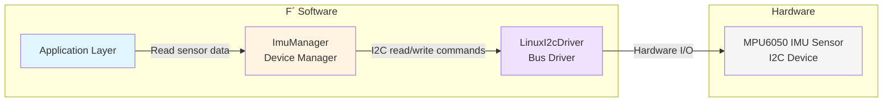

# Develop a Device Driver

This document describes the steps to create a new device manager in F Prime. A device driver is a component that interfaces with hardware peripherals (through a bus driver component). The device driver abstracts provides an interface to manage specific hardware devices.

## Application-Manager-Driver Pattern

Please refer to the [Application Manager Driver Pattern](../user-manual/design-patterns/app-man-drv.md) for more details on the design pattern used in F Prime for device drivers.

> [!IMPORTANT]
> A "device driver" traditionally refers to the entire stack of software that manages a hardware device. In F´, the driver-manager pattern splits this in two components: the device manager component (sometimes called "device driver") and the driver component (or "bus driver"). This enhances modularity and reusability, as we will see in the guide below.

<!-- TODO: do both device manager and bus driver in this doc? -->
**This guide focuses on the device manager component**. The bus driver component is assumed to already exist (e.g., I2C driver, SPI driver, UART driver, etc.) and will be covered in a separate guide.

### Example and reference

Consider an [MPU6050 IMU sensor](https://cdn-learn.adafruit.com/downloads/pdf/mpu6050-6-axis-accelerometer-and-gyro.pdf) connected via I2C. An example instantiation of the Application-Manager-Driver pattern, defined in the fprime-sensors repository (see [MpuImu component](https://github.com/fprime-community/fprime-sensors/tree/devel/fprime-sensors/MpuImu)), would look like this:
- The bus driver component (LinuxI2cDriver on Linux) handles I2C read and write operations at arbitrary addresses.
- The device manager component (ImuManager) uses the bus driver layer to implement the specific data read/writes sequences that produce relevant data for the MPU6050 sensor, as per its datasheet.
- The application layer uses the device manager component to obtain sensor data when needed.

**Figure**: Application-Manager-Driver pattern example with MPU6050 IMU sensor over I2C.

## How-To Develop a Device Manager

#### Step 1 - Understand the Hardware

Before starting development, obtain the datasheet and any relevant documentation for the hardware device. Understand its communication protocol, data formats, and anything relevant to your needs when interfacing with it.

#### Step 2 - Create the Device Manager Component

Use `fprime-util new --component` to create a new component for your device manager. Define its FPP model, including ports, commands, telemetry, and parameters as needed.

