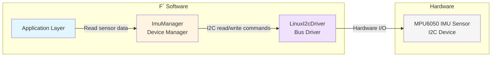

# Develop a Device Driver

This document describes the steps to create a new device manager in F Prime. A device driver is a component that interfaces with hardware peripherals (through a bus driver component). The device driver abstracts provides an interface to manage specific hardware devices.

## Application-Manager-Driver Pattern

Please refer to the [Application Manager Driver Pattern](../user-manual/design-patterns/app-man-drv.md) for more details on the design pattern used in F Prime for device drivers.

> [!IMPORTANT]
> A "device driver" traditionally refers to the entire stack of software that manages a hardware device. In F´, the driver-manager pattern splits this in two components: the device manager component (sometimes called "device driver") and the driver component (or "bus driver"). This enhances modularity and reusability, as we will see in the guide below.

<!-- TODO: do both device manager and bus driver in this doc? -->
**This guide focuses on the device manager component**. The bus driver component is assumed to already exist (e.g., I2C driver, SPI driver, UART driver, etc.) and will be covered in a separate guide.

### Example and reference

Consider an [MPU6050 IMU sensor](https://cdn-learn.adafruit.com/downloads/pdf/mpu6050-6-axis-accelerometer-and-gyro.pdf) connected via I2C. An example instantiation of the Application-Manager-Driver pattern, defined in the fprime-sensors repository (see [MpuImu component](https://github.com/fprime-community/fprime-sensors/tree/devel/fprime-sensors/MpuImu)), would look like this:
- The bus driver component (LinuxI2cDriver on Linux) handles I2C read and write operations at arbitrary addresses.
- The device manager component (ImuManager) uses the bus driver layer to implement the specific data read/writes sequences that produce relevant data for the MPU6050 sensor, as per its datasheet.
- The application layer uses the device manager component to obtain sensor data when needed.


**Figure**: Application-Manager-Driver pattern example with MPU6050 IMU sensor over I2C.


## How-To Develop a Device Manager

### Step 1 - Understand the Hardware

Before starting development, obtain the datasheet and any relevant documentation for the hardware device. Understand its communication protocol, data formats, and anything relevant to your needs when interfacing with it.

### Step 2 - Define the Device Manager Component

Use `fprime-util new --component` to create a new component for your device manager. This component will translate device-specific operations into bus transactions. Identify the bus type (I2C, SPI, UART, etc.) and the operations needed (read, write, configure, etc.). These should be reflected in the component's ports.

For our example `ImuManager` component, we are using an I2C bus, therefore we need to define ports that mirror the `Drv.I2c` interface (see [Drv/Interfaces/I2c.fpp](../../Drv/Interfaces/I2c.fpp)). A `Drv.I2c` for example provides an input port of type `Drv.I2cWriteRead`, so we need to define an output port of that type in our component:

```python
@ Component emitting telemetry read from an MpuImu
queued component ImuManager {
    output port busWriteRead: Drv.I2cWriteRead
    output port busWrite: Drv.I2c
}
```

### Step 3 - Implement Device-Specific Behavior

It is good practice to create helper functions for device operations, based on your datasheet. These helpers will then be called from your component's port handlers to respond to requests, or for example update telemetry on a schedule.

```cpp

// Register addresses (from datasheet)
static constexpr U8 RESET_REG = 0x00;
static constexpr U8 CONFIG_REG = 0x01;
static constexpr U8 DATA_REG = 0x10;

// Register values
static constexpr U8 RESET_VAL = 0x80;
static constexpr U8 DEFAULT_ADDR = 0x48;
static constexpr U8 DATA_SIZE = 6;

// Example: Reset device
Drv::I2cStatus MyDeviceManager::reset() {
    U8 cmd[] = {RESET_REG, RESET_VAL};  // From your datasheet
    Fw::Buffer writeBuffer(cmd, sizeof(cmd));
    return this->busWrite_out(0, m_address, writeBuffer);
}

// Example: Read sensor data
Drv::I2cStatus MyDeviceManager::read(MyDeviceData& output_data) {
    U8 regAddr = DATA_REG;
    U8 rawData[DATA_SIZE];
    Fw::Buffer writeBuffer(&regAddr, 1);
    Fw::Buffer readBuffer(rawData, DATA_SIZE);
    
    Drv::I2cStatus status = this->busWriteRead_out(0, m_address, writeBuffer, readBuffer);
    if (status == BUS_OK) {
        // Convert to engineering units
        output_data = convertRawData(rawData);
    }
    return status;
}
```

### Step 4 - Expose Behavior to Application layer

Once the device-specific helper functions are implemented, integrate them into your component's behavior. For example, we can configure our ImuManager to:
- a) Emit telemetry on a schedule by connecting to a RateGroup
- b) Expose data to the application layer through additional ports

First, let's represent our ImuData in FPP so we can use it in telemetry and ports:

```python
struct ImuData {
    acceleration: FprimeSensors.GeometricVector3
    rotation: FprimeSensors.GeometricVector3
    temperature: F32
}
```

**a) Emit telemetry on a schedule**

Add a run port to connect to a RateGroup, and implement the run handler to read data and emit telemetry:
```python
queued component ImuManager {
    ...

    @ Scheduling port for reading from IMU and writing to telemetry
    sync input port run: Svc.Sched
}
```

```cpp
void ImuManager::run_handler(FwIndexType portNum, U32 context) {
    ImuData data;
    Drv::I2cStatus status = this->read(data);
    if (status == BUS_OK) {
        this->tlmWrite_ImuData(data);
    } else {
        this->log_WARNING_HI_ImuReadError(status);
    }
}   
```

**b) Expose data to application layer**

Add a port that returns data on request:

```python
@ Port to read IMU data on request. Update data reference and return status
port ImuDataRead(ref data: ImuData) -> Fw.Success

queued component ImuManager {
    ...

    sync input port getData: ImuDataRead
}
```

```cpp
Fw::Success ImuManager::getData_handler(FwIndexType portNum, ImuData& data) {
    Drv::I2cStatus status = this->read(data);
    return (status == Drv::I2cStatus::I2C_OK) ? Fw::SUCCESS : Fw::FAILURE;
}   
```

>[!TIP]
> For more complex use cases, it is recommended not to use Fw.Success but rather define your own status enum to represent different error conditions. This is left as an exercise to the reader, but is illustrated in the fprime-sensors repository as well as in the `Drv/` directory in F Prime.

### Optional Step - Implement as a State Machine

For devices with initialization sequences, multiple operational modes, or any behavior that fits the pattern, you may consider using an FPP state machine. FPP state machines are documented here:
- [FPP State Machine User Guide](https://nasa.github.io/fpp/fpp-users-guide.html#Defining-State-Machines)
- [How-To Define State Machines in FPP](./define-state-machines.md)

The ImuManager component in the fprime-sensors repository also uses a state machine, see [ImuStateMachine.fpp](https://github.com/fprime-community/fprime-sensors/blob/devel/fprime-sensors/MpuImu/Components/ImuManager/ImuStateMachine.fpp)

### Step 5 - Integrate into Deployment

Wire your device manager to the bus driver in a topology:

```fpp
instance myDevice: MyModule.MyDeviceManager base id 0x1000
instance busDriver: Drv.LinuxI2cDriver base id 0x2000  # Or SPI, UART, etc.

topology MyTopology {
    connections {
        myDevice.busWriteRead -> busDriver.writeRead
    }
}
```

Then configure the bus driver to open the correct device. This is platform specific. On Linux, this may look like the following:

```cpp
// In Topology.cpp
void configureTopology() {
    ...

    Drv::I2cStatus status = MpuImu::imuDriver.open(state.mpu.device);
    // TODO: handle status
}
```

## Best Practices

- Keep device-specific logic in helper functions separate from component infrastructure
- Always check bus operation status and emit events on errors
- Define all register addresses/values as named constants from the datasheet, don't use "magic" numbers
- Use parameters for configurable device settings (ranges, modes, etc.)

## Additional Resources

- [Application Manager Driver Pattern](../user-manual/design-patterns/app-man-drv.md)
- [FPP State Machine Reference](../reference/fpp/fpp-spec.html#specifying-state-machines)
- [fprime-sensors Repository](https://github.com/fprime-community/fprime-sensors) - A collection of ready-to-use device managers for specific devices
- [fprime-sensors-reference Repository](https://github.com/fprime-community/fprime-sensors-reference) - Reference project that uses sensors defined in fprime-sensors

