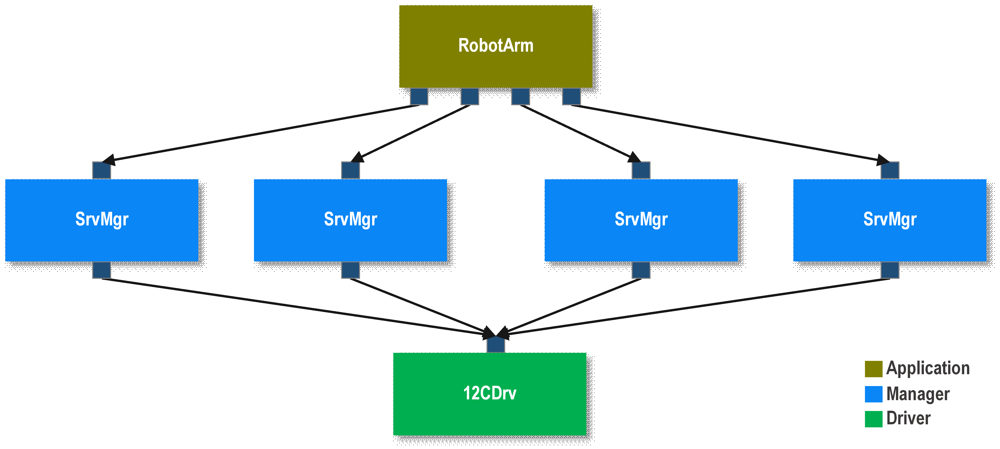

# Develop Device Drivers in F Prime (F´)

This guide shows how to develop device drivers in F Prime (F´) using the **Application-Manager-Driver** architectural pattern. Device drivers in F´ are organized into layered components that interface with hardware devices, such as sensors, actuators, or communication peripherals. This guide will walk you through the steps to create a complete device driver solution, including setting up the FPP models, implementing the driver logic, and integrating everything into an F´ deployment.

*Contents:*

1. [Understanding the Application-Manager-Driver Pattern](#understanding-the-application-manager-driver-pattern)
2. [Device Driver Architecture Overview](#device-driver-architecture-overview)
3. [Step 1: Creating the Driver Component](#step-1-creating-the-driver-component)
4. [Step 2: Creating the Manager Component](#step-2-creating-the-manager-component)
5. [Step 3: Creating the Application Component](#step-3-creating-the-application-component)
6. [Step 4: Building a Subtopology](#step-4-building-a-subtopology)
7. [Step 5: Integration and Testing](#step-5-integration-and-testing)
8. [Best Practices and Common Patterns](#best-practices-and-common-patterns)
9. [Troubleshooting](#troubleshooting)

---

## Understanding the Application-Manager-Driver Pattern

F´ device drivers follow the **Application-Manager-Driver** architectural pattern, which provides a clean separation of concerns across three distinct layers. This pattern, as described in the [Application-Manager-Driver Architecture](../user-manual/design-patterns/app-man-drv.md), enables code reusability, testability, and maintainability.

### The Three Layers



**Driver Layer (Hardware Interface)**
- Implements the low-level hardware communication protocols (SPI, I2C, UART, etc.)
- Provides generic interfaces for hardware operations
- Does not know about specific devices connected to it
- Example: `LinuxSpiDriver`, `ByteStreamDriver`

**Manager Layer (Device Control)**
- Manages a specific hardware device using the driver interface
- Translates high-level device operations into driver commands
- Handles device-specific protocols and data formats
- Provides abstracted device interface to applications
- Example: `BmpManager` for BMP280 sensor, `XBeeManager` for XBee radio

**Application Layer (Mission Logic)**
- Implements mission-specific functionality
- Uses manager components through their high-level interfaces
- Does not need to know hardware implementation details
- Orchestrates system-wide behavior
- Example: Weather monitoring system using multiple sensors

## Device Driver Architecture Overview

A typical F´ device driver implementation consists of:

1. **Driver Component**: Generic hardware interface (often reused from F´ standard drivers)
2. **Manager Component**: Device-specific logic and interface
3. **Types and Constants**: Device-specific data structures and enumerations
4. **Subtopology**: Packaging of manager and driver with their connections
5. **Configuration**: Device-specific parameters and settings

Let's examine a real example from the `fprime-sensors` library - the BMP280 pressure sensor implementation:

```
Bmp280/
├── Components/
│   └── BmpManager/           # Manager component
│       ├── BmpManager.fpp    # FPP interface definition
│       ├── BmpManager.hpp    # C++ header
│       └── BmpManager.cpp    # C++ implementation
├── Types/
│   └── Types.fpp            # Device-specific types
├── Subtopology/
│   ├── Subtopology.fpp      # Topology definition
│   └── Bmp280Config/        # Configuration
└── CMakeLists.txt
```

This structure provides:
- **Reusability**: The `LinuxSpiDriver` can be used with any SPI device
- **Testability**: Each layer can be tested independently
- **Maintainability**: Changes to hardware interface don't affect application logic
- **Composability**: Multiple device subtopologies can be combined in applications

## Step 1: Creating the Driver Component

For most hardware interfaces, F´ provides standard driver components that you can reuse:

- **SPI Devices**: Use `Drv.LinuxSpiDriver` or platform-specific SPI drivers
- **I2C Devices**: Use `Drv.LinuxI2cDriver` or platform-specific I2C drivers  
- **UART/Serial**: Use `Drv.ByteStreamDriver` with `LinuxUartDriver`
- **GPIO**: Use `Drv.LinuxGpioDriver`

**Example: Using an existing SPI driver**

Most of the time, you won't need to create a new driver component. For a device like the BMP280 that communicates over SPI, you would use the existing `LinuxSpiDriver`:

```fpp
# In your subtopology configuration
instance bmpDriver: Drv.LinuxSpiDriver base id BASE_ID + 0x2000 {
    phase Fpp.ToCpp.Phases.configComponents """
    if (not bmpDriver.open("/dev/spidev0.0", 0, Drv::SPI_FREQUENCY_5MHZ)) {
        Fw::Logger::log("[ERROR] BMP280 SPI open failed\\n");
    }
    """
}
```

**When to Create a Custom Driver**

Create a custom driver component only when:
- No existing F´ driver supports your hardware interface
- You need platform-specific optimizations
- Your hardware requires non-standard protocols

## Step 2: Creating the Manager Component

The manager component is the heart of your device driver. It implements device-specific logic and provides a clean interface for applications.

### 2.1: Define Device Types

First, create device-specific types in `Types/Types.fpp`:

```fpp
module YourDevice {
    
    @ Device measurement data structure
    struct DeviceData {
        timestamp: Fw.Time     @< Measurement timestamp
        temperature: F32       @< Temperature in Celsius  
        pressure: F32          @< Pressure in Pascals
        status: DeviceStatus   @< Device status
    }
    
    @ Device status enumeration
    enum DeviceStatus {
        HEALTHY = 0           @< Device operating normally
        WARNING = 1           @< Device has warnings
        ERROR = 2             @< Device has errors
    }
    
    @ Configuration parameters
    enum SamplingRate {
        RATE_1HZ = 0         @< 1 Hz sampling
        RATE_10HZ = 1        @< 10 Hz sampling  
        RATE_100HZ = 2       @< 100 Hz sampling
    }
}
```

### 2.2: Define the Manager FPP Interface

Create `YourDeviceManager.fpp` with ports, events, telemetry, and parameters:

```fpp
module YourDevice {
    @ Component managing the YourDevice sensor
    passive component DeviceManager {

        # ----------------------------------------------------------------------
        # Driver Interface Ports
        # ----------------------------------------------------------------------
        
        @ Port for SPI bus communication
        output port spiReadWrite: Drv.SpiReadWrite

        # ----------------------------------------------------------------------
        # Scheduling and Control Ports  
        # ----------------------------------------------------------------------
        
        @ Scheduling port for periodic device reading
        sync input port run: Svc.Sched

        @ Command to trigger device reading
        sync input port trigger: Fw.Com

        # ----------------------------------------------------------------------
        # Telemetry Channels
        # ----------------------------------------------------------------------
        
        @ Device measurement telemetry
        telemetry DeviceReading: DeviceData

        @ Device health status
        telemetry DeviceHealth: DeviceStatus

        # ----------------------------------------------------------------------
        # Events
        # ----------------------------------------------------------------------
        
        event DeviceInitialized() \
            severity activity high \
            format "Device initialized successfully"

        event DeviceError(error: U32) \
            severity warning high \
            format "Device error: {}" \
            throttle 5

        event ReadingOutOfRange(value: F32, min: F32, max: F32) \
            severity warning low \
            format "Reading {} outside expected range [{}, {}]"

        # ----------------------------------------------------------------------
        # Parameters
        # ----------------------------------------------------------------------
        
        @ Sampling rate configuration
        param SAMPLING_RATE: SamplingRate default SamplingRate.RATE_1HZ

        @ Enable/disable device
        param DEVICE_ENABLED: bool default true

        # ----------------------------------------------------------------------
        # Standard AC Ports (Required for Channels, Events, Commands, Parameters)
        # ----------------------------------------------------------------------
        
        @ Port for requesting current time
        time get port timeCaller

        @ Port for sending telemetry channels
        telemetry port tlmOut

        @ Port for sending events
        event port logOut

        @ Port for getting parameters
        param get port prmGetOut

        @ Port for setting parameters  
        param set port prmSetOut
    }
}
```

### 2.3: Implement the Manager Component

Create `YourDeviceManager.hpp`:

```cpp
#ifndef YourDevice_DeviceManager_HPP
#define YourDevice_DeviceManager_HPP

#include "YourDeviceManagerComponentAc.hpp"

namespace YourDevice {

class DeviceManager final : public DeviceManagerComponentBase {
  public:
    // Device register addresses and constants
    static constexpr U8 DEVICE_ID_REGISTER = 0x00;
    static constexpr U8 EXPECTED_DEVICE_ID = 0x42;
    static constexpr U8 CONTROL_REGISTER = 0x01;
    static constexpr U8 DATA_REGISTER = 0x02;
    
    // Constructor and destructor
    DeviceManager(const char* const compName);
    ~DeviceManager();

  private:
    // Handler implementations for input ports
    void run_handler(FwIndexType portNum, U32 context) override;
    void trigger_handler(FwIndexType portNum) override;
    void parameterUpdated(FwPrmIdType id) override;

    // Helper functions
    bool initializeDevice();
    bool readDeviceId(U8& id);
    bool configureDevice();
    bool readMeasurement(DeviceData& data);
    bool writeRegister(U8 address, U8 value);
    bool readRegister(U8 address, U8& value);
    
    // State variables
    bool m_deviceInitialized;
    U32 m_errorCount;
};

} // namespace YourDevice

#endif
```

Create `YourDeviceManager.cpp`:

```cpp
#include "YourDeviceManager.hpp"
#include <Fw/Logger/Logger.hpp>

namespace YourDevice {

DeviceManager::DeviceManager(const char* const compName) :
    DeviceManagerComponentBase(compName),
    m_deviceInitialized(false),
    m_errorCount(0)
{
}

DeviceManager::~DeviceManager() {
}

void DeviceManager::run_handler(FwIndexType portNum, U32 context) {
    // Check if device is enabled
    Fw::ParamValid valid;
    bool enabled = paramGet_DEVICE_ENABLED(valid);
    if (valid != Fw::ParamValid::VALID || !enabled) {
        return;
    }

    // Initialize device if not already done
    if (!m_deviceInitialized) {
        if (!initializeDevice()) {
            log_WARNING_HI_DeviceError(m_errorCount++);
            return;
        }
        m_deviceInitialized = true;
        log_ACTIVITY_HI_DeviceInitialized();
    }

    // Read measurement
    DeviceData data;
    if (readMeasurement(data)) {
        // Validate reading is in expected range
        if (data.temperature < -40.0 || data.temperature > 85.0) {
            log_WARNING_LO_ReadingOutOfRange(data.temperature, -40.0, 85.0);
        }
        
        // Send telemetry
        tlmWrite_DeviceReading(data);
        tlmWrite_DeviceHealth(DeviceStatus::HEALTHY);
    } else {
        tlmWrite_DeviceHealth(DeviceStatus::ERROR);
        log_WARNING_HI_DeviceError(m_errorCount++);
    }
}

bool DeviceManager::initializeDevice() {
    // Read and verify device ID
    U8 deviceId;
    if (!readDeviceId(deviceId)) {
        return false;
    }
    
    if (deviceId != EXPECTED_DEVICE_ID) {
        Fw::Logger::log("Device ID mismatch: expected 0x%02X, got 0x%02X\n", 
                       EXPECTED_DEVICE_ID, deviceId);
        return false;
    }

    // Configure device
    return configureDevice();
}

bool DeviceManager::readMeasurement(DeviceData& data) {
    // Implementation depends on device protocol
    // This is a simplified example
    
    U8 rawData[6];
    if (!readRegister(DATA_REGISTER, rawData[0])) {
        return false;
    }
    
    // Convert raw data to engineering units
    data.temperature = static_cast<F32>(rawData[0]) - 40.0;
    data.pressure = static_cast<F32>(rawData[1]) * 100.0;
    data.status = DeviceStatus::HEALTHY;
    
    // Set timestamp
    data.timestamp = getTime();
    
    return true;
}

bool DeviceManager::writeRegister(U8 address, U8 value) {
    U8 writeData[2] = {address, value};
    Fw::Buffer writeBuffer(writeData, sizeof(writeData));
    Fw::Buffer readBuffer; // Empty for write operation
    
    Drv::SpiStatus status = spiReadWrite_out(0, writeBuffer, readBuffer);
    return (status == Drv::SpiStatus::SPI_OK);
}

bool DeviceManager::readRegister(U8 address, U8& value) {
    U8 writeData[1] = {address | 0x80}; // Set read bit
    Fw::Buffer writeBuffer(writeData, sizeof(writeData));
    
    U8 readData[1];
    Fw::Buffer readBuffer(readData, sizeof(readData));
    
    Drv::SpiStatus status = spiReadWrite_out(0, writeBuffer, readBuffer);
    if (status == Drv::SpiStatus::SPI_OK) {
        value = readData[0];
        return true;
    }
    return false;
}

} // namespace YourDevice
```

## Step 3: Creating the Application Component

Application components use manager components to implement mission-specific functionality. Here's an example of an application that uses multiple sensor managers:

```fpp
module WeatherStation {
    active component WeatherApp {
        
        # ----------------------------------------------------------------------
        # Manager Interface Ports
        # ----------------------------------------------------------------------
        
        @ Interface to temperature sensor
        sync input port tempReading: YourDevice.DeviceData
        
        @ Interface to pressure sensor  
        sync input port pressureReading: Bmp280.Bmp280Data
        
        # ----------------------------------------------------------------------
        # Mission Telemetry
        # ----------------------------------------------------------------------
        
        @ Computed weather index
        telemetry WeatherIndex: F32
        
        @ Weather alert status
        telemetry WeatherAlert: WeatherAlertLevel
        
        # ----------------------------------------------------------------------
        # Commands
        # ----------------------------------------------------------------------
        
        @ Start weather monitoring
        async command START_MONITORING()
        
        @ Stop weather monitoring
        async command STOP_MONITORING()

        # Standard ports...
        time get port timeCaller
        telemetry port tlmOut
        event port logOut
        command recv port cmdIn
        command reg port cmdRegOut
        command resp port cmdResponseOut
    }
}
```

## Step 4: Building a Subtopology

Subtopologies package your manager and driver components together with their connections. This promotes reusability and encapsulation.

### 4.1: Create Subtopology Definition

Create `Subtopology/Subtopology.fpp`:

```fpp
module YourDevice {
    @ Manager overseeing the device
    instance deviceManager: YourDevice.DeviceManager base id YourDevice.SubtopologyConfig.BASE_ID + 0x1000

    topology Subtopology {
        instance deviceManager
        instance deviceDriver

        connections YourDevice {
            # Connect manager to driver
            deviceManager.spiReadWrite -> deviceDriver.SpiReadWrite
        }
    }
}
```

### 4.2: Create Configuration

Create `Subtopology/YourDeviceConfig/YourDeviceSubtopologyConfig.fpp`:

```fpp
module YourDevice {
    module SubtopologyConfig {
        constant BASE_ID = 0xE0000000
    }

    @ Device configuration structure
    struct DeviceConfig {
        device: string size 64    @< Device path (e.g., "/dev/spidev0.0")
        select: U8                @< Chip select pin
        frequency: U32            @< SPI frequency in Hz
    }

    instance deviceDriver: Drv.LinuxSpiDriver base id YourDevice.SubtopologyConfig.BASE_ID + 0x2000 {
        phase Fpp.ToCpp.Phases.configComponents """
        if (not YourDevice::deviceDriver.open(state.yourDevice.device.device, 
                                             state.yourDevice.device.select, 
                                             state.yourDevice.device.frequency)) {
            Fw::Logger::log("[ERROR] YourDevice SPI open failed\\n");
        }
        else {
            Fw::Logger::log("[INFO] YourDevice SPI open successful\\n");
        }
        """
    }
}
```

### 4.3: Create CMakeLists.txt

```cmake
####
# Subtopology CMakeLists.txt
####

# Register the subtopology
register_fprime_module()

# Add configuration
register_fprime_target("YourDeviceConfig")
```

## Step 5: Integration and Testing

### 5.1: Unit Testing

Create unit tests for your manager component in `test/ut/`:

```cpp
// YourDeviceManagerTester.cpp
#include "YourDeviceManagerGTestBase.hpp"
#include "YourDevice/Components/YourDeviceManager/YourDeviceManager.hpp"

class YourDeviceManagerTester : public YourDevice::YourDeviceManagerGTestBase {
public:
    YourDeviceManagerTester() : YourDeviceManagerGTestBase("Tester", MAX_HISTORY_SIZE) {
    }

    void connectPorts() {
        // Connect all ports for testing
        this->connect_to_spiReadWrite(0, this->component.get_spiReadWrite_OutputPort(0));
        this->component.set_timeCaller_OutputPort(0, this->get_from_timeCaller(0));
        // ... connect other ports
    }

private:
    YourDevice::DeviceManager component;
};

TEST_F(YourDeviceManagerTester, InitializationTest) {
    // Setup mock SPI responses
    EXPECT_CALL_spiReadWrite(/* expected parameters */);
    
    // Trigger device initialization
    this->invoke_to_run(0, 0);
    
    // Verify initialization event
    ASSERT_EVENTS_DeviceInitialized(1);
}
```

### 5.2: Integration Testing

Test your subtopology by integrating it into a test deployment:

```fpp
module TestDeployment {
    # Include your device subtopology
    import YourDevice.Subtopology
    
    topology TestTopology {
        # Include subtopology
        import YourDevice.Subtopology
        
        # Test application instance
        instance testApp: TestApp
        
        connections Test {
            # Connect test app to device manager
            testApp.deviceData -> deviceManager.trigger
        }
    }
}
```

### 5.3: Hardware-in-the-Loop Testing

For real hardware testing:

1. **Simulator Mode**: Use mock drivers during development
2. **Hardware Mode**: Connect to real hardware with actual drivers
3. **Validation**: Compare expected vs. actual sensor readings

```cpp
// Example hardware validation
void validateSensorReading(const DeviceData& data) {
    // Check if readings are within expected physical limits
    ASSERT_GT(data.temperature, -50.0);  // Above absolute minimum
    ASSERT_LT(data.temperature, 100.0);  // Below maximum expected
    
    // Check timestamp is recent
    Fw::Time now = getTime();
    ASSERT_LT(now.getSeconds() - data.timestamp.getSeconds(), 1.0);
}
```

## Best Practices and Common Patterns

### Error Handling Patterns

**1. Graceful Degradation**
```cpp
bool DeviceManager::readMeasurement(DeviceData& data) {
    if (!m_deviceInitialized) {
        // Try to reinitialize
        if (!initializeDevice()) {
            data.status = DeviceStatus::ERROR;
            return false;
        }
    }
    
    // Attempt reading with retry logic
    for (int retry = 0; retry < MAX_RETRIES; retry++) {
        if (performReading(data)) {
            m_consecutiveErrors = 0;
            return true;
        }
        
        // Brief delay before retry
        Os::Task::delay(RETRY_DELAY_MS);
    }
    
    m_consecutiveErrors++;
    if (m_consecutiveErrors > ERROR_THRESHOLD) {
        data.status = DeviceStatus::ERROR;
        log_WARNING_HI_DeviceError(m_errorCount++);
    }
    
    return false;
}
```

**2. Parameter Validation**
```cpp
void DeviceManager::parameterUpdated(FwPrmIdType id) {
    if (id == PARAM_SAMPLING_RATE) {
        Fw::ParamValid valid;
        SamplingRate rate = paramGet_SAMPLING_RATE(valid);
        
        if (valid == Fw::ParamValid::VALID) {
            if (updateSamplingRate(rate)) {
                log_ACTIVITY_HI_SamplingRateUpdated(rate);
            } else {
                log_WARNING_HI_ParameterUpdateFailed(id);
            }
        }
    }
}
```

### Performance Considerations

**1. Minimize Memory Allocations**
```cpp
class DeviceManager {
private:
    // Pre-allocate buffers to avoid runtime allocation
    U8 m_spiWriteBuffer[MAX_SPI_BUFFER_SIZE];
    U8 m_spiReadBuffer[MAX_SPI_BUFFER_SIZE];
    
    // Reuse measurement structure
    DeviceData m_currentReading;
};
```

**2. Efficient Communication**
```cpp
// Batch register operations when possible
bool DeviceManager::configureDevice() {
    // Single transaction with multiple register writes
    U8 configData[] = {
        REGISTER_1, VALUE_1,
        REGISTER_2, VALUE_2,
        REGISTER_3, VALUE_3
    };
    
    return writeRegisters(configData, sizeof(configData));
}
```

### Code Organization Patterns

**1. Separate Protocol Logic**
```cpp
class DeviceManager {
private:
    // Protocol-specific helper class
    class DeviceProtocol {
    public:
        static bool parseTemperature(const U8* rawData, F32& temperature);
        static bool parsePressure(const U8* rawData, F32& pressure);
        static void encodeConfig(const DeviceConfig& config, U8* buffer);
    };
};
```

**2. State Machine for Complex Devices**
```cpp
enum class DeviceState {
    UNINITIALIZED,
    INITIALIZING,
    IDLE,
    MEASURING,
    ERROR
};

void DeviceManager::run_handler(FwIndexType portNum, U32 context) {
    switch (m_deviceState) {
        case DeviceState::UNINITIALIZED:
            handleInitialization();
            break;
        case DeviceState::MEASURING:
            handleMeasurement();
            break;
        // ... other states
    }
}
```

## Troubleshooting

### Common Issues and Solutions

**1. SPI Communication Failures**
```
Problem: spiReadWrite returns SPI_ERROR
Solutions:
- Verify SPI device path (/dev/spidev0.0)
- Check SPI frequency compatibility
- Ensure correct chip select pin
- Verify device power and connections
- Check SPI mode (CPOL/CPHA) settings
```

**2. Device Not Responding**
```
Problem: Device ID reads incorrectly or timeouts
Solutions:
- Verify device power supply voltage
- Check reset timing requirements
- Ensure proper pull-up/pull-down resistors
- Verify communication protocol (SPI vs I2C)
- Check device address/chip select
```

**3. Telemetry Not Updating**
```
Problem: Device readings not appearing in GDS
Solutions:
- Verify scheduling port is connected
- Check that run_handler is being called
- Ensure telemetry ports are connected
- Verify parameter DEVICE_ENABLED is true
- Check for error events in log
```

**4. Build/Compilation Errors**
```
Problem: Component won't compile or link
Solutions:
- Verify all required ports are connected in FPP
- Check CMakeLists.txt includes all dependencies
- Ensure namespace consistency
- Verify FPP syntax (fprime-util fpp-check)
- Check that all required F´ modules are available
```

**5. Unit Test Failures**
```
Problem: Unit tests fail or won't run
Solutions:
- Verify all test ports are connected
- Check mock expectations match component behavior
- Ensure test data is within valid ranges
- Verify component state is properly reset between tests
- Check for race conditions in active components
```

### Debugging Techniques

**1. Add Debug Logging**
```cpp
void DeviceManager::readMeasurement() {
    Fw::Logger::log("DEBUG: Starting measurement read\n");
    
    U8 status;
    if (readRegister(STATUS_REGISTER, status)) {
        Fw::Logger::log("DEBUG: Device status: 0x%02X\n", status);
    }
    
    // ... rest of measurement logic
}
```

**2. Use Events for Debugging**
```fpp
event DebugRegisterRead(address: U8, value: U8) \
    severity diagnostic \
    format "Register 0x{x}: 0x{x}"

event DebugSpiTransaction(writeBytes: U8, readBytes: U8) \
    severity diagnostic \
    format "SPI: wrote {} bytes, read {} bytes"
```

**3. Parameter-Controlled Debug Mode**
```fpp
param DEBUG_ENABLED: bool default false

param DEBUG_LEVEL: U8 default 0
```

```cpp
void DeviceManager::debugLog(U8 level, const char* format, ...) {
    Fw::ParamValid valid;
    bool debugEnabled = paramGet_DEBUG_ENABLED(valid);
    U8 debugLevel = paramGet_DEBUG_LEVEL(valid);
    
    if (valid == Fw::ParamValid::VALID && debugEnabled && level <= debugLevel) {
        // Log debug message
        va_list args;
        va_start(args, format);
        Fw::Logger::logMsg(format, args);
        va_end(args);
    }
}
```

This comprehensive guide provides the foundation for developing robust device drivers in F´ using the Application-Manager-Driver pattern. The key is to maintain clear separation between hardware interface, device management, and application logic, enabling reusable and testable components that can be easily integrated into complex F´ systems.