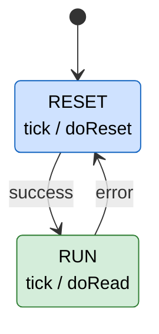
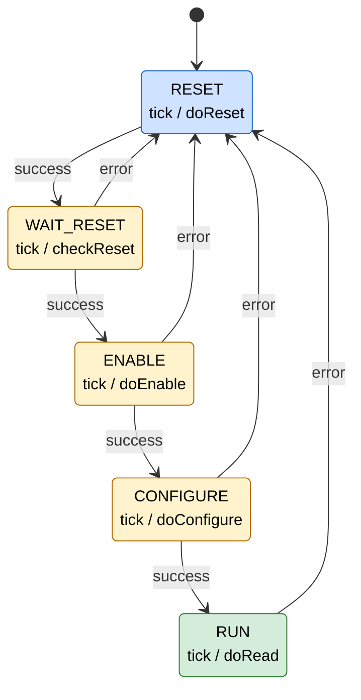

# Define State Machines in F Prime

This guide shows how to define and use state machines in F Prime using the F Prime Modeling Language (FPP). State machines help capture component behavior by modeling modes (states) and transitions explicitly, making complex logic easier to implement, test, and maintain. FPP provides autocoding capabilities to allow users to quickly implement state-defined behavior.

> [!NOTE]
> "F Prime" and "F´" are two ways of writing the name of the same framework. This guide uses "F Prime" throughout. A [glossary](#glossary) of terms used in this guide is provided at the end.

---

## Prerequisites

Before starting, you should have:

* Completed the [Hello World Tutorial](https://fprime.jpl.nasa.gov/latest/tutorials-hello-world/docs/hello-world/) (so you’ve built and run at least one component).
* A general understanding of [FPP component modeling](https://nasa.github.io/fpp/fpp-users-guide.html#Defining-Components) (see the "Defining Components" section of the FPP User’s Guide).
* Experience creating commands, events, and telemetry in FPP.
* A working build of F Prime on your system (`fprime-util` runs successfully).

---

## When to Use State Machines

State machines in F Prime are the same [finite state machines](https://en.wikipedia.org/wiki/Finite-state_machine) taught in computer science courses: a set of states, a set of inputs (signals), and rules (transitions) describing which state to move to when an input arrives. If you have studied state machines before, everything you know applies here — FPP simply provides a way to write them down and generate the implementation automatically.

State machines are useful when your component has distinct **modes** or **operational states** with different behavior in specific states and rules for the transitions between states. Examples include:

* A radio with `OFF`, `IDLE`, and `TRANSMITTING` states.
* A sensor with a series of start-up states.

By modeling these as a state machine, you make system behavior explicit, verifiable, and easier to test.

---

## Development Workflow

Adding a state machine to a component follows a defined pipeline. Each step is covered in a section of this guide:

1. **Design** the state machine: identify the states, the signals that drive it, the transitions between states, and the actions taken in each state.
2. **Define** the state machine in FPP ([Designing a State Machine in FPP](#designing-a-state-machine-in-fpp)).
3. **Instantiate** the state machine inside a `queued` or `active` component ([Instantiating the State Machine](#instantiating-the-state-machine)).
4. **Generate** implementation templates with `fprime-util impl` ([Integrating Into C++](#integrating-into-c)).
5. **Implement** the action handlers in C++ ([Implementing Actions in C++](#implementing-actions-in-c)).
6. **Send signals** from the component implementation to drive the machine ([Implementing Signaling in C++](#implementing-signaling-in-c)).
7. **Dispatch** the component's message queue so signals are processed ([Dispatching the State Machine](#dispatching-the-state-machine)).

## Example State Machine

This guide walks through implementing the start-up and run logic for an IMU (Inertial Measurement Unit — a sensor that measures acceleration and rotation). In F Prime code, type and component names use CamelCase, so the acronym IMU appears as `Imu` in identifiers such as `ImuStateMachine` and `ImuManager`.

Before looking at the full design, consider a simplified version with just two states. The device must be reset before it can be used, so the machine starts in a `RESET` state, and moves to a `RUN` state once the reset succeeds:



In this diagram (and those that follow):

* **Boxes are states.** The text below the state name, written `signal / action`, means "when this signal arrives in this state, run this action" (e.g. `tick / doReset` runs the `doReset` action on each `tick`).
* **Arrows are transitions**, labeled with the signal that causes them (e.g. `success` moves the machine from `RESET` to `RUN`).

The real device needs a few more steps: wait for the reset to complete, enable data flows, and configure the device. Expanding the simple two-state design gives the full state machine implemented in this guide, which has the following properties:

1. The initial state is `RESET`, followed by `WAIT_RESET`, `ENABLE`, `CONFIGURE`, and `RUN`.
2. In each state, a `tick` signal triggers an action.
3. Actions may yield `success` or `error` signals.
4. `success` signals progress linearly through to the next state.
5. `error` signals return to state `RESET`.
6. The state machine remains in a given state (and repeats the action) when the action yields no signals.



The states, transitions, and actions of this state machine are summarized in the following table:

| State | Action on `tick` | On `success` go to | On `error` go to |
|---|---|---|---|
| `RESET` | `doReset` | `WAIT_RESET` | (stay in `RESET`) |
| `WAIT_RESET` | `checkReset` | `ENABLE` | `RESET` |
| `ENABLE` | `doEnable` | `CONFIGURE` | `RESET` |
| `CONFIGURE` | `doConfigure` | `RUN` | `RESET` |
| `RUN` | `doRead` | (stay in `RUN`) | `RESET` |

This state machine is implemented in the [MpuImu](https://github.com/fprime-community/fprime-sensors/blob/devel/fprime-sensors/MpuImu/Components/ImuManager/ImuStateMachine.fpp) component. This component drives the `tick` signal from a rate group handler.

> [!NOTE]
> The [MpuImu](https://github.com/fprime-community/fprime-sensors/blob/devel/fprime-sensors/MpuImu/Components/ImuManager/ImuStateMachine.fpp) component implements a further `reconfigure` signal allowing the machine to return to reconfigure state.

## Designing a State Machine in FPP

We will model the `Imu` state machine in FPP.  In this guide, we will use a separate file `ImuStateMachine.fpp` defined in the same folder (i.e. module) as the `ImuManager`, but you may also inline the state machine directly in the component itself.  We define the basic module and state machine with:

```
module MpuImu {
    state machine ImuStateMachine
}
```

The module, filename, etc was chosen to remain consistent with our example code (and the `ImuManager` component that uses the state machine).

> [!NOTE]
> The guide builds up the same state machine definition step by step. In each code snippet below, the lines added in that step are highlighted.

### Defining a State Machine and Initial State

The first step of defining our state machine, is to name the machine and the initial `RESET` state. This step will give us a basis for state machine implementation.

```text hl_lines="4-9"
module MpuImu {
    @ Define ImuStateMachine State Machine
    state machine ImuStateMachine {
        @ Initial state: reset the device
        initial enter RESET

        @ Reset the Imu
        state RESET {
        }
    }
}
```

### Defining Signals and Adding More States

Next we should define our `success`, `error`, and `tick` signals and the remaining states: `WAIT_RESET`, `ENABLE`, `CONFIGURE`, and `RUN`.  Here we have added in all the structures (states, and signals) that define the general flow of the state machine. However, we have not added any transition logic yet.

The revised machine should look something like:

```text hl_lines="7-14 19-29"
module MpuImu {
    @ Define ImuStateMachine State Machine
    state machine ImuStateMachine {
        @ Initial state: reset the device
        initial enter RESET

        @ Rate-group driven tick signal
        signal tick

        @ Current state passed successfully
        signal success

        @ Current state erred
        signal error

        @ Reset the Imu
        state RESET

        @ Wait for the Imu to reset
        state WAIT_RESET

        @ Enable Imu data flows
        state ENABLE

        @ Configure Imu
        state CONFIGURE

        @ Run the Imu
        state RUN
    }
}
```

### Defining Transitions

The next step is to add our transitions between states. A **transition** moves the state machine from one state to another in response to a signal. Here we handle signals using the `on` syntax, and dictate the next state to enter. This provides the linear flow, and return to reset behaviors.

This update results in:

```text hl_lines="18 23-24 29-30 35-36 41"
module MpuImu {
    @ Define ImuStateMachine State Machine
    state machine ImuStateMachine {
        @ Initial state: reset the device
        initial enter RESET

        @ Rate-group driven tick signal
        signal tick

        @ Current state passed successfully
        signal success

        @ Current state erred
        signal error

        @ Reset the Imu
        state RESET {
            on success enter WAIT_RESET
        }

        @ Wait for the Imu to reset
        state WAIT_RESET {
            on success enter ENABLE
            on error enter RESET
        }

        @ Enable Imu data flows
        state ENABLE {
            on success enter CONFIGURE
            on error enter RESET
        }

        @ Configure Imu
        state CONFIGURE {
            on success enter RUN
            on error enter RESET
        }

        @ Run the Imu
        state RUN {
            on error enter RESET
        }
    }
}
```

> [!NOTE]
> The `RESET` state defines no `error` transition because the machine should remain in `RESET` on error. Similarly, the `RUN` state defines no `success` transition as it should remain in `RUN` on success. Signals that a state does not handle are simply ignored in that state.

The state machine now has transitions between states, but lacks taking action at each state. This will be covered next.


### Defining Actions

Here is where we define actions for the state machine to take. An **action** is a piece of user-supplied C++ code that the state machine runs; this differs from a **transition**, which changes the current state. Actions may occur as part of transitions, in response to signals, and on entry/exit from a state.  They call back into the components' C++ implementation. This allows user defined behavior (i.e. talking to the Imu over I2C).

In this state machine, we will use the `tick` signal to trigger action. `tick` will be invoked off our rate-group handler. By restricting actions to the `tick` signal, we ensure that only one state and the associated (singular) I2C communication is performed on each rate group invocation.  This was done to ensure that rate group calls are of a deterministic length and so that the I2C bus remains uncontested.

We use the `action` keyword to define actions: `doReset`, `checkReset`, `doEnable`, `doConfigure`, and `doRead`. We use `on <signal> do { <action> }` syntax to specify the actions to run on each `tick` signal.  This results in:

```text hl_lines="16-29 34 41 48 55 61"
module MpuImu {
    @ Define ImuStateMachine State Machine
    state machine ImuStateMachine {
        @ Initial state: reset the device
        initial enter RESET

        @ Rate-group driven tick signal
        signal tick

        @ Current state passed successfully
        signal success

        @ Current state erred
        signal error

        @ Perform reset commands
        action doReset

        @ Check if reset completed
        action checkReset

        @ Perform enable commands
        action doEnable

        @ Perform configure commands
        action doConfigure

        @ Read the IMU
        action doRead

        @ Reset the Imu
        state RESET {
            on success enter WAIT_RESET
            on tick do { doReset }
        }

        @ Wait for the Imu to reset
        state WAIT_RESET {
            on success enter ENABLE
            on error enter RESET
            on tick do { checkReset }
        }

        @ Enable Imu data flows
        state ENABLE {
            on success enter CONFIGURE
            on error enter RESET
            on tick do { doEnable }
        }

        @ Configure Imu
        state CONFIGURE {
            on success enter RUN
            on error enter RESET
            on tick do { doConfigure }
        }

        @ Run the Imu
        state RUN {
            on error enter RESET
            on tick do { doRead }
        }
    }
}
```

> [!NOTE]
> A few points on ordering and signal handling:
>
> * The order in which the `on` handlers are written *within a state* does not matter. Each state may handle a given signal at most once, so there is no ambiguity between, say, `on success` and `on tick` — which handler runs is determined by which signal arrives, not by the order the handlers appear in the file.
> * The order in which signals are *sent* does matter. Signals are queued on the component's message queue and processed one at a time, in the order they were sent. Each signal is fully processed (its action runs and any transition completes) before the next signal is handled.
> * If component code sends multiple signals (e.g. an action sends `success` while a `tick` is already queued), the signals do not "overlap": each is queued and handled sequentially against whatever state the machine is in when that signal is dispatched.

That should complete the definition of our state machine. However, we still have yet to bind it to our `ImuManager` component.

## Instantiating the State Machine

Every state machine can be used multiple times. To define a single instance attached to the `ImuManager` component, we use the following in our component definition:

```text hl_lines="2-3"
queued component ImuManager {
    @ Use the ImuStateMachine
    state machine instance imuStateMachine: ImuStateMachine
}
```

State machine signals are delivered asynchronously through the component's message queue. This is why only `queued` and `active` components may contain state machines: `passive` components have no message queue, so there is nowhere for the signals to go.

Here we chose a `queued` component, which requires the component to intentionally dispatch its own queue. This lets us process the `tick` signal (and thus perform the I2C work) synchronously *within* the rate group invocation itself. An `active` component would also work — its internal thread dispatches the queue automatically — but then the signal is processed on the component's own thread at some point *after* the rate group handler returns, rather than as part of the rate group invocation. In other words, an `active` component still runs the state machine correctly; we simply lose the guarantee that the work happens during the rate group call, which this example relies on for deterministic timing.

> [!WARNING]
> Only `queued` and `active` components may contain state machines. Users choosing a `queued` component must dispatch their state machines as they do with other component messaging (e.g. commands and port invocations). `active` components dispatch all messages via their internal thread.


## Integrating Into C++

Now we need to integrate the state machine into the C++ implementation of our component.  Like other constructs defined in FPP, we can get prototypes and templates by running:

```
fprime-util impl
```

This will generate the necessary action handlers for us to fill in.

### Implementing Actions in C++

Actions must be implemented for the state machine by the component. We are provided the following prototype  from `fprime-util impl` in the `.template.hpp` file. Prototypes belong in the component's HPP file.

**Function Prototype in HPP**
```c++
    //! Implementation for action doReset of state machine MpuImu_ImuStateMachine
    //!
    //! Perform reset commands
    void MpuImu_ImuStateMachine_action_doReset(SmId smId,                             //!< The state machine id
                                               MpuImu_ImuStateMachine::Signal signal  //!< The signal
                                               ) override;
```

Additionally, we can fill in the C++ implementation in the CPP file. Below we call a helper function "reset" and based on the return value choose to output an error.

**Function Implementation in CPP**
```c++
void ImuManager ::MpuImu_ImuStateMachine_action_doReset(SmId smId, MpuImu_ImuStateMachine::Signal signal) {
    Drv::I2cStatus status = this->reset();
    // Transition to RESET state on failure
    if (status != Drv::I2cStatus::I2C_OK) {
        this->log_WARNING_HI_I2cError(DEVICE_ADDRESS, status);
    } else {
        // TODO: success
    }
```

> [!WARNING]
> You must implement all action methods in the component. This guide shows just `doReset` for brevity and the full implementation is available in the [`ImuManager`](https://github.com/fprime-community/fprime-sensors/blob/devel/fprime-sensors/MpuImu/Components/ImuManager/ImuManager.cpp)

### Implementing Signaling in C++

The next step is to add signaling. In this case, we need to send `success` and `error` signals. We should also send `tick` in the rate group invocation (`run_handler`). Signaling is done by calling the `this-><state_machine_instance_name>_sendSignal_<signal_name>();` function. Below we've added an if-block to our `doReset` implementation checking for status and signaling appropriately.

```c++ hl_lines="2-3 8 10"
void ImuManager ::MpuImu_ImuStateMachine_action_doReset(SmId smId, MpuImu_ImuStateMachine::Signal signal) {
    // This function is implemented only for the specific instance "imuStateMachine"
    FW_ASSERT(smId == SmId::imuStateMachine);
    Drv::I2cStatus status = this->reset();
    // Transition to RESET state on failure
    if (status != Drv::I2cStatus::I2C_OK) {
        this->log_WARNING_HI_I2cError(DEVICE_ADDRESS, status);
        this->imuStateMachine_sendSignal_error();
    } else {
        this->imuStateMachine_sendSignal_success();
    }
}
```

> [!TIP]
> The action function is generic to the state machine type (i.e. `ImuStateMachine`). Signals are sent via the state machine instance (i.e. `imuStateMachine`). Asserting the state machine id prevents against dispatching signals to the wrong instance. Users with multiple instances of a state machine in their single component may use a `switch`-`case` block to handle multiple different signal functions.
>
> ```c++
> switch (smId) {
>    case SmId::imuStateMachine1:
>        this->imStateMachine1_sendSignal_success();
>        break;
>    case SmId::imuStateMachine2:
>        this->imStateMachine2_sendSignal_success();
>        break;
> }
> ```


Sending the `tick` signal happens in the rate group invocation (`run_handler`) and uses the same structure.

```c++
void ImuManager ::run_handler(FwIndexType portNum, U32 context) {
    this->imuStateMachine_sendSignal_tick();
}
```

### Dispatching the State Machine

Finally, we need to dispatch the state machine messages because we chose a `queued` component. This is done in the `run_handler` using the `dispatchCurrentMessages()` helper.

```c++ hl_lines="3"
void ImuManager ::run_handler(FwIndexType portNum, U32 context) {
    this->imuStateMachine_sendSignal_tick();
    this->dispatchCurrentMessages();
}
```

> [!WARNING]
> Only `queued` components should dispatch queued messages in this way. `active` components use their thread for dispatching. `this->dispatchCurrentMessages()` will dispatch all messages to the component (state machine signals, asynchronous commands, asynchronous port calls, etc).

That's all! The state machine should run at this point.

## Conclusion

State machines in FPP let you capture operational modes explicitly, enforce valid transitions, and ensure components behave predictably. They are especially useful for reducing the code written to handle state changes, reduce state variables, and model high-level behavior.  You can explore the full [`ImuStateMachine`](https://github.com/fprime-community/fprime-sensors/blob/devel/fprime-sensors/MpuImu/Components/ImuManager/ImuStateMachine.fpp) for an understanding of how to handle new transitions (like `reconfigure`) as well as see the fully integrated state machine.

---

## Glossary

| Term | Definition |
|---|---|
| **State machine** | A model of behavior consisting of a finite set of states, signals, and transitions; the same concept as a finite state machine in computer science. |
| **State** | One of the distinct modes a state machine can be in (e.g. `RESET`, `RUN`). The machine is in exactly one state at a time. |
| **Signal** | An input event sent to a state machine (e.g. `tick`, `success`, `error`). Signals may trigger actions and transitions. |
| **Transition** | A change from one state to another in response to a signal. |
| **Action** | User-supplied C++ code executed by the state machine, e.g. in response to a signal or as part of a transition. |
| **Component** | The basic unit of F Prime software: a module with typed input/output ports that encapsulates some behavior. |
| **Passive / Queued / Active component** | The three F Prime component kinds. A *passive* component has no message queue or thread; a *queued* component has a message queue dispatched by the component itself; an *active* component has a message queue and its own thread that dispatches it. |
| **Port** | A typed connection point through which components communicate. |
| **Rate group** | An F Prime mechanism that invokes components at a fixed periodic rate (e.g. 1 Hz). |
| **FPP** | The F Prime modeling language (F Prime Prime), used to define components, ports, topologies, and state machines, from which C++ code is generated. |
| **Autocoding** | Automatic generation of C++ code from FPP models. |
| **IMU** | Inertial Measurement Unit — a sensor measuring acceleration and angular rate; written `Imu` in code identifiers per naming conventions. |
| **I2C** | A serial bus commonly used to communicate with sensors such as an IMU. |
| **Dispatch** | Processing the messages (signals, commands, port calls) waiting on a component's message queue. |

---

## References

* [`ImuManager` Component](https://github.com/fprime-community/fprime-sensors/tree/devel/fprime-sensors/MpuImu/Components/ImuManager)
* [FPP User’s Guide on State Machines](https://nasa.github.io/fpp/fpp-users-guide.html#Defining-State-Machines)
* [F Prime Hello World Tutorial](https://fprime.jpl.nasa.gov/latest/tutorials-hello-world/docs/hello-world/)
* [Example Components in fprime-examples](https://github.com/nasa/fprime-examples)
