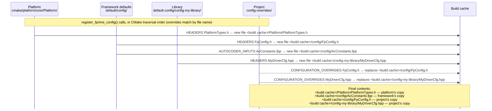

# Configuration Modules

F´ is configured at build time through *configuration modules*: CMake modules registered with
[`register_fprime_config`](../../reference/api/cmake/API.md) that supply FPP constants, C++ headers, and
optionally C++ sources. The framework, the platform, and libraries each supply defaults this way; a project
replaces any of those files by registering a configuration module of its own with `CONFIGURATION_OVERRIDES`.

This page explains how configuration modules are assembled, how each kind of provider supplies its defaults,
and how a project overrides them. For the list of individual framework settings (`FpConfig.h`,
`AcConstants.fpp`, `<Component>Cfg.hpp`, ...) see [Configuring F´](../framework/configuring-fprime.md).

- [Configuration Files](#configuration-files)
- [How Configuration Is Assembled](#how-configuration-is-assembled)
- [Providing Configuration](#providing-configuration)
    - [Framework Defaults](#framework-defaults)
    - [Platform Packages](#platform-packages)
    - [Library Defaults](#library-defaults)
    - [Subtopology Configuration](#subtopology-configuration)
- [Overriding Configuration in a Project](#overriding-configuration-in-a-project)
- [Directive Summary](#directive-summary)
- [Errors](#errors)

## Configuration Files

A configuration module supplies files under three directives, each with a different role:

| Directive | Contents | Typical use |
|---|---|---|
| `AUTOCODER_INPUTS` | `.fpp` files | Constants and types consumed by FPP models and by the autocoder: `FpConfig.fpp`, `AcConstants.fpp`, `PlatformTypes.fpp`, `<Subtopology>Config.fpp` |
| `HEADERS` | `.h` / `.hpp` files | Compile-time C++ settings: `FpConfig.h`, `<Component>Cfg.hpp`, `PlatformTypes.h`, `OsDelegateRawTime.hpp` |
| `SOURCES` | `.cpp` files | C++ implementations that are themselves configuration, e.g. the allocator set-up shipped by a subtopology |

Only files listed under these directives are treated as configuration and can be overridden. In particular, a
header that is not listed under `HEADERS` is not configuration.

## How Configuration Is Assembled

`register_fprime_config` works like `register_fprime_library` with one difference: the files it registers are
copied into the build cache and the module is built from the copies. This is what allows a later module to
replace a file that an earlier module supplied.

The diagram below follows a build in which the platform, the framework, and a library each supply
configuration files, and the project overrides one framework file and one library file:



Solid arrows are new files (`SOURCES`, `HEADERS`, `AUTOCODER_INPUTS`), copied to a path derived from the
providing module; dashed arrows are `CONFIGURATION_OVERRIDES`, copied over the file of the same name wherever an
earlier module put it. In detail:

1. **New files are copied into the build cache.** Each file under `SOURCES`, `HEADERS`, or `AUTOCODER_INPUTS`
   is copied to `<build cache>/<module path>/<file name>` (subdirectories in the source tree are not preserved;
   the file is copied by name), and the module is built from that copy. File names are therefore a single flat
   namespace across the whole build: two files with the same name in different subdirectories of one module
   collide in the build cache (the later one wins, silently), and two providers supplying the same new file
   name stop the build (see [Errors](#errors)), which only the providing library can resolve. Libraries should
   choose file names that cannot collide with other providers' (`MyLibraryCfg.fpp`, not `Config.fpp`).
2. **The directory name is the include prefix.** The module's include root is the *parent* of its directory in
   the build cache, so a header registered from `default/config/FpConfig.h` is included as
   `#include <config/FpConfig.h>`, and a header registered from `default-config/config-mylib/MyLibCfg.hpp` is
   included as `#include <config-mylib/MyLibCfg.hpp>`.
3. **Overrides replace by file name.** Each file under `CONFIGURATION_OVERRIDES` is matched by its file name
   against every configuration file registered so far. The match is by name only: `FpConfig.h` overrides the
   framework's `FpConfig.h` wherever the overriding file lives. The override is copied to the *original* file's
   location in the build cache, so the original module (and everything depending on it) is built with the
   override. The overriding module automatically depends on the overridden module.
4. **The last registration wins.** Modules are processed in CMake traversal order, which for an F´ project is:

   ```
   platform  ->  framework defaults (default/config)  ->  libraries (in library_locations order)  ->  project
   ```

   A file can be overridden more than once; the last module in that order supplies the final contents.
5. **The build cache is stable.** Copies are written once at the end of configuration and only when their
   contents changed, so re-running `fprime-util generate` does not trigger rebuilds. Every configuration source
   is a configure dependency: editing it re-runs CMake. Removing an override restores the previously supplied
   file.

Because configuration is included from the build cache, a configuration directory **must not sit directly
under a source include root** (the project root, the framework root, or a library root). If it did, the
source-tree copy would be found at the same include path as the build-cache copy and would shadow every
override. The build detects this for `HEADERS` and `SOURCES` and stops with an error (see [Errors](#errors)).
FPP inputs are consumed by absolute path and `CONFIGURATION_OVERRIDES` are never checked, so the placement rule
must be followed even for FPP-only and override-only modules: a stray header in an include-root `config/`
directory shadows the framework default silently.

## Providing Configuration

### Framework Defaults

The framework registers all of its default configuration from
[`default/config/CMakeLists.txt`](../../../default/config/CMakeLists.txt): the FPP configuration files
(`FpConfig.fpp`, `AcConstants.fpp`, `PlatformCfg.fpp`, `<Component>Cfg.fpp`, ...) and the C++ configuration
headers (`FpConfig.h`, `FPrimeNumericalConfig.h`, `<Component>Cfg.hpp`, `RawTimeSource.hpp`, ...).

```cmake
register_fprime_config(
    AUTOCODER_INPUTS
        "${CMAKE_CURRENT_LIST_DIR}/AcConstants.fpp"
        "${CMAKE_CURRENT_LIST_DIR}/FpConfig.fpp"
        ...
    HEADERS
        "${CMAKE_CURRENT_LIST_DIR}/FpConfig.h"
        "${CMAKE_CURRENT_LIST_DIR}/FPrimeNumericalConfig.h"
        ...
    GLOBAL_IMPLICIT_DEPENDENCY
    DEPENDS
        "${FPRIME_GLOBAL_INTERFACE_TARGET}"
)
```

It is registered with `GLOBAL_IMPLICIT_DEPENDENCY`, which links it into the global interface target so that every
module in the build (everything depending on `Fw_Types`) sees it without an explicit dependency. The directory is
`default/config`, not `config`, so that `config/FpConfig.h` is only found in the build cache.

### Platform Packages

A platform supplies the platform-dependent types and chooses the implementations (OSAL, string formatting,
...) used on that platform. The platform CMake file registers a configuration module with `AUTOCODER_INPUTS`
for `PlatformTypes.fpp`, `HEADERS` for `PlatformTypes.h`, `CHOOSES_IMPLEMENTATIONS` for the implementation
selections, and `GLOBAL_IMPLICIT_DEPENDENCY` so that all modules see the platform types. For example, the shared Unix
platform module (`cmake/platform/unix/Platform/CMakeLists.txt`) and the Linux platform file
(`cmake/platform/Linux.cmake`):

```cmake
register_fprime_config(
        UnixPlatformTypes
    AUTOCODER_INPUTS
        "${CMAKE_CURRENT_LIST_DIR}/PlatformTypes.fpp"
    HEADERS
        "${CMAKE_CURRENT_LIST_DIR}/PlatformTypes.h"
    CHOOSES_IMPLEMENTATIONS
        Os_File_Posix
        Os_Task_Posix
        ...
    INTERFACE
    GLOBAL_IMPLICIT_DEPENDENCY
)
```

```cmake
register_fprime_config(
        PlatformLinux
    INTERFACE
    CHOOSES_IMPLEMENTATIONS
        Os_Cpu_Linux
        Os_Memory_Linux
        Os_CountingSemaphore_Posix
    GLOBAL_IMPLICIT_DEPENDENCY
)
target_compile_definitions(PlatformLinux INTERFACE -DTGT_OS_TYPE_LINUX)
```

The platform is processed before the framework defaults, so platform files cannot override framework files;
they supply new ones. See [CMake Platforms](./cmake-platforms.md) and
[CMake Implementations](./cmake-implementations.md).

### Library Defaults

A library that has configurable settings ships them as a configuration module of its own. The recommended
layout is a `default-config` directory at the library root containing one configuration directory named
`config-<library name>`, registered as a module of the same name:

```
my-library/
├── library.cmake
├── default-config/
│   └── config-my-library/
│       ├── CMakeLists.txt
│       ├── MyDriverCfg.hpp
│       └── MyLibraryCfg.fpp
└── MyDriver/
    ├── CMakeLists.txt
    └── ...
```

```cmake
# my-library/default-config/config-my-library/CMakeLists.txt
register_fprime_config(
        config-my-library
    AUTOCODER_INPUTS
        "${CMAKE_CURRENT_LIST_DIR}/MyLibraryCfg.fpp"
    HEADERS
        "${CMAKE_CURRENT_LIST_DIR}/MyDriverCfg.hpp"
    DEPENDS
        Fw_Types
    INTERFACE
)
```

```cmake
# my-library/library.cmake
add_fprime_subdirectory("${CMAKE_CURRENT_LIST_DIR}/default-config/config-my-library/")
add_fprime_subdirectory("${CMAKE_CURRENT_LIST_DIR}/MyDriver/")
```

Three rules follow from [how configuration is assembled](#how-configuration-is-assembled):

1. **Location.** The configuration directory must not be directly under the library root: the library root is
   an include root, so `my-library/config-my-library/MyDriverCfg.hpp` would be found in the source tree as
   `config-my-library/MyDriverCfg.hpp` and could never be overridden. Nesting it under `default-config/` keeps
   the source-tree path (`default-config/config-my-library/...`) different from the include path.
2. **Include path.** Library code includes its configuration by the configuration directory name, not by the
   path from the library root: `#include <config-my-library/MyDriverCfg.hpp>`. The path-from-root form
   (`<default-config/config-my-library/MyDriverCfg.hpp>`) also compiles, because the library root is an include
   root, but it resolves to the source-tree file and bypasses every project override; the build does not detect it.
3. **Dependency.** Every module that includes one of the library's configuration headers must list the
   configuration module in `DEPENDS` (a module that only references its FPP constants receives the dependency
   from the FPP dependency analysis; listing it explicitly is still recommended, as the in-tree subtopologies
   do):

   ```cmake
   # my-library/MyDriver/CMakeLists.txt
   register_fprime_module(
       AUTOCODER_INPUTS
           "${CMAKE_CURRENT_LIST_DIR}/MyDriver.fpp"
       SOURCES
           "${CMAKE_CURRENT_LIST_DIR}/MyDriver.cpp"
       DEPENDS
           config-my-library
   )
   ```

   Alternatively, a library may register its configuration with `GLOBAL_IMPLICIT_DEPENDENCY`, as the framework
   defaults and platform packages do. The configuration is then linked into the global interface target and
   reaches every module in the build without a `DEPENDS` entry. This suits configuration that all of a library's
   modules (or code outside the library) need; explicit `DEPENDS` keeps the dependency visible and is preferred
   when only a few modules consume the configuration. A module marked `GLOBAL_IMPLICIT_DEPENDENCY` must not list
   `Fw_Types` (or anything depending on it) in `DEPENDS`: `Fw_Types` itself depends on the global interface target,
   so the dependency would be circular, which CMake tolerates among static libraries but rejects at generate time
   with `BUILD_SHARED_LIBS=ON`. Depend on `${FPRIME_GLOBAL_INTERFACE_TARGET}` instead, as `default/config` does; it
   supplies every include root. Projects override the files the same way in both cases.

A library may also override framework defaults on behalf of the projects using it, by adding a
`CONFIGURATION_OVERRIDES` module exactly as a project would (see below), in a library-specific directory such as
`default-config/overrides-<library name>/`. Do not reuse the project's `config-overrides/` name: library roots and
the project root map to the same build-cache root, so two directories with the same root-relative path collide
and CMake stops with `The binary directory ... is already used to build a source directory`. Libraries are
processed after the framework defaults and before the project, so the project can still override the library's
choice.

### Subtopology Configuration

A [subtopology](../design-patterns/subtopologies.md) exposes its configurable values (queue depths, stack
sizes, priorities, base IDs, ...) through a configuration module that the deploying project is expected to
override. The convention is a `<Subtopology>Config` directory next to the subtopology holding
`<Subtopology>Config.fpp`, registered `EXCLUDE_FROM_ALL` so that it is only built when a topology depends on
it (and `INTERFACE` when nothing in it compiles; see the [Directive Summary](#directive-summary)).
The subtopology module depends on it:

```cmake
# Svc/Subtopologies/CdhCore/CdhCoreConfig/CMakeLists.txt
register_fprime_config(
    EXCLUDE_FROM_ALL
    AUTOCODER_INPUTS
        "${CMAKE_CURRENT_LIST_DIR}/CdhCoreConfig.fpp"
        "${CMAKE_CURRENT_LIST_DIR}/CdhCoreFatalHandlerConfig.fpp"
        "${CMAKE_CURRENT_LIST_DIR}/CdhCoreTlmConfig.fpp"
    INTERFACE
)
```

```cmake
# Svc/Subtopologies/CdhCore/CMakeLists.txt
add_fprime_subdirectory("${CMAKE_CURRENT_LIST_DIR}/CdhCoreConfig/")
register_fprime_module(
    EXCLUDE_FROM_ALL
    AUTOCODER_INPUTS
        "${CMAKE_CURRENT_LIST_DIR}/CdhCore.fpp"
    ...
    DEPENDS
        Svc_Subtopologies_CdhCore_CdhCoreConfig
)
```

A subtopology configuration module may also carry `HEADERS` and `SOURCES` when part of its set-up is C++ (for
example the memory allocator used by `Svc/Subtopologies/DataProducts`). The placement rule applies as for
libraries: a subtopology in a library must not put its configuration directory directly under the library
root. See [Developing Subtopologies](../../how-to/develop/develop-subtopologies.md).

## Overriding Configuration in a Project

A project overrides any configuration file supplied by the framework, the platform, a library, or a
subtopology with the same steps:

1. **Locate the default.** Framework files are in `default/config`; platform files are next to the platform
   CMake file (for example `cmake/platform/unix/Platform`); library files are in the library's configuration
   directory (`default-config/config-<library name>` by convention); subtopology files are in
   `Svc/Subtopologies/<Subtopology>/<Subtopology>Config` or the equivalent library path. A few components ship
   their own configuration module under `<Component>/config/<Component>Config` (for example
   `Svc/TlmPacketizer/config/TlmPacketizerConfig`); those files are overridden the same way.
2. **Copy the file into the project, keeping its name.** Overrides are matched by file name, so the name must be
   identical. Copy only the files you change; the rest keep their defaults. A single `config-overrides/`
   directory at the project root is the recommended place; overrides may also be split into several modules
   (for example one per subtopology, as in [Subtopologies](../design-patterns/subtopologies.md)), the mechanism
   is the same. Do not name the directory `config/`: the project root is an include root, so
   `<project>/config/FpConfig.h` would be found at the same include path as the build-cache copy of the
   framework's `config/FpConfig.h` and shadow it.
3. **Edit the copy.**
4. **Register the overrides once**, from a `CMakeLists.txt` in that directory:

   ```cmake
   # <project>/config-overrides/CMakeLists.txt
   register_fprime_config(
           MyProjectConfig
       CONFIGURATION_OVERRIDES
           "${CMAKE_CURRENT_LIST_DIR}/FpConfig.h"            # framework header
           "${CMAKE_CURRENT_LIST_DIR}/FpConfig.fpp"          # framework FPP
           "${CMAKE_CURRENT_LIST_DIR}/CdhCoreConfig.fpp"     # subtopology
           "${CMAKE_CURRENT_LIST_DIR}/MyDriverCfg.hpp"       # library
       INTERFACE
   )
   ```

   and add the directory to the project after `fprime_setup_included_code()`:

   ```cmake
   # <project>/CMakeLists.txt
   include("${CMAKE_CURRENT_LIST_DIR}/lib/fprime/cmake/FPrime.cmake")
   fprime_setup_included_code()
   add_fprime_subdirectory("${CMAKE_CURRENT_LIST_DIR}/config-overrides/")
   add_fprime_subdirectory("${CMAKE_CURRENT_LIST_DIR}/MyDeployment/")
   ```

5. **FPP overrides that use types from a library** resolve as long as the defining module (e.g. `MyLibrary_Types`)
   is part of the build: the override is autocoded by the module it replaces, and the FPP dependency analysis
   picks up its imports automatically. `DEPENDS MyLibrary_Types` on the override module is optional and only
   documents the relationship.
6. **Override implementation choices in the same module** with `CHOOSES_IMPLEMENTATIONS`, e.g. to select
   `Os_File_Stub` instead of the platform's file implementation. A choice made here takes precedence over the
   platform's, unless the platform itself listed that implementation earlier and then superseded it: chosen
   implementations are de-duplicated in registration order, so on Linux re-choosing `Os_Cpu_Stub` (listed by
   `unix/Platform`, superseded by `Linux.cmake`) has no effect. Choose such an implementation in the
   deployment's `register_fprime_deployment()` or the unit test's `register_fprime_ut()` instead; see
   [CMake Implementations](./cmake-implementations.md).

Since the project directory is added last, its overrides win over every earlier provider. Nothing needs to
depend on the override module for the override to take effect: the replacement happens in the build cache when
CMake configures. Listing the module in a topology's `DEPENDS` is still useful to make the relationship
explicit, as shown in [Subtopologies](../design-patterns/subtopologies.md). The result can be checked in the
build cache: the overridden file's location (for example
`build-fprime-automatic-native/F-Prime/default/config/FpConfig.h`) contains the project's copy.

A worked example is the `ExampleCdhCoreConfig` module of
[fprime-examples](https://github.com/nasa/fprime-examples/tree/devel/FlightExamples/ExamplesDeployment), which
overrides `CdhCoreTlmConfig.fpp`.

> [!NOTE]
> A module with only `HEADERS` and/or `CONFIGURATION_OVERRIDES` has nothing to compile and must be declared
> `INTERFACE`; without it CMake fails at generate time with `No SOURCES given to target`. `INTERFACE` is also
> correct when the module's `AUTOCODER_INPUTS` contain only type aliases and integer constants, whose autocoded
> output has nothing to compile (the generated `FppConstantsAc.cpp` holds no definitions), as the platform and
> `CdhCoreConfig` examples above do. A module that supplies `SOURCES`, or whose FPP
> defines string, floating-point, or boolean constants, or `enum`, `struct`, or `array` types (these autocode
> `.cpp` files that must be compiled), must not be `INTERFACE`; declare it `STATIC` (the automatic `STATIC` default
> currently applies only to modules with `AUTOCODER_INPUTS`, such as `default/config` and
> `Svc/Subtopologies/FileHandling/FileHandlingConfig`; see
> [nasa/fprime#5970](https://github.com/nasa/fprime/issues/5970)), so that it stays static even when the project
> builds with `BUILD_SHARED_LIBS=ON`. The build does not check this: an `INTERFACE` module whose FPP needs a `.cpp` fails
> at link time with undefined references. An override is autocoded and built by the module it replaces, so an
> override of an `INTERFACE` module's `.fpp` must likewise keep to type aliases and integer constants.

## Directive Summary

| Directive | Meaning |
|---|---|
| `SOURCES`, `HEADERS`, `AUTOCODER_INPUTS` | New configuration files, copied into the build cache. A file name already supplied by an earlier module is an error; use `CONFIGURATION_OVERRIDES` instead. |
| `CONFIGURATION_OVERRIDES` | Replacements for files supplied by an earlier module, matched by file name. A name no earlier module supplied is an error. |
| `INTERFACE` | Module with nothing to compile: override-only, headers-only, or FPP that autocodes nothing compilable. Required for the first two; see the note under [Overriding Configuration in a Project](#overriding-configuration-in-a-project) for which FPP constructs require `STATIC`. |
| `GLOBAL_IMPLICIT_DEPENDENCY` | Linked into the global interface target: visible to every module without `DEPENDS`. Used by framework defaults and platform packages; available to library defaults. Replaces the deprecated `BASE_CONFIG`, which still works as a synonym and emits a warning. |
| `DEPENDS` | Modules this configuration needs to compile, typically `Fw_Types` (or `${FPRIME_GLOBAL_INTERFACE_TARGET}` when the module is `GLOBAL_IMPLICIT_DEPENDENCY`; see [Library Defaults](#library-defaults)). Not required for FPP imports, which the FPP dependency analysis discovers. |
| `CHOOSES_IMPLEMENTATIONS` | Implementation selections (see [CMake Implementations](./cmake-implementations.md)). Platform packages must choose every required implementation; projects may override. |
| `EXCLUDE_FROM_ALL` | Build only when depended upon. Used by subtopology configuration. |

## Errors

| Message | Cause | Fix |
|---|---|---|
| `<file> is CONFIGURATION_OVERRIDE but overrides nonexistent file` | No earlier module supplied a file of that name: typo, wrong file name, the providing library/subtopology is not in the build, or the override module was added before `fprime_setup_included_code()` (no configuration module is registered yet). | Check the name; move the `add_fprime_subdirectory()` call after `fprime_setup_included_code()`; if the file is genuinely new, list it under `SOURCES`/`HEADERS`/`AUTOCODER_INPUTS`. |
| `<file> is SOURCE/HEADER but overrides existing file` | A new file has the same name as an existing configuration file. | Move it to `CONFIGURATION_OVERRIDES` if it is meant to replace that file, or rename it. |
| `No SOURCES given to target: <module>` (at generate time) | A module with only `HEADERS`/`CONFIGURATION_OVERRIDES` was registered without `INTERFACE`. | Add `INTERFACE` to the `register_fprime_config()` call. |
| `The binary directory <dir> is already used to build a source directory` | Two configuration directories (typically a library's and the project's) have the same path relative to their roots, which share a build-cache root. | Rename the library's directory to include the library name, e.g. `default-config/overrides-<library name>/`. |
| `Configuration file '...' of module '...' is available as '...' via include root '...'` | The configuration directory is directly under a source include root (project, framework, or library root), so the source-tree file shadows the build-cache copy. | Move the directory one level down (e.g. `default-config/config-<name>/`), or register the files from a `CMakeLists.txt` in a different directory, so that the source-tree path no longer equals `<module directory>/<file name>`. |

The override, fatal-error, `HEADERS` include-root, `GLOBAL_IMPLICIT_DEPENDENCY`/`BASE_CONFIG`, and re-configure
behavior described on this page is exercised by the build-system tests in `cmake/test/src/test_config.py`
with the fixtures under `cmake/test/data/TestConfigDeployment`, `TestConfigConflictDeployment`, and
`test-config-library`.
