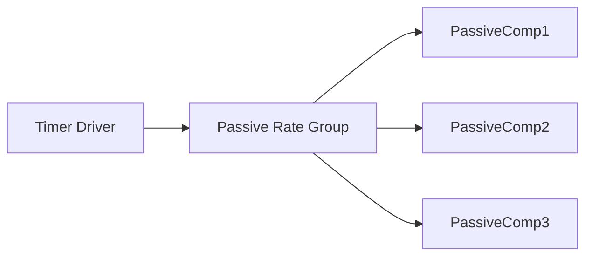

# Baremetal Pattern

The baremetal pattern enables F´ applications to run on processors without an operating system. This pattern is designed for resource-constrained environments where traditional OS features like threads and message queues are unavailable.

> [!NOTE]
> This document focuses on the practical implementation pattern for baremetal F´ applications. For advanced topics including thread virtualization, multi-core systems, and deeper technical details, see [F´ On Baremetal and Multi-Core Systems](../framework/baremetal-multicore.md).

## What is Baremetal?

"Baremetal" is defined as a processor/application that does not run with an operating system. In baremetal environments:

- There is no software provided to run processes or threads
- Resources are usually constrained (RAM, storage)
- There is one point of entry
- Interrupt service routines (ISR) can be used
- Examples include Arduino and STM32 microcontrollers

## F´ and Baremetal

F´ does not require an operating system. Applications can be written entirely as a set of passive components with one Timer component driving the entire application through passive rate groups.

The baremetal pattern provides a solution that allows F´ core components to be used in baremetal deployments while adapting to the constraints of the environment.

### Architecture

In a baremetal F´ application, components are organized around a passive rate group pattern:

The timer driver invokes the passive rate group at a fixed rate, which then drives the execution of all connected components. Since there are no threads or queues, all components use sync ports and execute synchronously when called.

For a detailed discussion of execution contexts and alternative approaches, see [Choosing an Execution Context](../framework/baremetal-multicore.md#choosing-an-execution-context).

## Baremetal Features

F´ provides support for baremetal deployments through the [fprime-community/fprime-baremetal](https://github.com/fprime-community/fprime-baremetal) support package, which ships as an F´ library. This package provides passive component implementations and other features described below.

### Baremetal OS

The Os/Baremetal module provides an implementation of the OS abstraction layer (OSAL) to emulate threads, message queues, and other OS features. This allows the use of F´ core components that depend on OS abstractions without requiring a full operating system.

Key characteristics:

- Emulates OS features like threads
- Provides compatibility with the F´ OSAL model

> [!NOTE]
> If you need to use active components in a baremetal environment, see [Thread Virtualization](../framework/baremetal-multicore.md#thread-virtualization) for an experimental approach using protothreading.

### MicroFs

MicroFs provides an in-memory basic file system for components that need file access:

- Provides basic file system operations
- Stores files in RAM
- Only persists as long as the processor is powered
- For less constrained environments with flash storage, users can write or use their own file system

## Configuration and Tuning

F´ provides configuration options to optimize for the constrained environments of baremetal deployments. These options are useful to minimize the code size, memory footprint, and other resources.

### F´ Configuration

F´ has numerous configuration options to scale the size of F´ down for resource-constrained environments. These are found in the project's copy of the `default/config` directory. For complete configuration details, see [User Guide: Configuring F´](../framework/configuring-fprime.md).

Example configuration options include the following:

- Turn features on and off
- Specify various buffer and storage sizes
- Many other options

### Port Call Optimization

F´ provides alternate code generation for port connections to eliminate some of the abstraction layers, reducing overhead in resource-constrained environments. This feature is currently in alpha.

## Implementation Suggestions

When implementing a baremetal F´ application, consider the following:

### Component Organization

Develop components based on the [RateGroup pattern](../design-patterns/rate-group.md):

- Have it driven by a hardware timer at the necessary rate
- Use PassiveRateGroup to drive a set of components (including F´ core components)
- All components should use passive ports for reasons discussed above.

### Scale F´ Features

Minimize resource usage by:

- Turning off port serialization if not needed
- Scaling command tables and telemetry storage to minimum size needed
- Adjusting buffer sizes to match actual requirements
- Disabling unused features

## Resources

- [`fprime-baremetal-reference`](https://github.com/fprime-community/fprime-baremetal-reference): a reference implementation of a baremetal F´ application
- [`fprime-baremetal`](https://github.com/fprime-community/fprime-baremetal): a support package for baremetal F´
- [User Guide: F´ on Baremetal and Multi-Core Systems](../framework/baremetal-multicore.md)

## Conclusion

The baremetal pattern enables F´ to run on resource-constrained processors without an operating system while still allowing the reuse of F´ core components. By using the Baremetal OS abstraction layer, MicroFs for file operations, and careful configuration tuning, developers can deploy F´ applications on microcontrollers like Arduino and STM32 platforms.
