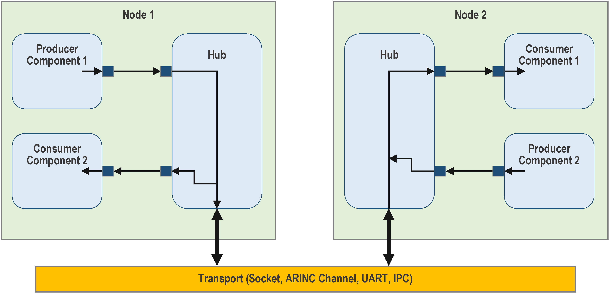

# A Quick Look at the Hub Pattern

The F´ hub pattern connects components across a boundary while preserving the
ordinary typed-port model inside each deployment. The boundary may be an
address-space boundary between processes, a platform or processor boundary, or
a network or hardware transport. Instead of requiring every component to know
about that transport, a pair of hubs serializes calls on one side and
deserializes them into typed port calls on the other side.



**Figure 9. Hub pattern.** Each hub instance connects to a remote node.
Connections may use sockets, ARINC 653 channels, hardware buses, UARTs, shared
memory, or another buffer-based transport.

## How it works

The basic arrangement is:

```text
    Component A1 -->--+       +-->-- Component B1
                       |       |
                       Hub A ~~> Hub B
                       |       |
    Component A2 -->--+       +-->-- Component B2
```

The `~~>` is the transport between deployments. In a typical implementation,
each hub is paired with a buffer driver:

```text
    FSW --> GenericHub --> Driver ~~> Driver --> GenericHub --> FSW
```

On the sending side, the hub allocates a buffer, writes a message-type
discriminator, port index, payload size, and serialized payload, and gives the
buffer to the driver. The remote driver gives the buffer to its hub, which
validates and deserializes it before invoking the corresponding typed output
port.

## What can cross the hub?

- **Serial data:** typed port calls whose arguments are serialized by value.
- **Buffers:** `Fw::Buffer` payloads, with explicit ownership and return
  semantics.
- **Events:** event ID, time tag, severity, and event arguments.
- **Telemetry:** channel ID, time tag, and telemetry value.
- **Commands:** remote command dispatches and command responses through the
  command splitter and dispatcher interfaces. See the [GenericHub SDD](../../../Svc/GenericHub/docs/sdd.md)
  for the current command-response limitation.

## Rules for using the pattern

- Configure both hubs with matching array sizes. Hub A's inputs must correspond
  to hub B's outputs, and hub A's outputs must correspond to hub B's inputs.
- Never pass pointers through a hub. A pointer is valid only in the address
  space that owns the pointed-to object; send serialized values or buffer data
  instead.
- Wire received event and telemetry outputs to the deployment's event manager
  and telemetry database. A hub transports events and telemetry, but is not
  itself an event source or telemetry database.
- Use a buffer driver at each end of the transport. The
  `Drv::ByteStreamBufferAdapter` can pair a byte-stream driver with the
  buffer-driver interface expected by GenericHub.

## Putting it together

A common layout is:

```text
Deployment A                         Deployment B
-------------                        -------------
FSW -> GenericHub -> transport -> GenericHub -> FSW
```

For a runnable worked example, see
[`fprime-community/fprime-generic-hub-reference`](https://github.com/fprime-community/fprime-generic-hub-reference).
Its [`docs/setup.md`](https://github.com/fprime-community/fprime-generic-hub-reference/blob/devel/docs/setup.md)
walks through building both deployments and running `HubMessageTest` for serial,
buffer, event, and telemetry round trips, plus `HubCommandTest` for
cross-deployment commanding.

## Where to go next

- [GenericHub SDD](../../../Svc/GenericHub/docs/sdd.md)
- [Generic Hub reference repository](https://github.com/fprime-community/fprime-generic-hub-reference)
- [Running F´ on multiple cores](../framework/run-multi-core.md)
