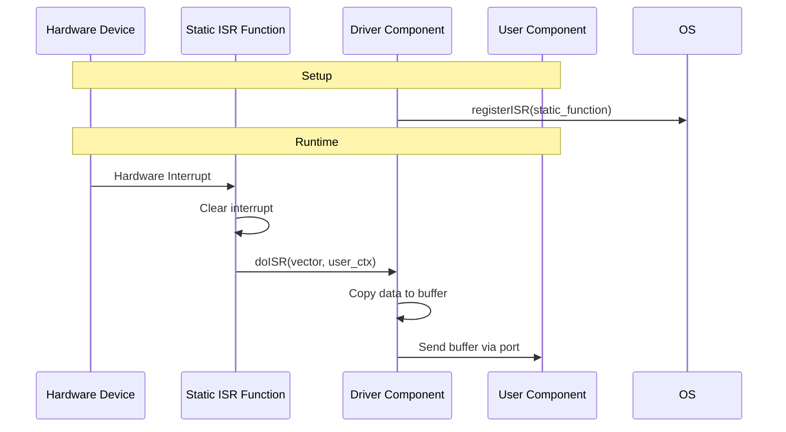

# ISR Device Driver Pattern

The ISR-based device driver pattern enables F´ components to interface with hardware devices that use Interrupt Service Routines (ISRs) for event-driven communication. This pattern is common in embedded RTOS's (VxWorks, RTEMS, Integrity, FreeRTOS) and baremetal systems where hardware interrupts signal data availability or device state changes.

> [!NOTE]
> This document focuses on the ISR-based driver pattern. For general device driver architecture, see the [Application-Manager-Driver Pattern](app-man-drv.md). For a complete how-to guide on implementing device drivers, see [How-To: Develop a Device Driver](../../how-to/develop-device-driver.md).

## What are ISRs?

Interrupt Service Routines (ISRs) are functions registered as callbacks that execute when hardware interrupts occur. ISRs run in a special execution context with important constraints:

- **Other interrupts are disabled** - The OS interrupt handling is paused
- **OS scheduler is paused** - Thread scheduling does not occur
- **Limited synchronization** - Taking locks or blocking operations are not allowed
- **Time should be minimized** - Only get/clear the interrupt and defer processing

**Best practices for ISRs:**
- Only get the cause and clear the interrupt
- Defer processing until later if possible
- Never block or take locks
- Keep execution time minimal

## When to Use ISR-Based Drivers

ISR-based drivers are appropriate when:

- Hardware devices use interrupts to signal events (data ready, buffer full, timer expiration)
- The platform provides an RTOS with ISR registration APIs
- Low-latency response to hardware events is required
- The device cannot be efficiently polled

## Key Design Considerations

### Minimize ISR Execution Time

Downstream users of the timer need minimal jitter, so call the connected component in the ISR context. The user should know to do the "right thing" in ISR context.

### Copy Data in Thread Context

The driver should copy data in the thread of the driver to minimize time in the ISR. Use the `Svc::BufferManager` pattern to manage buffers efficiently.

### Use OS C API for ISR Registration

The driver needs to use the OS C API to register the ISR. The OS API typically requires a C function pointer, hence the static function pattern.

### Thread Safety

The ISR and component thread access shared data (counters). Use atomic operations or ensure the data access pattern is safe:
- Simple counters can often be safely incremented if the platform guarantees atomic writes
- For complex data structures, consider using lock-free data structures or deferring all access to the component thread


## Pattern Overview

The ISR-based driver pattern bridges the gap between ISR context (C callback) and F´ component context (C++ object). Since F´ components are C++ objects and the OS ISR API typically requires C callbacks, the pattern uses a static function as the ISR entry point that then invokes a member function on the component.

### Architecture



## Example Scenario

To illustrate the ISR-based driver pattern, this guide walks through the setup of an hypothetical ISR-based driver component with the following characteristics:

### Device Hardware

- **Double-buffer memory area** - Incoming data fills the first buffer, sends an interrupt, then starts filling the second buffer. When the second buffer fills, it sends an interrupt and starts filling the first again.
- **Programmable interval timer** - Device has a register for a timer in microseconds that generates interrupts at the specified interval
- **FIFO hardware** - 16 bytes deep for each buffer (BUFF_A_FIFO and BUFF_B_FIFO)

### Register Specification

The device exposes memory-mapped registers at the following addresses:

| Register | Address | Bits | Function | Usage |
|----------|---------|------|----------|-------|
| `INT_EN` | 0x1000 | - | Enable interrupts | Write bit flags: 1=enable, 0=disable |
| `INT_PEND` | 0x1004 | 0 | Timer interrupt | 1 to clear |
| | | 1 | Enable buffer A done interrupt | 1=enabled, 0=disabled |
| | | 2 | Enable buffer B done interrupt | 1=enabled, 0=disabled |
| `TIMER_VAL` | 0x1008 | 0-31 | Timer value | Write integer timer value in microseconds |
| `TIMER_CNTL` | 0x100B | 0 | Timer enable | 1=enabled, 0=disabled |
| `BUFF_A_FIFO` | 0x1010 | 0-31 | BUFF_A_FIFO head | Read 16 times to empty FIFO |
| `BUFF_B_FIFO` | 0x1014 | 0-31 | BUFF_B_FIFO head | Read 16 times to empty FIFO |

### Driver Behavior

The ISR-based driver for this device:
1. Registers ISRs for timer and buffer-full interrupts
2. When timer interrupt fires, calls downstream component immediately (minimal jitter)
3. When buffer-full interrupt fires, dispatches to driver thread via internal port
4. Driver thread copies FIFO data to a buffer, sends buffer to user component
5. Periodically reports telemetry via rate group

## Implementation Example

### Component Requirements

An ISR-based driver component should have:

1. **Active component** - Provides a thread to copy data outside ISR context
2. **Timer output port** - For interval timers that drive periodic operations
3. **Buffer management ports** - For requesting and returning buffers (typically using `Svc::BufferManager`)
4. **Data output port** - For sending received data to user components
5. **Telemetry** - For reporting statistics (interrupts received, bytes transferred)
6. **Rate group input port** - For periodic telemetry reporting

### FPP Component Definition

Here's an example FPP definition for the ISR-based driver component:

```python
# Notification port type, no argument
port TimerPort()

@ Device driver using ISRs for data reception
active component MyDriver {

    # Scheduler port (rate group)
    async input port run: Svc.Sched

    # Internal interface for ISR reporting
    internal port IsrReport(interrupts: U32)

    # Port to send timer ticks (NOTE: runs in ISR context)
    output port TimerDone: TimerPort

    # Buffer management ports
    output port AllocateBuffer: Fw.BufferGet
    output port SendBuffer: Fw.BufferSend

    # Telemetry
    telemetry DataBytes: U64
    telemetry TimerTicks: U64

    # Not displayed: Standard ports for commands, events, telemetry
    # ...
}
```

### Header File Structure

The driver header declares key elements for ISR handling:

```cpp
// In: MyDriver.hpp
#include "Drv/MyDriver/MyDriverComponentAc.hpp"

namespace Drv {

class MyDriver : public MyDriverComponentBase {
  public:
    // Component construction and destruction
    MyDriver(const char* compName);
    ~MyDriver();

    // Enable driver
    void enableDriver(const U32 timerVal);

  private:
    // Handler implementation for rate group to report telemetry
    void run_handler(FwIndexType portNum, U32 context) override;

    // Handler implementation for IsrReport internal interface
    void IsrReport_internalInterfaceHandler(U32 interrupts) override;

    //! static Interrupt service routine - required for OS API
    //! *** invoked in ISR context ***
    static void driverISR(int vector, void* user_ctx);

    //! Member function to handle ISRs
    void doISR(int vector);

  private:
    U64 m_dataBytes;    // Counter for data bytes received
    U64 m_timerTicks;   // Counter for timer ticks
};

} // namespace Drv
```

### Implementation - Initialization

The enable function configures hardware registers and registers the ISR with the OS:

```cpp
// In: MyDriver.cpp
void MyDriver::enableDriver(const U32 timerVal) {
    // Clear pending interrupts
    INT_PEND = 0x0;
    // Set timer interval
    TIMER_VAL = timerVal;
    // enable timer
    TIMER_CNTL = TIMER_CNTL_ENABLE;
    // enable interrupts
    INT_EN = INT_EN_TIMER | INT_EN_BUFF_A_FULL | INT_EN_BUFF_B_FULL;
    // register ISR
    registerISR(DRIVER_VECTOR, MyDriver::driverISR, this);
}
```

### Implementation - Static ISR Function

The static function serves as the entry point from the OS and casts the user context back to the component:

```cpp
// In: MyDriver.cpp

//! Static interrupt service routine - required for OS API
//! *** invoked in ISR context ***
void MyDriver::driverISR(int vector, void* user_ctx) {
    FW_ASSERT(user_ctx);
    
    // Cast the user_ctx pointer back to the component object
    MyDriver* comp_ptr = static_cast<MyDriver*>(user_ctx);
    
    // Invoke the member ISR function
    comp_ptr->doISR(vector);
}
```

### Implementation - Member ISR Function

The member ISR function handles the interrupt, determines the source, and dispatches work:

```cpp
// In: MyDriver.cpp

//! Member ISR function does:
//! - Reads the interrupt pending bits to see which interrupt is asserted
//! - Writes back just the bits that are asserted (clears interrupts)
//! - Checks to see if the timer interrupt was asserted
//! - Otherwise, dispatches a message to the driver thread to report interrupts
void MyDriver::doISR(int vector) {
    FW_ASSERT(DRIVER_VECTOR == vector, vector);
    
    // Get interrupts
    U32 ints = INT_PEND;
    
    // Write back bits to clear interrupts
    // This avoids a race if a new interrupt is asserted
    INT_PEND = ints;
    
    // Dispatch calls based on interrupts
    if (ints & INT_PEND_TIMER) {
        this->m_timerTicks++;
        this->TimerDone_out(0);
    } else {
        // FIFO A/B full - dispatch to driver thread for further processing
        // Use internal port to move processing off ISR context
        this->IsrReport_internalInterfaceInvoke(ints);
    }
}
```

### Implementation - Internal Interface Handler

The internal interface handler executes on the driver's thread (not in ISR context) and performs the data copy:

```cpp
// In: MyDriver.cpp

void MyDriver::IsrReport_internalInterfaceHandler(U32 interrupts) {
    // if the interrupt reported from the ISR is the buffer done interrupt,
    // copy the buffer
    if ((interrupts&INT_EN_BUFF_A_FULL) or (interrupts&INT_EN_BUFF_B_FULL)) {
        // get a buffer to fill
        Fw::Buffer buff;
        this->AllocateBuffer_out(0,FIFO_DEPTH);
        FW_ASSERT(buff.getSize() == FIFO_DEPTH, static_cast<FwAssertArgType>(buff.getSize()));
        FW_ASSERT(buff.getData());
        Fw::ExternalSerializeBuffer serTo = buff.getSerializer();
        for (FwSizeType word = 0; word < FIFO_DEPTH/sizeof(U32); word++) {
            Fw::SerializeStatus stat;
            if (interrupts&INT_EN_BUFF_A_FULL) {
                stat = serTo.serializeFrom(BUFF_A_FIFO);
            } else {
                stat = serTo.serializeFrom(BUFF_B_FIFO);
            }
            // There should always be room
            FW_ASSERT(stat = Fw::FW_SERIALIZE_OK,stat);
        }
        // send copied data to user
        this->SendBuffer_out(0,buff);
        // add data to counter
        this->m_dataBytes += FIFO_DEPTH;
    }
}
```

### Implementation - Telemetry Reporting

The run handler reports telemetry on a schedule:

```cpp
// In: MyDriver.cpp

//! The run_handler() function writes the counters to telemetry channels
//! Note that this runs on the thread of the driver since it is an async port
void MyDriver::run_handler(FwIndexType portNum, U32 context) {
    this->tlmWrite_DataBytes(this->m_dataBytes);
    this->tlmWrite_TimerTicks(this->m_timerTicks);
}
```


## Resources

- [Application-Manager-Driver Pattern](app-man-drv.md) - General device driver architecture
- [How-To: Develop a Device Driver](../../how-to/develop-device-driver.md) - Complete implementation guide
- [Baremetal Pattern](baremetal.md) - ISRs in baremetal systems
- [F´ on Baremetal and Multi-Core Systems](../framework/baremetal-multicore.md) - ISR considerations for baremetal

## Conclusion

The ISR-based device driver pattern enables F´ components to interface with interrupt-driven hardware while respecting ISR execution constraints. By using a static function as the ISR entry point and deferring work to the component thread via internal ports, the pattern maintains F´'s component architecture while achieving low-latency interrupt handling.
