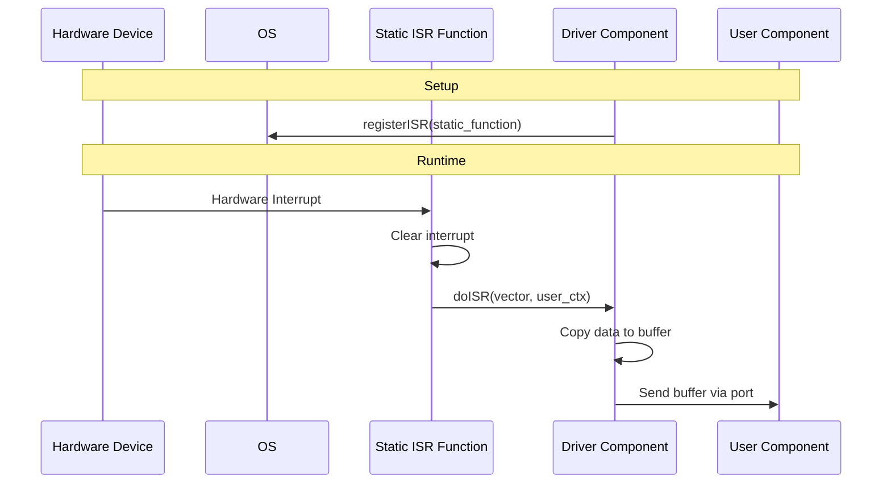

# ISR Device Driver Pattern

The ISR-based device driver pattern enables F´ components to interface with hardware devices that use Interrupt Service Routines (ISRs) for event-driven communication. This pattern is common in embedded RTOSes (VxWorks, RTEMS, Integrity, FreeRTOS) and baremetal systems where hardware interrupts signal data availability or device state changes.

> [!NOTE]
> This document focuses on the ISR-based driver pattern. For general device driver architecture, see the [Application-Manager-Driver Pattern](app-man-drv.md). For a complete how-to guide on implementing device drivers, see [How-To: Develop a Device Driver](../../how-to/develop/develop-device-driver.md).

## What are ISRs?

Interrupt Service Routines (ISRs) are functions registered as callbacks that execute when hardware interrupts occur. ISRs do not run in a task context, which imposes constraints that hold on every platform:

- **No blocking, no locks** - Mutexes, condition variables, semaphores and any OS call that may block are unavailable: there is no task to block
- **No OS scheduling of the ISR** - The ISR runs to completion; work handed to a task does not run until the ISR returns
- **Time must be minimized** - Interrupt latency for the rest of the system is charged to the ISR

Interrupt masking and nesting are *platform-specific*: many interrupt controllers allow a higher-priority interrupt to preempt a running ISR, so do not assume the ISR cannot be reentered or preempted. Consult the platform's ISR documentation for what is masked while the handler runs.

**Best practices for ISRs:**
- Only get the cause and clear the interrupt
- Defer processing to task context whenever the latency budget allows
- Never block, take locks, allocate memory, or assert (see [Asserts and ISR Context](#asserts-and-isr-context))
- Keep execution time minimal

## When to Use ISR-Based Drivers

ISR-based drivers are appropriate when:

- Hardware devices use interrupts to signal events (data ready, buffer full, timer expiration)
- The platform provides an RTOS with ISR registration APIs
- Low-latency response to hardware events is required
- The device cannot be efficiently polled

## Key Design Considerations

### Choose Where the Work Runs

Each interrupt cause needs a decision: handle it in ISR context, or defer it to the driver's thread.

- **Defer by default.** Copying data, allocating buffers, emitting events and telemetry all belong in task context. The driver dispatches to its own thread through an internal port, and the ISR does nothing but read and clear the cause.
- **Handle in ISR context only for jitter-critical notifications.** A periodic timer tick whose consumer must see minimal jitter can be pushed out of the ISR directly. This is only valid when the *receiving* input port is `sync` and the receiving handler itself obeys every ISR constraint listed above, because a `sync` input runs the downstream handler inside the ISR. An `async` input enqueues on the receiving component's message queue and a `guarded` input takes that component's mutex — both are subject to [ISRs and F´ Queuing](#isrs-and-f-queuing).

### Copy Data in Thread Context

The driver should copy data in the thread of the driver to minimize time in the ISR. Use the `Svc::BufferManager` pattern to manage buffers efficiently.

### Use OS C API for ISR Registration

The driver needs to use the OS C API to register the ISR. The OS API typically requires a C function pointer, hence the static function pattern.

### Asserts and ISR Context

`FW_ASSERT` is not ISR-safe: the default hook writes to the console and the assert path terminates or restarts the system. An ISR must therefore validate its inputs (interrupt vector, user context, hardware status) and *return* rather than assert on them. Keep asserts in the deferred, task-context handlers.

### Thread Safety

The ISR and the component thread share the driver's counters. F´ components serialize their state through their message queue, and an ISR bypasses that mechanism entirely, so shared state needs explicit protection:

- Use `std::atomic` for counters touched by both contexts, and use a width that is lock-free on the target — a non-lock-free `std::atomic` falls back to a lock and is unusable in an ISR. A plain `U32`/`U64` increment is a data race, and a 64-bit access can tear on a 32-bit target even when the platform claims atomic word writes.
- For anything more complex than a counter, keep all access in the component thread and hand the ISR nothing but the interrupt cause.

### Memory-Mapped Registers

The examples below name registers (`INT_EN`, `INT_PEND`, `TIMER_VAL`, the FIFOs) as if they were variables to keep the pattern readable. Real memory-mapped accesses must go through `volatile`-qualified pointers of a fixed-size type, or the compiler is free to reorder, merge, or elide them.

## Pattern Overview

The ISR-based driver pattern bridges the gap between ISR context (C callback) and F´ component context (C++ object). Since F´ components are C++ objects and the OS ISR API typically requires C callbacks, the pattern uses a static function as the ISR entry point that then invokes a member function on the component.

### Architecture



## Example Scenario

To illustrate the ISR-based driver pattern, this guide walks through the setup of a hypothetical ISR-based driver component with the following characteristics:

### Device Hardware

- **Double-buffer memory area** - Incoming data fills the first buffer, sends an interrupt, then starts filling the second buffer. When the second buffer fills, it sends an interrupt and starts filling the first again.
- **Programmable interval timer** - Device has a register for a timer in microseconds that generates interrupts at the specified interval
- **FIFO hardware** - 16 bytes deep for each buffer (BUFF_A_FIFO and BUFF_B_FIFO)

### Register Specification

The device exposes memory-mapped registers at the following addresses:

| Register | Address | Bits | Function | Usage |
|----------|---------|------|----------|-------|
| `INT_EN` | 0x1000 | 0 | Timer interrupt enable | 1=enable, 0=disable |
| | | 1 | Buffer A done interrupt enable | 1=enable, 0=disable |
| | | 2 | Buffer B done interrupt enable | 1=enable, 0=disable |
| `INT_PEND` | 0x1004 | 0 | Timer interrupt pending | Write 1 to clear |
| | | 1 | Buffer A done interrupt pending | Write 1 to clear |
| | | 2 | Buffer B done interrupt pending | Write 1 to clear |
| `TIMER_VAL` | 0x1008 | 0-31 | Timer value | Write integer timer value in microseconds |
| `TIMER_CNTL` | 0x100C | 0 | Timer enable | 1=enabled, 0=disabled |
| `BUFF_A_FIFO` | 0x1010 | 0-31 | BUFF_A_FIFO head | Read 4 times (4 words, 16 bytes) to empty FIFO |
| `BUFF_B_FIFO` | 0x1014 | 0-31 | BUFF_B_FIFO head | Read 4 times (4 words, 16 bytes) to empty FIFO |

### Driver Behavior

The ISR-based driver for this device:
1. Registers an ISR for the timer and buffer-full interrupts
2. When timer interrupt fires, calls downstream component immediately (minimal jitter)
3. When buffer-full interrupt fires, dispatches to driver thread via internal port
4. Driver thread copies FIFO data to a buffer, sends buffer to user component
5. Periodically reports telemetry via rate group

## Implementation Example

### Component Requirements

An ISR-based driver component should have:

1. **Active component** - Provides a thread to copy data outside ISR context
2. **Timer output port** - For interval timers that drive periodic operations
3. **Buffer management ports** - For requesting and returning buffers (typically using `Svc::BufferManager`)
4. **Data output port** - For sending received data to user components
5. **Telemetry** - For reporting statistics (interrupts received, bytes transferred)
6. **Rate group input port** - For periodic telemetry reporting

### FPP Component Definition

Here's an example FPP definition for the ISR-based driver component:

```fpp
# Notification port type, no argument
port TimerPort()

@ Device driver using ISRs for data reception
active component MyDriver {

    # Scheduler port (rate group)
    async input port run: Svc.Sched

    # Internal interface for ISR reporting
    # `drop` queue-full behavior: a full queue must drop (not FW_ASSERT) in ISR context
    internal port IsrReport(interrupts: U32) drop

    # Port to send timer ticks
    # NOTE: invoked in ISR context, so it must be connected to a `sync` input
    # port whose handler is ISR-safe (see "Choose Where the Work Runs")
    output port TimerDone: TimerPort

    # Buffer management ports
    output port AllocateBuffer: Fw.BufferGet
    output port SendBuffer: Fw.BufferSend

    # Telemetry: types match the atomic counters in the implementation
    telemetry DataBytes: U32
    telemetry TimerTicks: U32

    @ Buffer allocation failed, incoming data was dropped
    event BufferAllocationFailed($size: U32) \
        severity warning high \
        format "Failed to allocate {} bytes for incoming device data"

    # Not displayed: Standard ports for commands, events, telemetry
    # ...
}
```

The internal port declares the `drop` queue-full behavior. The default behavior is `assert`, which calls `FW_ASSERT` when the message queue is full — unacceptable in ISR context (see [Asserts and ISR Context](#asserts-and-isr-context)). With `drop`, the generated invoke increments the component's dropped-message counter and returns instead. Size the component's message queue for the worst-case interrupt burst so drops do not occur in normal operation.

### Header File Structure

The driver header declares key elements for ISR handling:

```cpp
// In: MyDriver.hpp
#include <atomic>
#include "Drv/MyDriver/MyDriverComponentAc.hpp"

namespace Drv {

class MyDriver : public MyDriverComponentBase {
  public:
    // Component construction and destruction
    MyDriver(const char* compName);
    ~MyDriver();

    // Enable driver
    void enableDriver(const U32 timerVal);

  private:
    // Handler implementation for rate group to report telemetry
    void run_handler(FwIndexType portNum, U32 context) override;

    // Handler implementation for IsrReport internal interface
    void IsrReport_internalInterfaceHandler(U32 interrupts) override;

    //! static Interrupt service routine - required for OS API
    //! *** invoked in ISR context ***
    //! `int` is used here only because the OS callback signature requires it
    static void driverISR(int vector, void* user_ctx);

    //! Member function to handle ISRs
    void doISR(U32 vector);

    //! Counters shared between ISR and component thread: must be lock-free
    std::atomic<U32> m_dataBytes{0};   // Counter for data bytes received
    std::atomic<U32> m_timerTicks{0};  // Counter for timer ticks
};

} // namespace Drv
```

### Implementation - Initialization

The enable function registers the ISR with the OS *before* enabling any interrupt, so that no interrupt can assert while the vector is unhandled:

```cpp
// In: MyDriver.cpp
void MyDriver::enableDriver(const U32 timerVal) {
    // register ISR before any interrupt can assert
    registerISR(DRIVER_VECTOR, MyDriver::driverISR, this);
    // clear stale pending interrupts (INT_PEND is write-1-to-clear)
    INT_PEND = INT_PEND_TIMER | INT_PEND_BUFF_A_FULL | INT_PEND_BUFF_B_FULL;
    // set timer interval
    TIMER_VAL = timerVal;
    // enable timer
    TIMER_CNTL = TIMER_CNTL_ENABLE;
    // enable interrupts
    INT_EN = INT_EN_TIMER | INT_EN_BUFF_A_FULL | INT_EN_BUFF_B_FULL;
}
```

### Implementation - Static ISR Function

The static function serves as the entry point from the OS and casts the user context back to the component:

```cpp
// In: MyDriver.cpp

//! Static interrupt service routine - required for OS API
//! *** invoked in ISR context ***
//! Inputs are validated by returning, not asserting: FW_ASSERT is not ISR-safe
void MyDriver::driverISR(int vector, void* user_ctx) {
    if (user_ctx == nullptr) {
        return;
    }

    // Cast the user_ctx pointer back to the component object
    MyDriver* comp_ptr = static_cast<MyDriver*>(user_ctx);

    // Invoke the member ISR function
    comp_ptr->doISR(static_cast<U32>(vector));
}
```

### Implementation - Member ISR Function

The member ISR function handles the interrupt, determines the source, and dispatches work. Every asserted cause is dispatched: the write-back clears all of them at once, so a cause that is cleared but not handled is lost.

```cpp
// In: MyDriver.cpp

//! Member ISR function does:
//! - Reads the interrupt pending bits to see which interrupts are asserted
//! - Writes back just the bits that are asserted (clears interrupts)
//! - Handles the timer interrupt in ISR context for minimal jitter
//! - Dispatches any buffer interrupt to the driver thread
void MyDriver::doISR(U32 vector) {
    if (DRIVER_VECTOR != vector) {
        return;
    }

    // Get interrupts
    U32 ints = INT_PEND;

    // Write back bits to clear interrupts
    // This avoids a race if a new interrupt is asserted
    INT_PEND = ints;

    // Dispatch calls based on interrupts. Each cause is tested independently:
    // the timer and a buffer interrupt can be pending at the same time.
    if ((ints & INT_PEND_TIMER) != 0) {
        this->m_timerTicks++;
        // Runs the connected `sync` handler in ISR context
        this->TimerDone_out(0);
    }
    if ((ints & (INT_PEND_BUFF_A_FULL | INT_PEND_BUFF_B_FULL)) != 0) {
        // FIFO A/B full - dispatch to driver thread for further processing
        // Use internal port to move processing off ISR context
        // NOTE: requires an ISR-safe queue, see "ISRs and F´ Queuing"
        this->IsrReport_internalInterfaceInvoke(ints);
    }
}
```

### Implementation - Internal Interface Handler

The internal interface handler executes on the driver's thread (not in ISR context) and performs the data copy. Each FIFO is drained independently, since both can be reported by a single ISR invocation:

```cpp
// In: MyDriver.cpp

void MyDriver::IsrReport_internalInterfaceHandler(U32 interrupts) {
    const U32 fifos[2] = {INT_PEND_BUFF_A_FULL, INT_PEND_BUFF_B_FULL};
    for (U32 fifo : fifos) {
        if ((interrupts & fifo) == 0) {
            continue;
        }
        // get a buffer to fill: allocation can fail (e.g. an interrupt storm
        // draining Svc::BufferManager), so drop the data rather than assert
        Fw::Buffer buff = this->AllocateBuffer_out(0, FIFO_DEPTH);
        if ((buff.getSize() < FIFO_DEPTH) || (buff.getData() == nullptr)) {
            this->log_WARNING_HI_BufferAllocationFailed(static_cast<U32>(FIFO_DEPTH));
            continue;
        }
        auto serTo = buff.getSerializer();
        for (FwSizeType word = 0; word < FIFO_DEPTH / sizeof(U32); word++) {
            const U32 data = (fifo == INT_PEND_BUFF_A_FULL) ? BUFF_A_FIFO : BUFF_B_FIFO;
            const Fw::SerializeStatus stat = serTo.serializeFrom(data);
            // There should always be room
            FW_ASSERT(stat == Fw::FW_SERIALIZE_OK, static_cast<FwAssertArgType>(stat));
        }
        // send copied data to user
        buff.setSize(FIFO_DEPTH);
        this->SendBuffer_out(0, buff);
        // add data to counter
        this->m_dataBytes += FIFO_DEPTH;
    }
}
```

### Implementation - Telemetry Reporting

The run handler reports telemetry on a schedule:

```cpp
// In: MyDriver.cpp

//! The run_handler() function writes the counters to telemetry channels
//! Note that this runs on the thread of the driver since it is an async port
void MyDriver::run_handler(FwIndexType portNum, U32 context) {
    this->tlmWrite_DataBytes(this->m_dataBytes.load());
    this->tlmWrite_TimerTicks(this->m_timerTicks.load());
}
```

## ISRs and F´ Queuing

Queuing messages in F´ happens using an implementation of the `Os::Queue` class. When queuing messages, it is imperative that the queue selection does not use mutexes or other forms of locking in its implementation. On some platforms this is a hard-error and on others this can cause deadlock.

The default implementation, `Os::Generic::PriorityQueue`, uses `Os::Mutex` and condition variables and is therefore **not** ISR-safe. Any component whose queue is written from ISR context — including a driver invoking its own internal port, and any downstream component reached through an `async` input — must run on an ISR-safe queue implementation. F´ ships two, and some platforms supply OS-supported lock-free queues of their own:

- [`Os::Generic::LocklessPriorityQueue`](../../../Os/Generic/docs/sdd.md#oslocklesspriorityqueue) - lock-free, full priority range, allocation only at `create` time
- [`Os::Generic::PriorityMemQueue`](../../../Os/Generic/docs/sdd.md#osprioritymemqueue) - lock-free, per-priority memory pools and configuration

Both allocate all memory up front. `LocklessPriorityQueue`'s non-blocking send/receive paths are fully lock-free and ISR-safe; `PriorityMemQueue`'s non-blocking send posts a counting semaphore, so its ISR safety is platform-dependent — verify `Os_CountingSemaphore` ISR safety for the target (see its SDD). The blocking variants of both must not be called from an ISR.

The implementation is selected at build time with the `CHOOSES_IMPLEMENTATIONS` directive (`Os_Generic_LocklessPriorityQueue` or `Os_Generic_PriorityMemQueue`), either in the platform definition or as a per-deployment override. See [CMake Implementations](../build-system/cmake-implementations.md).

## Resources

- [Application-Manager-Driver Pattern](app-man-drv.md) - General device driver architecture
- [How-To: Develop a Device Driver](../../how-to/develop/develop-device-driver.md) - Complete implementation guide
- [F´ on Baremetal Systems](../framework/run-baremetal.md) - ISR considerations for baremetal
- [F´ on Multi-Core Systems](../framework/run-multi-core.md) - Concurrency considerations across cores
- [Generic OSAL Services SDD](../../../Os/Generic/docs/sdd.md) - Queue implementations and their ISR-safety

## Conclusion

The ISR-based device driver pattern enables F´ components to interface with interrupt-driven hardware while respecting ISR execution constraints. By using a static function as the ISR entry point and deferring work to the component thread via internal ports, the pattern maintains F´'s component architecture while achieving low-latency interrupt handling.
