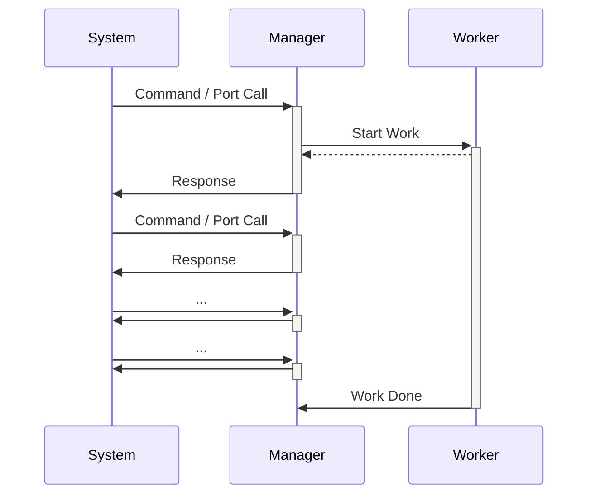

# The Manager/Worker Pattern

The manager/worker pattern is used to perform long-running background work within a component that needs to remain highly responsive to the rest of the system. It is an adoption of the "worker thread" pattern (commonly seen in Computer Science) into the F Prime architecture.

The fprime-examples repository provides an example of the [Manager/Worker Pattern](http://github.com/fprime-community/fprime-examples/tree/devel/FlightExamples/ManagerWorker).

## Applicability

Often a component needs to perform some long-running work while still remaining responsive to commands and port dispatches coming in from the rest of the system. A few examples of such work are:

  - File Operations 
  - Algorithms with Long Compute Time
  - Machine Learning

Any work that is long enough to lock-up a component when it should be responsive to the larger system can be considered for this pattern.

You may also determine that some work of a component needs to be high-priority (e.g. responding to commands) and other work of that same component needs to be low-priority (e.g. loading a large file in the background).  This is another clear indication that you should consider the manager/worker pattern.


## Design

The manager/worker pattern is composed of two separate components: an `active` worker set to a low-priority that performs background work, and a manager component that off-loads background work to that worker. The worker component performs a [callback](./common-port-patterns.md#callback-ports) when the work is finished.



All interactions with the worker should be through the Manager in order to ensure that the worker need not be responsive while working.

The worker must be asynchronous in order to free up the manager's execution context.  Typically the worker is set to a low-priority in the system topology to ensure that the background work not disrupt higher-priority work in a real-time operating system.

## Implementation

The implementation of the manager/worker pattern starts with two `active` components. A set of [callback ports](./common-port-patterns.md#callback-ports) is used for the manager to dispatch work to the worker and receive status in response. 

**Manager Model Snippet**
```
active component Manager {
    ...

    @ Signal to start the worker
    output port startWorker: Fw.Signal

    @ Signal from the worker that the work is finished
    async input port doneRecv: Fw.CompletionStatus

    ...
}
```
> [!NOTE]
> Any port types can be used to start work and signal completion as long as the worker component matches.

> [!NOTE]
> The manager component typically has commands, port calls, and other design elements. This above snippet just represents the interaction with the worker.

**Worker Model Snippet**
```
active component Manager {
    @ Signal to start the work
    async input port start: Fw.Signal

    @ Signal that the work is done
    output port doneRecv: Fw.CompletionStatus
}
```

> [!NOTE]
> Workers typically have no inputs (commands, ports) except those that are controlled by the manager component.

The [synchronous cancel port](./common-port-patterns.md#synchronous-cancel) pattern can be applied to the manager and worker components should the worker need to support the ability to cancel ongoing work.

There is one critical aspect of the manager/worker pattern that is set up at the system topology level: priority of the manager and worker.  Managers are by definition responsive, and thus run at a high-priority. Workers are typically background tasks, and thus run at a low-priority.

**Manager/Worker Instance Priorities**
```
instance manager: Manager base id Manage 0x0000 \
    queue size ... \
    stack size ... \
    priority 90 # High-priority (Linux) for the Manager

instance worker: ManagerWorker.Worker base id 0x1000 \
    queue size ... \
    stack size ... \
    priority 20 # Low-priority (Linux) for the Worker
```

> [!NOTE]
> Actual priorities should be determined relative to the other instances in the system. 

## Conclusion

The manager/worker pattern can be used to off-load background work from a highly-responsive component to a low-priority worker. The worker then reports when the task is done thus ensuring the manager can remain responsive to requests during the duration of the work performed.g
