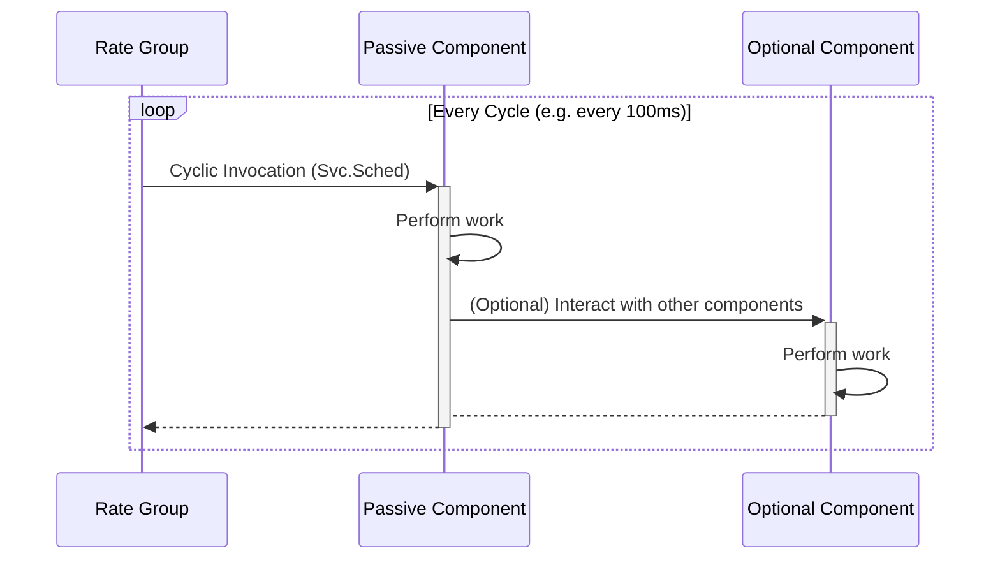
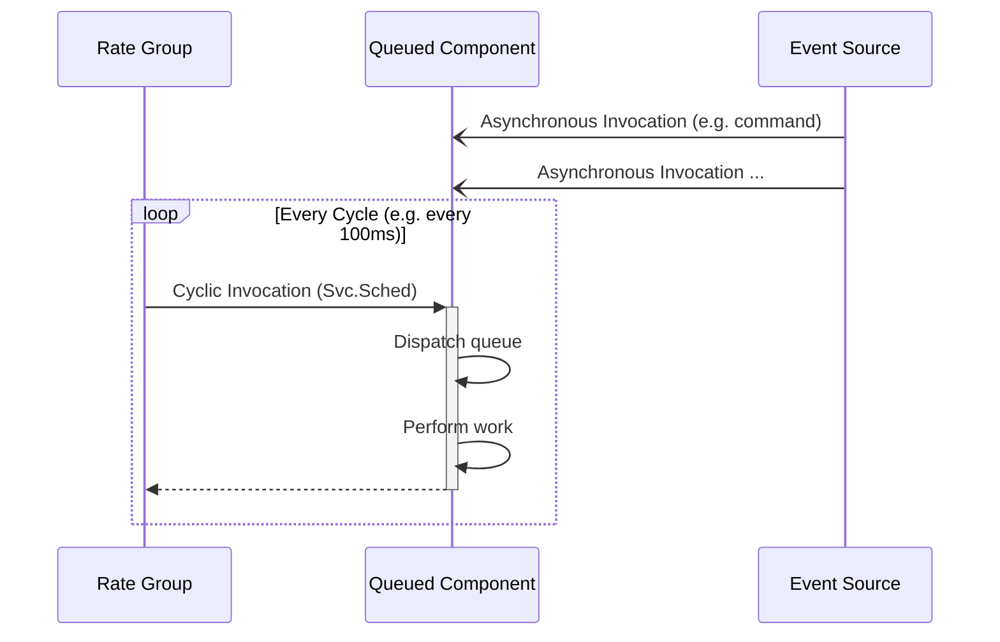
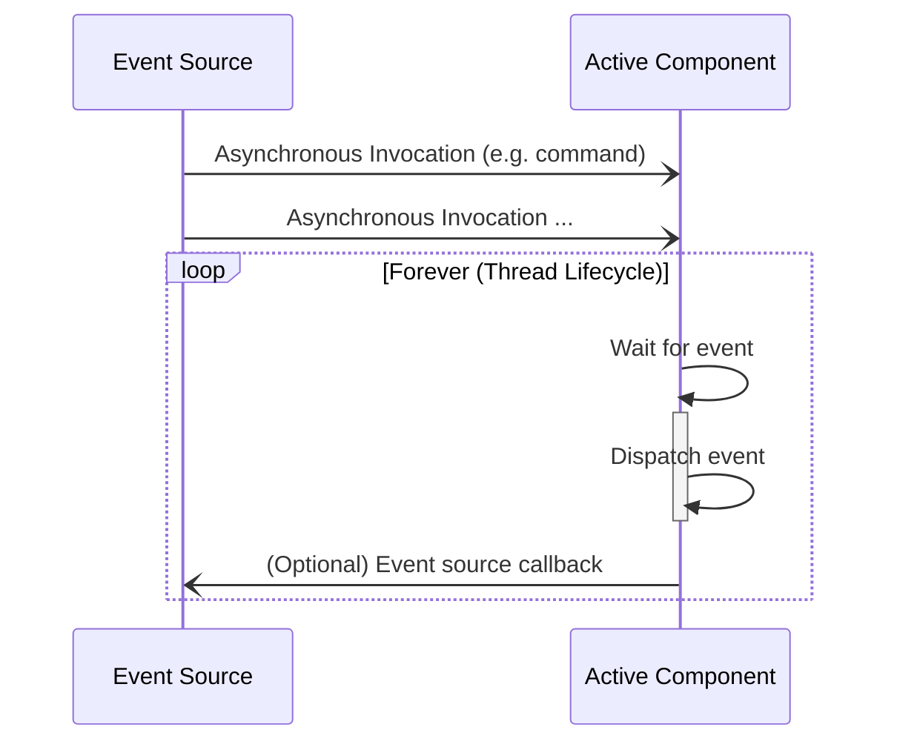
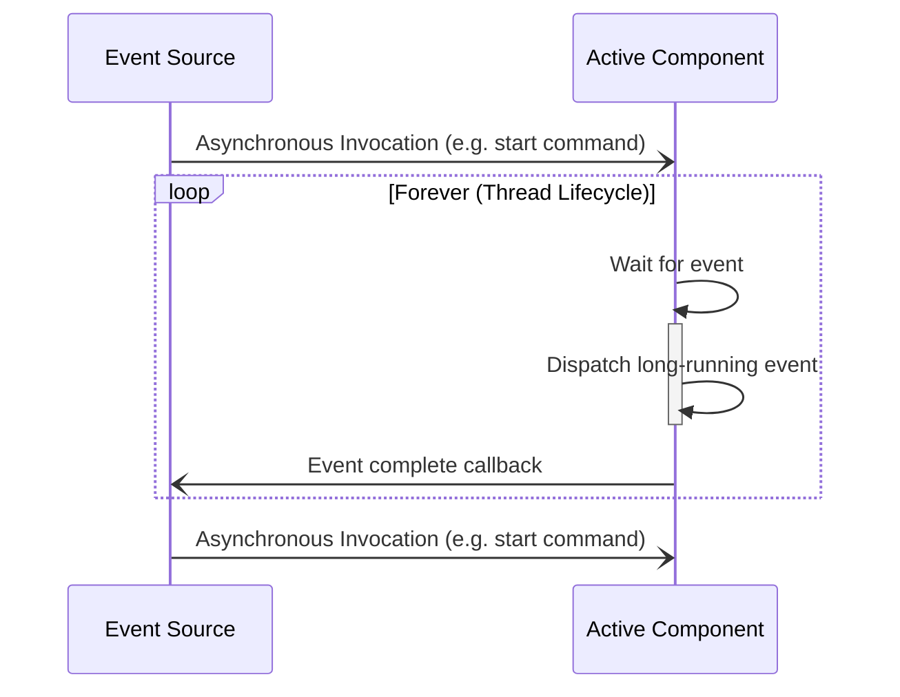
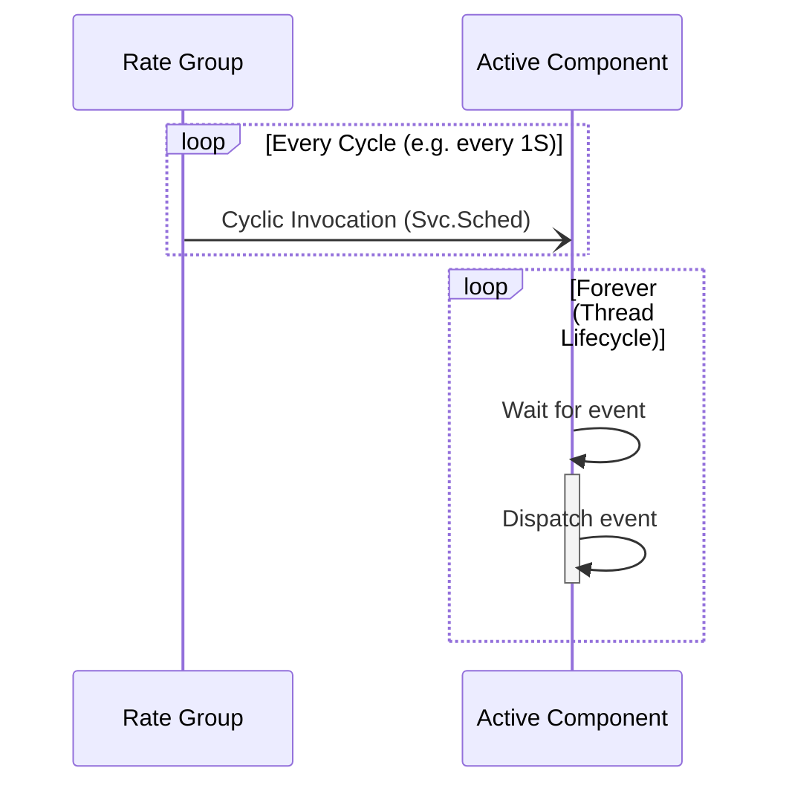
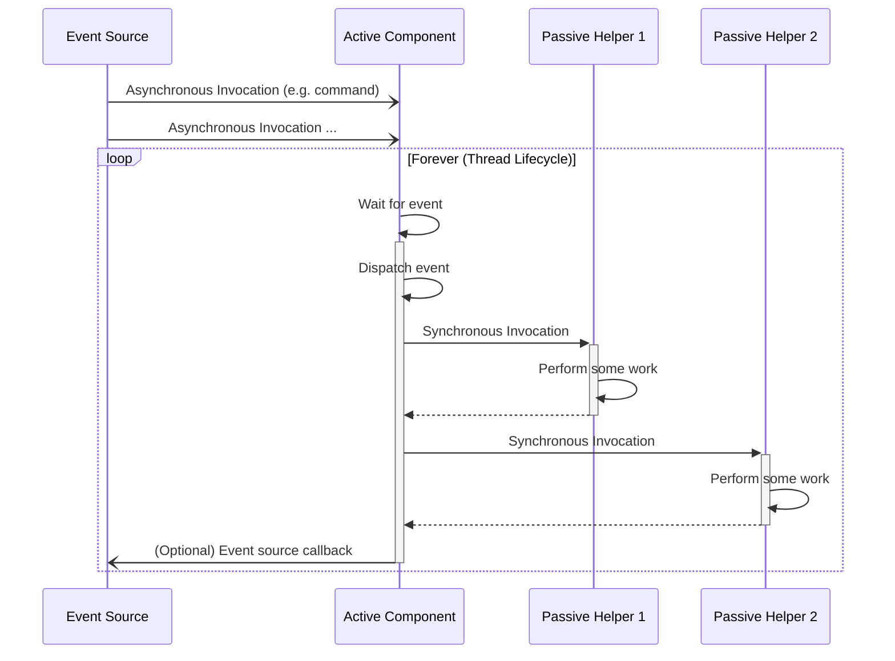
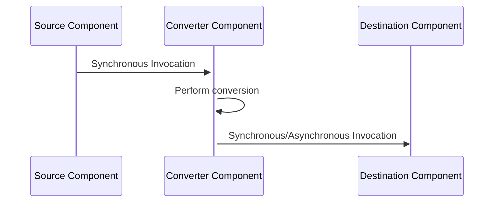

# Component, Port, and Command Kind Selection

This document will describe how to select the kind of component, port, and command to use when developing within the F Prime framework. We will focus on the component kinds (passive, queued, and active) and the critical port kinds (synch, async). We will begin by discussing the types of work performed by F Prime systems, and then use this to build understanding in the kind selection for ports and components.

This guide assumes you have a basic understanding of the different component and port kinds. If you are unfamiliar with these concepts, please see [Core Constructs: Ports, Components, and Topologies](../overview/03-port-comp-top.md) for an introduction to these concepts.

> [!NOTE]
> This document does not discuss output ports as the kind of port is determined on the input side of the connection.

> [!IMPORTANT]
> Since command and port kinds (`sync`, `async`, `guarded`) are very similar in their selection, we will focus on port kind selection and the same principles can be applied to command kind selection.

## Types of Work in F Prime Systems

Work in F Prime system breaks down into three categories roughly driven by the timing requirements of the work.  These are:

1. Cyclic Work: Cyclic work is how F Prime address hard deadlines. This work is performed on a repeating schedule driven by a [Rate Group](../design-patterns/rate-group.md). e.g. send a control update every 10ms.
2. Event-Driven Work: Event-driven work is how F Prime addresses timely work lacking hard deadlines. e.g. dispatch commands reasonably quickly.
3. Background Work: Background work is how F Prime addresses work without timing requirements. e.g. log telemetry to disk.

There are also two other terms of not: synchronous and asynchronous invocations (i.e. how a port executes).  Synchronous invocations happen immediately and block the caller until completion just like a typical function call. Asynchronous invocations are queued up until some point in the future when the receiver processes them. Synchronous ports are invoked synchronously and asynchronous ports are invoked asynchronously and backed by a queue.

> [!IMPORTANT]
> Cyclic work is almost always performed via synchronous invocations while Event-Driven and Background work is typically performed via asynchronous invocations.

Understanding the type of work your component will perform is the first step to selecting the appropriate component and port kinds. We will discuss component selection for each type of work.

## Component Selection for Cyclic Work

When performing cyclic work, it is crucial to know if all work on the cycle will be completed before the cycle repeats as this "slip" will indicate a failure to meet the cycle's hard deadline. e.g a 10Hz control update must happen every 100ms, if it takes longer than 100ms to execute one iteration of the cycle then system control has been compromised.  For this reason, cyclic work is always performed via synchronous invocations and thus will use a `synchronous` port.

> [!CAUTION]
> Remember, `guarded` ports are synchronous too with an internal mutex to protect data.  These are not as common in cyclic work and a full discussion of `guarded` ports is outside the scope of this document.

Since the primary mode of invocation is `synchronous` when doing cyclic work, we will choose a component kind that does not have a thread to process asynchronous work and thus we would chose either a `passive` or `queued` component.

### Passive Components for Cyclic Work

Passive components are the natural choice for cyclic work as we intend them to execute in the context of the invoking rate group. A good starting model for cyclic work is to have a passive component with a `sync` port of type `Svc.Sched` that performs the repeating work for that component each cycle.

You may add output ports as needed for the component to interact with other components, but the primary work of the component will be performed in the `Sched` handler.  This is a simple and common model for cyclic work.

A timing diagram of this model is shown below.

**Figure 1**: a rate group driven passive component that may call another component as part of its cyclic execution.

> [!CAUTION]
> This simple `passive` pattern breaks down when the cyclic component needs to accept some Event-Driven work (e.g. it processes some commands). This use case is described in the next section.

### Queued Components for Cyclic Work

When a component performing cyclic work also needs to accept some Event-Driven work we then required a queue to handle the asynchronous invocations, but adding a queue processing thread may disrupt the critical synchronous invocations of the core cyclic work of the component.  For this exact reason, we use a `queued` component. A `queued` component allows asynchronous events to be accepted while the core model of the component is synchronous driven.  In this model, the component dispatches the queue as part of the primary synchronous invocation (i.e. `Svc.Sched` handler) thus moving the asynchronous work into the cycle.

**Figure 2**: a rate group driven queued component that dispatches asynchronous events as part of its cyclic execution.

> [!IMPORTANT]
> In this model it is **imperative** that you dispatch the queue in some synchronous implementation (i.e. the `Svc.Sched` handler) otherwise the queue will fill but events will never process.

## Event-Driven Work

Since Event-Driven work is typically high-priority but without strict hard deadlines, this work is typically done via asynchronous invocations and uses the `async` port kind.  Since the component lacks another context to run in, we use an `active` component to dispatch the asynchronous work.

This model is constructed by having any number of `async` ports and commands attached to an `active` component. The thread scheduler handles the rest.

**Figure 3**: an active component that dispatches asynchronous events as part of its thread lifecycle.

## Background Work

In F Prime, background work is typically performed via asynchronous invocations and thus uses the `async` port kind.  Since the component lacks another context to run in, we use an `active` component to dispatch the asynchronous work via a thread.

This model is identical to the Event-Driven work model, however; background work runs on active components with much lower priority than the Event-Driven work. Thus the event source for background work should emit only a small number of events until the background work is indicated as complete ([see port callback pattern](../design-patterns/common-port-patterns.md#callback-ports) for more details on how to indicate that background work is complete).

**Figure 4**: an active component that dispatches background events as part of its thread lifecycle. Here a callback indicates the background work is complete and another event can be handled.

> [!IMPORTANT]
> Components performing background work should be engineered to accept only a small number of events at a time to prevent queue overflows. An example is the [Manager/Worker pattern](../design-patterns/manager-worker.md).

## Hybrid Patterns

Sometimes component design does not neatly fit into the above categories. This section will elaborate on some common "hybrid" patterns that combine the above models.

> [!CAUTION]
> This section is intended to give developers deeper understanding of real-world designs. You should prefer the simpler models above wherever possible.

## Cyclic Notification Pattern

We discussed what happens when a cyclic component needs to accept the occasional Event-Driven work, but what if a primarily Event-Drive component needs to perform the occasional cyclic work? For example, a component needs to emit telemetry at a regular interval that is not a strict deadline.

In this case, we can use the "Cyclic Notification Pattern" where an `active` component performs primarily Event-Driven work but also has a `async` port of type `Svc.Sched` that converts the cyclic invocation into a queued event that is processed roughly at the cycle interval.

**Figure 5**: an active component that dispatches events as part of its thread lifecycle. Some events are generated by a cyclic invocation via a `Svc.Sched` port.

## Active Anchor Pattern

Sometimes the work done by an Event-Driven component is easier to decompose into multiple components. In this case, there is typically an Event-Driven active component that orchestrates a set of passive helper components as part of its handling of events.

**Figure 5**: an active component that dispatches events as part of its thread lifecycle using a series of passive helper components for a more nuanced decomposition.

## Passive Converter Pattern

Sometimes you just need a component that does some menial conversion or other work as part of what is logically another port call. E.g. you need to connect two components with incompatible port types and need need to reconcile those type. In this case, you can use a passive component as a converter that is called synchronously as part of the primary port call.

**Figure 6**: a passive converter component that performs a conversion inline with a port call.

## Conclusion

This document covers the basics of component and port kind selection in F Prime. It should give you a starting point for making informed decisions developing F Prime components, however; there are always times where a real design may depart from these models. The important thing is to understand why and be able to justify it.