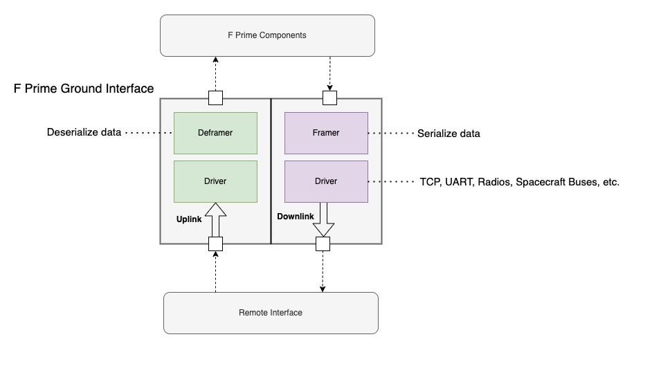

# Ground Interface Architecture and Customization

This guide will discuss the F´ ground interface layers and how to customize them. There are two parts to the ground
interface: the spacecraft side, and the ground side. This guide will primarily focus on the spacecraft side adaptation
as the most common pattern is to adapt F´ flight software for some other ground system (e.g.
[Cosmos]( https://github.com/BallAerospace/COSMOS), [OpenMCT](https://nasa.github.io/openmct/), etc). This
document will walk through common adaptations in hopes that projects will not need to replace the ground interface
entirely.

In the most basic form, the F´ ground system pattern consists of two sides: uplink and downlink. These two sides each
have two layers: framing and driver.  Uplink handles data coming from the remote side of the interface, downlink handles
data going to the remote interface, framing handles serializing and deserializing data to and from byte buffers, and the
driver layer handles writing data to and from the hardware.




Also of note is the framing protocol, which breaks out the handling of the byte serialization for quick adaptation. Each
of these stages need to allocate memory and thus users should also consult the [buffer pool management](../framework/memory-management/buffer-pool.md)
guide.

> [!NOTE]
> in this guide we will refer to the driver layer but many projects will refer to it as the radio or communication layer. The function of this layer is to read and write bytes to some hardware and the nature of that hardware is irrelevant as long as it can send and receive bytes.

## Ground Interface Architecture

Standard F´ components handle two types of data: com buffers and raw buffers. Com buffers transmit standard F´ items
(e.g. events, telemetry, and commands) whereas raw buffers (`Fw::Buffer`) transmit any raw bytes like file data. Thus
the F´ ground interface must handle both types of data. Communications hardware typically only transmits bytes of data
and knows nothing about the nature of that data. The goal of the ground interfaces is to ensure that the various types
of F´ data can be translated into a sequence of bytes that can be reconstructed on the other side of the interface. This
architecture is described below.

### Driver

Drivers manage hardware communications. These can be simple hardware interfaces (e.g. TCP or UART) or far more complex
constructs (e.g. radios, spacecraft buses). From the perspective of F´, the driver has two functions: provide incoming
data and handle outgoing data.

> [!NOTE]
> typically projects use a single driver to handle both input and output, however; two drivers may be used too if differing behavior is needed for uplink and downlink.(e.g. UDP downlink for speed and  Tcp uplink reliability).

All drivers implement an input port receiving data from the framer. The driver should write input data to the hardware
the driver manages. Drivers deliver incoming data through a `recv` output port, which is typically supported by a read
thread. Ownership of the received buffer is later returned to the driver through its `recvReturnIn` port.

**Sending Data**

To send data to a driver, an `Fw::Buffer` is passed to the driver's send input port and the data wrapped by the buffer
will be pushed out to the hardware. Synchronous drivers (implementing `Drv.ByteStreamDriver`) return one of the
following `Drv.ByteStreamStatus` values directly from the send call, and the caller retains ownership of the buffer:

1. ByteStreamStatus.OP_OK: indicates the send was successful
2. ByteStreamStatus.SEND_RETRY: indicates subsequent retransmission will likely succeed
3. ByteStreamStatus.OTHER_ERROR: send failed, the data was not sent, and future success cannot be predicted

Asynchronous drivers (implementing `Drv.AsyncByteStreamDriver`) take ownership of the buffer on send and return both
the status and the buffer through their `sendReturnOut` callback port.

**Receiving Data**

The driver typically has an internal task that calls the `recv` output port when data has been received. Receive ports
are passed an `Fw::Buffer` and a `Drv.ByteStreamStatus` as described below:

1. ByteStreamStatus.OP_OK: receive works as expected and the buffer has valid data
2. ByteStreamStatus.RECV_NO_DATA: receive worked, but there was no data
3. ByteStreamStatus.OTHER_ERROR: receive failed and the buffer does not have valid data

When the receiving component is done with the buffer, it returns ownership to the driver through the driver's
`recvReturnIn` port.

### Uplink

Uplink handles received data, unpacks F´ data types, and routes these to the greater F´ system. In a typical formation,
these com buffers are sent to the command dispatcher and raw buffers are sent to the file uplink. Uplink is implemented by chaining multiple components:

- a [Svc.FrameAccumulator](../../../Svc/FrameAccumulator/docs/sdd.md) component, accumulating bytes from the driver until it detects a full frame
- a component implementing the [Svc.DeframerInterface](../../../Svc/Interfaces/docs/sdd.md) port interface to unpack the frame into F´ data types. F´ ships with implementations for various protocols:
  - [Svc.FprimeDeframer](../../../Svc/FprimeDeframer/docs/sdd.md) for the lightweight F´ protocol
  - [Svc.Ccsds package](../../../Svc/Ccsds) containing implementations for the CCSDS TC and Space Packet protocols
- a router component implementing the [Svc.RouterInterface](../../../Svc/Interfaces/docs/sdd.md) port interface to route unpacked F´ data types to their destinations (e.g. command dispatcher, file uplink, etc). F´ ships with the [Svc.FprimeRouter](../../../Svc/FprimeRouter/docs/sdd.md) implementation for routing F´ data types

### Downlink

Downlink takes in F´ data and wraps the data with bytes supporting the necessary protocol. This assembled data is then
sent to the driver for handling. Downlink is implemented with a component implementing the [Svc.FramerInterface](../../../Svc/Interfaces/docs/sdd.md) port interface. F´ ships with implementations for two different protocols:

- [Svc.FprimeFramer](../../../Svc/FprimeFramer/docs/sdd.md)
- [Svc.Ccsds Package](../../../Svc/Ccsds) containing implementations for the CCSDS TM and Space Packet protocols

## Adding a Custom Wire Protocol

To add custom protocols (e.g. CCSDS, custom telemetry formats, etc), users should follow the detailed [How-To Implement a Framing Protocol Guide](../../how-to/integrate/custom-framing.md)

## Adding a Custom Driver 

To be compatible with this ground interface, a driver must implement one of the byte stream driver interfaces defined
in [Drv/Interfaces](https://github.com/nasa/fprime/blob/devel/Drv/Interfaces): `Drv.ByteStreamDriver` (synchronous
send) or `Drv.AsyncByteStreamDriver` (asynchronous send). The driver may add any other ports, events, telemetry, or
other F´ constructs as needed. The synchronous interface defines the following ports:

```fpp
    output port ready: Drv.ByteStreamReady
    output port $recv: Drv.ByteStreamData
    guarded input port $send: Drv.ByteStreamSend
    guarded input port recvReturnIn: Fw.BufferSend
```

1. **ready**: (output) drivers call this port without arguments to signal they are ready to send and receive data.
2. **recv**: (output) drivers call this port with a `Drv.ByteStreamStatus` and an `Fw::Buffer` to provide received
   data.
3. **send**: (input) clients call this port passing in an `Fw::Buffer` to send data; the status is returned
   synchronously and the caller retains buffer ownership.
4. **recvReturnIn**: (input) clients return ownership of buffers received on `recv` through this port.

The asynchronous interface replaces the synchronous `$send` with an `async input port $send: Fw.BufferSend` and adds
an `output port sendReturnOut: Drv.ByteStreamData` through which the send status and buffer ownership are returned.
